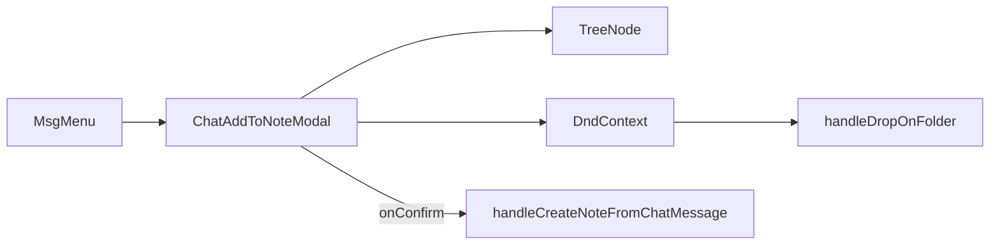

# 노트에 추가 → TreeNode + 전체 DnD

## 확정 UX

- **DnD**: Sidebar와 동일 — `@dnd-kit` 내부 이동 + OS 파일/폴더 드롭 → App [`handleDropOnFolder`](src/App.jsx)
- **표시**: **폴더만** (기존 목적지 피커와 동일)
- **선택**: 폴더 클릭 = 노트 생성 목적지. 루트 행 유지
- **유지**: 파일명 입력, 새 폴더 / 폴더 이동 툴바, `onConfirm({ parentPath, parentHandle, fileName, message })` 페이로드
- **모달에서 끔**: rename / delete / context menu / sticky 폴더

## 1. TreeNode 경량 모드

[`TreeNode.jsx`](src/components/TreeNode.jsx)에 props 추가:

- `foldersOnly` — 재귀 children에서 `type === 'folder'`만 렌더
- `folderSelectMode` — 폴더 클릭 시 expand 토글과 함께 **항상 `onSelect(storageType, node, modifiers)`** 호출 (destination picker용). 기존 Sidebar 동작은 기본값으로 유지

모달에서는 `onRename` / `onDelete` / `onOpenContextMenu` 미전달, `stickyFoldersEnabled={false}`.

## 2. DnD 공유 조각 추출

[`Sidebar.jsx`](src/components/Sidebar.jsx) 내부의 `RootDropZone`, `treeCollisionDetection`을 공유 모듈로 이동 (예: [`src/components/treeDnd.jsx`](src/components/treeDnd.jsx)).

- Sidebar는 해당 모듈을 import해 기존 동작 유지
- 모달도 같은 `RootDropZone` + collision으로 루트 드롭/하이라이트 통일

센서는 Sidebar와 동일: `PointerSensor` distance 8.

## 3. ChatAddToNoteModal 교체

[`ChatAddToNoteModal.jsx`](src/components/chatWithMyself/ChatAddToNoteModal.jsx):

- 로컬 `FolderNode` 삭제
- 트리 영역을 `DndContext`로 감싸고:
  - `RootDropZone` (클릭 = 루트 선택, Sidebar와 동일 drop id)
  - `tree.filter(n => n.type === 'folder').map` → `TreeNode` (`foldersOnly`, `folderSelectMode`)
- **선택**: `selectedIds = selectedRoot ? empty : Set(\`${storageType}:${path}\`)`
- **펼침**: 모달 로컬 `Set` + `onExpandedChange`; `selectPathAfterCreate` 시 조상 경로 강제 펼침(기존 `getAncestorPathsToExpand`)
- **DnD 핸들러**: Sidebar와 동일한 `resolveDragItems` / `parseDroppableId` / `onDragStart|Over|End|Cancel` 패턴으로 `onDropOnFolder` 호출; `dropTarget`·`activeDragItemIds` 반영
- Local: 폴더 펼칠 때 `childrenLoaded !== true`이면 `onLoadLocalFolderChildren` 호출 (Sidebar 패리티)

## 4. App / Pane 배선

[`ChatWithMyselfPane.jsx`](src/components/chatWithMyself/ChatWithMyselfPane.jsx) → [`ChatAddToNoteModal`](src/components/chatWithMyself/ChatAddToNoteModal.jsx)에 추가 전달:

- `onDropOnFolder={handleDropOnFolder}`
- `dropTarget`
- `onLoadLocalFolderChildren={loadLocalFolderChildren}`

[`App.jsx`](src/App.jsx)의 `/chat` `ChatWithMyselfPane`에 위 props 연결 (Sidebar에 이미 넘기는 것과 동일 핸들러).

노트 생성·create-folder 피드백(`addToNoteSelectPath`) 로직은 변경 없음.

## 범위 밖

- `MoveFileModal` / `MoveFolderModal`의 `FolderNode`는 이번 작업에서 건드리지 않음
- 채팅 메시지를 트리로 드래그하는 UX는 포함하지 않음
