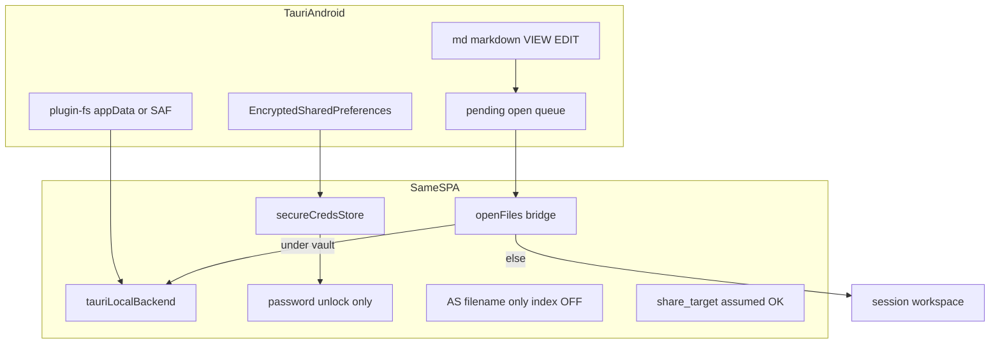

# Android Tauri (사이드로드) 플랜

## 범위 (확정)

| 포함 | 제외 |
|------|------|
| S3 + WebDAV | Google Play / AAB |
| Local Vault | Advanced Search lucivy 역색인 |
| `.md` / `.markdown` 앱 연결 (기본 오프너로 DocuHaim 사용) | WebAuthn/PRF (별도 후속 플랜) |
| 마스터 비밀번호 언락 + 앱 샌드박스 보안 저장소 | iOS |
| 별도 Android workflow + 별도 GitHub Release | [`release-tauri.yml`](.github/workflows/release-tauri.yml)에 APK 합치기 |

**전제:** 기존 PWA [`share_target`](vite.config.ts) / [`ShareTargetGate`](src/components/chatWithMyself/ShareTargetGate.jsx) / chat share intake는 **정상 작동함을 전제**한다. 이 플랜에서 share_target을 재구현·수정하지 않는다. Android 셸은 파일 연결(VIEW/EDIT)과 Local/원격 저장소에 집중한다.

웹(GitHub Pages) · 데스크톱(DMG/NSIS, 기존 [`release-tauri.yml`](.github/workflows/release-tauri.yml)) 경로는 유지·분리한다.

## 아키텍처

## 1. 플랫폼 헬퍼 분리

[`src/utils/isDesktopApp.ts`](src/utils/isDesktopApp.ts)가 현재 **모든 Tauri**를 데스크톱으로 본다. 분리:

- `isTauriApp()` — `__TAURI__` / `VITE_ELECTRON`
- `isTauriDesktop()` — macOS/Windows/Linux 셸
- `isTauriAndroid()` — Android (`@tauri-apps/plugin-os` `platform()` 또는 `navigator.userAgent` + Tauri)
- `isDesktopApp()` — **데스크톱만** (기존 “폴더 절대경로 / 데스크톱 UX” 호출처 유지)

Android도 HashRouter · PWA 비활성 · `VITE_ELECTRON=true` 빌드는 공유한다 ([`vite.config.ts`](vite.config.ts), [`package.json`](package.json) `build:tauri` / `tauri:vite`).

## 2. Android 셸 스캐폴드

- `bunx tauri android init` → [`src-tauri/gen/android/`](src-tauri/gen/android/) (**생성물 커밋**으로 재현성 우선)
- [`tauri.conf.json`](src-tauri/tauri.conf.json): Android용 `apk` 번들 설정 (AAB/Play 없음). 데스크톱 `dmg`/`nsis` 타깃과 공존하되, **릴리즈 산출물 분리는 workflow에서** 처리
- [`capabilities/default.json`](src-tauri/capabilities/default.json) 또는 `mobile.json`: Android 윈도우/스코프 (앱 data + 선택 폴더)
- 문서: [`docs/desktop/android-sideload.md`](docs/desktop/android-sideload.md) + VitePress sidebar (설치·권한·별도 Release 태그 안내)

[`release-tauri.yml`](.github/workflows/release-tauri.yml)은 **수정하지 않는다** (macOS DMG + Windows NSIS만).

## 3. 별도 Android workflow + Release

신규 [`.github/workflows/release-tauri-android.yml`](.github/workflows/release-tauri-android.yml):

- `workflow_dispatch` + semver 입력 (데스크톱과 독립 버전 입력 가능; 기본은 root `package.json` sync와 동일 규칙)
- `ubuntu-latest`: JDK, Android SDK/NDK, Rust Android targets, `bun install`, `tauri android build --apk`
- **별도 GitHub Release** 생성 (예: tag `android-vX.Y.Z` 또는 `vX.Y.Z-android`) — 데스크톱 `vX.Y.Z` Release와 **자산을 섞지 않음**
- APK만 업로드. 서명 secrets 없으면 unsigned/debug-signed sideload. Play 업로드 없음

## 4. `.md` 파일 연결 → DocuHaim으로 사용

목표: 파일 관리자·다른 앱에서 `.md` / `.markdown`을 열 때 **DocuHaim을 선택·기본 앱으로 등록**할 수 있게 한다.

- [`tauri.conf.json`](src-tauri/tauri.conf.json) `bundle.fileAssociations` (기존 md/markdown)가 Android Manifest intent-filter로 반영되는지 확인
- 부족 시 [`gen/android`](src-tauri/gen/android/) Manifest에 `VIEW` / `EDIT` + `text/markdown`, `text/plain`, pathPattern `.*\\.md` 등 보강
- [`src-tauri/src/lib.rs`](src-tauri/src/lib.rs): intent URI → pending queue + `desktop-open-files`(또는 일반화 브리지) emit
- 프론트 ([`desktopOpenFiles.ts`](src/utils/desktopOpenFiles.ts), `isTauriApp()` 게이트 확장):
  - 볼트 하위 → Local note
  - 그 외 → session workspace ([`sessionWorkspace.ts`](src/utils/sessionWorkspace.ts))
  - `content://`는 필요 시 Rust `read_open_uri` → 바이트 → session

share_target(채팅 공유 수신)과 경로를 섞지 않는다 — 파일 연결은 노트/세션 오픈 전용.

## 5. 연결 키 = 앱 내부 보안 저장소 (WebAuthn 아님)

암호 **포맷은 유지**: `passwordSalt` + `encryptWithEntropy` ([`crypto.js`](src/utils/crypto.js), [`App.jsx` `saveEncryptedSettings`](src/App.jsx)).

새 모듈 [`src/utils/secureCredsStore.ts`](src/utils/secureCredsStore.ts):

- API: `getEncryptedBlob(key)` / `setEncryptedBlob(key, json)` / `removeEncryptedBlob(key)`
- 키: `s3NotesEncrypted`, `s3haim_webdav_encrypted`
- **Android**: Rust → `EncryptedSharedPreferences`
- **웹/데스크톱**: 기존 `localStorage`

Android: WebAuthn UI/저장 경로 전부 비활성 → 항상 비밀번호 blob. WebAuthn은 후속 플랜.

## 6. Local Vault (Android)

1. **기본 볼트**: `appDataDir`/`documentDir` 하위 `LocalHaim`
2. **선택 폴더**: dialog + `plugin-fs` (경로/URI 분기)
3. [`createStorageBackend.js`](src/utils/storage/createStorageBackend.js) / `App.jsx`: `isTauriAndroid()`에서도 Tauri 백엔드

## 7. Advanced Search 색인 미사용

- 부트 초반: `isTauriAndroid()` → `advancedSearchEngine.setEnabled(false)`
- `ensureLoaded`를 `isEnabled()`로 가드
- Settings / `settings-as-index` 숨김 또는 강제 OFF (파일명·경로·커맨드만)

## 8. 후속 (이 플랜 밖)

- WebAuthn/PRF (또는 플랫폼 생체)
- Play / AAB
- iOS
- share_target Android 전용 이슈 (전제상 정상; 문제 발견 시 별도 티켓)

## 주요 터치 파일

- 신규: `secureCredsStore.ts`, Android secure-store commands, `docs/desktop/android-sideload.md`, `gen/android/`, **`.github/workflows/release-tauri-android.yml`**
- 수정: 플랫폼 헬퍼, `App.jsx`, WebAuthn 게이트, vault/openFiles, AS 부트, `lib.rs`, `tauri.conf.json`, `capabilities`, `package.json`
- **미변경:** [`.github/workflows/release-tauri.yml`](.github/workflows/release-tauri.yml)

## 검증 (구현 후)

- 별도 workflow → 별도 Release에 APK만 게시; 데스크톱 Release에 APK 없음
- `.md`를 “연결 앱”에서 DocuHaim으로 열어 vault/session 라우팅
- share_target 기존 웹/PWA 동작은 건드리지 않음(전제)
- S3/WebDAV/Local + 보안 저장소 언락
- AS 역색인 미기동; WebAuthn UI 없음
- 웹·데스크톱 회귀 유지
