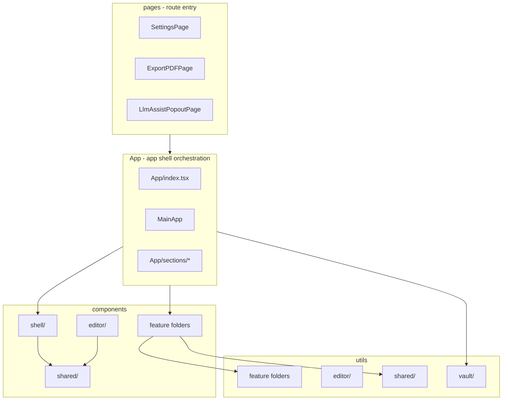

# App.jsx 분리 + components/utils 폴더 정리

## 목표

1. **App.jsx** (11,178줄) → [`src/App/`](src/App/) 군집 (index, MainApp, sections, layout components)
2. **components/** (178파일, 루트 54) · **utils/** (304파일, 루트 180) → **페이지·기능 단위** 폴더로 수렴
3. **여러 페이지/기능에 걸치는 코드** → `shared/` 공통 폴더
4. Phase A–B: 동작 변경 없음, **점진 PR**, import는 re-export로 하위 호환 유지 후 제거
5. **Phase C**: [Provider thin shell 계획](app_provider_thin_shell.plan.md) — state를 domain Provider로 이전, `MainApp` → `AppShellView` (<150줄)

## 현황 요약

| 영역 | 규모 | 문제 |
|------|------|------|
| [`src/App.jsx`](src/App.jsx) | 11,178줄 | `MainApp()` god component |
| `src/components/` 루트 | 54파일 | shell·editor·LLM·recording 혼재 |
| `src/utils/` 루트 | 180파일 | vault·editor·print·llm 혼재 |
| `src/pages/` | 3파일 | Settings, ExportPDF, LlmAssistPopout만 formal page |

**이미 잘 나뉜 feature 폴더 (유지·확장)**

- `chatWithMyself/`, `advancedSearch/`, `noteCover/`, `haimTable/`, `workspaceTabs/`, `storage/`, `print/`(components만), `settings/`



---

## 폴더 taxonomy (목표 구조)

### 원칙

| 규칙 | 설명 |
|------|------|
| **페이지** | [`src/pages/`](src/pages/) — 라우트 진입점만 (얇은 wrapper). 로직은 feature/App으로 |
| **기능** | 단일 도메인 UI·로직 — `components/<feature>/` + `utils/<feature>/` **대칭** 유지 |
| **앱 셸** | 사이드바·트리·워크스페이스·세션 — `components/shell/` + `utils/vault/` |
| **에디터 플랫폼** | Md/Novel/Monaco·wikiImage·preview — 여러 feature가 씀 → `components/editor/` + `utils/editor/` |
| **공통** | 2개 이상 페이지/feature가 씀 → `components/shared/` · `utils/shared/` |
| **이동 방식** | `git mv` → 구 경로에 **re-export shim** → import 점진 수정 → shim 제거 |

### `src/components/` 목표

```
components/
  shell/              # App shell 전용 (신규)
    Sidebar.jsx
    SidebarContextMenu.jsx
    TreeNode.jsx, treeDnd.jsx
    ResizableSidebarPanel.jsx
    EditorPane.jsx
    SessionOpenPanel.tsx, SessionTreeList.tsx
    ActivityIndicatorBar.jsx
    workspace/          # 기존 workspace/ 이관
    desktop/            # DesktopTitlebar 등 (선택)
  editor/               # 에디터 플랫폼 (신규)
    MarkdownEditor.jsx
    NovelMarkdownEditor.jsx, MonacoTextEditor.jsx, HtmlSvgPreviewEditor.jsx
    MdEditorToolbar*, MirrorEditToolbar, FontFamilyInput, UserWebfontStyles, …
  shared/               # cross-page UI (신규 버킷)
    modals/             # 기존 modals/ 이관
    contextMenu/        # 기존 contextMenu/ 이관
    ui/                 # Button, icons, RadixSelectField, Kbd, …
  chatWithMyself/       # 유지
  print/                # 유지 (+ 루트 Print* 컴포넌트 흡수)
  settings/             # 유지
  advancedSearch/       # 유지
  noteCover/            # 유지
  haimTable/            # 유지
  llm/                  # 신규 — LlmAssistModal, LlmAssistPanel, *ModelSelect
  recording/            # 신규 — RecordingPlayer, RecordingSyncView, …
```

### `src/utils/` 목표

```
utils/
  vault/                # vault·트리·동기화 (신규, App §3–6와 직결)
    s3Client.js, s3Tree.js
    webdavClient.js, webdavTree.js, webdavHref.ts
    localTree.js, localFolderStore.js, localVault*
    treeMove.js, treeCopy.ts, treeNameConflict.ts, expandedFoldersStore.ts
    sessionWorkspace.ts, storageSettings.js, storageScope.ts
  editor/               # markdown·preview·wikiImage (신규)
    wikiImage*, preview*, markdownIt*, footnote*, mirrorEdit*, …
  shared/               # 플랫폼·인프라 (신규)
    crypto.js, webauthn.js, authSession.js
    isDesktopApp.ts, tauri*, desktop*
    hapticFeedback.ts, copyText.ts, modalLayerStack.ts, pwaUpdate.ts
  storage/              # 유지 (backend adapters)
  workspaceTabs/        # 유지
  chatWithMyself/       # 유지
  advancedSearch/       # 유지
  noteCover/            # 유지 (+ coverSettingsStore.ts 흡수)
  haimTable/            # 유지
  print/                # 신규 — 루트 print* ~15파일
  llm/                  # 신규 — llm*, gemini*, openaiCompatible*
  recording/            # 신규 — recording*
```

### re-export shim 예시

이동 직후 기존 import 깨짐 방지:

```ts
// src/utils/s3Tree.js (shim — 마지막 PR에서 삭제)
export * from './vault/s3Tree.js';
```

```ts
// src/components/modals/AuthModal.jsx (shim)
export { default } from '../shared/modals/AuthModal.jsx';
```

**규칙**: shim은 **한 feature/버킷 PR당 해당 파일만** 추가; 전역 일괄 shim 금지.

---

## App.jsx 분리 (기존 계획 유지)

```
src/App/
  index.tsx
  MainApp.tsx
  helpers.ts
  types.ts
  components/
    AppLayout.tsx
    AppModals.tsx
    ExportPdfGate.tsx
  sections/
    appInit.ts, appAuthActions.ts
    appStorageBackend.ts, appLocalFolder.ts
    appFileSession.ts, appTreeCrud.ts
    appAutoSaveSync.ts
```

- Phase A–B: 상태는 `MainApp`에 유지; section은 **factory 함수** (`createSelectFileRaw(deps)`)
- Phase C: factory → domain Provider/hook; `useWorkspaceTabs` 채택 — [**별도 계획**](app_provider_thin_shell.plan.md)

### App sections ↔ utils 폴더 매핑

| App section | 주로 쓰는 utils (이동 후) |
|-------------|---------------------------|
| §1–2 Init/Auth | `shared/` (crypto, webauthn, authSession, desktop*) |
| §3 Storage | `vault/` + `storage/` |
| §4 Local | `vault/local*` |
| §5 File | `vault/` + `editor/` + `workspaceTabs/` |
| §6 Tree CRUD | `vault/tree*` + `storage/` |
| §7–8 Auto save | `vault/` + `workspaceTabs/` |

App section PR을 열 때 **해당 utils 이동을 같은 PR 또는 직전 PR**에 묶으면 import 정리가 한 번에 끝납니다.

---

## 통합 PR 로드맵

### Track A — App.jsx (PR1–10)

| PR | App 작업 | 연동 폴더 정리 |
|----|----------|----------------|
| **PR1** | `src/App/` 스캐폴드, `App.jsx` 삭제 | 없음 |
| **PR2** | `AppModals.tsx` 추출 | `components/shared/` 생성; `modals/` → `shared/modals/` **git mv** + shim |
| **PR3** | `AppLayout`, `ExportPdfGate` | `components/shell/` 생성; Sidebar, workspace, TreeNode, ResizableSidebarPanel 이동 + shim |
| **PR4** | sections §1–2 | `utils/shared/` 스캐폴드; auth/crypto/desktop 루트 파일 이동 시작 |
| **PR5** | sections §3 | `utils/vault/` — s3/webdav/localTree 핵심 이동 |
| **PR6** | sections §4 | vault/local* 잔여 |
| **PR7** | sections §5 | `components/editor/` 스캐폴드; EditorPane → shell, MarkdownEditor → editor |
| **PR8** | sections §6 | vault/tree* 정리 |
| **PR9** | sections §7–8 | — |
| **PR10** | MainApp 정리 (<600줄 목표) | App이 가리키는 import를 새 경로로 통일 |

### Track B — feature orphan 정리 (PR11–12, App 이후 또는 병행)

| PR | 대상 | 작업 |
|----|------|------|
| **PR11a** | LLM | `components/llm/`, `utils/llm/` — 루트 `Llm*`, `gemini*`, `llm*` 이동 |
| **PR11b** | Recording | `components/recording/`, `utils/recording/` |
| **PR11c** | Print | `utils/print/` — 루트 print*; components 루트 `ExportPDF` 등 → `print/` |
| **PR11d** | noteCover 잔여 | `coverSettingsStore.ts` → `utils/noteCover/` |
| **PR12** | pages thin (선택) | quasi-page 경로 문서화; `ChatWithMyselfPane`은 feature 루트 유지 |

**이미 feature 폴더에 있는 것** (`chatWithMyself`, `advancedSearch` 등)은 건드리지 않음 — 루트 산재분만 정리.

### Phase C — Provider thin shell (별도 계획, PR12 이후)

PR1–12로 **파일·폴더·factory 경계**가 안정된 뒤, [**app_provider_thin_shell.plan.md**](app_provider_thin_shell.plan.md)를 실행합니다.

| Phase | 계획 파일 | 결과물 |
|-------|-----------|--------|
| A–B | 이 파일 (PR1–12) | `App/sections/*`, taxonomy, `MainApp` <600줄 |
| **C** | [app_provider_thin_shell.plan.md](app_provider_thin_shell.plan.md) | `AppProviders` + `AppShellView` <150줄, `sections/` 제거 |

Phase C 핵심:

- 도메인 Provider 5–6개 (`Vault`, `WorkspaceTabs`, `FileSession`, `TreeOps`, `AutoSave`, `Bootstrap`)
- `useWorkspaceTabs` + `workspaceTabsStore` 단일 소스
- `components/shell/*`가 context hook으로 props 의존 축소
- `MainApp.tsx` 삭제 → `AppShellView.tsx` 조립만

**Phase C 착수 조건** (handoff checklist):

- [ ] PR10 완료 — `MainApp.tsx` <600줄, section §1–8 대응
- [ ] PR11 shim 정리 또는 추적 이슈 등록
- [ ] cluster split 스모크 전체 통과
- [ ] `app_provider_thin_shell.plan.md` Provider 경계·PR 순서 최종 확인

---

## PR별 검증

App 스모크 (기존과 동일):

1. 잠금/unlock · 2. S3/WebDAV/로컬 · 3. 워크스페이스 탭 · 4. 채팅/ShareTarget · 5. 트리 CRUD · 6. export-pdf/AS · 7. Tauri titlebar

폴더 PR 추가:

- `bun run check` 통과
- 구 shim 경로(`@/utils/s3Tree`, `@/components/modals/...`)와 신 경로 **둘 다** import하는 파일이 있으면 동작 동일 확인
- 해당 PR에서 옮긴 feature만 수동 스모크 (예: PR11a → LLM assist 모달)

---

## 리스크와 완화

| 리스크 | 완화 |
|--------|------|
| 대규모 import rename | shim re-export; PR당 한 버킷만 |
| App ↔ utils 순환 import | `vault/`는 storage adapter만; App sections는 factory로 utils 호출 |
| editor vs shell 경계 모호 | shell = 레이아웃·트리·탭 host; editor = 문서 편집 surface |
| pages vs feature | formal route만 `pages/`; ChatWithMyselfPane은 `components/chatWithMyself/` 유지 |

---

## 완료 기준

### Phase A–B (이 계획)

**App**

- `src/App.jsx` 없음; `MainApp.tsx` < 600줄
- section 파일이 §1–8과 1:1 대응

**components/utils**

- 루트 loose 파일 **50개 미만** (현재 54+180 → 단계적으로 감소)
- 신규 코드는 taxonomy 준수 (shell / editor / shared / feature)
- shim 제거 완료 또는 shim 목록 이슈로 추적

**Handoff**

- [app_provider_thin_shell.plan.md](app_provider_thin_shell.plan.md) 착수 조건 충족

### Phase C (별도 계획 — 전체 리팩터 완료 시점)

- `MainApp.tsx` 없음; `AppShellView.tsx` < 150줄
- `App/sections/` 제거, domain Provider가 state 소유
- `useWorkspaceTabs` 단일 탭 소스

### 후속 (Phase C 이후)

- `src/features/` 단일 트리로의 전면 재배치
- `hooks/`를 feature 옆으로 이관
