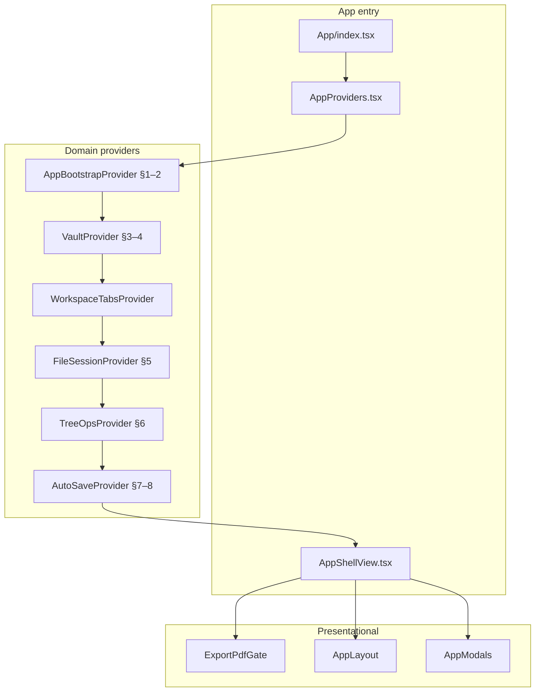

# App Provider 기반 얇은 셸 전환

> **선행 계획**: [app.jsx_cluster_split](app.jsx_cluster_split_2524a7ea.plan.md) PR1–12 완료 후 착수.
> 이 단계부터는 **동작 동일**을 유지하되 state 소유권·데이터 흐름이 바뀌므로 PR 단위를 더 작게 쪼갭니다.

## 왜 별도 계획인가

| 단계 | 계획 | 성격 |
|------|------|------|
| PR1–12 | cluster split + 폴더 정리 | **기계적 이동**, MainApp이 state 보유 |
| **이 계획** | Provider thin shell | **아키텍처 전환**, state를 domain hook/Provider로 이전 |

기계적 분리가 끝나야 Provider 경계를 안전하게 그을 수 있습니다. 섹션 factory(`createSelectFileRaw`)가 이미 도메인 경계를 만들어 두면, 각 factory를 hook으로 승격하기 쉽습니다.

## 목표 아키텍처



### 목표 파일 구조

```
src/App/
  index.tsx                    # popout 분기 + <AppProviders><AppShellView /></AppProviders>
  AppProviders.tsx             # Provider nesting (순서 고정)
  AppShellView.tsx             # gates + layout + modals 조립 (~100–150줄)
  providers/
    AppBootstrapProvider.tsx   # auth bootstrap, share gate, theme, PWA
    VaultProvider.tsx          # storage trees, backends, settings store inject
    WorkspaceTabsProvider.tsx  # useWorkspaceTabs + persistence + URL sync
    FileSessionProvider.tsx    # open/save/reload, enc.md, editor content bridge
    TreeOpsProvider.tsx        # CRUD, DnD, download/export orchestration
    AutoSaveProvider.tsx       # debounce + idle sync
  hooks/
    useVault.ts                # VaultProvider consumer
    useWorkspaceTabsCtx.ts
    useFileSession.ts
    useTreeOps.ts
    useAutoSave.ts
  context/                     # createContext + typed hooks (providers와 1:1)
  components/                  # AppLayout, AppModals, ExportPdfGate (기존 유지)
  sections/                    # → 점진 제거, logic은 providers/hooks로
```

**MainApp.tsx는 `AppProviders` + `AppShellView`로 대체 후 삭제.**

## Provider 설계 원칙

1. **단일 거대 Context 금지** — 도메인별 Provider 5–6개; 각 context는 해당 hook만 export
2. **읽기/쓰기 분리 검토** — re-render 폭주 시 selector hook (`useVaultTree(storageMode)`) 패턴
3. **기존 contexts와 역할 분리**
   - [`AuthProvider`](src/contexts/AuthContext.jsx) — 잠금/자격증명 (유지)
   - [`ActivityIndicatorProvider`](src/contexts/ActivityIndicatorContext) — 유지
   - App domain providers — vault·tabs·file·tree (신규, `App/` 아래)
4. **sections factory → provider hook** — `createXxx(deps)` 본문을 hook 내부로 옮기고 deps는 상위 Provider context에서 읽기
5. **`useWorkspaceTabs` 채택** — [`appBridge`](src/utils/workspaceTabs/appBridge.ts) 인라인 `useState` 제거; [`workspaceTabsStore`](src/utils/workspaceTabs/workspaceTabsStore.ts) 단일 소스

## Provider 의존 순서 (고정)

```
AppBootstrapProvider
  └─ VaultProvider          (needs: auth unlock, webdav config)
       └─ WorkspaceTabsProvider
            └─ FileSessionProvider   (needs: vault backends, tabs)
                 └─ TreeOpsProvider (needs: vault + tabs + file session)
                      └─ AutoSaveProvider (needs: file session + tabs)
```

역방향 import·context 순환 금지. 하위 Provider는 상위 hook만 사용.

## PR 로드맵 (이 계획 전용)

| PR | 작업 | MainApp/Shell 영향 |
|----|------|-------------------|
| **P1** | Provider 스캐폴드 + `AppBootstrapProvider` (§1–2 state 이전) | MainApp은 아직 유지, 병행 마운트 |
| **P2** | `VaultProvider` (§3–4) | `getS3Client`, tree state 이전 |
| **P3** | `WorkspaceTabsProvider` + `useWorkspaceTabs` | 인라인 workspace state 제거 |
| **P4** | `FileSessionProvider` (§5) | `selectFileRaw`, `saveFile` 이전 |
| **P5** | `TreeOpsProvider` (§6) | create/delete/move |
| **P6** | `AutoSaveProvider` (§7–8) | editor change, sync |
| **P7** | `AppShellView` 조립 + `MainApp` 삭제 | **<150줄** |
| **P8** | `components/shell/*` consumer hook 전환 | Sidebar 등 props 축소 |
| **P9** | `App/sections/` 제거, factory dead code 정리 | — |

각 PR마다 기존 factory 기반 경로와 Provider 경로를 **feature flag 없이** 즉시 교체하지 말고, 한 도메인씩 state 소유권을 옮긴 뒤 MainApp에서 해당 블록 삭제.

## AppShellView 목표 형태

```tsx
export function AppShellView() {
  if (!useScriptsLoaded()) return <LoadingGate />;
  const exportPdf = useExportPdfGate();
  if (exportPdf) return exportPdf;

  return (
    <>
      <ShareTargetGate ... />   {/* bootstrap context에서 props */}
      <AppLayout />
      <AppModals />
    </>
  );
}
```

Layout/Modals는 context hook으로 필요한 조각만 구독; 거대 `modalProps`/`layoutProps` 객체 제거.

## 검증

- cluster split 스모크 전체 재실행
- Provider PR마다: 해당 도메인 회귀 + **React DevTools Profiler**로 context 변경 시 re-render 범위 확인
- `bun run check` + workspace tabs persistence / URL sync / dirty beforeunload

## 완료 기준

- `MainApp.tsx` 없음; `AppShellView.tsx` < 150줄
- `App/sections/` 삭제
- `useWorkspaceTabs`가 유일한 탭 state 소스
- shell 컴포넌트의 App 전용 props **50% 이상 감소** (hook으로 대체)
- 신규 App 기능은 Provider/hook에만 추가 (MainApp god component 재발 방지)

## 이 계획 범위 밖

- `src/features/` 단일 트리 전면 재배치
- Redux/Zustand 등 외부 전역 store 도입
- AuthContext·Toast 등 기존 app-wide context 구조 변경
