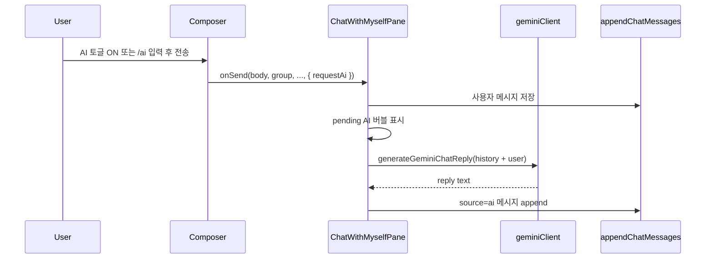

# 나와의 채팅 AI 답장

## 동작 요약

- **트리거 A**: 컴포저에 Markdown 스위치와 같은 패턴의 **AI 토글** → 그룹(채팅) 선택 → 전송
- **트리거 B**: 본문이 `/ai `(대소문자 무시, 선행 공백 허용)로 시작하면 토글 없이도 1회 요청. 저장되는 본문에서는 프리픽스 제거
- 사용자 메시지는 기존과 동일하게 선택된 `group`으로 저장
- 바로 뒤에 AI 메시지가 따라옴 (`source: 'ai'`)

## 스키마 / 판별

이미 HTML 주석 attr로 `source`를 직렬화하므로 새 필드 없이 확장합니다 ([`format.js`](src/utils/chatWithMyself/format.js)).

- AI 메시지: `source: 'ai'`, `group`: 요청 시점의 선택 그룹(필터 일관성), `markdown: true` (Gemini 마크다운 응답 가정)
- 헬퍼: `isAiChatMessage(msg) => msg.source === 'ai'`
- 버블 정렬: `self = isSelfGroup(group) && !isAiChatMessage(msg)` — AI는 항상 왼쪽

## LLM

기존 노트 도우미 스택 재사용:

- [`withGeminiApiKey`](src/utils/geminiApiKeySession.js) + Settings에 저장된 키
- [`useGeminiModelState`](src/components/GeminiModelSelect.jsx) / `loadLastUsedGeminiModel`
- [`geminiClient.js`](src/utils/geminiClient.js)에 채팅용 함수 추가:
  - `generateGeminiChatReply({ apiKey, model, messages, systemInstruction? })`
  - Gemini `contents` 멀티턴 (`role: 'user' | 'model'`)
  - **비스트리밍** `:generateContent` (기존과 동일)
  - 컨텍스트: 전송 직전 타임라인에서 최근 약 30개 메시지(본문만, 첨부 플레이스홀더는 짧게). `source === 'ai'` → `model`, 그 외 → `user`
  - systemInstruction: 짧게 “나와의 채팅 도우미, 대화체로 답한다” 정도
- [`App.jsx`](src/App.jsx) `/chat` 라우트에 `getGeminiApiKey`를 `ChatWithMyselfPane`으로 전달 (에디터와 동일 소스)

키 없음 / API 실패 시: pending AI 버블 제거 + 기존 `setError`로 안내 (설정 Gemini 키 유도).

## UI

### 컴포저 ([`ChatComposer.jsx`](src/components/chatWithMyself/ChatComposer.jsx))

- `aiEnabled` 상태 + `ChatNavSwitch` label `"AI"` (Markdown 옆)
- `doSend`에서 `requestAi = aiEnabled || /^\/ai\s+/i.test(body)`; 프리픽스 strip 후 `onSend(..., { markdown, requestAi })`
- 수정(edit) 모드에서는 AI 요청하지 않음

### 팬 ([`ChatWithMyselfPane.jsx`](src/components/chatWithMyself/ChatWithMyselfPane.jsx))

- `handleSend`가 `options.requestAi`이면 사용자 메시지 큐잉 후 `requestAiReply(userMsg)` 호출
- optimistic pending AI 메시지 (`pendingSync: 'ai'`, 빈/플레이스홀더 본문) → 성공 시 `appendChatMessage`로 확정, 실패 시 제거
- 동시 요청은 직렬(간단 큐)로 처리해 메시지 순서를 보장

### 버블 ([`ChatMessageList.jsx`](src/components/chatWithMyself/ChatMessageList.jsx))

AI일 때:

- 왼쪽 정렬, 이름 자리에 **그라데이션 텍스트 `AI` 마크** (예: `bg-gradient-to-r from-violet-500 via-fuchsia-500 to-sky-500 bg-clip-text text-transparent` + 작은 pill/badge). 기존 LLM Assist가 violet이라 톤을 맞춤
- 버블 배경: self(`sky-100`) / other(`white`)와 구분 — 예: `bg-violet-50` / dark `bg-violet-950/40` + violet border
- pending 중: 짧은 “…” 또는 pulse 플레이스홀더

아바타는 일반 그룹 아바타 대신 AI 마크(또는 Sparkles+그라데이션)로 대체.

## Advanced Search

워크스페이스 규칙에 맞춰 같은 변경에 등록:

- [`chatActions.ts`](src/utils/advancedSearch/chatActions.ts): `chat-toggle-ai` (켜기/끄기 상황별 카피 또는 토글 핸들러)
- 컴포저 mount 시 `registerChatActions`에 연결
- Host가 `chat-*` 접두로 이미 실행하면 추가 분기 최소화; 필요 시 [`commands.ts`](src/utils/advancedSearch/commands.ts) 노출만 확인

## 주요 변경 파일

| 파일 | 내용 |
|------|------|
| `src/utils/geminiClient.js` | `generateGeminiChatReply` |
| `src/utils/chatWithMyself/format.js` (또는 작은 `aiMessage.ts`) | `isAiChatMessage` |
| `ChatComposer.jsx` | AI 토글, `/ai` 파싱, `requestAi` |
| `ChatWithMyselfPane.jsx` | AI 생성·저장 오케스트레이션 |
| `ChatMessageList.jsx` | AI 버블 스타일 |
| `App.jsx` | `getGeminiApiKey` prop |
| `chatActions.ts` (+ Host/commands 필요 시) | AS 토글 |

## 범위 밖 (이번 PR에 넣지 않음)

- 스트리밍 타이핑 애니메이션
- AI 전용 프롬프트 템플릿 UI / 모델 선택 UI (설정·마지막 사용 모델만 사용)
- 이미지 첨부를 Gemini에 전달 (텍스트 본문만)
