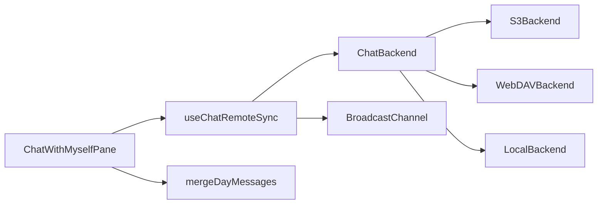

# 나와의 채팅 기기 간 동기화

## Scope

- **포함**: S3 + WebDAV 채팅 전체 IO(day/`meta`/이미지·첨부) + 동기화(필수·1차·보강). Local은 탭 간 BroadcastChannel만.
- **제외**: WebDAV로 노트 트리/에디터 전체 전환, WebSocket 푸시, 서버 중계.

## Architecture



공용 백엔드 인터페이스 (`getText` / `headMeta` → `{ etag, mtime }` / `putTextIfMatch(etag|null)` / `putBinary` / `ensureDir` / `getBinaryBlobUrl`):

- 구현 위치: [`src/utils/chatWithMyself/backends/`](src/utils/chatWithMyself/backends/) (`createChatBackend(ctx)`).
- 기존 [`storage.js`](src/utils/chatWithMyself/storage.js)의 `readText`/`writeText`를 이 백엔드로 위임. `ChatStorageCtx.mode`에 `'webdav'` 추가.
- [`images.js`](src/utils/chatWithMyself/images.js) / [`attachments.js`](src/utils/chatWithMyself/attachments.js)도 `putBinary` 사용.

## 필수 — 충돌 안전 쓰기

**삭제 tombstone** ([`format.js`](src/utils/chatWithMyself/format.js)):

```
<!-- chat-msg-deleted id="..." at="ISO" -->
```

`parseDayFile`이 messages + `deletedIds`를 반환. `serializeDayFile`이 tombstone을 유지. 삭제는 본문 제거 + tombstone 추가.

**머지** (`mergeDayMessages(local, remote)`):

- `deletedIds`는 합집합.
- 살아 있는 메시지는 `id` 맵; 같은 id면 `editedAt || at`가 더 최신인 쪽 채택.
- tombstone에 있는 id는 살아 있는 쪽에서 제거.
- 결과는 `at` 기준 정렬.

**조건부 쓰기**:

- S3: [`headObject`](src/utils/s3Client.js)에 `ETag` 반환 추가. `putObject`에 `IfMatch` / 신규 파일 `IfNoneMatch: '*'` 지원. 412면 재읽기 → 머지 → 재시도(최대 5회).
- WebDAV: `PUT`에 `If-Match` (기존), 신규은 `If-None-Match: *`. 412면 동일 재시도.
- Local: ETag 없음. 단일 기기 전제로 기존 overwrite 유지(머지 API는 원격 pull 경로에서만 사용).

`appendChatMessage` / `updateChatMessage` / `deleteChatMessage` / `writeMeta` / `addGroup` 등 day·meta 쓰기를 모두 “읽기(etag) → 변경 → putIfMatch → 충돌 시 머지 재시도”로 통일.

## 1차 — 원격 변경 감지

훅 [`useChatRemoteSync.js`](src/components/chatWithMyself/useChatRemoteSync.js) (S3·WebDAV만):

- 간격 **10초**, `document.hidden`이면 interval 정지.
- `visibilitychange`(visible) / `focus` / `online` 시 즉시 1회.
- watch 대상: 현재 로드된 day 키들 + `meta.json`의 `headMeta`. etag/mtime 변경 시에만 body GET.
- day 변경: 원격 파싱 → 로컬 창 메시지와 머지 → `setMessages` (optimistic 로컬 미확정분과 id 기준으로 합침).
- meta 변경: groups/timezone 갱신.
- 새 day 파일: `listDayKeys` 갱신(prefix PROPFIND 또는 S3 list on `.chat-with-myself/`).

## 보강 — BroadcastChannel

채널명 `s3haim-chat-sync`. 이벤트: `{ type: 'day'|'meta', dateStr?, originTabId }`.

- 쓰기 성공 후 post.
- 수신 탭은 해당 day/meta 즉시 reload+머지 (자기 origin 무시).
- Local / S3 / WebDAV 공통.

## WebDAV 채팅 IO

신규 [`src/utils/webdavClient.js`](src/utils/webdavClient.js) (외부 라이브러리 없이 `fetch`):

- Basic Auth, `basePath` + 상대 키로 URL 조합.
- `propfind` / `head` / `getText` / `getBinary` / `put` (If-Match) / `mkcol` (부모 경로 생성).
- CORS·인증 실패는 명확한 Error 메시지.

[`ChatWithMyselfPane`](src/components/chatWithMyself/ChatWithMyselfPane.jsx) ctx:

```js
if (storageMode === 'webdav') return { mode: 'webdav', webdavConfig };
```

`storageReady`: endpoint + username 존재 시 true.

[`App.jsx`](src/App.jsx): `webdavConfig`를 pane에 전달. `getChatImageUrlForPath`는 WebDAV일 때 `getBinary` → blob URL (revoke는 기존 wiki/chat 이미지 패턴 따름). 설정 저장 후 채팅이 바로 쓰이도록 유지.

채팅 UI 안내: WebDAV 미설정 시 Sidebar와 동일하게 설정 유도 문구.

## Pane 통합

- `loadInitial` 후 `useChatRemoteSync` 시작.
- send/edit/delete 성공 시 BC post + 로컬 etag 캐시 갱신.
- boot 시 `getPendingMessages` flush(조건부 append) — 기존 IDB pending이 실제로 재시도되도록 연결.
- `storageMode === 'local'`: 폴링 비활성, BC만.

## 확정 기본값

| 항목 | 값 |
|------|-----|
| 폴링 | 10s, hidden 시 중지 |
| 충돌 재시도 | 최대 5회 |
| 삭제 | day 파일 tombstone |
| WebDAV 범위 | `.chat-with-myself/` 채팅 IO만 |
| Local 원격 sync | 없음 (BC만) |
