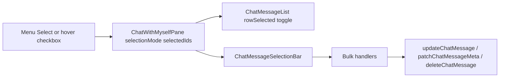

# Chat multi-select (Telegram-style)

## Decisions (locked)

- **그룹 변경**: 기존 [`updateChatMessage`](src/utils/chatWithMyself/storage.js) 경로 유지 → 메시지마다 수정 이력 생성 (1-B).
- **모바일 진입**: 롱프레스는 기존 컨텍스트 메뉴 유지. 메뉴의 **「선택」**으로만 선택 모드 진입 (2-B).
- **마우스/트랙패드**: 버블 **왼쪽**에 hover 시에만 보이는 체크박스 + **넓은 히트 영역**.

## Architecture

상태·오케스트레이션은 [`ChatWithMyselfPane.tsx`](src/components/chatWithMyself/ChatWithMyselfPane.tsx), 버블 UI는 [`ChatMessageList.jsx`](src/components/chatWithMyself/ChatMessageList.jsx) (거대 JSX — 신규 로직은 `.ts`/`.tsx`로 추출), 모바일 메뉴는 [`ChatMessageContextMenu.jsx`](src/components/chatWithMyself/ChatMessageContextMenu.jsx).

## 1. Selection state

Pane에:

- `selectionMode: boolean`
- `selectedIds: Set<string>` (message `id`)

동작:

- **진입**: 컨텍스트/⋯ 메뉴 「선택」 → 해당 id 포함 + `selectionMode=true`
- **토글**: 선택 모드에서 버블 탭/클릭; 파인 포인터는 왼쪽 체크 히트존으로도 토글 (선택 모드 아니어도 체크 클릭 시 진입+선택)
- **종료**: 선택 바 닫기 / Esc / 선택 0개
- Desktop: `Ctrl/Cmd+클릭`으로 토글, `Shift+클릭`으로 보이는 목록 기준 범위 선택 (Sidebar/Cover 패턴과 동일 계열)
- 선택 중: 스와이프 답장·단건 컨텍스트 메뉴·수정 진입 억제; `rowSelected` = `selectedIds.has(id) || sheet…`

헬퍼 예: [`src/utils/chatWithMyself/messageSelection.ts`](src/utils/chatWithMyself/messageSelection.ts) — `toggleId`, `rangeSelect`, `clear`.

## 2. Bubble checkbox (fine pointer only)

[`MessageBubble`](src/components/chatWithMyself/ChatMessageList.jsx) 왼쪽:

- `pointer:fine` (또는 `!coarse`)일 때만 렌더
- 기본 `opacity-0`, row `group-hover` / `selected` / `selectionMode`일 때 표시
- 체크 비주얼은 작되, 히트 영역은 세로로 버블에 가깝게·가로 ~32–40px (`absolute` + 넓은 `button`/`label`)
- Radix Checkbox 또는 프로젝트 기존 체크 스타일; 아이콘/버튼 규칙 준수
- 접근성: `aria-label="메시지 선택"`, `aria-checked`

## 3. Menu: 「선택」

[`MessageActionItems`](src/components/chatWithMyself/ChatMessageList.jsx) + [`ChatMessageContextMenu.jsx`](src/components/chatWithMyself/ChatMessageContextMenu.jsx)에 「선택」 항목 추가 (답장 근처). `onEnterSelection(msg)` → Pane.

## 4. Selection action bar

신규 [`ChatMessageSelectionBar.tsx`](src/components/chatWithMyself/ChatMessageSelectionBar.tsx):

- Composer dock **위** sticky/고정 바 (`PrintChromePlacementBar` 수준의 rounded border + blur 참고)
- `N개 선택` + 닫기
- 액션 (각 아이콘+라벨 또는 아이콘+Tooltip/`aria-label`):
  - 반응
  - 그룹 변경
  - 복사
  - 고정
  - 삭제

선택 모드일 때 단건 시트/드롭다운보다 바가 우선.

## 5. Bulk handlers (Pane)

| 액션 | 동작 |
|------|------|
| 반응 | 기존 `ChatReactionPicker` 1회 → 각 id에 `handleToggleReaction` (단건과 동일 토글 의미) |
| 그룹 | 그룹 피커 모달 (`ChatSelect` / 공유 모달 패턴) → 각 메시지 `updateChatMessage({ group, body: 기존 body, … })` — **이력 유지 (1-B)**; day별로 순차/제한 병렬 |
| 복사 | `formatChatMessagePlainText`를 시간순으로 join (`\n\n`) → `copyText` |
| 고정 | 선택 중 **하나라도 unpinned면 전부 pin**, 모두 pinned면 전부 unpin → `patchChatMessageMeta({ pinnedAt })` |
| 삭제 | `ConfirmModal` `variant="danger"` (`N개 메시지 삭제`) → 기존 `performDeleteMessage` 배치; 완료 후 선택 해제 |

암호화/플레이스홀더 복사는 단건과 동일한 포맷 규칙을 따른다.

## 6. Out of scope (1차)

- 벌크 답장 / 노트 추가 / OG 재로딩 / 수정
- day-file 단일 write 배치 최적화 (필요 시 후속)
- `ChatMessageList.jsx` 전체 TS 전환 (신규 바·selection util만 `.tsx`/`.ts`)

## 7. Verification

- Desktop: hover 체크 → 다중 선택 → 바 액션 각각
- Mobile: 롱프레스 메뉴 → 「선택」 → 탭 토글 → 바 액션; 롱프레스가 메뉴를 유지하는지
- Esc/닫기로 선택 해제; 삭제 후 선택 클리어
- 가상 리스트 스크롤·older load 중 선택 id 유지
