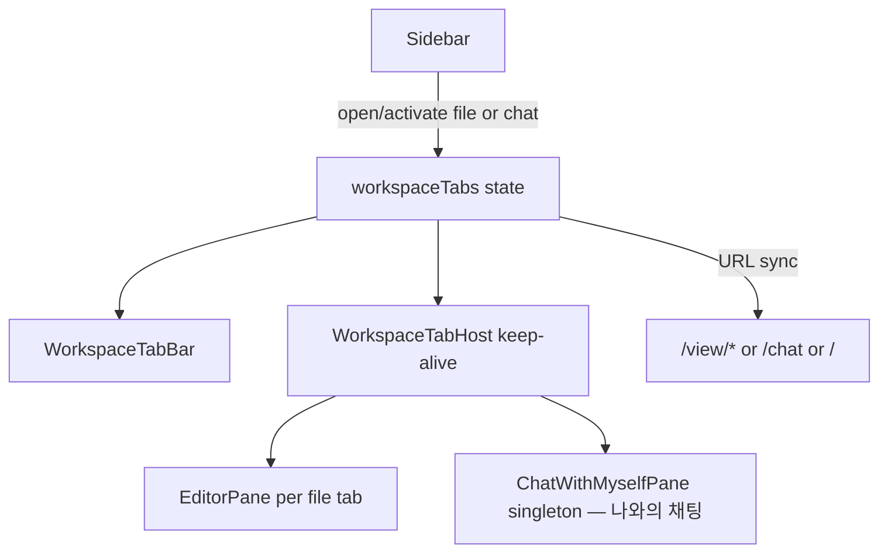

# Editor workspace tabs (chat included)

## Decisions (locked)

- **Layout**: 탭 스트립 + 단일 콘텐츠 (스플릿 없음)
- **Lifecycle**: 열린 탭 **keep-alive** (`hidden`/`inert`, 언마운트 금지)
- **Chat**: 「나와의 채팅」(`ChatWithMyselfPane`)을 **싱글톤 워크스페이스 탭**으로 포함 (`/chat` 배타 교체 제거). 사이드바·탭바에서 동일 진입점
- **Already-open file**: 같은 `storageType:path` 탭이 있으면 **새 탭을 만들지 않고 그 탭을 activate**한 뒤 **서버 동기화를 시도** (아래 Open / switch)
- **Out of scope**: 에디터 스플릿, [`directory_chat`](.cursor/plans/directory_chat.md_files_f4e25160.plan.md) `*.chat.md`, Settings/PDF export/LLM popout을 탭으로 넣는 것

## Current state

- [`App.jsx`](src/App.jsx): 단일 `currentFile` + `editorContent`; `/chat` vs `/`·`/view/*`가 메인 슬롯을 **교체**
- 전환 시 md는 `saveCurrentMarkdownBeforeSwitch` → IndexedDB draft; 미디어 `objectUrl`은 이전 파일에서 revoke
- 복원: `s3haim_lastFile` 단일 항목 (`chat` 또는 `{type,path}`)
- 파일 재오픈 시 서버 fetch + draft vs server 충돌 confirm은 [`selectFileRaw`](src/App.jsx)에 이미 있음 (탭 모델로 옮겨 재사용)

## Target architecture



### Tab model

New TS modules (migration policy: **new files `.ts`/`.tsx`**):

- [`src/utils/workspaceTabs/types.ts`](src/utils/workspaceTabs/types.ts) — tab shapes
- [`src/utils/workspaceTabs/workspaceTabsStore.ts`](src/utils/workspaceTabs/workspaceTabsStore.ts) (or `useWorkspaceTabs` hook owned by `MainApp`) — open list + active id + ops

```ts
type WorkspaceTab =
  | { id: string; kind: 'chat' } // id fixed e.g. 'chat' — UI label: 「나와의 채팅」
  | {
      id: string; // `${storageType}:${path}`
      kind: 'file';
      storageType: 's3' | 'local' | 'webdav';
      path: string;
      currentFile: /* existing shape */;
      editorContent: string;
      baselineContent: string; // dirty compare
      editedFileName: string;
      lastActivatedAt: number;
    };
```

Ops:

| Op | Behavior |
|----|----------|
| `openOrActivateFile` | 동일 id 탭 **있으면** `activate` + **서버 sync 시도** (아래); 없으면 soft-cap 후 load·open |
| `openOrActivateChat` | chat 탭 없으면 open, 있으면 activate만 (싱글톤) |
| `activate` / `close` / `patchFileTab` | 기존 계획과 동일 |
| `reorder` | optional v1: click-order only, no drag |

Soft cap **12** open tabs: when opening beyond cap, close least-recently-activated **non-dirty** file tab first; if none, prompt before closing dirty. Chat 탭은 soft-cap 대상에서 **제외**(항상 1개 또는 0).

### Already-open file → activate + server sync

트리·검색·URL 등으로 **이미 열린** 파일을 다시 열 때:

1. 해당 file 탭을 **activate** (URL → `/view/...`, keep-alive 패널 표시). 다른 탭 **언마운트·objectUrl revoke 금지**.
2. 이어서 **서버(또는 백엔드)에서 최신 본문/메타를 다시 읽기** — 기존 `selectFileRaw`의 S3/WebDAV/local open 경로를 탭용으로 재사용 (`openPathFileFromBackend` / `getObjectBody` 등).
3. 충돌 정책 (현 `selectFileRaw` draft 로직과 정렬):
   - 탭이 **clean**이고 서버가 더 최신이면 → 서버 내용으로 `patchFileTab` (baseline 갱신)
   - 탭이 **dirty**(또는 IndexedDB draft)이고 서버 `LastModified`가 열 때/draft 기준보다 최신이면 → 기존 confirm (“서버에 더 최신 버전이 있습니다…”) 후 사용자 선택 적용
   - 서버가 같거나 더 오래되면 → 로컬 탭 상태 유지, activate만
4. local 스토리지는 “서버” 대신 디스크 재read로 동일 패턴.
5. 동기화 실패(네트워크 등) 시: 탭은 이미 activate된 채 유지, 에러는 기존과 같이 로그/상태만 (탭을 닫지 않음).

구현 힌트: `openOrActivateFile`이 “hit”일 때 `selectFileRaw(..., { syncExistingTab: true })` 또는 전용 `syncFileTab(tabId)`가 활성 탭만 patch하고, miss일 때만 새 탭 open.

### UI shell

New components:

- [`src/components/workspace/WorkspaceTabBar.tsx`](src/components/workspace/WorkspaceTabBar.tsx) — horizontal scroll strip; file title; dirty dot; close (×); chat 탭 고정 라벨 **「나와의 채팅」** (+ 아이콘)
- [`src/components/workspace/WorkspaceTabHost.tsx`](src/components/workspace/WorkspaceTabHost.tsx) — stack of panes; inactive: `hidden` + `inert` (and `aria-hidden`); **do not unmount**

Main content in [`App.jsx`](src/App.jsx):

- **`/settings`**: 기존처럼 Settings만 표시. 탭 **state는 App에 유지**. 가능하면 WorkspaceHost를 숨긴 채 마운트 유지(설정 왕복 시 채팅/에디터 keep-alive 보존); 구현이 과도하면 설정 진입 시 host 언마운트 허용하되 state로 재마운트(차선).
- **그 외 workspace** (`/`, `/view/*`, `/chat`): `WorkspaceTabBar` + `WorkspaceTabHost` 한 경로로 통합. 라우트별 `EditorPane`/`ChatWithMyselfPane` 중복 element 제거.

URL sync (표시·북마크 유지):

- active file → `navigate(/view/${path})`
- active chat → `navigate(/chat)`
- no tabs → `navigate('/')` + empty state
- Sidebar `chatWithMyselfActive` / 트리 `currentFile`는 **active tab** 기준

### Open / switch / close

| Action | Behavior |
|--------|----------|
| Tree / AS / deep-link file | 같은 `storageType:path` 탭 있으면 **그 탭 activate + 서버 sync 시도**; 없으면 load 후 open. **다른 탭 objectUrl revoke 금지** |
| Sidebar 「나와의 채팅」 | `openOrActivateChat` — 없으면 탭 생성, 있으면 즉시 전환 (싱글톤) |
| Tab click (file) | activate + URL; **재클릭(이미 active) 또는 포커스만**이면 sync는 선택(기본: 트리에서 다시 열 때만 sync). Tab 클릭으로 inactive→active 전환 시 sync는 **하지 않음**(불필요한 네트워크 방지). Sync는 **외부 open 요청**(트리/검색/URL reopen)에 묶음 |
| Tab click (chat) | activate + `/chat` |
| Tab × / Editor close | dirty면 기존 close confirm; 닫을 때 해당 탭만 `revokeObjectURL`; active였으면 이웃 탭 activate |
| File switch between keep-alive tabs | **더 이상** `saveCurrentMarkdownBeforeSwitch` 필수 아님(상태가 탭에 있음). Draft 저장은 close/unload/blur 정책으로 축소 가능 |

`selectFileRaw` / `setCurrentFile` / `setEditorContent` 단일 모델을 **active file tab에 대한 patch**로 치환. Save/rename/recording 등은 `activeTabId`의 file 탭을 대상으로.

### Chat keep-alive (「나와의 채팅」)

- `ChatWithMyselfPane` **인스턴스 1개**만 host 안에 두고, chat 탭이 비활성일 때도 마운트 유지 → sync·composer draft·share 큐 유지
- 탭바 표시명: **「나와의 채팅」**
- `useVisualViewportLock` 등 모바일 채팅 전용 효과는 **chat 탭이 active일 때만** 켜지도록 pane에 `isActive` prop 전달
- 사이드바 「나와의 채팅」 항목 = `openOrActivateChat` (별도 전용 라우트 슬롯 제거)

### Persistence

Replace single `s3haim_lastFile` writer with session-friendly:

```json
{
  "tabs": [{ "kind": "chat" }, { "kind": "file", "type": "s3", "path": "a.md" }],
  "activeId": "s3:a.md"
}
```

Restore: reopen listed tabs (file via existing open path; chat as 「나와의 채팅」 탭). Backward compat: old `{type:'chat'}` / `{type,path}` → 단일 탭으로 hydrate.

`beforeunload`: **any** open file tab dirty → warn (not only active).

### App.jsx touchpoints (high impact)

- State: `currentFile`/`editorContent`/`editedFileName` → derived from active file tab **or** kept as mirrors updated from store (점진 이식 시 mirror 허용, 최종은 store SSOT)
- [`selectFileRaw`](src/App.jsx) (~1725+): miss → open tab; hit → activate + syncExisting; revoke only replaced media **on that tab**
- [`closeCurrentFile`](src/App.jsx) / close confirm: close **active tab**, not clear-all
- Routes block (~4816–5000): workspace host unification
- Sidebar handlers: 「나와의 채팅」 → `openOrActivateChat`

Avoid mass TS conversion of `App.jsx` / giant panes.

## Implementation phases

1. **Types + store** — tab identity, `openOrActivateFile` (hit=activate+sync), `openOrActivateChat`, close/patch, soft cap, dirty helpers
2. **TabBar + TabHost UI** — empty state, active styling, chat label 「나와의 채팅」, mobile horizontal scroll
3. **Wire files** — `selectFileRaw` open-vs-sync, save, close, URL sync, objectUrl lifecycle
4. **Wire chat** — singleton keep-alive 「나와의 채팅」, sidebar entry, `isActive` for viewport lock
5. **Persist + restore** — session schema + lastFile compat; beforeunload multi-tab dirty
6. **Polish** — dirty indicators, LRU close on cap, keyboard optional later (`Ctrl+Tab`는 follow-up)

## Non-goals / follow-ups

- Split editor panes
- Tab drag-reorder / pin
- `*.chat.md` file tabs ([directory_chat plan](.cursor/plans/directory_chat.md_files_f4e25160.plan.md)과 별도; 이후 `kind:'file'` + `viewer:'chat'`로 자연 합류 가능)
- Settings as a tab
- Tab 클릭만으로 inactive→active 시 자동 서버 sync (외부 open 경로에만 sync)
