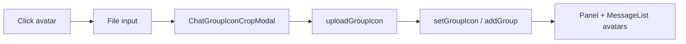

# 그룹 아이콘 + 인라인 추가

## 확정된 UX

- **기존 그룹**: 목록 원형 아이콘 클릭 → 파일 선택 → `react-easy-crop` 원형 크롭 → 저장 후 반영
- **그룹 목록 `+`**: 모달 제거. 목록 **아래**에 motion으로 초안 행(빈 아이콘 + 이름 input + Check). 자동 focus. 빈 값 blur → 취소. 내용 있음 + blur/Check → 생성. 초안 중 `+` 비활성
- **컴포저**: Select의 「직접추가」옵션/다이얼로그 제거. Select는 기존 그룹만. 옆에 `placeholder="직접추가"` input + no-bg Check로 즉시 추가(추가 후 해당 그룹 선택)

## 데이터 모델

[`storage.js`](src/utils/chatWithMyself/storage.js)의 `meta.json` groups를 객체 배열로 확장하고, 기존 `string[]`는 읽기 시 정규화:

```json
{
  "timezone": "Asia/Seoul",
  "groups": [
    { "name": "친구", "iconPath": ".chat-with-myself/group-icons/<uuid>.jpg" },
    { "name": "업무" }
  ]
}
```

- `normalizeGroups(raw)`: string → `{ name }`, 객체는 `name`/`iconPath`만 유지, `나`/공백 제외
- `sortGroupsKo`: `name` 기준 `ko` localeCompare
- `addGroup(ctx, name, { iconPath? })`, `setGroupIcon(ctx, name, iconPath)` 추가
- 메시지 `group` 필드는 **이름 문자열 유지** (기존 day `.md` 호환). 아이콘은 meta에서 이름→iconPath 조회

경로: [`paths.js`](src/utils/chatWithMyself/paths.js)에 `GROUP_ICONS_FOLDER` / `groupIconPathPrefix()` 추가. 업로드는 [`images.js`](src/utils/chatWithMyself/images.js)와 동일하게 local/S3 put (`uploadGroupIcon`).

## 의존성

```bash
bun add react-easy-crop
```

크롭 헬퍼: `src/utils/chatWithMyself/cropImage.js` (`getCroppedImg` → JPEG Blob/File). UI: `cropShape="round"`, `aspect={1}`, `showGrid={false}`.

## 새/변경 UI 컴포넌트



1. **`ChatGroupIconCropModal.jsx`**  
   Radix Dialog + `Cropper` + zoom + 확인/취소. 확인 시 cropped File을 `onConfirm`으로 전달.

2. **`ChatGroupAvatar.jsx`** (공용)  
   `iconPath` 있으면 `getPresignedUrl`로 원형 ``, 없으면 해시색+첫글자(또는 「나」). 클릭 가능 시 stopPropagation + 파일 선택 트리거.

3. **[`ChatGroupPanel.jsx`](src/components/chatWithMyself/ChatGroupPanel.jsx)**  
   - `ChatAddGroupDialog` 제거  
   - `drafting` 상태: `+` → draft row `AnimatePresence`/`motion`으로 하단 append, input autofocus, Check 버튼  
   - blur/Check 커밋 로직; 초안 중 아이콘도 미리 crop 가능(로컬 blob → 커밋 시 업로드)  
   - 기존 행 아바타 클릭 → crop → `onSetGroupIcon`

4. **[`ChatComposer.jsx`](src/components/chatWithMyself/ChatComposer.jsx)**  
   - `ADD_GROUP_VALUE` / `ChatAddGroupDialog` 제거  
   - Select는 `나` + 기존 그룹만  
   - `input[placeholder=직접추가]` + Check: trim 후 `onAddGroup` → `onSelectedGroupChange(name)` → input clear  
   - Enter로도 커밋 가능하면 동일 처리

5. **[`ChatMessageList.jsx`](src/components/chatWithMyself/ChatMessageList.jsx)**  
   말풍선 옆 원에 `groups`/`iconByName` + `getPresignedUrl`로 사진 표시(없으면 기존 이니셜).

6. **[`ChatWithMyselfPane.jsx`](src/components/chatWithMyself/ChatWithMyselfPane.jsx)**  
   `handleAddGroup`를 icon 지원으로 확장, `handleSetGroupIcon` 추가, `groupPanelProps`/`ChatComposer`에 전달. `groups` state는 `{name, iconPath?}[]`.

7. **정리**  
   [`ChatAddGroupDialog.jsx`](src/components/chatWithMyself/ui/ChatAddGroupDialog.jsx) 삭제(미사용). `ADD_GROUP_VALUE` export 제거(검색 패널 등 미사용 확인). Select/검색/필터는 `group.name` 사용하도록 수정.

## 표시/조회 헬퍼

`groupNames(groups)`, `groupIconMap(groups)`를 storage 또는 작은 util로 두어 Select/Search/필터가 이름 배열만 쓰게 유지.

## 구현 시 주의

- 초안 Check 클릭 시 input blur가 먼저 와서 이중 커밋/취소되지 않도록 `relatedTarget`/mousedown `preventDefault` 처리
- 아이콘 업로드 실패 시 그룹명은 유지하고 이니셜 fallback
- 한글 주석/문자열 유니코드 깨지면 영문으로 통일 (사용자 규칙)
