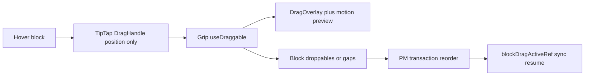

# Haim Editor 블록 드래그 (dnd-kit + motion)

## 현황

- 노트 WYSIWYG는 TipTap [`HaimDragHandleLayer`](src/components/haimEditor/HaimDragHandleLayer.tsx) + HTML5 DnD로 블록을 옮긴다. 주석에도 **no dnd-kit / motion overlay** 라고 명시됨.
- 드래그 중 [`blockDragActiveRef`](src/components/haimEditor/HaimEditor.tsx)로 TipTap↔CM 동기화를 막는 가드는 이미 있음 — 유지.
- 사이드바 트리는 `useDraggable`/`useDroppable` + 파일명 pill 오버레이([`treeDnd.tsx`](src/components/shell/treeDnd.tsx)). **이 모듈/애니메이션을 import·공유하지 않음.**

## 선택한 접근

1. **TipTap `DragHandle`**: 호버 블록에 그립을 붙이는 위치 계산만 사용 (`onNodeChange`로 현재 블록 `pos`/`node` 추적).
2. **HTML5 드래그 차단**: 그립/`DragHandle` 루트에 capture `dragstart` → `preventDefault` + `stopImmediatePropagation` 해서 TipTap `dragHandler` / `view.dragging`이 돌지 않게 함. (`element.draggable`과 경쟁하지 않도록 드래그 시작은 **PointerSensor만**).
3. **dnd-kit**: 에디터 전용 `DndContext` + 그립 `useDraggable` + 최상위 블록(또는 블록 사이 gap) `useDroppable`.
4. **문서 변경**: drop 시 ProseMirror로 최상위 노드 이동 (TipTap HTML5 drop / NodeRange restore에 의존하지 않음).
5. **motion**: Haim 전용 오버레이·고스트·삽입선 애니메이션 (TreeNode pill spring / `layout={false}` ghost 복제 금지).

범위: **노트 에디터 최상위 블록만** (현재 `nested` 미사용과 동일). composer / preview / nested list 핸들은 제외. 이미지 NodeView의 `data-drag-handle` HTML5는 그대로 두고, 그립 경로만 dnd-kit으로 교체.

## 구현 모듈 (신규, TreeNode 무관)

[`src/components/haimEditor/blockDnd/`](src/components/haimEditor/blockDnd/) 아래에 모음:

| 파일 | 역할 |
|------|------|
| `HaimBlockDndRoot.tsx` | `DndContext`, sensors (`PointerSensor` + `TouchSensor`, activation `distance: 8`), collision, `onDragStart/Over/End`, `blockDragActiveRef` 연동 |
| `HaimBlockDragHandle.tsx` | 기존 `HaimDragHandleLayer` 대체: TipTap `DragHandle` + grip에 `useDraggable` listeners; HTML5 차단 |
| `HaimBlockDropTargets.tsx` | `editor.view.dom`의 직계 블록에 droppable 등록(또는 gap rect). doc/scroll/resize 시 remeasure |
| `HaimBlockDragOverlay.tsx` | `DragOverlay dropAnimation={null}` + **자체** `motion.div` 프리뷰 |
| `moveHaimTopLevelBlock.ts` | `fromPos` → 목표 index/pos로 slice cut+insert (history에 한 스텝) |
| `haimBlockDndConstants.ts` | spring / z-index / ghost opacity 상수 (트리 상수 비참조) |

기존 [`HaimDragHandleLayer.tsx`](src/components/haimEditor/HaimDragHandleLayer.tsx)는 위 핸들로 교체하거나 thin re-export로 정리. [`HaimEditor.tsx`](src/components/haimEditor/HaimEditor.tsx) lazy import 경로만 갱신.

## UX / 애니메이션 (Haim 전용)

- **오버레이**: 드래그 중인 블록 DOM을 clone해 카드형 프리뷰 (max-height + fade mask로 긴 블록 처리). spring: scale ~0.97→1.02, opacity, soft shadow. TreeNode의 파일명 pill 룩 사용 금지.
- **소스 고스트**: 원본 블록에 `.haim-block-drag-source` (opacity ~0.35). Motion layout animation 없음.
- **드롭 지표**: 블록 사이 파란 삽입선 (`motion`으로 width/opacity). Cover 레이어 행 스타일과도 분리.
- **autoScroll**: 에디터 스크롤 컨테이너 기준 (Sidebar `TREE_DND_AUTO_SCROLL` 비사용).

참고 패턴(복사 대상이 아니라 API만): Cover의 `DragOverlay` + `dropAnimation={null}` + `Motion.div` ([`CoverLayerPanel.tsx`](src/components/noteCover/CoverLayerPanel.tsx) ~974–987). 트리 모듈은 import하지 않음.

## 동기화 / 안전

- `onDragStart` → `blockDragActiveRef.current = true` + `cancelPending()` (현행과 동일).
- `onDragEnd` / cancel → `false` 후 dual sync 재개.
- drop 중 `setContent` 금지 유지.
- `NodeRange` 확장은 당분간 유지(다른 경로/향후 nested); HTML5 그립 경로에서는 더 이상 사용하지 않음.

## 스타일

[`src/styles/haim-editor/preview-tokens.css`](src/styles/haim-editor/preview-tokens.css)에 소스 고스트·오버레이·삽입선 클래스 추가. 기존 `.haim-drag-handle` gutter는 유지.

## 검증

- 단락/제목/이미지/코드블록을 그립으로 위·아래 이동 → 마크다운·소스 페인 일치, undo 한 스텝.
- 드래그 중 보이는 카드 오버레이 + 소스 고스트 + 삽입선.
- 드래그 중 외부 value/`useHaimDualSync`가 DnD를 끊지 않음.
- 사이드바 트리 DnD와 동시 사용 시 컨텍스트 격리(에디터 `DndContext`가 트리와 중첩되지 않음 — 에디터 서브트리에만 마운트).
