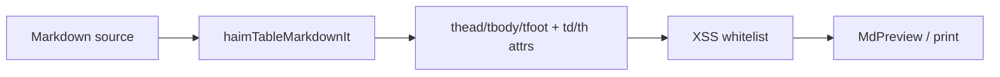

# Haim 표 병합·스타일 문법

## 확정 결정

- 터치 롱프레스: 채팅과 동일 **500ms** ([`usePressableCardMenu`](src/components/chatWithMyself/usePressableCardMenu.ts))
- 템플릿 편집: Settings 섹션 (`/settings#settings-table-styles`) + 표 편집 모달에서 동일 편집기 모달 오픈
- 병합: **colspan + rowspan**
- 구역 스타일: **thead / tbody / tfoot** 각각 (템플릿·표 편집 공통)
- 타이포: **font-family / font-size / font-weight** (셀·구역·템플릿 규칙 공통 필드)
- 소스: GFM `|` 표 + 직전 `<!-- haim-table … -->` 주석 (note-cover와 같은 JSON-in-comment)
- 다운로드 표 형식 선택: [`DownloadMethodModal`](src/components/modals/DownloadMethodModal.tsx)에 추가
- Novel(TipTap) 라운드트립: v1 비범위 (주석 보존만 기대; TipTap Table 미도입)

## 스타일 필드 (공통)

셀·구역·템플릿 규칙이 공유하는 `HaimTableStyle` 필드 (모두 optional):

| 필드 | CSS | UI |
|------|-----|-----|
| `bg` / `background` | `background-color` | 색 입력 |
| `borderInner` / `border_inner` | 셀 내부 테두리 | 색 입력 |
| `borderOuter` / `border_outer` | 표/구역 외곽 테두리 | 색 입력 |
| `color` | `color` | 색 입력 |
| `fontFamily` / `font_family` | `font-family` | [`FontFamilyInput`](src/components/FontFamilyInput.tsx) + 웹폰트 옵션 |
| `fontSize` / `font_size` | `font-size` | 숫자/단위 입력 (예 `14px`) |
| `fontWeight` / `font_weight` | `font-weight` | Select/입력 (`400`/`600`/`bold` 등) |

우선순위 (높→낮): **셀 오버라이드** → **구역(thead/tbody/tfoot)** → **템플릿 nth 규칙**(앞 규칙 우선) → 기본.

## 소스 문법

```markdown
<!-- haim-table
{
  "v":1,
  "headerRows":1,
  "footerRows":0,
  "merges":[{"r":0,"c":0,"colspan":2,"rowspan":1}],
  "sections":{
    "thead":{"bg":"#1e293b","color":"#fff","fontFamily":"Pretendard","fontSize":"14px","fontWeight":"700","borderOuter":"#0f172a","borderInner":"#334155"},
    "tbody":{"fontFamily":"Pretendard","fontSize":"13px","fontWeight":"400","borderInner":"#e2e8f0"},
    "tfoot":{"bg":"#f8fafc","fontWeight":"600"}
  },
  "cells":{"1,0":{"bg":"#eee","color":"#111","fontSize":"12px"}},
  "templateId":"striped",
  "templateOverrides":{}
}
-->
| A | B |
| --- | --- |
| 1 | 2 |
```

- 그리드 텍스트는 기존 GFM 표에 유지. 병합에 가려진 셀은 빈 칸으로 두고, 플러그인이 렌더 시 생략.
- 주석 escape는 [`noteCover/parse.ts`](src/utils/noteCover/parse.ts)와 동일 패턴 (`-->` 등).
- `headerRows` / `footerRows`: GFM에는 thead/tfoot이 없으므로 **행 개수로 구역을 지정** (기본 `headerRows:1`, `footerRows:0`). 중간 행 = tbody.
- `sections.thead|tbody|tfoot`: 구역 일괄 스타일 (위 공통 필드).
- `cells` 키는 `"row,col"`. 셀별 오버라이드 (색 + 타이포 포함).
- `templateId` + `templateOverrides`: 템플릿 적용 후 표별 수정분 (sections/cells/rules 일부).

유틸 (신규 TS):

- [`src/utils/haimTable/types.ts`](src/utils/haimTable/types.ts) — `HaimTableStyle`, `HaimTableSections`, meta
- [`src/utils/haimTable/parse.ts`](src/utils/haimTable/parse.ts) — 주석+표 블록 find/parse/serialize/upsert
- [`src/utils/haimTable/merge.ts`](src/utils/haimTable/merge.ts) — 병합 정규화·가림 셀 계산
- [`src/utils/haimTable/styleResolve.ts`](src/utils/haimTable/styleResolve.ts) — 템플릿 규칙 + sections → 셀 최종 스타일, **앞 규칙 우선**
- [`src/utils/haimTable/toHtml.ts`](src/utils/haimTable/toHtml.ts) — `<table><thead>/<tbody>/<tfoot>` HTML 변환
- [`src/utils/haimTable/nthMatch.ts`](src/utils/haimTable/nthMatch.ts) — `odd`/`even`/`2n+1`/`3` 등 row/col 매칭

## 렌더 파이프라인



1. 신규 [`src/utils/haimTable/markdownItPlugin.ts`](src/utils/haimTable/markdownItPlugin.ts): 주석+GFM table 토큰을 찾아 `headerRows`/`footerRows` 기준으로 **thead / tbody / tfoot** 래퍼를 재구성하고, 구역·셀 `style`·`colspan`/`rowspan`·`data-haim-table` 부여, 가림 셀 제거.
2. 등록: [`src/config/mdEditorConfig.js`](src/config/mdEditorConfig.js) (+ [`MarkdownEditor.jsx`](src/components/MarkdownEditor.jsx) 중복 가드).
3. XSS: `extendedWhiteList`에 `table`/`thead`/`tbody`/`tfoot`/`td`/`th`의 `style`, `class`, `data-*` 허용 (`colspan`/`rowspan`은 기본 허용).
4. 인쇄 [`ExportPDFPage.jsx`](src/pages/ExportPDFPage.jsx)는 동일 전역 플러그인이라 추가 작업 최소.

## 표 편집 UX

### 진입점

| 위치 | 동작 |
|------|------|
| 에디터 (CodeMirror) | 선택이 GFM 표(또는 직전 haim-table 주석)와 겹치면 context menu → **표 편집** |
| 프리뷰 표 | 우클릭 / coarse 500ms 롱프레스 → **표 편집** ([`usePressableCardMenu`](src/components/chatWithMyself/usePressableCardMenu.ts) 패턴). 기존 이미지 우클릭 핸들러([`MarkdownEditor.jsx`](src/components/MarkdownEditor.jsx) ~996)와 공존: `closest('table')` 우선 분기 |
| ExportPDF 미리보기 | 동일 프리뷰 훅 재사용 (읽기 전용이면 편집 비활성 또는 본문 저장 경로만) |

에디터 메뉴: Radix `ContextMenu`를 에디터 루트에 controlled로 두거나, 선택이 표일 때 기존 커스텀 메뉴에 항목 추가. 표 range 탐지는 `parse.ts`의 블록 스캔.

### 표 편집 모달 ([`src/components/haimTable/TableEditModal.tsx`](src/components/haimTable/TableEditModal.tsx))

- 그리드 UI: 셀 클릭 선택, Shift/드래그로 직사각 다중 선택 → **병합**(colspan×rowspan) / 병합 해제.
- 셀 텍스트 인라인 편집 → GFM 셀 문자열 갱신.
- Header 툴바 (선택 셀):
  - 색: 배경·내부 border·외부 border·글자색
  - 타이포: **font-family** ([`FontFamilyInput`](src/components/FontFamilyInput.tsx) + webfont 목록), **font-size**, **font-weight**
- 구역 패널: **thead / tbody / tfoot** 탭(또는 Select)으로 전환해 동일 스타일 필드 일괄 편집 + `headerRows`/`footerRows` 조절.
- 템플릿 Select → 적용(규칙+sections resolve 후 기록) → 이후 셀·구역 오버라이드 가능.
- “템플릿 관리” → Settings와 동일한 [`TableStyleTemplateEditor`](src/components/settings/TableStyleTemplateEditor.tsx) 모달.
- 확인 시: 주석 upsert + GFM 표 본문 치환을 CodeMirror/`onChange`로 반영.

## 표 스타일 템플릿 (YAML)

저장: **`.settings/table-styles.yaml`** (vault 동기화). 파서: `js-yaml` (`load`/`dump`).

Store: [`src/utils/tableStyleSettingsStore.ts`](src/utils/tableStyleSettingsStore.ts) — [`webfontSettingsStore.ts`](src/utils/webfontSettingsStore.ts) 복제, `App.jsx`에서 `setTableStyleSettingsStore` 주입.

스키마 예시:

```yaml
version: 1
templates:
  - id: striped
    name: Striped
    # Section defaults (applied before row/col rules)
    sections:
      thead:
        background: "#1e293b"
        border_inner: "#334155"
        border_outer: "#0f172a"
        color: "#ffffff"
        font_family: "Pretendard"
        font_size: "14px"
        font_weight: "700"
      tbody:
        border_inner: "#e2e8f0"
        font_family: "Pretendard"
        font_size: "13px"
        font_weight: "400"
      tfoot:
        background: "#f8fafc"
        font_weight: "600"
        font_size: "12px"
    rules:
      - rows: "odd"          # odd | even | nth 수식 | 단일 번호 (tbody 기준 또는 전체 row — 문서화)
        background: "#f5f5f5"
        border_inner: "#e5e5e5"
        border_outer: "#333333"
        color: "#111111"
        font_family: "Pretendard"
        font_size: "14px"
        font_weight: "600"
      - cols: "1"
        background: "#eef2ff"
        font_weight: "500"
```

- `sections.thead|tbody|tfoot`: 구역 기본 디자인 (색·border·**font_family / font_size / font_weight**).
- `rules[]`: nth row/col 일괄. 각 규칙에도 동일 스타일 필드 전부 허용.
- 규칙 배열 **앞쪽일수록 우선** (이미 채워진 속성은 뒤 규칙이 덮지 않음).
- Settings GUI: 템플릿마다 **Sections 탭**(thead/tbody/tfoot) + **Rules 리스트** + YAML 원문 토글. 타이포 컨트롤은 표 편집과 동일 컴포넌트.
- Settings UI: [`TableStyleSettings.tsx`](src/components/settings/TableStyleSettings.tsx) — 템플릿 목록 + [`TableStyleTemplateEditor`](src/components/settings/TableStyleTemplateEditor.tsx).
- [`SettingsPage.jsx`](src/pages/SettingsPage.jsx) 섹션 `id="settings-table-styles"`.
- Advanced Search: [`commands.ts`](src/utils/advancedSearch/commands.ts)에 `settings-table-styles` → `/settings#settings-table-styles`. 표 편집 액션은 [`editorActions.ts`](src/utils/advancedSearch/editorActions.ts)에 `editor-table-edit` 추가 후 `MarkdownEditor`에 등록.

## 다운로드 변환

[`DownloadMethodModal.tsx`](src/components/modals/DownloadMethodModal.tsx)에 Radio 추가:

- **Haim 마크다운 유지** (기본): 주석+GFM 그대로
- **HTML table로 변환**: `toHtml`로 `<table><thead>…</thead><tbody>…</tbody><tfoot>…</tfoot></table>` 치환 후 이미지/헤딩 처리 기존 흐름 유지

`DownloadMethodChoice`에 `tableFormat: 'haim' | 'html'` 추가 → [`App.jsx`](src/App.jsx) `handleDownloadCurrentFile`에서 markdown 전처리.

## 커스텀 마크다운 문서 ([`.cursor/rules/custom-markdown-docs.mdc`](.cursor/rules/custom-markdown-docs.mdc))

같은 변경에 문서를 포함한다. 참고 형식: [`note-cover.md`](docs/custom-markdown/note-cover.md) (HTML 주석 + JSON).

| 산출물 | 내용 |
|--------|------|
| [`docs/custom-markdown/haim-table.md`](docs/custom-markdown/haim-table.md) | **Syntax** + **Spec (interop)** + Implementation |
| [`docs/custom-markdown/README.md`](docs/custom-markdown/README.md) | 문서 목록 표에 한 줄 추가 |

`haim-table.md` Spec 체크리스트:

1. **Grammar** — `<!-- haim-table … -->` 직후 GFM pipe table; comment match regex; `--` escape (note-cover와 동일)
2. **Parse algorithm** — 주석+표 블록 결합, 실패 시 리터럴 유지; `headerRows`/`footerRows`로 thead/tbody/tfoot 분할; merges·가림 셀
3. **Value normalization** — hex color (README 공유 규칙), font-size 단위, font-weight, font-family 문자열; YAML 템플릿 snake_case ↔ JSON camelCase
4. **Canonical HTML** — `<table><thead>/<tbody>/<tfoot>` + `td`/`th`의 `colspan`/`rowspan`/`style`/`data-*`
5. **Post-process** — 다운로드 `tableFormat: html` 시 주석+GFM → HTML 치환; 템플릿 resolve 우선순위 (셀 → 구역 → nth 규칙 앞쪽 우선)
6. **Non-goals** — Novel/TipTap Table; 템플릿 YAML vault UI 세부; XSS hydration 등 앱 전용

템플릿 파일 `.settings/table-styles.yaml`은 인라인 마크다운이 아니므로 feature 문서에 **부록(Appendix)** 으로 스키마만 기술하고, 별도 feature 파일은 만들지 않는다.

## 구현 순서

1. 타입(`HaimTableStyle`+sections)·parse/serialize·merge·nth·styleResolve
2. markdown-it 플러그인(thead/tbody/tfoot 재구성) + XSS + mdEditorConfig
3. `docs/custom-markdown/haim-table.md` + README 인덱스 (플러그인/스키마와 동기)
4. tableStyleSettingsStore + Settings YAML/GUI (sections + font controls)
5. TableEditModal (셀·구역·타이포·병합·템플릿) + context menu/롱프레스
6. DownloadMethodModal 표 형식 + HTML 변환
7. Advanced Search 명령·editor action
