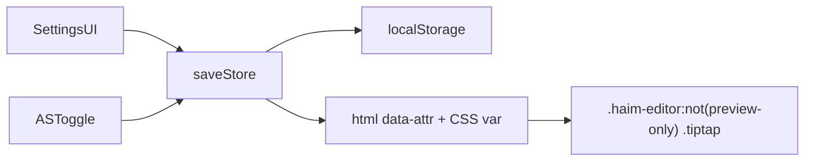

# Haim WYSIWYG prose width clamp

## Goal

Settings에 두 컨트롤을 추가한다.

1. **Switch** — WYSIWYG 본문 max-width clamp on/off
2. **px 입력** — clamp 시 최대 너비(px)

기본값: clamp **꺼짐**(현재 풀폭 유지), px **800**, 범위 **400–1600**.

적용 범위: **노트 Haim Editor WYSIWYG만**. `data-haim-preview-only`(Export PDF / 퀴즈 등)와 채팅 컴포저는 제외.

## Approach

기존 [`haimFocusOutlineSettings.ts`](src/utils/haimFocusOutlineSettings.ts) 패턴을 따른다 — React로 TipTap class를 다시 짜지 않고 `document.documentElement` 속성 + CSS로 즉시 반영.



## Implementation

### 1. Settings store — new [`src/utils/haimProseWidthSettings.ts`](src/utils/haimProseWidthSettings.ts)

- Keys: `s3haim_haim_prose_width_clamp` (`'1'|'0'`), `s3haim_haim_prose_max_width_px`
- `load/saveHaimProseWidthClampEnabled`, `load/saveHaimProseMaxWidthPx` (clamp to 400–1600, default 800)
- `applyHaimProseWidthDom({ enabled, maxWidthPx })`:
  - `html[data-haim-prose-width-clamp]="1"|"0"`
  - `--haim-prose-max-width: {n}px`
- `HAIM_PROSE_WIDTH_CHANGED_EVENT` + `initHaimProseWidthDom()`
- Boot: call `initHaimProseWidthDom()` next to other Haim inits in [`src/main.tsx`](src/main.tsx)

### 2. CSS — [`src/styles/haim-editor/style.css`](src/styles/haim-editor/style.css)

```css
html[data-haim-prose-width-clamp='1']
  .haim-editor:not([data-haim-preview-only])
  .haim-editor-content
  .tiptap.haim-editor-prose {
  max-width: var(--haim-prose-max-width, 800px);
  margin-inline: auto;
}
```

Tailwind `max-w-none`보다 특이도를 높여 덮어쓴다. 소스 페인(CM)·미리보기 전용 루트는 영향 없음.

### 3. Advanced Search toggle — [`src/utils/advancedSearch/settingsToggles.ts`](src/utils/advancedSearch/settingsToggles.ts)

- Id: `settings-haim-prose-width-clamp`
- `load`/`save` → store의 enabled API만 (px는 AS에 넣지 않음)
- KO/EN keywords: 본문 너비, reading width, max-width, clamp 등

### 4. Settings UI — new [`src/components/settings/HaimProseWidthSettings.tsx`](src/components/settings/HaimProseWidthSettings.tsx)

[`CoverSettings.tsx`](src/components/settings/CoverSettings.tsx)와 같은 토글+px 쌍:

- Switch → `setSettingsToggle('settings-haim-prose-width-clamp', …)` + `subscribeSettingsToggles`
- `SliderWithScrubInput` (`unit="css"`, `suffix="px"`, min/max/step) → `saveHaimProseMaxWidthPx`
- px 슬라이더는 clamp가 꺼져 있어도 편집 가능(켜면 바로 적용), 또는 disabled when off — **켜져 있을 때만 활성**

[`SettingsPage.jsx`](src/pages/SettingsPage.jsx) Haim Editor 옵션 블록(점선 테두리 등 Switch 근처)에 컴포넌트만 마운트. 거대 `SettingsPage`는 변환하지 않음.

카탈로그는 기존 `#settings-editor` 섹션 안에 두므로 [`settingsPageCatalog.ts`](src/utils/settingsPageCatalog.ts) 변경 불필요.

## Out of scope

- md-editor-rt preview 너비
- ChatComposer Haim
- Export PDF / `HaimMarkdownPreview` (`data-haim-preview-only`)
- AS에 px 숫자 커맨드 추가
