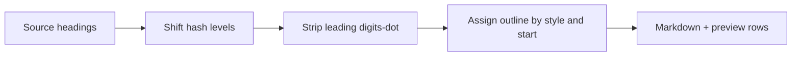

# Heading Remap — outline 번호 옵션

## 범위

- **대상:** [`HeadingRemapModal.tsx`](src/components/modals/HeadingRemapModal.tsx) + [`markdownHeadings.ts`](src/utils/markdownHeadings.ts)
- **비대상:** [`DownloadMethodModal`](src/components/modals/DownloadMethodModal.tsx) / 내보내기 경로의 level-only remap, Advanced Search 새 커맨드(기존 `editor-heading-remap` 유지)

## 동작 요약

옵션 **「outline 번호 맞추기」** 를 켠 경우, 적용 범위의 **모든** ATX heading에 대해:

1. 기존 leading outline (`^(?:\d+\.)+\s*`) 제거 (없으면 noop)
2. remap된 heading 수준에 맞춰 새 번호 prefix 부여
3. `#` 개수 remap은 기존과 동일

옵션이 꺼져 있으면 현재와 같이 **level만** 변경.

정규식은 의도상 `(\d\.)+` 이지만 `10.` 등을 위해 **`(\d+\.)+`** 로 파싱/제거.

## 번호 알고리즘

문서(또는 선택) 순서의 heading을 remap 후 `toLevel` 기준으로 순회.

| 옵션 | 의미 |
|------|------|
| `numberingStyle: 'flat'` | 최대 heading(= `headingMax`)은 **1세그먼트** (`1.` / `2.`) |
| `numberingStyle: 'nested'` | 세그먼트 수 = **heading 수준** (h2 → `2.1.`, h3 → `2.1.1.` …) |
| `startNumber: 1 \| 2` | 최대 heading의 **첫 세그먼트** 시작값 |

```text
extraPrefix = nested ? (headingMax - 1) : 0
# nested h2 start=2 → counters init [2, 0] → first h2 becomes "2.1. "
# flat  h2 start=2 → counters init [1] then first increment → "2. "
# depth index for heading L: extraPrefix + (L - headingMax)
# increment that index; zero trailing; format: parts.join('.') + '. '
```

레벨 점프(h1 다음 h3 등)는 해당 depth만 증가하고 중간은 기존 값 유지(표준 outline).

`shift === 0` 이어도 번호 옵션이 켜져 있으면 **반드시 적용** (현재 [`remapMarkdownHeadingLevels`](src/utils/markdownHeadings.ts) early-return 우회).



## Util API ([`markdownHeadings.ts`](src/utils/markdownHeadings.ts))

추가/확장:

- `OUTLINE_PREFIX_RE` / `stripHeadingOutlinePrefix` / `formatHeadingOutline`
- `assignHeadingOutlineNumbers(entries, { style, startNumber, targetMax })`
- `HeadingRemapRow`에 `nextText` 추가
- `planHeadingRemapRows` / `remapMarkdownHeadingLevels`에 optional:
  - `renumberOutline?: boolean`
  - `outlineStyle?: 'flat' | 'nested'`
  - `outlineStart?: 1 | 2`

한 패스에서 hash 교체 + rest 텍스트 rewrite.

## UI ([`HeadingRemapModal.tsx`](src/components/modals/HeadingRemapModal.tsx))

`최대 heading` Select 아래:

1. **Radix Switch** — 「outline 번호 맞추기」
2. Switch ON일 때만:
   - Radio: `1. 형식` (flat) / `2.1. 형식` (nested, 수준=세그먼트 수)
   - Radio: 시작 번호 `1` / `2`
3. 미리보기 테이블:
   - 기존: 내용 / 기존 크기 / 변경 크기
   - 추가: **변경될 제목** (`nextText`; 번호 OFF면 원문과 동일)
   - 긴 제목: native `title=` 제거 → **Radix Tooltip** (`z-100010`)
4. 모달 오픈 시 옵션 초기화: renumber off, nested, start 1
5. 취소/적용 버튼: 프로젝트 `Button` + 아이콘 (기존 text-only 정리)

## 검증

브라우저에서:

- 선택/전체 범위에서 level-only remap 기존 동작 유지
- 번호 ON + flat/nested × start 1/2 조합으로 미리보기 ↔ 적용 결과 일치
- 번호 없는 heading에도 prefix 추가되는지 확인
- `shift=0` + 번호만 변경 케이스
- nested Select/Tooltip이 모달 위에 보이는지 (z-index)
