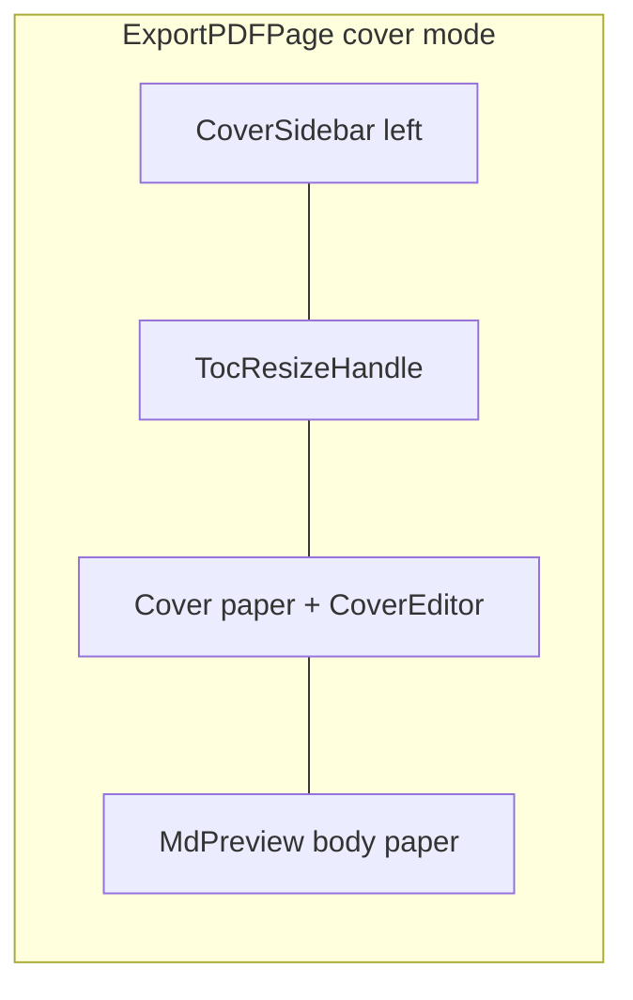

# Note 표지(Cover) 기능

## 결정사항

- **저장**: 노트 `.md` 최상단 HTML 주석 블록 (사이드카 없음). 중첩 데이터이므로 **JSON 본문 블록** 사용. 채팅 메타 주석 패턴([`format.js`](src/utils/chatWithMyself/format.js))과 동일한 “주석에 메타” 스타일.
- **범위(v1)**: 텍스트 상자 + 이미지 + 단색/배경 이미지. 도형·애니메이션·다중 슬라이드·MD 번들 래스터화는 v1 밖(도형은 후속 PLAN).
- **진입점**: [`ExportPDFPage.jsx`](src/pages/ExportPDFPage.jsx) 툴바 「표지」 → 표지 편집 모드.
- **컨트롤 UI**: 표지 편집 중 **왼쪽 사이드바**가 옵션·액션의 기본 표면. 하단/플로팅 툴바로 옵션을 흩뿌리지 않음.
- **라이브러리**: 캔버스 라이브러리 없이 `%` 좌표 + pointer 드래그/리사이즈 ([`NoteImageCropPanel.tsx`](src/components/modals/NoteImageCropPanel.tsx) 핸들 패턴). 사이드바 리사이즈는 [`useResizablePanelWidth`](src/hooks/useResizablePanelWidth.js) + [`TocResizeHandle`](src/components/TocResizeHandle.jsx) 재사용.

## 데이터 스키마

노트 최상단 단일 블록:

```html
<!-- note-cover
{"v":1,"enabled":true,"layout":{"align":"center","containerWidthPct":80,"gapPct":2},"bg":{"color":"#ffffff","imagePath":""},"elements":[...]}
-->
```

**layout** (사이드바에서 편집, 표지 전체에 적용):

- `align`: `"left" | "center" | "right"` — content frame의 가로 정렬(페이지 기준).
- `containerWidthPct`: content frame 너비 (페이지 너비 대비 %).
- `gapPct`: 개체 사이 세로 간격 (페이지 높이 대비 %, 스택/재배치 시 사용).

**elements (v1)**:

- `text`: `{ id, type:"text", x,y,w,h`, `text`, `fontSize`, `textAlign`, `color`, `fontWeight`, `fontFamily?` }`
- `image`: `{ id, type:"image", x,y,w,h, path }` — vault wiki path ([`uploadPrintEditorImage`](src/utils/printEditorImageUpload.ts))

파싱 규칙:

- 파일 **선두**(BOM/앞 공백만 허용)의 `<!-- note-cover ... -->`만 인식.
- `parseNoteCover` / `stripNoteCoverComment` / `upsertNoteCoverComment`.
- JSON의 `--` 이스케이프 정책을 유틸에 고정.
- `MdPreview`에는 strip 결과만 전달; dirty/저장은 주석 포함 full markdown.

## 레이아웃 동작

하이브리드:

1. **Content frame**: `align` + `containerWidthPct`로 페이지 안에 가로로 배치된 작업 영역. 배경은 페이지 full-bleed.
2. **개체**: frame 안에서 절대 좌표로 자유 배치(드래그·리사이즈).
3. **사이드바 레이아웃 헬퍼**:
   - 정렬 변경 → frame 위치 재계산 (개체는 frame 상대 좌표 유지).
   - container width 변경 → frame 폭 변경; 개체 x/w는 frame %로 유지.
   - gap + 「세로로 정리」 → 선택/전체 개체를 `gapPct` 간격으로 스택 재배치.
4. 텍스트 `textAlign`은 요소 단위(사이드바 Selection)로 left/center/right.

## UI: 왼쪽 Cover 사이드바

표지 편집 모드에서만 표시 (`print:hidden`). Export TOC(오른쪽)와 **완전 독립**.



**사이드바 섹션**

1. **액션**: 텍스트 추가, 이미지 추가, 선택 삭제, 앞으로/뒤로, 표지 켜기/끄기, 세로 정리(gap 적용).
2. **레이아웃**: align 토글(좌/중/우), container width, gap.
3. **배경**: 단색(`react-colorful`), 배경 이미지 업로드/제거.
4. **선택 속성**: 텍스트면 fontSize·textAlign·color·weight; 이미지면 path 교체 등.

**리사이즈 (이번 구현에 포함)**

- 패널 오른쪽 가장자리 [`TocResizeHandle`](src/components/TocResizeHandle.jsx).
- [`useResizablePanelWidth`](src/hooks/useResizablePanelWidth.js): `edge: 'left'`, min/max.
- **storageKey는 cover 전용** `s3haim_cover_sidebar_width` (또는 동등한 상수). Export TOC의 `s3haim_print_toc_width`([`PRINT_TOC_WIDTH_KEY`](src/pages/ExportPDFPage.jsx))와 **공유하지 않음** — 각각 독립 persist.
- 인쇄·내보내기 시 사이드바 미포함.
- 표지 모드에서 왼쪽 cover sidebar + 오른쪽 TOC 동시 표시 가능.

## 인쇄 / 저장 흐름

1. 툴바 「표지」로 편집 모드 토글. cover 없으면 기본 `enabled:true` + center/80%/gap 기본값.
2. 스크롤 상단: full-bleed 표지 용지 → 그 아래 본문 용지. `enabled:false`면 표지 숨김.
3. 인쇄: `CoverSlide` + `break-after: page`. 본문 page-start/오버레이는 표지를 별도 첫 페이지로 두고 본문만 기존 로직.
4. 저장: 기존 「저장」이 주석 포함 `previewValue` 저장. 표지 변경 시 dirty.

## 주요 신규/변경 파일

- [`src/utils/noteCover/types.ts`](src/utils/noteCover/types.ts) — Cover, layout, elements
- [`src/utils/noteCover/parse.ts`](src/utils/noteCover/parse.ts) — parse / strip / upsert
- [`src/utils/noteCover/layout.ts`](src/utils/noteCover/layout.ts) — frame rect, restack-by-gap
- [`src/components/noteCover/CoverSlide.tsx`](src/components/noteCover/CoverSlide.tsx) — 미리보기·인쇄
- [`src/components/noteCover/CoverEditor.tsx`](src/components/noteCover/CoverEditor.tsx) — 캔버스 편집
- [`src/components/noteCover/CoverSidebar.tsx`](src/components/noteCover/CoverSidebar.tsx) — 왼쪽 옵션·액션 + **cover 전용 width key**
- [`src/pages/ExportPDFPage.jsx`](src/pages/ExportPDFPage.jsx) — 모드 토글, 셸, strip/upsert, CSS
- 인쇄 CSS — `.export-pdf-cover` full page + page break

## 후속 PLAN (v1 완료 후 작성 — 이 PLAN의 포함)

v1 구현이 끝난 뒤, **별도 후속 PLAN 문서**를 작성한다 (이 v1에서 도형을 구현하지 않음). 후속 PLAN에 담을 범위:

- 도형 요소 타입 (`rect` / `ellipse` / `roundRect` 등)
- 도형 **내부 텍스트** (정렬·폰트·패딩)
- 도형 **배경색(fill)** · **border**(색·두께·스타일)
- 도형 **크기/위치** 변경 (기존 드래그·리사이즈·사이드바 수치 입력과 동일 UX)
- 스키마 `v` bump 및 구버전 cover JSON 호환
- CoverSidebar 액션/선택 속성 확장, CoverSlide·CoverEditor 렌더 분기

작성 시점: v1 merge-ready 직후. 산출물: Cursor plan 파일 (예: `note_cover_shapes_*.plan.md`) + 스키마 초안·파일 터치 목록.

## 구현 시 주의

- 좌표는 페이지(또는 frame-local) **%**로 저장.
- 이미지 URL: `getPresignedUrlResolver` + wiki hydration.
- Novel/md-editor 라운드트립 시 주석 보존 스모크; 깨지면 strip 후 저장 직전 재삽입.
- Cover sidebar width ≠ Export TOC width (각각 전용 storageKey) — **v1 필수**.
- v1 범위 밖(후속 PLAN): 도형·도형 내 텍스트·fill/border, 다중 슬라이드, 애니메이션, MD 다운로드 래스터화.
