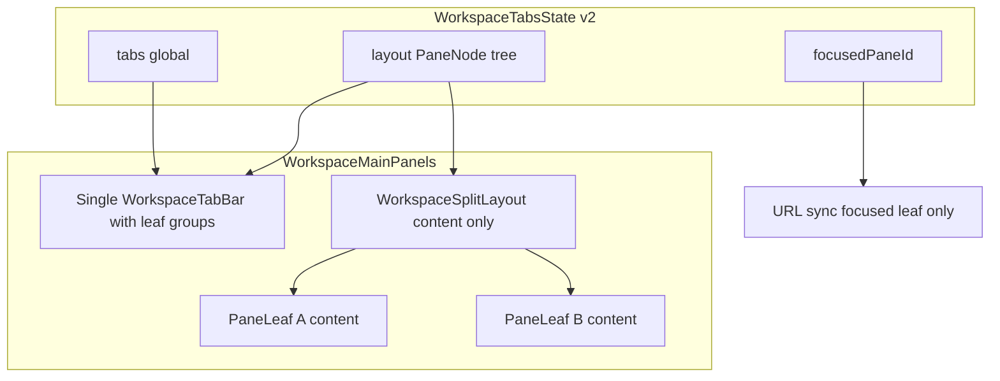

# Tab drag-to-split view

## Decisions (locked)

- **Layout**: 상·하·좌·우 edge drop + **재귀 스플릿** (3페인 이상). 리프 soft max **4**.
- **Export PDF**: 새 탭 kind 아님. 노트 페인에서 Export PDF → **그 페인**에 `ExportPDFPage` 표시, **뒤로가기**면 같은 페인이 노트로 복귀 (`useHistoryOverlayBack`).
- **대상 콘텐츠**: `.md` / `.quiz.md`(file 탭 + EditorPane/QuizPane), `chat`, 페인 내 export-pdf. settings/content-search 탭도 일반 탭으로 페인 이동은 허용.
- **모바일/좁은 폭**: 스플릿 비활성 (단일 리프만).
- **탭 리스트**: 스플릿되어도 **탭바는 하나**. 같은 리프(페인)에 속한 탭들은 리스트에서 **하나의 시각적 그룹**으로 묶인다 (리프별 개별 탭바 없음).

## Current constraints

- State는 [`WorkspaceTabsState`](src/utils/workspaceTabs/types.ts) `{ tabs, activeId }` 단일 활성만 지원.
- [`WorkspaceMainPanels.jsx`](src/components/shell/workspace/WorkspaceMainPanels.jsx) keep-alive 스택 + 한 패널만 `active`.
- 탭 DnD는 [`WorkspaceTabBar.tsx`](src/components/shell/workspace/WorkspaceTabBar.tsx) 가로 재정렬만 (`restrictToHorizontalAxis`).
- `/export-pdf`는 [`AppShellView`](src/App/AppShellView.tsx)에서 `ExportPdfGate`로 **셸 전체 교체** → 스플릿과 공존 불가.
- Quiz 모드는 `location.pathname` 의존 ([`EditorPane.jsx`](src/components/shell/EditorPane.jsx)) → 보조 페인에서 깨짐.

## Architecture



**Pane model** (new module e.g. `src/utils/workspaceTabs/paneLayout.ts`):

```ts
type PaneLeaf = {
  type: 'leaf';
  id: string;
  tabIds: string[];
  activeId: string | null;
  /** File tab in this leaf showing ExportPDFPage instead of editor */
  exportPdfForTabId?: string | null;
};
type PaneSplit = {
  type: 'split';
  id: string;
  direction: 'horizontal' | 'vertical'; // row = L/R, column = T/B
  ratio: number; // 0..1 first child
  children: [PaneNode, PaneNode];
};
type PaneNode = PaneLeaf | PaneSplit;
```

Extend `WorkspaceTabsState`:

- `layout: PaneNode` (default single leaf owning all tab ids)
- `focusedPaneId: string`
- Keep `activeId` as **focused leaf’s** `activeId` for backward compat with mirrors / existing domain hooks, or derive via helpers everywhere (prefer helpers + migrate callers).

**Ops**: `splitLeaf(leafId, edge, tabId)`, `moveTabToLeaf`, `reorderInLeaf`, `setLeafActive`, `setFocusedPane`, `setLeafExportPdf`, `collapseEmptyLeaf`, `resizeSplit`.

## UX / DnD + tab groups

1. **Single tab strip** (inline or Tauri titlebar — same as today). When layout is one leaf, flat list (current look). When split, render **contiguous groups**: DFS/leaf order of the layout tree → each leaf’s `tabIds` as one cluster.
2. **Group chrome**: wrap each multi-tab (or any leaf when split) cluster with a subtle shared background / border / gap so it reads as one unit; focused leaf’s group gets a stronger accent. Optional tiny split icon on the group — keep minimal.
3. **Order**: `tabs[]` display order is derived from leaf membership (flatten leaf groups). Reorder **within a group** updates that leaf’s `tabIds`. Drop onto another group (or between groups) = `moveTabToLeaf`. Opening a new file adds to the **focused** leaf’s group.
4. Lift DnD: one `DndContext` wrapping the single tab list + pane content drop zones.
5. Drag over a leaf **content** area → **4 edge zones**. Edge drop = split that leaf and place the tab in the new leaf (new group appears in the strip). Center drop = move into that leaf’s group and activate.
6. Last tab leaving a leaf → collapse leaf into sibling; groups merge back toward a flat list when only one leaf remains.

## Content per leaf

Refactor [`WorkspaceMainPanels`](src/components/shell/workspace/WorkspaceMainPanels.jsx) → `.tsx`:

- One `WorkspaceTabBar` above (or in titlebar) with **grouped** items; below it, recursive `WorkspaceSplitLayout` for **content only** (no per-leaf tab bars).
- Resize handles between panes (reuse [`useResizablePanelWidth.js`](src/hooks/useResizablePanelWidth.js) patterns).
- Render each tab’s panel inside the leaf that owns it (stable keys + tab-state buffers). Chat/settings singletons: only one leaf may hold the id; activating elsewhere focuses that leaf’s group.

**File / quiz**: add per-tab `noteSurface: 'edit' | 'quiz'` (or derive from last focused URL for that tab) so QuizPane does not depend solely on global pathname. Focused leaf’s active file tab drives `navigate(/view|/quiz/...)`.

**Export PDF (pane mode)** when `workspaceTabsEnabled`:

- Change [`ExportPDF.jsx`](src/components/print/ExportPDF.jsx) / [`PrintButton`](src/components/print/PrintButton.jsx) / Novel/Markdown/AS/desktop menu paths to call a workspace API `openExportPdfInFocusedPane(...)` instead of `navigate('/export-pdf/...')` when tabs are on.
- Leaf sets `exportPdfForTabId` and shows lazy `ExportPDFPage` with document props from that file tab.
- Wire `useHistoryOverlayBack(open, clearExportPdf, true, \`export-pdf-${leafId}\`)` so back clears only that leaf’s print surface.
- [`AppShellView`](src/App/AppShellView.tsx): if tabs enabled, **do not** early-return `ExportPdfGate` for `/export-pdf/*`; instead AppLayout opens print surface on the matching/focused file leaf (compat for deep links). Tabs off → keep current full-page gate.

## Domain / persistence

- [`useWorkspaceTabsDomain.ts`](src/App/hooks/useWorkspaceTabsDomain.ts): activate/close/open/reorder update **leaf** lists; close last tab in leaf collapses; focus pane on click; URL sync from focused leaf only.
- Persist schema bump to **version 2** in [`persistence.ts`](src/utils/workspaceTabs/persistence.ts) / last-open restore: layout tree + focusedPaneId + tab membership (exportPdf surface session-only, not persisted).
- Soft cap 12 file tabs still global.

## Out of scope

- Nested split beyond soft max 4 leaves (show no-op / toast).
- Split on mobile portrait.
- Persisting unsaved editor buffers (unchanged).
- Making settings/content-search “special” split targets beyond normal tabs.
