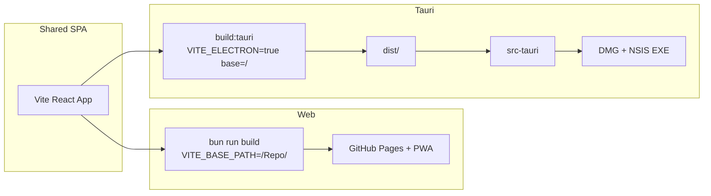
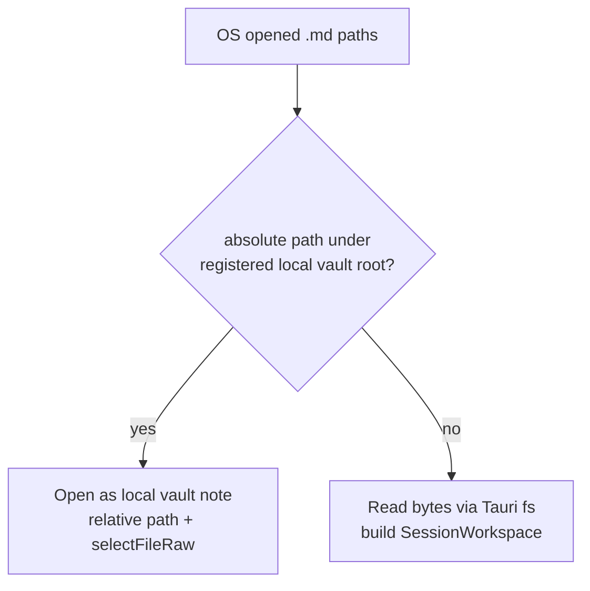

# Tauri 데스크톱 래핑 + GitHub Release

## 현재 상태

- Electron은 제거됨. [`VITE_ELECTRON`](src/main.jsx) 잔여 훅만 있음: HashRouter, PWA 비활성, popout/해시 URL.
- 웹 배포는 [`.github/workflows/deploy.yml`](.github/workflows/deploy.yml)만 존재.
- 로컬 vault는 FSA `DirectoryHandle`만 저장 ([`localFolderStore.js`](src/utils/localFolderStore.js)) — OS absolute path와 매칭 불가.

## 아키텍처 (웹 ↔ Tauri 공존)



- **한 소스**: `src/` 변경은 웹·Tauri 공통. 데스크톱만 `VITE_ELECTRON=true`로 빌드해 기존 HashRouter/무PWA 경로 재사용 (이름 유지, 의미는 “desktop shell”).
- **웹 CI 유지**: `deploy.yml` 그대로. Tauri는 별도 워크플로.
- **데스크톱 전용 빌드**: VitePress docs는 제외해 빠르게 번들 (`build:tauri` = `vite build` only, `base=/`).

## 1. Tauri v2 스캐폴드

| 항목 | 내용 |
|------|------|
| 경로 | [`src-tauri/`](src-tauri/) (`tauri.conf.json`, `Cargo.toml`, `src/lib.rs` / `main.rs`, icons) |
| CLI | `@tauri-apps/cli` + `@tauri-apps/api` (devDep/dep) |
| 식별자 | `com.docuhaim.app` (또는 동등), productName `DocuHaim` |
| `frontendDist` | `../dist` |
| `devUrl` | `http://localhost:5173` (기존 Vite) |
| `beforeDevCommand` | `bun run dev` |
| `beforeBuildCommand` | `bun run build:tauri` |
| bundle targets | macOS: `dmg` / Windows: `nsis` (`.exe` 설치기). Linux는 이번 범위 제외 |
| CSP / capabilities | 기본 + 로컬 파일 읽기·대화상자용 plugin 권한 |

스크립트 ([`package.json`](package.json)):

- `tauri` / `tauri:dev` / `tauri:build`
- `build:tauri`: `VITE_ELECTRON=true VITE_BASE_PATH=/ vite build` (+ 필요 시 `llms`만; docs 제외)
- 깨진 `"main": "electron/main.js"` 제거

헬퍼: [`src/utils/isDesktopApp.ts`](src/utils/isDesktopApp.ts) — `import.meta.env.VITE_ELECTRON === 'true'`. 기존 분기 호출부를 이 헬퍼로 점진 교체(필수 최소: main / App popout / pwaUpdate).

## 2. `.md` 기본 열기 (file association + open 라우팅)

### Bundle 등록

[`src-tauri/tauri.conf.json`](src-tauri/tauri.conf.json) `bundle.fileAssociations`:

- ext: `md`, `markdown` (선택: `enc.md`는 Windows에서 복합 확장자 한계 → UI에서 `.enc.md`는 세션/일반 md로 열림 문서화)
- role: `Editor`, rank: `Default`/`Owner` 가능 범위에서 Default 쪽
- mime: `text/markdown`

### Rust → 프론트

- 콜드 스타트 argv + 실행 중 `RunEvent::Opened` (및 필요 시 deep-link 플러그인)로 절대 경로 수집
- 프론트에 `desktop://open-files` 이벤트(또는 `invoke` + startup payload)로 path 배열 전달

### 프론트 라우팅 (선택 2-B)



구현 포인트:

1. **Tauri에서 로컬 vault 루트 absolute path 영속화**  
   - FSA만으로는 OS path 매칭 불가 → Tauri일 때 `@tauri-apps/plugin-dialog`로 폴더 선택 + `@tauri-apps/plugin-fs`로 I/O.  
   - IndexedDB/localStorage에 `localVaultFsPath` 저장 ([`localFolderStore`](src/utils/localFolderStore.js) 확장 또는 `localVaultPathStore.ts`).  
   - 웹은 기존 FSA 유지 (변경 최소화).

2. **매칭**: `normalize` 후 `openedPath === root || openedPath.startsWith(root + sep)` → vault 상대 경로로 `selectFileRaw` / `/view/...`.

3. **비매칭**: 파일 읽기 → 기존 [`sessionWorkspace`](src/utils/sessionWorkspace.ts) / `openSessionWorkspace` 경로 (브라우저 파일 열기와 동일 UX).

4. **부트 타이밍**: App unlock·storage ready 후 pending open queue 처리 (기존 `?open=` deep link effect 근처).

## 3. GitHub Actions Release

새 워크플로: [`.github/workflows/release-tauri.yml`](.github/workflows/release-tauri.yml)

```yaml
on:
  workflow_dispatch:
    inputs:
      version:
        description: 'Semver (e.g. 1.2.3)'
        required: true
      prerelease:
        type: boolean
        default: false
```

Jobs:

1. **prepare** (ubuntu): checkout → `package.json` + `src-tauri/tauri.conf.json`(+ Cargo) 버전을 input으로 기록 → 커밋 없이 env/`tauri-action`의 `tagName`/`releaseName`에 `v{version}` 전달 (버전 파일 bump는 action `includeUpdaterJson` 없이 **빌드 직전 sed/jq로 working tree만 수정**하거나 tauri-action `version` 입력 활용).
2. **publish** matrix:
   - `macos-latest` — `aarch64-apple-darwin` (+ 필요 시 `x86_64` 또는 `universal-apple-darwin` 하나 선택: **universal DMG 하나**로 단순화)
   - `windows-latest` — NSIS exe
3. 공통 steps: Bun install → Rust toolchain → rust-cache → `tauri-apps/tauri-action@v1`  
   - `tagName: v__VERSION__` / `releaseName: DocuHaim v__VERSION__`  
   - `releaseDraft: false` (또는 true로 두었다가 수동 publish — **즉시 업로드·공개 릴리스**로 고정)  
   - `args`에 matrix target  
   - `GITHUB_TOKEN` contents: write

서명 (선택 1-B):

- macOS: `APPLE_CERTIFICATE`, `APPLE_CERTIFICATE_PASSWORD`, `APPLE_SIGNING_IDENTITY`, `APPLE_ID`, `APPLE_PASSWORD`, `APPLE_TEAM_ID` 등이 **모두 있으면** env로 주입 → Tauri가 서명/공증; 없으면 미서명 DMG.
- Windows: `TAURI_SIGNING_PRIVATE_KEY` 또는 Authenticode용 `WINDOWS_CERTIFICATE` / password — 시크릿 존재 시에만 설정.
- 워크플로에서 `if: secrets.X != ''` 패턴으로 조건부 env 세팅.

웹 `deploy.yml`과 독립 — 데스크톱 릴리스가 Pages를 건드리지 않음.

## 4. 서명 문서 (별도)

[`docs/desktop/code-signing.md`](docs/desktop/code-signing.md) (VitePress sidebar에 Desktop 섹션 추가):

- Apple Developer: 인증서 export, base64 시크릿, App Store Connect 앱 비밀번호, 공증 흐름
- Windows: Authenticode PFX → GitHub Secrets, NSIS 서명 확인
- “시크릿 없으면 미서명으로 업로드됨” 동작 명시
- Gatekeeper / SmartScreen 경고 안내
- 시크릿 이름 표 (워크플로와 1:1)

## 5. 정리·검증 체크리스트

- [ ] `bun run tauri:dev` — 웹과 동일 UI, Hash 라우팅
- [ ] 웹 `bun run build` / Pages 경로 회귀 없음
- [ ] `.md` 더블클릭 → 앱 기동/포커스 + 세션 또는 vault 열림
- [ ] vault 루트 하위 `.md` → `/view/...` local
- [ ] vault 밖 `.md` → 세션 워크스페이스
- [ ] Actions → Release Tauri → version 입력 → Release에 dmg/exe 첨부
- [ ] 시크릿 없을 때 미서명 성공; 문서만으로 서명 추가 가능

## 주요 변경 파일

- 신규: `src-tauri/**`, `.github/workflows/release-tauri.yml`, `docs/desktop/code-signing.md`, `src/utils/isDesktopApp.ts`, `src/utils/desktopOpenFiles.ts` (또는 동등)
- 수정: [`package.json`](package.json), [`vite.config.ts`](vite.config.ts) (필요 시), [`src/main.jsx`](src/main.jsx), [`src/App.jsx`](src/App.jsx) (open queue), local vault path 저장, [`docs/.vitepress/config.ts`](docs/.vitepress/config.ts)
