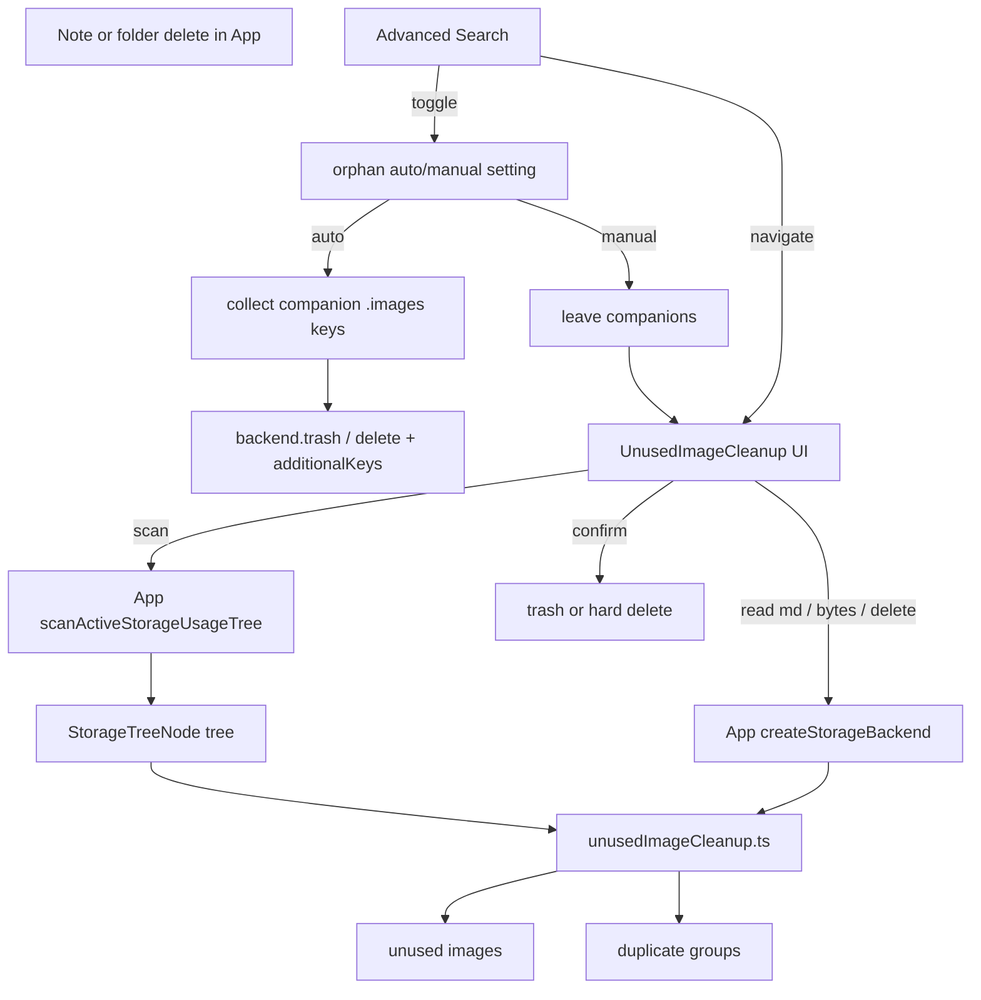

# Unused / Orphan Image Cleanup

## Scope (확정)

- 위치: [`SettingsPage.jsx`](src/pages/SettingsPage.jsx)의 [`StorageUsageAnalysis`](src/components/settings/StorageUsageAnalysis.tsx) **바로 아래**
- 섹션 DOM id: `settings-unused-images` (`scroll-mt-4`, AS hash 네비용)
- **Orphan 정책 (설정)** — **기본값: 수동** (`loadOrphanImageAutoDeleteEnabled()` → `false` / Switch OFF / localStorage 미설정·`'0'`)
  - `manual` (**기본**): 노트/폴더 삭제 시 companion `.images/…`는 **남김**. 나중에 Settings UI에서 스캔·선택 삭제. 기존 삭제 동작과 동일
  - `auto`: 노트/폴더를 trash(또는 영구 삭제)할 때 companion 이미지 prefix도 **같이** trash/delete
  - 저장: 기존 [`orphanImageCleanupSettings.ts`](src/utils/orphanImageCleanupSettings.ts) (`s3haim_orphan_image_auto_delete`, `1` = auto, 그 외·부재 = manual)
- **수동 정리 UI — 대상 스코프**
  - `notes`: `.images/` 만
  - `notes+chat`: `.images/` + `.chat-with-myself/images/`
- **수동 정리 UI — 삭제 방식 (기본값 `trash`)**
  - `trash`: `backend.trash(path)`
  - `hard`: `backend.delete(path)`
- **참조 파싱**: 위키 `![[path]]`만 (`WIKI_IMAGE_RE` + `parseWikiImageInner` in [`wikiImageSyntax.js`](src/utils/wikiImageSyntax.js)). 표준 `` 제외
- **중복**: 동일 바이트(SHA-256) 그룹. size로 1차 버킷팅 후 2개 이상만 해시
- **Advanced Search**
  - 섹션 이동 커맨드: `settings-unused-images` → `/settings#settings-unused-images`
  - 정책 토글: `settings-orphan-image-auto` (켜기 = auto / 끄기 = manual), AS 규칙대로 현재 상태에 맞는 한쪽만 표시

## Policy vs manual scan

| 모드 | 노트/폴더 삭제 시 | 정리 방법 |
|------|-------------------|-----------|
| **수동 (기본값)** | companion 이미지 유지 | Settings 「미사용 / 중복 이미지」에서 스캔 후 선택 삭제 |
| 자동 | companion `.images/…`를 본문과 함께 trash/delete | 즉시 처리; 스캔 UI는 기존 orphan·중복용으로 계속 사용 가능 |

신규 설치·localStorage 키 없음 → 항상 수동. 자동은 사용자가 Settings/AS에서 켠 뒤에만 적용.

자동은 **노트 경로에 묶인 companion prefix**만 동반 삭제한다. 참조가 깨진 orphan·교차 참조·채팅 이미지는 수동 스캔으로 남긴다.

## Architecture



## New / existing files

### 1. [`src/utils/orphanImageCleanupSettings.ts`](src/utils/orphanImageCleanupSettings.ts) (이미 존재)

- `loadOrphanImageAutoDeleteEnabled()` / `saveOrphanImageAutoDeleteEnabled(enabled)`
- **기본값 `false` = 수동(manual)** — 키 없거나 `'0'`이면 OFF; `'1'`만 auto
- Settings Switch 초기 상태도 OFF(수동)
- Settings Switch + AS toggle가 동일 API 사용; UI는 `setSettingsToggle('settings-orphan-image-auto', …)`로 맞춰 AS와 동기화

### 2. [`src/utils/unusedImageCleanup.ts`](src/utils/unusedImageCleanup.ts)

순수 분석 + 경로 규칙:

- `IMAGE_EXTS` / prefix helpers: `.images/`, `.chat-with-myself/images/`
- `collectImageFiles(tree, scope)` — `.trash/` 제외
- `collectMarkdownPaths(tree)` — `.md`, `.trash/` 제외
- `extractWikiImagePaths(markdown)` — path normalize
- `findUnusedImages({ images, referencedPaths })`
- `findDuplicateImageGroups(files, readBytes)` — SHA-256, 진행률 콜백
- `formatStorageBytes`는 [`storageUsageAnalysis.ts`](src/utils/storageUsageAnalysis.ts) 재사용

### 3. Companion helpers (같은 util 또는 소형 모듈)

노트/폴더 삭제 시 auto 모드용:

- `buildEditorImagePathPrefix(mdPath)` ([`editorImageUpload.js`](src/utils/editorImageUpload.js)) 재사용
- `collectCompanionImageKeysForDelete(node, listTreeKeys?)`:
  - file `*.md` → prefix `.images/<dir>/<name>/` 하위 키 (또는 prefix trash가 되면 prefix 자체)
  - folder → 하위 md마다 companion prefix 수집
- 녹음 companion(`recordingKeysToMove`)과 **합쳐** `backend.trash(path, { additionalKeys })` / S3·WebDAV·Local 동일 패턴에 전달
- missing companion은 무시 (recording과 동일)

### 4. [`src/components/settings/UnusedImageCleanup.tsx`](src/components/settings/UnusedImageCleanup.tsx)

[`StorageUsageAnalysis`](src/components/settings/StorageUsageAnalysis.tsx)와 비슷한 섹션 톤:

- 루트: `id="settings-unused-images"`
- 헤더: 「미사용 / 중복 이미지」
- **정책 행 (Switch)**: 「노트 삭제 시 이미지 자동 정리」 — ON=auto, OFF=manual; 짧은 설명 문구
  - ON: 삭제 시 companion을 함께 trash
  - OFF: Settings에서 스캔해 직접 삭제
- 옵션 행:
  - 대상: 라디오 `노트만` / `노트 + 채팅`
  - 삭제: 라디오 `휴지통으로 이동`(기본) / `영구 삭제`
- 액션: `미사용 스캔` / `중복 스캔` (독립 실행)
- 진행 표시: md N/M, 해시 N/M
- 결과:
  - **미사용**: 체크리스트, path·size, 선택 삭제
  - **중복**: 그룹별 keep 1개(기본 경로 사전순 첫 파일), 나머지 선택 삭제
- 삭제 전 [`ConfirmModal`](src/components/modals/ConfirmModal.jsx)
- Props: `storageMode`, `canScan`, `onScanTree`, `onReadText`, `onReadBytes`, `onDeletePaths`, `onGetObjectUrl?`

## App / Settings wiring

[`App.jsx`](src/App.jsx) + [`SettingsPage.jsx`](src/pages/SettingsPage.jsx):

- 기존 `scanActiveStorageUsageTree` / `canScanStorageUsage` 재사용
- `createStorageBackend(…)`로 readText / readBytes / delete·trash
- Settings에 `<UnusedImageCleanup … />`를 StorageUsageAnalysis 다음
- **삭제 경로**: `loadOrphanImageAutoDeleteEnabled()`이 true일 때만 companion keys를 `additionalKeys`(및 S3/WebDAV hard-delete 목록)에 포함. Local trash/move도 동일하게 companion을 함께 이동
- 해시 `#settings-unused-images`는 기존 Settings hash scroll 로직으로 처리

## Advanced Search

[`commands.ts`](src/utils/advancedSearch/commands.ts) `APP_COMMANDS`에 추가:

```ts
{
  id: 'settings-unused-images',
  title: '설정 · 미사용 / 중복 이미지',
  description: 'orphan·중복 이미지 스캔 및 삭제',
  path: '/settings#settings-unused-images',
  keywords: ['미사용', 'orphan', '중복', '이미지', '정리', 'unused', 'duplicate', 'cleanup'],
}
```

[`settingsToggles.ts`](src/utils/advancedSearch/settingsToggles.ts)에 추가:

```ts
{
  id: 'settings-orphan-image-auto',
  enableTitle: '노트 삭제 시 이미지 자동 정리 켜기',
  disableTitle: '노트 삭제 시 이미지 자동 정리 끄기',
  description: '노트/폴더 삭제 시 companion .images 동반 trash',
  keywords: ['orphan', '이미지', '자동', '정리', '삭제', 'companion', '.images'],
  load: loadOrphanImageAutoDeleteEnabled,
  save: saveOrphanImageAutoDeleteEnabled,
}
```

- `AppCommandId` / `SettingsToggleId` 유니온에 id 추가
- Settings Switch는 `setSettingsToggle` + `subscribeSettingsToggles`로 AS와 양방향 동기화 (다른 설정 토글과 동일)

## Scan pipeline (미사용)

1. `onScanTree()` 전체 트리
2. 스코프별 이미지 수집
3. 모든 `.md` → `readText` (동시성 ~4–8)
4. wiki image path → `Set`
5. 이미지 ∉ Set → 미사용 (size 내림차순)

채팅 스코프: `.chat-with-myself/*.md`의 `![[.chat-with-myself/images/...]]` 포함.

## Duplicate pipeline

1. 동일 스코프 이미지
2. size 동일·>0 버킷
3. `readBytes` → SHA-256
4. 동일 해시 그룹만 표시; 그룹당 keep ≥1

## Safety / edge cases

- `.trash/` 하위는 스캔 제외
- path 정규화로 `![[/foo]]` vs `foo` 불일치 방지
- 스캔 AbortSignal
- 영구 삭제 Confirm 문구 강화
- auto 삭제 시 companion missing은 무시
- 폴더 삭제 시 하위 모든 md companion prefix 수집 (과도한 listing은 tree/list API로)
- 코드 주석·식별자 영어 (한글 UI 라벨만)

## Out of scope (이번 PR)

- 표준 markdown `` orphan
- IndexedDB `wikiImageCacheDb` 강제 정리 (삭제 후 resolve 시 자연 만료)
- 채팅 메시지 삭제 시 `.chat-with-myself/images/` 자동 동반 삭제 (노트/폴더 auto만; 채팅은 수동 스캔)
