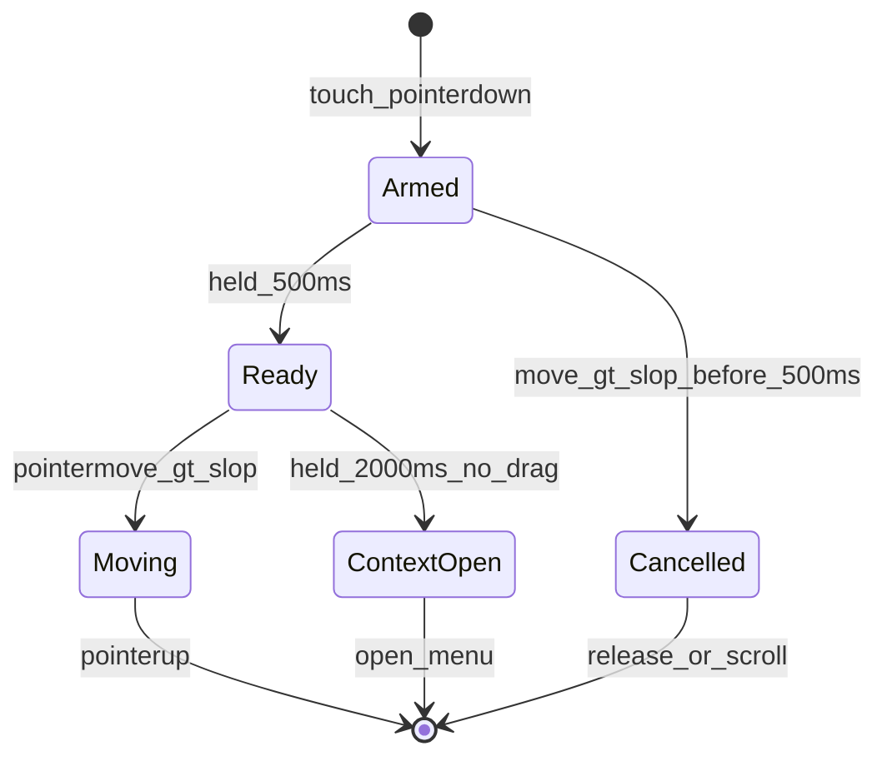

# 표지편집 모바일 지원 + 개체이동 리모콘

## 결정

- **리모콘 대상**: 현재 선택 개체 **전부** (`expandIdsToGroups` 후 `moveElementsByDelta`와 동일)
- **스키마 변경 없음** — 위치는 계속 프레임 `%`; UI만 px 표시/입력
- **터치만** long-press 게이트; `pointerType === 'mouse'`는 기존처럼 즉시 드래그 + 우클릭 ContextMenu

## 터치 상태 머신 ([CoverEditor.tsx](src/components/noteCover/CoverEditor.tsx))

| 구간 | 동작 |
|------|------|
| 0–500ms | 선택만(또는 기존 additive 규칙); `beginMove` 보류; ~8px slop 초과 시 long-press 취소 |
| ≥500ms 후 드래그 | `beginMove` 시작 (기존 move/snap/undo 경로 재사용) |
| ≥2s, 드래그 없음 | 해당 좌표에 ContextMenu 오픈 + 가벼운 햅틱(`navigator.vibrate?.(10)`) 가능하면 |
| mouse | 변경 없음: `pointerdown` → 즉시 `beginMove` |

구현 메모:

- `touch-action: none`을 개체 wrapper에만 (캔버스 스크롤과 충돌 방지)
- long-press용 ref + `pointerup`/`pointercancel`에서 타이머 정리
- Radix `ContextMenu`를 **controlled** (`open` / `onOpenChange`)로 두고, 2s 도달 시 `open=true` + 가상 기준점(또는 `contextmenu` 합성)으로 메뉴 위치 지정
- **모든 개체 타입**에 ContextMenu 통일 (지금은 이미지만). 이미지 기존 항목(자르기/비율) 유지 + 공통 항목 추가

## ContextMenu 항목

공통:

- **모바일 개체이동 리모콘** → `requestOpenMoveRemote()`

이미지 전용 (기존 유지): 자르기 / 원본 비율 / 비율 유지

`requestOpenMoveRemote`:

1. `(pointer: fine)`이면 ConfirmModal: 제목/메시지에 **모바일용**임을 알리고, 확인 시 리모콘 오픈
2. coarse면 바로 오픈
3. 선택 비어 있으면 no-op (메뉴는 개체 위에서만 열리므로 사실상 항상 선택됨 — 오픈 시 해당 개체가 선택에 없으면 선택에 포함)

## 리모콘 UI — 새 파일 [`CoverMoveRemoteModal.tsx`](src/components/noteCover/CoverMoveRemoteModal.tsx)

기존 [`Modal`](src/components/modals/Modal.jsx) + Radix 패턴. 선택 변경/`frameRef` resize에 맞춰 px 표시 갱신.

**표시/입력**

- 선택 bounds의 **좌상단**을 기준으로 `xPx`, `yPx` 표시 (프레임 `getBoundingClientRect()` → `pct * frameW/100`)
- 직접 `input` (정수 px). 커밋 시 목표 bounds 좌상단과의 델타를 `%`로 환산해 `moveElementsByDelta(cover, selectedIds, dxPct, dyPct)` 호출
- 클램프는 기존 `moveElementsByDelta`에 위임

**방향키 (작게)**

- 십자 버튼: N/E/S/W 각 1px (Shift 또는 long-press 반복 시 10px 스텝은 UX로 넣되, 기본 탭=1px)
- 호출: `nudgeByPx(dx, dy)` → `%` 변환 → `onChange(moveElementsByDelta(...))`

**트랙패드 모드**

- 리모콘 내 사각 “패드” 영역: pointer drag 누적 Δ를 px로 변환해 연속 `nudge`
- 토글: `트랙패드` / `방향키` (또는 둘 다 한 화면에 배치 — 방향키는 작고, 패드는 하단 넓은 영역)

**기타**

- 닫기 버튼; 선택 해제되면 자동 닫기
- 데스크톱에서도 Confirm 후 사용 가능 (의도적)

## 배선

- 상태: `CoverEditor`에 `moveRemoteOpen`, `finePointerConfirmOpen`
- ConfirmModal 문구 예: 제목 `모바일 개체이동 리모콘`, 메시지 `이 기능은 터치(모바일) 환경을 위한 것입니다. 그래도 열까요?`, confirm `열기`
- 메뉴 스타일: 기존 `chatMenuContentClass` / `chatMenuItemClass` 재사용 ([CoverEditor](src/components/noteCover/CoverEditor.tsx) / [CoverLayerPanel](src/components/noteCover/CoverLayerPanel.tsx)와 동일)

## 범위 밖

- 레이어 패널 DnD TouchSensor / 리사이즈 long-press
- 스키마·custom-markdown 문서 (마크업 변경 없음)
- Advanced Search 등록 (페이지 전용 모달; 설정 토글 아님)

## 검증 (수동)

- 폰/에뮬: 개체 500ms+드래그 → 이동; 2s 홀드 → 메뉴 → 리모콘 → px/화살표/트랙패드로 선택 전체 이동
- 데스크톱: 즉시 드래그·우클릭 유지; 리모콘 선택 시 Confirm 후 오픈
- 다중 선택 + 그룹 확장 후 함께 이동·프레임 밖으로 안 나감
