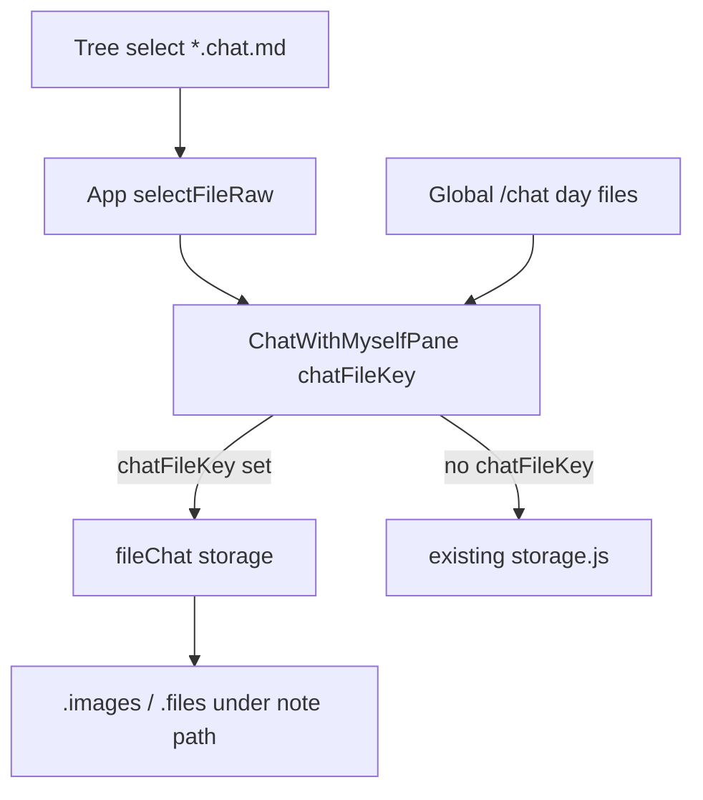

# Directory `*.chat.md` chat notes

## Scope

- **포함**: 트리에서 `*.chat.md` 생성·열기·채팅 UI, 단일 파일 저장(날짜 파일 분할 없음), 파일 내 groups/timezone 메타, 노트형 미디어 경로, S3/Local/WebDAV.
- **제외**: 기존 [`.chat-with-myself/`](src/utils/chatWithMyself/paths.js) 전역 채팅 변경·마이그레이션. 전역 `/chat` UX 그대로.

## Architecture



## File format

Single object key e.g. `notes/project.chat.md`:

```markdown
<!-- chat-meta -->
{"timezone":"Asia/Seoul","groups":[{"name":"친구","iconPath":".images/notes/project.chat/group-icons/….jpg"}]}
<!-- /chat-meta -->

<!-- chat-msg id="…" at="…" tz="…" source="compose" group="나" -->
본문 + ![[.images/…]] / [[file:.files/…|name|size]]

<!-- chat-msg-deleted id="…" at="…" -->
```

- Meta는 기존 day 마커와 맞춰 **HTML 주석 + JSON** (YAML 파서 추가 없음). `groups`는 전역 meta와 동일하게 `{ name, iconPath? }[]` (string도 읽기 시 정규화).
- 메시지/tombstone/edits 직렬화는 기존 [`format.js`](src/utils/chatWithMyself/format.js) 재사용. `parseChatFile` / `serializeChatFile`만 meta 래핑 추가.
- 날짜 구분선·DatePanel은 **파일 분할 없이** `msg.at` → `dateStr`로 메모리 그룹핑.

## Storage API (new)

신규 [`src/utils/chatWithMyself/fileChat.js`](src/utils/chatWithMyself/fileChat.js) (또는 `storageFile.js`):

- `isChatMarkdownPath(path)` → `/(^|\/)[^/]+\.chat\.md$/i`
- `readChatFile(ctx, fileKey)` / `mutateChatFile(ctx, fileKey, mutator)` — 전역 `mutateDayFile`과 동일하게 head → mutate → `putTextIfMatch` → 412 시 merge 재시도.
- Merge: 메시지+tombstone은 `mergeDayMessages`; groups는 이름 기준 합집합(iconPath는 더 최신 mtime/존재 쪽 우선 등 단순 last-write 규칙 명시).
- `append` / `update` / `delete` / `addGroup` / `setGroupIcon` / `touchTimezone`를 **fileKey 스코프**로 제공. 전역 `storage.js`는 손대지 않음.
- Pending/BC: channel에 `fileKey` 포함; Dexie pending에 `fileKey` 필드(또는 dayKey 자리에 fileKey) — 전역 day pending과 충돌 없게 분리.

백엔드: 기존 [`createChatBackend`](src/utils/chatWithMyself/backends/index.js)의 `getText`/`headMeta`/`putTextIfMatch`/`putBinary`를 **임의 키**로 쓰면 됨 (day prefix 가정 제거). 전역 `listDayKeys`는 file 모드에서 호출하지 않음.

## Media = note parity

| 종류 | 경로 | 본문 |
|------|------|------|
| 이미지 | [`buildEditorImagePathPrefix(fileKey)`](src/utils/editorImageUpload.js) → `.images/<dir>/<nameWithoutLastExt>/` (`foo.chat.md` → `…/foo.chat/`) | `![[path]]` |
| 일반 파일 | 동일 구조의 `.files/<dir>/<basename>/` | 기존 `[[file:path\|name\|size]]` |
| 그룹 아이콘 | `.images/<…>/<basename>/group-icons/` | meta `iconPath` |

- file 모드 전용 `uploadChatAttachmentForFile(ctx, fileKey, file)`가 노트 업로드(local/S3/WebDAV) 경로를 재사용. 전역 `uploadChatAttachment`의 `.chat-with-myself/images|files/YYYY-MM-DD/`는 그대로.
- URL 해석: 열린 `*.chat.md`일 때 wiki/chat 이미지·파일은 기존 노트 `getPresignedUrlForPath` / local·webdav와 동일 파이프라인 사용 (채팅 전용 `.chat-with-myself` URL 분기 타지 않음).

## Open / create / tree

1. **판별**: `isChatMarkdownPath` — `split('.').pop()`만으로는 부족.
2. **열기**: [`selectFileRaw`](src/App.jsx) + [`openPathFileFromBackend.js`](src/utils/storage/openPathFileFromBackend.js)에서 `viewer: 'chat'`, `content`는 비우거나 raw 보관만. `/view/<path>` 유지, EditorPane 대신 `ChatWithMyselfPane`에 `chatFileKey={currentFile.id}` 전달.
3. **생성**: 폴더 컨텍스트에 **「새 채팅」** (`type: 'chat'`). 이름에 `.chat.md` 보장(이미 `.chat.md`면 중복 방지). 초기 body = 빈 meta 블록(`timezone` + `groups: []`). 생성 후 바로 chat viewer로 연다. 기존 「새 파일」`.md` 동작 불변.
4. **트리**: [`TreeNode`](src/components/TreeNode.jsx)에서 `.chat.md` 전용 아이콘/색(채팅 진입과 구분 가능한 정도).
5. **리네임**: 복합 확장자 `.chat.md`를 한 단위로 보존 (`base` + `.chat.md`). 단순 `lastIndexOf('.')`만 쓰면 `.chat`이 basename에 묻혀 깨질 수 있음.
6. **전역 채팅 활성 표시**: `chatWithMyselfActive`는 `/chat`만. `/view/*.chat.md`는 트리 선택 유지.

## Pane wiring

[`ChatWithMyselfPane`](src/components/chatWithMyself/ChatWithMyselfPane.jsx)에 prop `chatFileKey?: string`:

| | 전역 (`/chat`) | 파일 (`chatFileKey`) |
|--|--|--|
| 메시지 IO | day files | 단일 `mutateChatFile` |
| meta | `.chat-with-myself/meta.json` | 파일 내 `chat-meta` |
| 로드 | `listDayKeys` + lazy older/newer | 한 번 전체 로드(또는 메모리에서 date window만 UI) |
| sync | day keys + meta | 해당 `fileKey`만 head/poll |
| 첨부 | chat-with-myself prefixes | note `.images`/`.files` |
| Add-to-note / search / reply | 기존 | 동일(본문 토큰 경로만 note형) |

DatePanel: file 모드에서는 로드된 메시지의 고유 `dateStr` 목록으로 점프(스크롤); “이전 day 파일 로드” API는 no-op.

## Sync

[`useChatRemoteSync`](src/components/chatWithMyself/useChatRemoteSync.js): `fileKey` 모드면 watch 목록 = `[fileKey]`만. 변경 시 전체 parse → merge → `setMessages` + groups. BroadcastChannel에 `{ type: 'file', fileKey }`.

## Out of scope / non-goals

- 전역 day 파일을 `*.chat.md`로 합치기
- 노트 에디터에서 `.chat.md`를 일반 마크다운으로 편집(항상 chat viewer)
- 초대형 단일 파일 가상 스크롤 최적화(1차는 전체 로드; 필요 시 후속)
