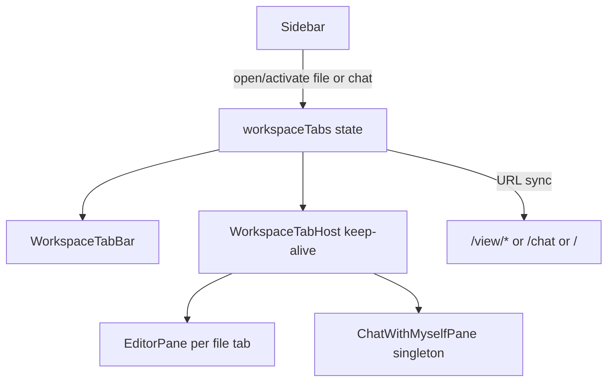

# Editor workspace tabs (chat included)

## Decisions (locked)

- **Layout**: 탭 스트립 + 단일 콘텐츠 (스플릿 없음)
- **Lifecycle**: 열린 탭 **keep-alive** (`hidden`/`inert`, 언마운트 금지)
- **Chat**: 전역 채팅을 **싱글톤 탭**으로 포함 (`/chat` 배타 교체 제거)
- **Out of scope**: 에디터 스플릿, [`directory_chat`](.cursor/plans/directory_chat.md_files_f4e25160.plan.md) `*.chat.md`, Settings/PDF export/LLM popout을 탭으로 넣는 것

## Current state

- [`App.jsx`](src/App.jsx): 단일 `currentFile` + `editorContent`; `/chat` vs `/`·`/view/*`가 메인 슬롯을 **교체**
- 전환 시 md는 `saveCurrentMarkdownBeforeSwitch` → IndexedDB draft; 미디어 `objectUrl`은 이전 파일에서 revoke
- 복원: `s3haim_lastFile` 단일 항목 (`chat` 또는 `{type,path}`)

## Target architecture



### Tab model

New TS modules (migration policy: **new files `.ts`/`.tsx`**):

- [`src/utils/workspaceTabs/types.ts`](src/utils/workspaceTabs/types.ts) — tab shapes
- [`src/utils/workspaceTabs/workspaceTabsStore.ts`](src/utils/workspaceTabs/workspaceTabsStore.ts) (or `useWorkspaceTabs` hook owned by `MainApp`) — open list + active id + ops

```ts
type WorkspaceTab =
  | { id: string; kind: 'chat' } // id fixed e.g. 'chat'
  | {
      id: string; // `${storageType}:${path}`
      kind: 'file';
      storageType: 's3' | 'local' | 'webdav';
      path: string;
      currentFile: /* existing shape */;
      editorContent: string;
      baselineContent: string; // dirty compare
      editedFileName: string;
      lastActivatedAt: number;
    };
```

Ops: `openOrActivateFile`, `openOrActivateChat`, `activate`, `close`, `patchFileTab`, `reorder` (optional v1: click-order only, no drag).

Soft cap **12** open tabs: when opening beyond cap, close least-recently-activated **non-dirty** file tab first; if none, prompt before closing dirty.

### UI shell

New components:

- [`src/components/workspace/WorkspaceTabBar.tsx`](src/components/workspace/WorkspaceTabBar.tsx) — horizontal scroll strip; title; dirty dot; close (×); chat icon/label (“나와의 채팅”)
- [`src/components/workspace/WorkspaceTabHost.tsx`](src/components/workspace/WorkspaceTabHost.tsx) — stack of panes; inactive: `hidden` + `inert` (and `aria-hidden`); **do not unmount**

Main content in [`App.jsx`](src/App.jsx):

- **`/settings`**: 기존처럼 Settings만 표시. 탭 **state는 App에 유지**. 가능하면 WorkspaceHost를 숨긴 채 마운트 유지(설정 왕복 시 채팅/에디터 keep-alive 보존); 구현이 과도하면 설정 진입 시 host 언마운트 허용하되 state로 재마운트(차선).
- **그 외 workspace** (`/`, `/view/*`, `/chat`): `WorkspaceTabBar` + `WorkspaceTabHost` 한 경로로 통합. 라우트별 `EditorPane`/`ChatWithMyselfPane` 중복 element 제거.

URL sync (표시·북마크 유지):

- active file → `navigate(/view/${path})`
- active chat → `navigate(/chat)`
- no tabs → `navigate('/')` + empty state
- Sidebar `chatWithMyselfActive` / 트리 `currentFile`는 **active tab** 기준

### Open / switch / close

| Action | Behavior |
|--------|----------|
| Tree file click | 같은 `storageType:path` 탭 있으면 activate; 없으면 load 후 open. **다른 탭 objectUrl revoke 금지** |
| Sidebar “나와의 채팅” | chat 탭 openOrActivate (이미 있으면 즉시 전환) |
| Tab click | activate + URL |
| Tab × / Editor close | dirty면 기존 close confirm; 닫을 때 해당 탭만 `revokeObjectURL`; active였으면 이웃 탭 activate |
| File switch between keep-alive tabs | **더 이상** `saveCurrentMarkdownBeforeSwitch` 필수 아님(상태가 탭에 있음). Draft 저장은 close/unload/blur 정책으로 축소 가능 |

`selectFileRaw` / `setCurrentFile` / `setEditorContent` 단일 모델을 **active file tab에 대한 patch**로 치환. Save/rename/recording 등은 `activeTabId`의 file 탭을 대상으로.

### Chat keep-alive

- `ChatWithMyselfPane` **인스턴스 1개**만 host 안에 두고, chat 탭이 비활성일 때도 마운트 유지 → sync·composer draft·share 큐 유지
- `useVisualViewportLock` 등 모바일 채팅 전용 효과는 **chat 탭이 active일 때만** 켜지도록 pane에 `isActive` prop 전달

### Persistence

Replace single `s3haim_lastFile` writer with session-friendly:

```json
{
  "tabs": [{ "kind": "chat" }, { "kind": "file", "type": "s3", "path": "a.md" }],
  "activeId": "s3:a.md"
}
```

Restore: reopen listed tabs (file via existing open path; chat as tab). Backward compat: old `{type:'chat'}` / `{type,path}` → 단일 탭으로 hydrate.

`beforeunload`: **any** open file tab dirty → warn (not only active).

### App.jsx touchpoints (high impact)

- State: `currentFile`/`editorContent`/`editedFileName` → derived from active file tab **or** kept as mirrors updated from store (점진 이식 시 mirror 허용, 최종은 store SSOT)
- [`selectFileRaw`](src/App.jsx) (~1725+): openOrActivate + per-tab content; revoke only replaced tab’s media
- [`closeCurrentFile`](src/App.jsx) / close confirm: close **active tab**, not clear-all
- Routes block (~4816–5000): workspace host unification
- Sidebar handlers: chat open → tab API

Avoid mass TS conversion of `App.jsx` / giant panes.

## Implementation phases

1. **Types + store** — tab identity, open/activate/close/patch, soft cap, dirty helpers
2. **TabBar + TabHost UI** — empty state, active styling (existing dark/light tokens), mobile horizontal scroll
3. **Wire files** — `selectFileRaw`, save, close, URL sync, objectUrl lifecycle
4. **Wire chat** — singleton keep-alive, sidebar entry, `isActive` for viewport lock
5. **Persist + restore** — session schema + lastFile compat; beforeunload multi-tab dirty
6. **Polish** — dirty indicators, LRU close on cap, keyboard optional later (`Ctrl+Tab`는 follow-up)

## Non-goals / follow-ups

- Split editor panes
- Tab drag-reorder / pin
- `*.chat.md` file tabs ([directory_chat plan](.cursor/plans/directory_chat.md_files_f4e25160.plan.md)과 별도; 이후 `kind:'file'` + `viewer:'chat'`로 자연 합류 가능)
- Settings as a tab
