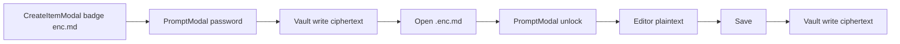

# `.enc.md` 암호화 노트 + 생성 모달 형식 배지

## 기본 결정

- 형식 배지: **`.md`**(일반) / **`.enc.md`**(암호화) 두 가지만 (파일 생성 모달에서만).
- 암호: 생성 시 `PromptModal`로 비밀번호 설정 → 빈 본문을 암호화해 vault에 기록. 열 때 다시 입력 → 세션에 path별 비밀번호 캐시 → 저장 시 동일 키로 재암호화.
- Wire 형식: 채팅과 동일 JSON (`{ ciphertext, iv, salt }` base64) — [`src/utils/crypto.js`](src/utils/crypto.js) `encryptData` / `decryptData`.



## 1. 경로·형식 유틸

[`src/utils/createItemPath.ts`](src/utils/createItemPath.ts)

- `isEncMdFileName(name)` / `isPlainMdFileName` 헬퍼 (또는 공유 [`src/utils/encMd.ts`](src/utils/encMd.ts)).
- `resolveCreateItemPath(..., options?: { fileFormat?: 'md' | 'enc.md' })`:
  - 파일명 stem에서 기존 `.enc.md` / `.md` 제거 후 선택 형식 append.
  - 사용자가 `foo.enc.md`를 직접 치면 그대로 유지하고 형식은 `enc.md`로 간주.
- 기본값(배지 미선택·빈 이름): 기존처럼 `.md`.

공유 모듈 권장: [`src/utils/encMd.ts`](src/utils/encMd.ts)

- `isEncMdPath`, `encryptEncMdContent`, `decryptEncMdContent` (채팅 [`encryptedMessage.ts`](src/utils/chatWithMyself/encryptedMessage.ts)와 동일 wire, 노트용 래퍼).
- 세션 캐시: 모듈 레벨 `Map<path, password>` + `setEncMdPassword` / `getEncMdPassword` / `clearEncMdPassword` (탭 닫기·로그아웃 시 clear는 App에서 호출).

## 2. 생성 형식 레지스트리 + CreateItemModal

모달에 `.md` / `.enc.md`를 하드코딩하지 않는다. **단일 목록**을 두고 배지는 그걸 `map`한다. 이후 `.slide.md` 같은 확장자를 추가하면 레지스트리에 한 줄만 넣으면 모달에 배지가 생긴다.

새 모듈 [`src/utils/createFileFormats.ts`](src/utils/createFileFormats.ts):

```ts
export type CreateFileFormat = {
  id: string;           // 'md' | 'enc.md'
  extension: string;    // '.md' | '.enc.md'  (longest-match first)
  label: string;        // 배지 텍스트, e.g. '.enc.md'
  description: string;  // 짧은 KO 설명
  default?: boolean;    // true → 기본 선택 (.md)
};
export const CREATE_FILE_FORMATS: CreateFileFormat[] = [ /* .md, .enc.md */ ];
```

헬퍼: `detectCreateFileFormat(baseName)`, `applyCreateFileFormat(nameInput, formatId)`, `defaultCreateFileFormat()`. `resolveCreateItemPath`는 이 목록의 **최장 확장자**로 stem을 맞춘다 (`.enc.md`가 `.md`보다 먼저).

[`src/components/modals/CreateItemModal.jsx`](src/components/modals/CreateItemModal.jsx) — **파일** 타입일 때만:

- `fileFormat` 기본값은 `CREATE_FILE_FORMATS`의 `default`.
- “생성될 위치” 아래 짧은 안내 + `CREATE_FILE_FORMATS.map` 클릭 배지 (선택된 배지 강조).
- 배지 클릭: 해당 `id` 선택 + 입력란 stem 확장자 교체 (`applyCreateFileFormat`).
- 입력이 `.enc.md`로 끝나면 배지 선택을 그 형식으로 동기화.
- placeholder / 빈 미리보기: 선택 형식 반영.

폴더 생성 UI는 변경 없음.

### Cursor rule (같은 변경에 포함)

[`advanced-search-features.mdc`](.cursor/rules/advanced-search-features.mdc)와 같이 **alwaysApply**. 새 vault 노트 확장자를 추가할 때 모달을 빠뜨리지 않게 한다.

파일: [`.cursor/rules/create-file-formats.mdc`](.cursor/rules/create-file-formats.mdc)

- **언제**: 사용자가 새로 만드는 노트/문서 파일 확장자 (`.enc.md`, 이후 `.slide.md` 등). 바이너리·사이드카(`.sync.pb`)는 제외.
- **필수**: 같은 변경에서 `CREATE_FILE_FORMATS`에 `{ id, extension, label, description }` 추가. 모달에 배지를 직접 하드코딩하지 말 것.
- **같이**: `resolveCreateItemPath`가 최장 확장자로 인식하는지, 열기/저장/트리/검색이 그 확장자를 다루는지.
- BAD/GOOD 예시: 파서만 추가하고 배지 없음 vs 레지스트리 한 줄 + 모달은 map.

## 3. 생성 플로우 (App)

[`src/App.jsx`](src/App.jsx) `createItem` / `handleCreateItemSubmit`:

1. 최종 경로가 `.enc.md`이면 `PromptModal`로 비밀번호 요청 (취소 시 생성 중단).
2. `encryptEncMdContent('', password)` 결과를 파일 초기 content로 `putObject` / `writeText` / local create.
3. `setEncMdPassword(path, password)` 후 `openCreatedFile` — 이미 잠금 해제된 빈 문서로 에디터 오픈(재프롬프트 없음).

## 4. 열기·저장

[`src/utils/storage/openPathFileFromBackend.js`](src/utils/storage/openPathFileFromBackend.js) + App 오픈 경로:

- `.enc.md`면 `readText` 후 **평문 에디터에 바로 넣지 않음**.
- App에서 ciphertext를 들고 `PromptModal` → 성공 시 decrypt → `commitOpenFile` + 세션 비밀번호 저장.
- 실패 시 에러 메시지 유지, 파일 미오픈(또는 잠금 플레이스홀더 — **미오픈**이 안전).

저장 ([`App.jsx`](src/App.jsx) save ~6150+ 및 session binding write):

- 경로가 `.enc.md`이고 세션 비밀번호 있으면 plaintext → encrypt → vault write.
- 비밀번호 없으면 저장 직전 `PromptModal`로 재입력 후 캐시·저장.

탭 닫기 / 파일 전환 시 해당 path 캐시 clear (채팅과 같이 “세션만”).

## 5. 부가 동작 (최소)

- **트리 아이콘**: [`TreeNode`](src/components/Sidebar) / 파일 아이콘 분기에서 `.enc.md`면 `IconLock` 또는 기존 md 아이콘 + lock (한 곳만 맞추면 됨).
- **Advanced Search 인덱싱**: `.enc.md` 본문은 읽어서 인덱싱하지 않음(또는 파일명만) — ciphertext/평문 유출 방지.
- **문서**: [`docs/custom-markdown/enc-md.md`](docs/custom-markdown/enc-md.md) (Syntax + Spec + wire + non-goals) + [`docs/custom-markdown/index.md`](docs/custom-markdown/index.md) + VitePress sidebar. 규칙(`custom-markdown-docs`) 준수.
- **Cursor rule**: [`.cursor/rules/create-file-formats.mdc`](.cursor/rules/create-file-formats.mdc) (`alwaysApply: true`).

## 6. 비범위

- `.md` ↔ `.enc.md` 리네임/변환 마법사
- SaveSessionToNote / 채팅→노트 경로의 배지 (요청은 새 파일 생성 모달만)
- 서버측 암호 / WebAuthn PRF 연동
