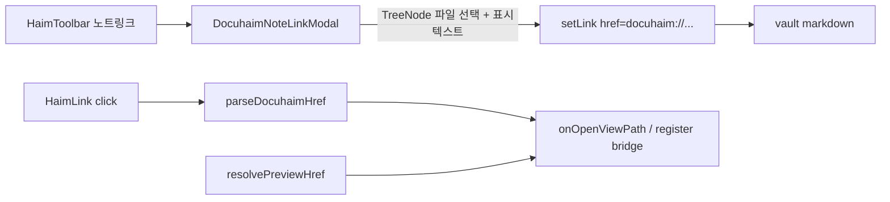

# Haim `docuhaim://` 노트 링크

## 문법 / URI 계약

- 표준 Markdown 링크: `[표시텍스트](docuhaim://vault/relative/path.md)`
- 스킴 접두사: 정확히 `docuhaim://` (대소문자 무시)
- 접두사 뒤 문자열을 **그대로 vault storage path**로 취급 (URL host 파싱 금지 — `docuhaim://a/b.md`의 `a`가 hostname으로 깨지는 문제 방지)
- 정규화: leading `/` 제거, `decodeURIComponent`, `\` → `/`
- 빌드: `docuhaim://` + encode된 path 세그먼트(슬래시는 유지)

예: `[회의록](docuhaim://notes/meeting.md)`

## 아키텍처



## 1. URI 헬퍼 + preview 해석

- 새 모듈 [`src/utils/docuhaimLink.ts`](src/utils/docuhaimLink.ts)
  - `DOCUHAIM_SCHEME_PREFIX = 'docuhaim://'`
  - `isDocuhaimHref`, `parseDocuhaimHref`, `buildDocuhaimHref`
- [`src/utils/appHref.ts`](src/utils/appHref.ts) `resolvePreviewHref`: `docuhaim://`면 early return `{ kind: 'app', viewPath, pathname: /view/... }`
  - Classic Md 미리보기([`MarkdownEditor.jsx`](src/components/editor/MarkdownEditor.jsx) 기존 클릭 핸들러)도 동일하게 인앱 오픈
- 테스트: [`tests/utils/appHref.test.ts`](tests/utils/appHref.test.ts) + `docuhaimLink` 단위 테스트

## 2. TipTap `HaimLink` — 허용 + 클릭 네비

[`src/components/haimEditor/extensions/HaimLink.ts`](src/components/haimEditor/extensions/HaimLink.ts):

- `configure({ protocols: ['docuhaim'], ... })` (TipTap Link 공식 `protocols` 옵션)
- `tryOpenLinkFromEvent`에서 **attrs.href 우선** (DOM `link.href` 왜곡 방지)
- `docuhaim://`이면 `window.open` 대신 등록된 opener 호출
  - bridge 패턴은 기존 [`haimImageAnnotateUpload.ts`](src/utils/haimImageAnnotateUpload.ts)와 동일: `registerHaimOpenViewPath` / `openHaimViewPath`
- 열기 정책:
  - editable: 기존과 동일 (Ctrl/Cmd+클릭 또는 `loadHaimLinkOpenOnClick`)
  - `previewOnly` / `!editable`: `docuhaim://`는 클릭 시 항상 가로채서 인앱 오픈 (`target=_blank`로 커스텀 스킴이 깨지지 않게)

[`HaimEditor.tsx`](src/components/haimEditor/HaimEditor.tsx): props의 `onOpenViewPath`(이미 [`NoteEditorProps`](src/editor/contracts/noteEditorTypes.ts) / EditorPane에 있음, Haim은 미사용)를 mount 시 register, unmount 시 clear.

## 3. 삽입 UI — TreeNode 모달 + 툴바

새 모달 [`src/components/haimEditor/DocuhaimNoteLinkModal.tsx`](src/components/haimEditor/DocuhaimNoteLinkModal.tsx) (`.tsx`):

- `Modal` + 현재 storage의 `TreeNode` (폴더 펼침 / **파일 클릭으로 선택** — `foldersOnly` 끔, `disableDrag`)
- 트리 데이터: `useVault()`의 `storageMode`에 맞는 `s3Tree|localTree|webdavTree|idbTree` + lazy `load*FolderChildren`
- 하단: 선택된 경로 표시 + **표시 텍스트** 입력 (기본값: 선택 파일명 또는 에디터 선택 텍스트)
- 확인 → `onConfirm({ path, text })`
- z-index: 모달 `z-100000` 기준, 내부 오버레이는 규칙대로 상위

[`HaimToolbar.tsx`](src/components/haimEditor/HaimToolbar.tsx):

- `HaimToolbarAppActions`에 `onDocuhaimNoteLink?: () => void`
- 기존「링크」옆 ToolBtn「노트 링크」(예: `FileText` / `Notebook` 아이콘, Radix Tooltip, `aria-label`)
- 클릭 → 모달 open (기존 `onImageLink`와 같은 appActions 패턴)

`HaimEditor`에서 모달 상태 + 확인 시:

```ts
editor.chain().focus().extendMarkRange('link')
  .setLink({ href: buildDocuhaimHref(path) })
  .run();
// 선택 텍스트가 비었으면 insertContent(`[text](docuhaim://path)`, { contentType: 'markdown' })
```

표시 텍스트가 있고 선택이 비어 있으면 markdown insert; 선택이 있으면 `setLink`만 적용하고 필요 시 텍스트 교체는 최소 구현(선택 유지 + 링크 마크, 또는 markdown replace 한 경로로 통일).

## 4. Advanced Search

[`src/utils/advancedSearch/editorActions.ts`](src/utils/advancedSearch/editorActions.ts): `editor-docuhaim-link` 커맨드 (KO/EN keywords: 노트 링크, docuhaim, note link)

[`HaimEditor.tsx`](src/components/haimEditor/HaimEditor.tsx) `registerEditorActions`에 동일 핸들러(모달 open). Classic MarkdownEditor는 no-op 또는 미등록(Haim 전용 UX).

## 5. 문서

규칙 `custom-markdown-docs`에 따라 같은 변경에:

- [`docs/custom-markdown/docuhaim-link.md`](docs/custom-markdown/docuhaim-link.md) — Syntax + Spec (grammar, normalize, canonical HTML `<a href="docuhaim://…">`, click → in-app open)
- [`docs/custom-markdown/index.md`](docs/custom-markdown/index.md) 표 행
- [`docs/.vitepress/config.ts`](docs/.vitepress/config.ts) 사이드바

## 범위 밖 / 고정 결정

- 채팅 `[[note:]]`와 별개 — Haim/노트 MD 전용 `docuhaim://` 하이퍼링크
- Chat composer Haim 툴바에는 넣지 않음 (노트 표면 + vault 트리 전제)
- 기존 URL「링크」prompt 동작은 유지 (`docuhaim://`를 직접 붙여도 클릭 네비는 2번 경로로 동작)
