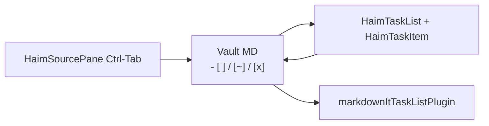

# Haim Editor 3-state task checkbox (`[ ]` / `[~]` / `[x]`)

## Decision (locked)

| Marker | Status | UI |
|--------|--------|-----|
| `- [ ]` | `todo` | unchecked |
| `- [~]` | `doing` | indeterminate (진행중) |
| `- [x]` / `[X]` | `done` | checked (serialize → `[x]`) |

**Click / Ctrl-Tab cycle:** `todo → doing → done → todo`.

`[ ]`/`[x]`는 GFM 호환 유지. `[~]`만 앱 커스텀 → custom-markdown 문서 필수.

## Current state

- TipTap `ListKit`이 이미 `[ ]`/`[x]` WYSIWYG + MD I/O 지원 ([`createHaimExtensions.ts`](src/components/haimEditor/createHaimExtensions.ts)).
- Stock TaskItem input rule는 **`[ ]` / `[x]`만** (`/^\s*(\[([( |x])?\])\s$/`) — **`- [ ]` 전체 접두는 미매칭**. BulletList가 먼저 `- `를 가로채면 task 변환이 깨질 수 있음.
- Tokenizer는 **TaskList**에 있음 (`[ xX]`만).
- [`markdownItTaskListPlugin.ts`](src/utils/markdownItTaskListPlugin.ts)도 `[~]` 미지원이고 **`APP_MARKDOWN_IT_PLUGIN_DEFS`에 미등록**.
- 현재 task CSS는 layout만 — brand tint 없음.

## Architecture



Shared helper (new): [`src/utils/taskCheckboxStatus.ts`](src/utils/taskCheckboxStatus.ts)

- `TaskCheckboxStatus = 'todo' | 'doing' | 'done'`
- `parseTaskCheckboxMarker(ch)` / `serializeTaskCheckboxMarker(status)` / `cycleTaskCheckboxStatus(status)`
- Marker charset: space / `~` / `x`/`X`

## Implementation

### 1. TipTap: `HaimTaskItem` + `HaimTaskList`

New files under [`src/components/haimEditor/extensions/`](src/components/haimEditor/extensions/):

- **`HaimTaskItem`** — `TaskItem.extend`:
  - Attr `status` (`todo|doing|done`); keep `data-checked` for done + add `data-status`.
  - Override `parseMarkdown` / `renderMarkdown`.
  - Override `addNodeView`: click cycles status; `checkbox.indeterminate = status === 'doing'`; `checked = status === 'done'`.
- **`HaimTaskList`** — `TaskList.extend`:
  - `markdownTokenizer.start` + `itemPattern` charset `[ xX~]`.
  - `extractItemData` → `status`.

Wire in [`createHaimExtensions.ts`](src/components/haimEditor/createHaimExtensions.ts):

```ts
ListKit.configure({
  taskItem: false,
  taskList: false,
}),
HaimTaskItem.configure({ nested: true }),
HaimTaskList,
```

### 1b. WYSIWYG auto-convert on typing `- [ ]` (required)

**비침해 규칙:** `-` / `- `만 입력하면 **기존과 동일하게 bullet list**. BulletList `wrappingInputRule`은 그대로 두고, task 규칙은 **체크박스 마커가 완전히 들어온 뒤에만** 발동한다.

`HaimTaskItem.addInputRules()`:

1. **Short form** (stock 확장): `[ ]` / `[]` / `[~]` / `[x]` + trailing space → taskItem wrap + status attrs.
2. **Markdown prefix form:** 줄 앞에서 `- [ ]` / `- [~]` / `- [x]` / `* [ ]` 등 + trailing space → `taskList`/`taskItem` wrap.  
   - 매칭은 **`- ` 다음 `[…]`까지 완성된 긴 패턴만** (예: `/^\s*[-*+]\s+\[([ xX~])\]\s$/`).  
   - `- `만으로는 task rule이 **절대** 매칭되지 않음 → bullet 유지.
3. **Bullet → task 승격:** 이미 bullet인 줄에서 `[ ] ` / `[~] ` / `[x] `를 이어서 치면 task로 승격 (bullet rule을 제거하지 않음).

검증 시나리오:
- `- ` → bullet (회귀, 기존과 동일)
- `- [ ]` + space → checkbox 행
- `- [~]` / `- [x]` 동일
- 이미 bullet인 줄에서 `[ ] ` → task로 승격
- 소스 모드가 아닌 TipTap prose에서만 (CM은 텍스트 유지)

### 2. Integrated checkbox UI (modern-web-guidance)

Guide: **`brand-consistent-forms`** (`accent-color`, native `<input type="checkbox">` 유지 — 커스텀 div 체크박스 금지).

[`src/styles/haim-editor/style.css`](src/styles/haim-editor/style.css) (+ preview/export task-list 선택자 공유):

- `.haim-editor` / task list 루트에 `color-scheme: light dark` + `accent-color: var(--color-blue-600)` (dark: `var(--color-odp-accentBlue, #60a5fa)`).
- Prose와 **한 줄로 붙는** 정렬: checkbox `1.05em` 근처, `flex` + `align-items: flex-start`, label `margin-top`를 line-height에 맞춤, 포인터 hit 영역 여유.
- `li[data-status='done']` 텍스트 살짝 muted; `doing`은 indeterminate native + 동일 accent.
- Preview/export HTML도 같은 accent/token 클래스(`.task-list-item-checkbox`)를 쓰도록 markdown-it 출력과 CSS 선택자를 맞춤.
- `@supports not (accent-color: …)` 일 때만 guide의 visually-hidden + `::before`/`::after` fallback (3상태: empty / dash-for-doing / check). Electron/Chromium 주력이어도 fallback은 thin 유지.

가짜 React 체크박스 컴포넌트·extra icon pack은 쓰지 않음.

### 3. Preview / Export HTML: markdown-it

Update [`markdownItTaskListPlugin.ts`](src/utils/markdownItTaskListPlugin.ts):

- Recognize `[~] `.
- `li` → `task-list-item` + `data-status`.
- Checkbox: todo unmarked; doing → `data-status="doing"` + `aria-checked="mixed"`; done → `checked`.
- Register in [`appMarkdownItPlugins.ts`](src/utils/appMarkdownItPlugins.ts).
- XSS: `input`에 `data-status`, `aria-checked`.

Static HTML에는 `indeterminate` property가 없으므로 `data-status` + CSS; TipTap NodeView만 `indeterminate = true`.

### 4. Source pane + shared CM toggles

- [`editorMarkdownStyle.ts`](src/utils/editorMarkdownStyle.ts): `TASK_CHECKBOX_LINE_RE`에 `~`; 3-way cycle.
- [`HaimSourcePane.tsx`](src/components/haimEditor/HaimSourcePane.tsx): `Ctrl-Tab` → 해당 토글.

### 5. Consumers

- [`HaimEditor.tsx`](src/components/haimEditor/HaimEditor.tsx) progress count
- [`ChecklistProgressView.jsx`](src/components/ChecklistProgressView.jsx) (+ `.tsx` if substantial edit)
- [`previewMirrorEdit.ts`](src/utils/previewMirrorEdit.ts)
- [`otherApps/checkListProgressCheck.jsx`](src/components/otherApps/checkListProgressCheck.jsx) if still used

Progress: total = all three; completed = `done` only; pending = `todo` + `doing`.

### 6. Docs + tests

- [`docs/custom-markdown/task-list.md`](docs/custom-markdown/task-list.md) + index + VitePress sidebar.
- Tests: status helper, MD↔TipTap round-trip for three markers, input-rule smoke if feasible, markdown-it `[~]` → `data-status="doing"`.

## Out of scope

- md-editor-rt vendor `github-task-lists` 내부 패치 (레거시). 앱 `createAppMarkdownIt` / Export PDF / Haim 우선.
- Advanced Search 새 커맨드 (기존 `editor-task` 유지).
- Div-only custom checkbox / 별도 UI 라이브러리.
