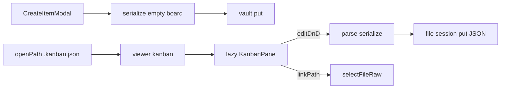

# Kanban `.kanban.json` MVP

## 결정된 범위

- **카드 모델 A (하이브리드):** JSON에 `title` / `body` / 컬럼 소속을 두고, 선택적으로 `linkPath`(vault storage path)로 TreeNode를 연다.
- **1차 MVP:** 컬럼 추가·이름·순서·색, 카드 CRUD·컬럼 내/간 DnD, vault 파일 링크·열기, CreateItemModal 생성, 전용 `KanbanPane`.
- **2차(이번 PR에서 구현하지 않음):** swimlane, 커버 이미지, 컬럼 폴더에 노트 자동 생성.
- **MVP 완료 시점**에 [`.cursor/plans/`](.cursor/plans/) 아래 차기 계획 파일을 반드시 작성한다.

참고 UX: [Obsidian Kanban Bases View](https://community.obsidian.md/plugins/kanban-bases-view)의 컬럼/카드 DnD·컬럼 색·클릭으로 노트 열기. Bases 속성 기반 컬럼 생성은 s3haim에 Bases가 없으므로 **보드 파일이 컬럼·카드를 소유**하는 형태로 이식한다.

## 데이터 스키마 (v1)

시드·저장 모두 pretty-printed JSON (`application/json`).

```json
{
  "version": 1,
  "columns": [
    { "id": "col_todo", "title": "To Do", "color": null, "cardIds": [] },
    { "id": "col_doing", "title": "Doing", "color": null, "cardIds": [] },
    { "id": "col_done", "title": "Done", "color": null, "cardIds": [] }
  ],
  "cards": {
    "card_x": {
      "id": "card_x",
      "title": "",
      "body": "",
      "linkPath": null
    }
  }
}
```

- `linkPath`: vault POSIX path 또는 `null`. 클릭 시 기존 `selectFileRaw` / `handleOpenNoteFromChat` 패턴으로 연다.
- 파싱 실패 시 안전한 empty board + UI 오류 배너.

모듈: `src/utils/kanban/kanbanPath.ts`, `kanbanDocument.ts` (`createEmptyKanbanDocument`, `parseKanbanDocument`, `serializeKanbanDocument`), 테스트 `tests/utils/kanbanDocument.test.ts`.

## 생성·경로·viewer 배선

퀴즈(`.quiz.md`)와 동일한 “경로 helper + 전용 viewer + lazy pane” 패턴.

1. [`src/utils/createFileFormats.ts`](src/utils/createFileFormats.ts) — `{ id: 'kanban.json', extension: '.kanban.json', ... }` 추가. `createFileIntermediateSuffixes`를 `.json` 복합에도 확장해 `board.kanban` → `board.kanban.json`.
2. [`useTreeOpsDomain.ts`](src/App/hooks/useTreeOpsDomain.ts) `createItem` — `isKanbanJsonPath`이면 시드 JSON; open 시 `viewer: 'kanban'`.
3. [`openPathFileFromBackend.js`](src/utils/storage/openPathFileFromBackend.js)와 [`useFileSessionDomain.ts`](src/App/hooks/useFileSessionDomain.ts) — generic `json`보다 앞에 `.kanban.json` → `viewer: 'kanban'`.
4. [`EDITABLE_VIEWERS`](src/utils/workspaceTabs/types.ts) + EditorPane editable + `contentTypeForViewer`: `'kanban'` → `application/json`.
5. [`TreeNode.tsx`](src/components/shell/TreeNode.tsx) — 칸반 아이콘.
6. URL은 `/view/<path>` 유지 (별도 `/kanban/` 라우트는 MVP 생략).

## UI: `KanbanPane`

- [`src/components/kanban/KanbanPane.tsx`](src/components/kanban/KanbanPane.tsx) (default export), [`EditorPane.jsx`](src/components/shell/EditorPane.jsx)에서 `React.lazy` + `Suspense`.
- **dnd-kit:** 컬럼 droppable + 가로 순서, 카드는 컬럼별 `SortableContext` 다중 컨테이너. `@dnd-kit/*`만 사용.
- 컬럼: 추가·이름·색(`react-colorful`)·순서·삭제(`ConfirmModal` danger).
- 카드: 추가·title/body 편집·삭제·DnD.
- **TreeNode 링크:** 카드에 파일 연결(Quiz source picker류 또는 AS browse). `linkPath` 저장 후 클릭 → `selectFileRaw`.
- **세션 undo/redo:** Mod+Z / Mod+Shift+Z / Mod+Y, capture-phase, 언마운트 시 폐기.
- dirty는 `editorContent` JSON 문자열로 기존 저장 파이프라인에 연결.
- 버튼 아이콘·Radix Tooltip 규칙 준수.



## 문서·테스트

- [`docs/custom-markdown/kanban-json.md`](docs/custom-markdown/kanban-json.md) + [`index.md`](docs/custom-markdown/index.md) + VitePress sidebar.
- `createFileFormats` / parse-serialize / 카드 이동 순수 함수 단위 테스트.

## MVP 완료 필수: 차기 계획

구현 마무리 후 **코드 없이** 계획만 작성:

- 예: [`.cursor/plans/kanban_phase2_swimlane_cover.plan.md`](.cursor/plans/kanban_phase2_swimlane_cover.plan.md)
- swimlane, 커버 이미지, 컬럼 폴더 quick-add 노트 생성 등.

## 주요 터치 파일

- 신규: `src/utils/kanban/*`, `src/components/kanban/KanbanPane.tsx`, docs, tests, phase2 plan
- 수정: `createFileFormats.ts`, `useTreeOpsDomain.ts`, open/session 경로, `EditorPane.jsx`, `workspaceTabs/types.ts`, `TreeNode.tsx`
