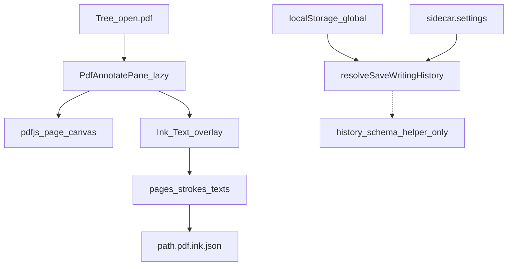

# PDF 노트 필기 (ink + text) + history 설정 준비

## Decisions (locked)

- **도구**: 펜 / 형광펜 / 지우개 + 텍스트 박스 (이미지 라이트박스와 동급). 레이저는 세션 전용(비영속) 가능.
- **History(A)**: 감사 타임라인용 **스키마·설정·헬퍼만** 준비. v1에서 스트로크 커밋 시 history append 호출 없음, 타임라인 UI 없음.
- **영속**: 원본 `.pdf` 불변. 형제 사이드카 `{name}.pdf.ink.json` (예: `notes/a.pdf` → `notes/a.pdf.ink.json`).
- **문서 설정**: PDF는 마크다운 `<!-- document-settings -->`가 없으므로 **사이드카 `settings` + 필기 뷰어 내 문서 설정 패널**(전역/켜기/끄기). 전역은 SettingsPage + Advanced Search.
- **세션 undo**: Mod+Z / Mod+Shift+Z / Mod+Y (인메모리) — 감사 history와 별개, 규칙 [`editor-undo-redo`](.cursor/rules/editor-undo-redo.mdc).
- **렌더**: `pdfjs-dist`만 추가 (annotate에 `pdf-lib` 불필요). dynamic `import()` + [`vite.config.ts`](vite.config.ts) `vendor-pdfjs`. iframe 미리보기 교체.
- **좌표**: 페이지 정규화 `0..1` (줌/해상도 독립). 스트로크 모델은 [`haimImageStrokes.ts`](src/components/haimEditor/haimImageStrokes.ts)의 `AnnotateStroke` / `AnnotateText`를 확장·공유.

## Architecture



## Sidecar schema (`*.pdf.ink.json`)

```ts
type PdfInkDocument = {
  v: 1;
  /** omit | true | false — omit = inherit global */
  settings?: { saveWritingHistory?: boolean };
  pages: Record<string /* 1-based page */, {
    strokes: PdfInkStroke[];
    texts: PdfInkText[];
  }>;
  /** Prepared for audit trail; always [] in v1 (no writers) */
  history: PdfInkHistoryEntry[];
};

type PdfInkHistoryEntry = {
  id: string;
  at: string; // ISO
  op: 'add' | 'update' | 'delete' | 'clear';
  page: number;
  targetId?: string;
  // payload reserved for later
};
```

트리 숨김: [`s3Tree.js`](src/utils/vault/s3Tree.js)에 `isPdfInkSidecarFileKey` (녹음 companion과 동일 패턴).

## Settings

| 층 | 저장 | UI |
|----|------|----|
| 전역 | `localStorage` `s3haim_pdf_ink_save_writing_history` (default `false`) | SettingsPage 새 섹션 카드 + AS `settings-pdf-ink-save-writing-history` |
| 문서 | sidecar `settings.saveWritingHistory` omit/true/false | PdfAnnotatePane 내 tinted 카드 RadioGroup **전역 / 켜기 / 끄기** |

모듈: [`src/utils/pdfInk/pdfInkHistorySettings.ts`](src/utils/pdfInk/pdfInkHistorySettings.ts)

- `load/save` + `CHANGED_EVENT`
- `resolvePdfInkSaveWritingHistory(global, docOverride?: boolean)`
- `appendPdfInkHistoryEntry(doc, entry)` — resolve가 true일 때만 push; **v1 call site 없음** (테스트로 헬퍼만 검증)

Settings 등록:

- [`settingsToggles.ts`](src/utils/advancedSearch/settingsToggles.ts)
- [`SettingsPage.jsx`](src/pages/SettingsPage.jsx) + [`settingsPageCatalog.ts`](src/utils/settingsPageCatalog.ts) (`editor-content` 근처 또는 새 `pdf-ink` 섹션)
- section card: [`settingsSectionCardClass`](src/utils/settingsSectionCard.ts)

## UI / wiring

1. **Deps**: `pdfjs-dist`; Vite worker (`new URL('pdfjs-dist/build/pdf.worker.min.mjs', import.meta.url)` 또는 프로젝트에 맞는 worker 경로) + `manualChunks` `vendor-pdfjs`.
2. **Lazy pane**: [`PdfAnnotatePane.tsx`](src/components/pdfInk/PdfAnnotatePane.tsx) — default export; [`EditorPane.jsx`](src/components/shell/EditorPane.jsx) `viewer === 'pdf'`에서 iframe 대신 `<Suspense><PdfAnnotatePane …/></Suspense>`.
3. **툴바**: 펜/형광펜/지우개/텍스트, 색·굵기, 페이지 이동, 저장 상태, 문서 설정(history 토글), Undo/Redo.
4. **포인터**: lightbox 제스처 패턴 재사용(가능하면 공유 훅 추출; 거대 복제 금지 — 공통 stroke hit-test/SVG path는 `src/utils/pdfInk/` 또는 shared ink util).
5. **로드/저장**: open 시 `readBytes` PDF + sidecar(없으면 빈 doc); debounce `writeBytes` sidecar; dirty + 명시 저장은 vault autosave 패턴에 맞춤.
6. **미리보기 패널**: [`VaultDocumentPreviewBody.tsx`](src/components/shared/panels/VaultDocumentPreviewBody.tsx)는 읽기 전용 — 기존 iframe 유지 또는 pdfjs 읽기 전용(필기 없음). **필기는 EditorPane만**.
7. **pdf-tools 플랜과 분리**: annotate ≠ merge/split; 네이밍·라우트 혼동 금지.

## Out of scope (v1)

- History 타임라인 UI / playback / 실제 append 호출
- PDF 안에 annotation 임베드 (`pdf-lib` bake-in)
- Export annotated PDF
- `/pdf-tools` 병합·분할
- 마크다운 `DocumentSettingsModal`에 동일 토글 (PDF 전용)

## Tests / docs

- Unit: sidecar parse/serialize, `resolvePdfInkSaveWritingHistory`, `appendPdfInkHistoryEntry` gating
- Tree: sidecar 숨김
- Docs: `docs/custom-markdown/`는 MD 문법이 아니므로 짧게 `docs/` 또는 플랜만; 사이드카 포맷은 코드 옆 README 주석 또는 `docs/pdf-ink.md` 한 파일 (스펙: 경로 규칙, JSON schema, history 예약 필드)

## Implementation order

1. Settings 모듈 + AS + SettingsPage + resolve/append helpers (history 준비)
2. Sidecar IO + tree hide
3. pdfjs load/render + PdfAnnotatePane shell (page nav)
4. Ink + text overlay + session undo
5. Autosave wiring in EditorPane
6. Tests + docs
