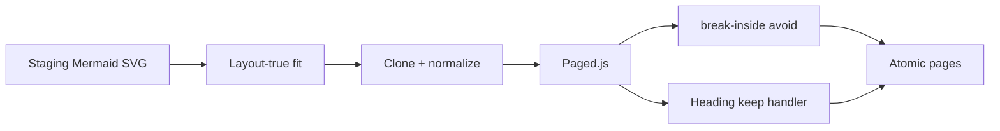

# Print Mermaid 분절 수정 + Word/HWP식 페이지 분할

## 문제

1. **Mermaid가 여러 이미지처럼 보임** — [`exportPdfPagedStyles.ts`](src/pages/exportPdf/exportPdfPagedStyles.ts)에서 `.md-editor-mermaid { break-inside: auto }`로 의도적으로 분절을 허용함. paged.js가 큰 SVG를 페이지마다 잘라 **별도 SVG 조각**으로 넣음. sequenceDiagram처럼 세로로 긴 다이어그램에서 특히 심함.
2. **Fit이 레이아웃에 안 먹힘** — [`usePrintMermaidFit.ts`](src/hooks/usePrintMermaidFit.ts)가 `transform: scale` + 음수 margin만 적용해 **시각 크기 ≠ 레이아웃 박스**. paged.js는 여전히 overflow로 판단해 분절할 수 있음.
3. **좁은 다이어그램 확대** — `svg { width: 100% !important }`가 자연 폭이 좁은 sequenceDiagram을 가로·세로로 키워 분절을 부추김.
4. **페이지 분할이 어색함** — keep-with-next / orphans·widows가 라이브 paged CSS에 거의 없고, heading `break-after: avoid`는 vanish 회귀로 금지됨.



## 접근 (결정)

- Mermaid는 **절대 SVG 중간 분절하지 않음**. 페이지보다 크면 **페이지 콘텐츠 박스에 맞게 축소**한 뒤 통째로 배치.
- Word/HWP식 느낌은 **제목이 홀로 페이지 끝에 남지 않게** + **단락 orphan/widow**로 확보. 표 row 단위 분할·코드 pre-split 재도입은 이번 범위 밖.
- CSS `break-after: avoid`는 재도입하지 않음 (heading vanish 회귀). 대신 **측정/Handler 기반 keep-with-next**.

---

## 1. Mermaid: 레이아웃-진실한 fit

**새 유틸** [`src/utils/exportPdf/applyPrintMermaidFit.ts`](src/utils/exportPdf/applyPrintMermaidFit.ts) (또는 `src/utils/print/`):

- 입력: root + `maxW`/`maxH` (probe 박스).
- 대상: `.md-editor-mermaid[data-processed]` (+ normalize 후 Haim alias 포함).
- `data-print-free-transform` / 명시 size attrs는 사용자 크기 존중하되, **페이지 높이를 넘으면** print 전용으로 `maxH`까지 추가 축소 (분절 방지 우선).
- **transform 제거**. SVG에 실제 `width`/`height`(px) + host 박스 고정 (`maxWidth`/`width`/`height`) — [`usePrintImageAspectFit`](src/hooks/usePrintImageAspectFit.ts)와 같은 “박스가 시각 크기” 패턴.
- viewBox 유지, `data-print-mermaid-fit` 기록.

**훅** [`usePrintMermaidFit.ts`](src/hooks/usePrintMermaidFit.ts): 위 util 호출로 교체. clear 시 transform/margin뿐 아니라 SVG/host 인라인 사이즈도 복구.

**클론 직후 한 번 더** — [`buildPagedSourceFromPreview`](src/pages/exportPdf/hooks/usePagedJsPreview.ts)에서 `normalizeHaimPreviewForExportPdf` 이후, probe/페이지 콘텐츠 크기를 넘겨 `applyPrintMermaidFit` 실행 (Haim staging이 fit 셀렉터를 건너뛰는 경로 보완).

---

## 2. Mermaid CSS: avoid + 업스케일 금지

[`exportPdfPagedStyles.ts`](src/pages/exportPdf/exportPdfPagedStyles.ts):

| 변경 | 내용 |
|------|------|
| `.md-editor-mermaid` | `break-inside: avoid` / `page-break-inside: avoid` (display: **block** 유지 — 과거 avoid+flex crash 회피) |
| unsized SVG | `width: 100% !important` → `max-width: 100%`; `width: auto`; `height: auto` (`.haim-mermaid-block` 경로도 동일) |
| fit 표시 | `[data-print-mermaid-fit]`일 때 host/SVG가 인라인 크기를 이기도록 충돌 규칙 정리 |

`display: block`은 유지. flex로 되돌리지 않음.

---

## 3. Word/HWP식 페이지 분할

### 3a. orphans / widows

`exportPdfPagedStyles`에:

```css
.export-pdf-paged-source p,
.export-pdf-paged-source li,
.pagedjs_page_content p,
.pagedjs_page_content li {
  orphans: 2;
  widows: 2;
}
```

### 3b. Heading keep-with-next (Handler)

기존 [`protectExportPdfHeadingBeforeCode.ts`](src/utils/exportPdf/protectExportPdfHeadingBeforeCode.ts) 로직을 **일반 블록**으로 확장:

- 새 모듈 예: `src/utils/exportPdf/pagedJsHeadingKeepHandler.ts` + `resolveHeadingKeepBreakToken`.
- `onBreakToken`: overflow/break가 **heading 직후**에 걸리고, 남은 공간에 heading + 다음 블록 시작(최소 ~96px, 기존 `MIN_SPACE_AFTER_HEADING_FOR_CODE_PX` 재사용/일반화)이 안 들어가면 break를 **heading 앞**으로 이동 (`export-pdf-break-before-page`와 동일 효과).
- 다음 형제: `p`, list, `.md-editor-code`, `.md-editor-mermaid`, `table`, `figure` 등.
- [`loadPagedJsPreviewer.ts`](src/utils/exportPdf/loadPagedJsPreviewer.ts)에 code handler와 함께 등록.

CSS `break-after: avoid`는 **추가하지 않음** — [`exportPdfHeadingVanish.test.ts`](tests/utils/exportPdf/exportPdfHeadingVanish.test.ts) 정책 유지. Handler/측정으로 keep만 구현.

### 3c. figure/wiki wrap (소폭)

Mermaid와 같이 flex로 인한 break-token 이슈가 있으면 `.haim-wiki-image-wrap` / `figure`를 `display: block` + 중앙 정렬로 맞춤 (기존 mermaid 주석과 정책 통일). 표는 현재 `break-inside: avoid` 유지.

---

## 4. 테스트·문서

- **Unit**: `applyPrintMermaidFit` — 초과 시 SVG/host 박스가 max 이하로 줄고 transform 없음; 이미 page 이하면 스케일 1.
- **Unit**: heading keep token resolver — heading 직후 tight leftover면 break를 heading 앞으로.
- **Style**: paged CSS에 mermaid `break-inside: avoid`, `width: 100% !important` on unsized mermaid svg 없음, orphans/widows 존재; 여전히 `break-after: avoid` 없음.
- **Docs**: [`docs/custom-markdown/page-break.md`](docs/custom-markdown/page-break.md) — Mermaid는 통째 배치(축소 가능, mid-SVG split 비목표), heading keep / orphans·widows 동작 요약.

---

## 주요 파일

- [`src/hooks/usePrintMermaidFit.ts`](src/hooks/usePrintMermaidFit.ts) + 새 `applyPrintMermaidFit` util
- [`src/pages/exportPdf/exportPdfPagedStyles.ts`](src/pages/exportPdf/exportPdfPagedStyles.ts)
- [`src/pages/exportPdf/hooks/usePagedJsPreview.ts`](src/pages/exportPdf/hooks/usePagedJsPreview.ts)
- [`src/utils/exportPdf/loadPagedJsPreviewer.ts`](src/utils/exportPdf/loadPagedJsPreviewer.ts)
- 새 heading keep handler + protect 일반화
- [`docs/custom-markdown/page-break.md`](docs/custom-markdown/page-break.md)
- 관련 `tests/utils/exportPdf/*`

## 비범위

- 긴 표의 row 단위 페이지 분할
- `splitExportPdfCodeBlocksByPageHeight` 라이브 재연결
- CSS `break-after: avoid` 복구
