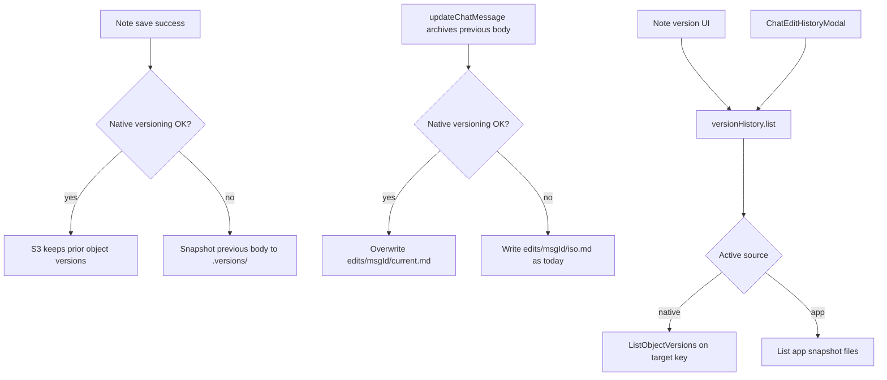

# 노트 + 채팅 수정 히스토리 — S3 네이티브 + 앱 관리 폴백

## 결론

**노트**와 **채팅 메시지 수정 이력** 모두 같은 정책이다.

1. **S3 native** — 버킷 Object Versioning Enabled + IAM이면 `ListObjectVersions` / `GetObject(VersionId)`.
2. **App-managed 폴백** — 버저닝 불가·비-S3면 vault에 스냅샷을 직접 쌓음.

채팅은 이미 app 경로가 있다: [`.chat-with-myself/edits/<messageId>/<iso>.md`](src/utils/chatWithMyself/paths.js) + [`writeMessageEditVersion`](src/utils/chatWithMyself/storage.js) / [`ChatEditHistoryModal`](src/components/chatWithMyself/ChatEditHistoryModal.tsx). 이번 작업에서 그 경로를 **폴백 전용**으로 두고, native가 되면 **메시지당 단일 키 overwrite**로 S3 버전에 맡긴다.

일일 채팅 파일(`YYYY-MM-DD.md`) 전체에 대한 버전 UI는 하지 않는다. 메시지 단위 수정 이력만 다룬다(데이 파일 버전은 여러 메시지가 섞여 복원이 위험함).



## 현재 상태

- S3: [`s3Client.js`](src/utils/vault/s3Client.js) — Key-only. **VersionId 없음.**
- 노트: 버전 UI/스냅샷 없음.
- 채팅: 수정 시 이전 body를 `writeMessageEditVersion`으로 항상 파일 아카이브. 레거시 inline `editHistory`도 모달에서 보조 표시.

## 공유: 지원 판별

Vault/S3 스코프당 한 번 probe → 캐시(`native` | `app` | `off`).

| 조건 | 내용 |
|------|------|
| 버킷 | Object Versioning = **Enabled** |
| IAM | `s3:ListBucketVersions`, `s3:GetObjectVersion` |
| 실패 | AccessDenied / NotImplemented / 비-S3 → **app** |

노트·채팅이 **같은 probe 결과**를 쓴다.

## 경로 A — S3 native

### 노트

- 대상 Key = 노트 path. Put만으로 버전 축적.
- 목록/미리보기/복원 = `ListObjectVersions` + `GetObject(VersionId)` → 현재 path에 Put.
- native 활성 시 `.versions/` 스냅샷 **안 남김**.

### 채팅 수정

메시지는 day 파일 안에 있으므로, **수정 아카이브용 전용 Key**가 필요하다.

- **Canonical key (native):** `.chat-with-myself/edits/<messageId>/current.md`
- 수정 시 이전 body를 `serializeEditVersion(...)`으로 직렬화한 뒤 **같은 Key에 overwrite** (`putTextOverwrite`).
- S3가 이전 `VersionId`를 보관 → 목록은 `ListObjectVersions(Prefix=exact key)` (또는 Key 일치 필터).
- 복원: 선택한 VersionId 본문 parse → `updateChatMessage`로 현재 메시지에 반영(이때 또 overwrite 하면 복원 전 상태가 새 버전으로 남음).
- **타임스탬프별 새 파일은 만들지 않음** (객체 폭증 방지; 버전은 S3가 담당).

기존에 쌓인 `edits/<messageId>/<iso>.md`는 삭제하지 않는다. 목록 시 native 버전 뒤에 **레거시 app 파일을 이어서** 보여 연속성을 유지한다(읽기 전용 병합).

## 경로 B — App-managed 폴백

### 노트 (신규)

```text
.versions/
  <entryId>/
    meta.json    # { path, createdAt, size, contentHash, source: "app" }
    body.md
```

- 저장 성공 + content hash 변경 시에만.
- 대상: Create-file 문서 등 사용자 노트. 제외: `.trash/`, `.versions/`, `.settings/`, `.chat-with-myself/**`, 대용량 바이너리.
- 파일당 최대 **20**개; Settings 토글 + AS settings toggle.
- 복원 전 현재 본문 한 번 스냅샷.

### 채팅 (기존 유지)

- native 불가 시 **현재 동작 그대로**: `messageEditVersionKey` → `edits/<messageId>/<iso>.md`.
- `loadMessageEditHistoryPage` / 레거시 inline `editHistory` 병합 로직 유지.
- 별도 `.versions/`로 옮기지 않음(채팅 전용 경로 유지).

## 공통 레이어

`src/utils/versionHistory/`

- `types.ts` — `VersionEntry { id, source: 's3-native' | 'app' | 'legacy-app', at, size, … }`
- `resolveSource()` — vault probe 캐시
- 타깃 종류:
  - `note`: vault-relative path
  - `chatEdit`: messageId → native면 `…/current.md`, app면 folder prefix
- `listVersions` / `readVersion` / `restoreVersion`
- 어댑터: `s3NativeAdapter.ts`, `appManagedNoteAdapter.ts`, `chatEditAdapter.ts` (기존 storage 헬퍼 래핑)

채팅 쓰기 경로 변경점:

- [`updateChatMessage`](src/utils/chatWithMyself/storage.js) → `writeMessageEditVersion` 대신 `versionHistory.archiveChatEdit(ctx, messageId, archived)` 호출.
- native: `current.md` overwrite.
- app: 기존 ISO 파일 write.

## UI

| 표면 | 동작 |
|------|------|
| 노트 | 신규 버전 모달 — 사이드바/에디터 메뉴 + AS 커맨드 |
| 채팅 | 기존 [`ChatEditHistoryModal`](src/components/chatWithMyself/ChatEditHistoryModal.tsx)이 `loadMessageEditHistoryPage` 대신(또는 내부에서) 공통 list/read/restore 사용. 소스 배지 optional (`S3` / `앱`) |
| Settings | 앱 버전 기록 on/off·노트 보존 개수; 채팅 app 경로는 기존처럼 best-effort 아카이브(끄기는 노트 토글과 분리하거나 동일 master 토글 — **MVP: master “버전 기록” 토글이 노트 app 스냅샷 + 채팅 app 아카이브를 함께 끔; native는 버킷 설정에 따름**) |

모달: sticky header/footer, nested z-index, 버튼 아이콘, ConfirmModal 복원.

## 주의할 부작용

- **비용** — native 채팅은 메시지마다 `current.md` 버전이 쌓임. 수정이 잦은 메시지 lifecycle 권장. app 채팅은 파일 수 증가(현행과 동일).
- **이중 기록 금지** — native일 때 ISO 파일을 추가로 쓰지 않음. 레거시 ISO는 읽기만.
- **데이 파일** — 노트 버전/스냅샷 대상에서 `.chat-with-myself/*.md` day 파일 제외(메시지 수정 이력과 분리).
- **custom markdown docs** — `chat-edit-version` 문법 변경 없으면 docs 갱신 최소; native 키 규약(`current.md`)만 문서화.
- **충돌/동기화** — 기존 ETag/LastModified 유지.

## 구현 순서 (승인 후)

1. probe/캐시 + `versionHistory` 타입·native 어댑터
2. 채팅 hybrid (`current.md` vs ISO) + `ChatEditHistoryModal` 연동·레거시 병합
3. 노트 `.versions/` app 어댑터 + 저장 훅
4. 노트 UI·AS·settings toggle
5. 트리/검색에서 `.versions` 제외 + IAM/키 규약 문서

## 범위

계획 단계. 코드 구현은 별도 실행 지시 후.
