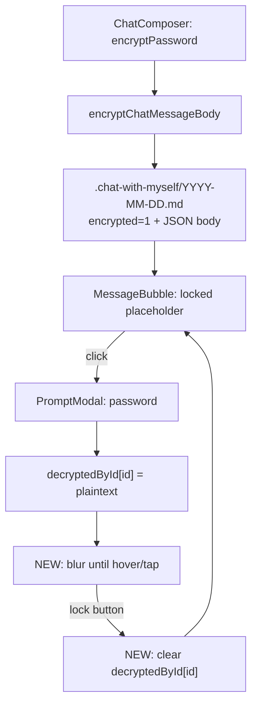

# 나와의 채팅 암호화 메시지 완성

## 현재 상태 (이미 구현됨)

작업 트리에 암호화 메시지 인프라가 **대부분** 들어가 있습니다.

| 영역 | 파일 | 상태 |
|------|------|------|
| 암호화 wire 포맷 (`.enc.md`와 동일 PBKDF2 100k + AES-GCM-256) | [`src/utils/chatWithMyself/encryptedMessage.ts`](src/utils/chatWithMyself/encryptedMessage.ts) | 완료 |
| 일별 파일 `encrypted="1"` + body JSON | [`src/utils/chatWithMyself/format.js`](src/utils/chatWithMyself/format.js) | 완료 |
| 암호화 전송 (Ctrl+Shift+Enter, 전송 버튼 우클릭, `PromptModal`) | [`src/components/chatWithMyself/ChatComposer.jsx`](src/components/chatWithMyself/ChatComposer.jsx) | 완료 |
| 전송 큐 암호화 + optimistic UI | [`src/components/chatWithMyself/ChatWithMyselfPane.jsx`](src/components/chatWithMyself/ChatWithMyselfPane.jsx) | 완료 |
| 세션 복호화 Map (`decryptedById`) + 잠금 해제 모달 | `ChatWithMyselfPane` | 완료 |
| 잠긴 버블 UI (violet 스타일, `IconLock`, 클릭 → 복호화) | [`src/components/chatWithMyself/ChatMessageList.jsx`](src/components/chatWithMyself/ChatMessageList.jsx) | 완료 |



## 구현할 부분 (이번 작업)

### 1. 세션 재잠금 API (`ChatWithMyselfPane`)

[`ChatWithMyselfPane.jsx`](src/components/chatWithMyself/ChatWithMyselfPane.jsx)에 핸들러 추가:

```ts
const handleRelockMessage = useCallback((message) => {
  if (!message?.id || !isChatMessageEncrypted(message)) return;
  setDecryptedById((prev) => {
    if (prev[message.id] == null) return prev;
    const next = { ...prev };
    delete next[message.id];
    return next;
  });
}, []);
```

- `ChatMessageList`에 `onRequestRelock={handleRelockMessage}` 전달
- 재잠금 후 `handleRequestDecrypt`가 다시 동작 (현재 `decryptedById[id]` 있으면 early return — 재잠금 시 Map에서 제거되므로 OK)

### 2. 메시지 버블 UI — 잠금 버튼 + blur/reveal

주요 변경: [`ChatMessageList.jsx`](src/components/chatWithMyself/ChatMessageList.jsx) `MessageBubble`

**상태 분기 (3단계)**

| 상태 | 조건 | UI |
|------|------|-----|
| `encryptedLocked` | `encrypted && !decryptedBody` | 기존: 자물쇠 + "암호화된 메시지" + "클릭하여 잠금 해제" |
| `encryptedRevealed` | `encrypted && decryptedBody && (hovering \|\| mobilePeek)` | 평문 `ChatMessageBody` (blur 없음) |
| `encryptedPeekHidden` | `encrypted && decryptedBody && !(hovering \|\| mobilePeek)` | **blur** + 안내 문구 |

**잠금 버튼** — 암호화 메시지(`encrypted === true`)이면 잠금/해제 상태와 무관하게 버블 **상단**에 항상 표시:

- 잠김: 기존 `IconLock` 행 유지 (클릭 → 복호화 모달)
- 언락됨: 버블 헤더에 `IconLock` + **「다시 잠금」** 버튼 (`e.stopPropagation()`, `onRequestRelock`)
- Radix `Tooltip`으로 `aria-label` 보조 (title= 금지)

**blur/reveal 동작**

- 데스크톱 (fine pointer): 버블 wrapper에 `group` + `onMouseEnter`/`onMouseLeave` 또는 `group-hover:[&_.enc-body]:blur-none`
- 모바일 (`coarse` 이미 `MessageBubble`에서 사용 중): 호버 불가 → 버블 본문 탭 시 `mobilePeekId` 토글 (한 번 탭 = 보기, 다시 탭 또는 바깥 탭 = 숨김)
- 안내 문구 예:
  - 데스크톱: `마우스를 올리면 내용이 보입니다`
  - 모바일: `탭하면 내용이 보입니다`
- blur 대상: `ChatMessageBody` + OG 카드 영역 (언락 후에도 URL/OG는 숨김 상태 유지)
- `select-text`는 reveal 상태에서만 허용 (blur 중 `select-none`)

**스타일**: 언락+숨김 상태도 violet 테두리 유지해 암호 메시지임을 시각적으로 구분 (`encryptedLocked`와 동일 계열, 배경은 기존 self/other 색 유지 가능)

### 3. 컨텍스트 메뉴 / 모바일 시트

[`ChatMessageContextMenu.jsx`](src/components/chatWithMyself/ChatMessageContextMenu.jsx):

- `encrypted && decryptedBody != null`일 때 **「다시 잠금」** 항목 (`IconLock`) 추가
- `onRequestRelock` prop 전달 (`MessageBubble` → `MessageMoreButton` / mobile sheet 경로)

### 4. 기타 연동 (소규모)

- **답장 스니펫** (`handleReply`): 이미 잠김 시 `ENCRYPTED_MESSAGE_LABEL` 사용 — 유지. 언락+blur 중에도 스니펫은 라벨만 (민감 정보 노출 방지) 고려 → **언락 여부와 무관하게 암호 메시지 답장 스니펫은 항상 `ENCRYPTED_MESSAGE_LABEL`** 로 통일 권장
- **수정** (`handleEdit`): 언락된 경우만 허용 — 기존 로직 유지
- **복사/공유**: blur 숨김 상태에서는 컨텍스트 메뉴의 복사·공유 비활성 또는 reveal 후에만 허용 (기존 `encryptedLocked` 가드 확장)

### 5. 테스트

신규 [`tests/utils/chatEncryptedMessage.test.ts`](tests/utils/chatEncryptedMessage.test.ts):

- `isChatMessageEncrypted` truthy variants
- `parseEncryptedChatPayload` valid/invalid
- `encryptChatMessageBody` → `decryptChatMessageBody` round-trip (Web Crypto mock 또는 jsdom `@peculiar/webcrypto` 패턴 — 기존 crypto 테스트 참고)

### 6. 문서

[`docs/custom-markdown/chat-day-file-comments.md`](docs/custom-markdown/chat-day-file-comments.md) UI 섹션 보강:

- 세션 `decryptedById` (RAM only, `.enc.md` Map과 별도)
- 잠금 해제 모달 → blur until hover/tap → 다시 잠금 버튼
- on-disk 포맷은 이미 문서화됨 — UI 동작만 추가

## 범위 밖

- Advanced Search `chat-encrypt-send` 등록 — visible toolbar 버튼이 아니라 단축키/우클릭이므로 [AS 규칙](.cursor/rules/advanced-search-features.mdc) 필수 범위 아님
- `ChatMessageList.jsx` → `.tsx` 전환 — 거대 UI 파일; 이번 변경은 최소 diff로 JSX 유지
- 비밀번호 영속 캐시 — `.enc.md`와 동일하게 **세션 RAM만** (IndexedDB/localStorage 금지)

## 검증 체크리스트

1. Ctrl+Shift+Enter / 전송 우클릭 → 비밀번호 입력 → vault에 `encrypted="1"` + JSON body 저장
2. 잠긴 버블 클릭 → `PromptModal` → 올바른 비밀번호 시 세션 언락
3. 언락 직후 본문 **blur** + 안내 문구; 마우스 호버(또는 모바일 탭) 시 선명하게 표시
4. 「다시 잠금」 클릭 → 세션 plaintext 제거 → 다시 잠긴 UI + 비밀번호 재입력 필요
5. 잘못된 비밀번호 → inline error 유지
6. 원격 동기화된 암호 메시지도 동일 UX
7. `bun run check` 통과
