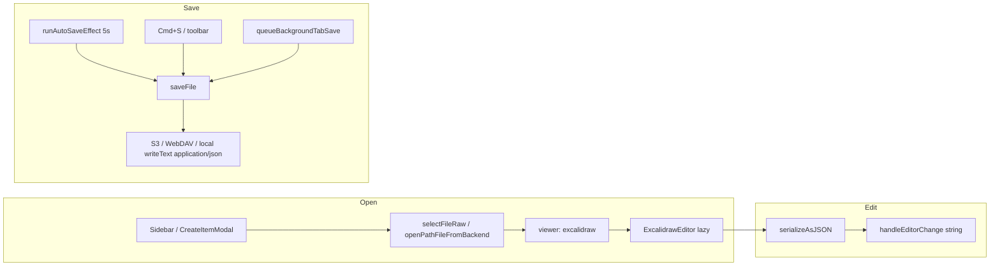

# Excalidraw 파일 지원 추가

## 확장자 결정

Excalidraw 공식 문서 기준 로컬 저장 형식은 **`.excalidraw`** (plaintext JSON, `type: "excalidraw"`, `version`, `elements`, `appState`, `files`). 별도 “더 공식적인” 확장자는 없으며, 라이브러리 전용 `.excalidrawlib`는 이번 범위에서 제외합니다.

## 아키텍처



저장 파이프라인은 기존과 동일하게 **문자열(JSON)** 만 다룹니다. Excalidraw UI는 `@excalidraw/excalidraw`의 `serializeAsJSON` / `restore`로 vault 문자열과 동기화합니다.

## 1. 의존성 및 번들

- [`package.json`](package.json)에 `@excalidraw/excalidraw` 추가 (React 19 호환 최신 버전)
- [`vite.config.ts`](vite.config.ts) `manualChunks`에 `vendor-excalidraw` 그룹 추가 ([`vite-chunk-splitting` 규칙](.cursor/rules/vite-chunk-splitting.mdc))
- [`src/components/shell/EditorPane.jsx`](src/components/shell/EditorPane.jsx)에서 `React.lazy(() => import('@/components/ExcalidrawEditor'))` — cold load에 Excalidraw 포함 금지

## 2. 문서 유틸 (신규)

[`src/utils/excalidrawDocument.ts`](src/utils/excalidrawDocument.ts) (신규 `.ts`):

| 함수 | 역할 |
|------|------|
| `createEmptyExcalidrawDocument()` | 새 파일용 최소 유효 JSON (`type`, `version`, `elements: []`, `appState`, `files: {}`) |
| `parseExcalidrawDocument(raw: string)` | vault 문자열 → `{ elements, appState, files }` (손상 시 빈 scene fallback) |
| `serializeExcalidrawDocument(...)` | `@excalidraw/excalidraw`의 `serializeAsJSON(..., "local")` 래퍼 |

단위 테스트: [`tests/utils/excalidrawDocument.test.ts`](tests/utils/excalidrawDocument.test.ts) — empty doc 생성, round-trip, invalid JSON fallback.

## 3. Excalidraw 에디터 컴포넌트 (신규)

[`src/components/editor/ExcalidrawEditor.tsx`](src/components/editor/ExcalidrawEditor.tsx) + shim [`src/components/ExcalidrawEditor.tsx`](src/components/ExcalidrawEditor.tsx):

- `import '@excalidraw/excalidraw/index.css'`
- Props: `value`, `theme`, `readOnly`, `onChange`, `onSave` — [`HtmlSvgPreviewEditor`](src/components/editor/HtmlSvgPreviewEditor.jsx)와 동일 계약
- `key={fileId}`로 파일 전환 시 remount; `initialData`는 파일 open 시점의 `value`만 사용 (편집 중 re-parse 방지)
- `onChange(elements, appState, files)` → **500ms debounce** → `serializeExcalidrawDocument` → `onChange(jsonString)`
- `theme` prop: 앱 light/dark → Excalidraw `theme`
- 레이아웃: `flex-1 min-h-0 h-full` 컨테이너 (Excalidraw는 명시적 높이 필요)
- Undo/redo: Excalidraw 내장 — 별도 CM 스택 불필요 ([`editor-undo-redo` 규칙](.cursor/rules/editor-undo-redo.mdc) 충족)

## 4. Viewer 라우팅 (`.excalidraw` → `viewer: 'excalidraw'`)

다음 파일들에 **동일한** `ext === 'excalidraw'` 분기 추가 (현재 4곳 이상 중복):

| 파일 | 변경 |
|------|------|
| [`src/utils/storage/openPathFileFromBackend.js`](src/utils/storage/openPathFileFromBackend.js) | WebDAV/Tauri local open |
| [`src/App/hooks/useFileSessionDomain.ts`](src/App/hooks/useFileSessionDomain.ts) | S3 + FileSystemAccess handle open (약 497, 671행 json 분기 인근) |
| [`src/utils/vault/sessionWorkspace.ts`](src/utils/vault/sessionWorkspace.ts) | `SessionViewer` union + `sessionViewerForName` + `mimeForSessionFileName` |

**선택적 리팩터 (같은 PR 내 소규모):** [`src/utils/fileViewerRouting.ts`](src/utils/fileViewerRouting.ts) 신규 — `viewerForExtension`, `contentTypeForViewer`, `isEditableViewer`를 한곳에 모아 위 파일들이 import하도록 정리. `.excalidraw` 추가 시 유지보수 부담을 줄이는 목적.

## 5. EditorPane 연동

[`src/components/shell/EditorPane.jsx`](src/components/shell/EditorPane.jsx):

- `lazy` import + `viewer === 'excalidraw'` 분기 (json/html/svg와 동일 Suspense 패턴)
- `isEditableViewer`에 `'excalidraw'` 포함 → dirty 표시, 저장 버튼, Cmd+S

## 6. 저장 / Content-Type / editable 목록

[`src/utils/workspaceTabs/types.ts`](src/utils/workspaceTabs/types.ts): `EDITABLE_VIEWERS`에 `'excalidraw'` 추가.

다음 위치의 `contentTypeForViewer` / `editableViewers` 배열에 `excalidraw → application/json` 반영:

- [`src/App/hooks/useFileSessionDomain.ts`](src/App/hooks/useFileSessionDomain.ts) — `saveFile` 및 관련 refresh 경로
- [`src/App/hooks/useDownloadSessionDomain.ts`](src/App/hooks/useDownloadSessionDomain.ts)
- [`src/utils/print/printMarkdownSave.ts`](src/utils/print/printMarkdownSave.ts)

## 7. 자동 저장 (사용자 선택: 5초 디바운스)

[`src/App/providers/createAutoSaveSyncHandlers.ts`](src/App/providers/createAutoSaveSyncHandlers.ts) `runAutoSaveEffect`:

- 조건 `currentFile.viewer !== 'markdown'` → **`markdown` 또는 `excalidraw`** 일 때 자동 저장
- `.enc.md` 스킵 등 기존 가드 유지
- ExcalidrawEditor의 debounced `onChange`가 `editorContentRef`를 갱신하므로, 5초 후 `saveFile`이 최신 scene JSON을 vault에 씀

탭 전환/포커스 저장은 `EDITABLE_VIEWERS` 등록으로 기존 `queueBackgroundTabSave` 경로 자동 활용.

## 8. 새 파일 생성

[`src/utils/createFileFormats.ts`](src/utils/createFileFormats.ts):

```ts
{
  id: 'excalidraw',
  extension: '.excalidraw',
  label: '.excalidraw',
  description: 'Excalidraw 다이어그램',
}
```

[`src/App/hooks/useTreeOpsDomain.ts`](src/App/hooks/useTreeOpsDomain.ts) `createItem`:

- `finalName`이 `.excalidraw`이면:
  - `initialBody = createEmptyExcalidrawDocument()`
  - `writeText` Content-Type: `application/json` (현재 `'text/markdown'` 하드코딩 분기)
  - `openCreatedFile({ ..., viewer: 'excalidraw' })`
- S3 `putObject`도 동일 initial body

CreateItemModal은 `CREATE_FILE_FORMATS` 등록만으로 배지 자동 노출 ([`create-file-formats` 규칙](.cursor/rules/create-file-formats.mdc)).

## 9. UI (아이콘)

[`src/components/shell/TreeNode.tsx`](src/components/shell/TreeNode.tsx), [`src/components/shell/workspace/WorkspaceTabBar.tsx`](src/components/shell/workspace/WorkspaceTabBar.tsx):

- `.excalidraw` → `lucide-react` `PenTool` 또는 `PencilRuler` + violet/amber 계열 색상 (기존 html/json 패턴 따름)

## 10. 범위 밖 / 후속

- `.excalidrawlib` 라이브러리 파일 편집
- Markdown 임베드 (`![[drawing.excalidraw]]` 등) — custom-markdown 문서 필요 시 별도 작업
- Advanced Search 등록 — 에디터 툴바/설정 토글이 아니므로 [AS 규칙](.cursor/rules/advanced-search-features.mdc) 범위 밖
- COOP/COEP 환경에서 Excalidraw 로드 smoke-check — 문제 시 `EXCALIDRAW_ASSET_PATH` 등 vite alias 조정

## 검증 체크리스트

1. CreateItemModal에서 `.excalidraw` 배지로 새 파일 생성 → vault에 유효 JSON
2. 기존 `.excalidraw` 파일 열기 → 캔vas에 요소 표시
3. 그리기 후 Cmd+S / 5초 idle → vault 재열기 시 내용 유지
4. 탭 전환 시 dirty flush
5. S3 / WebDAV / local(Tauri·FSA) 각각 smoke
6. `bun run check` 통과
