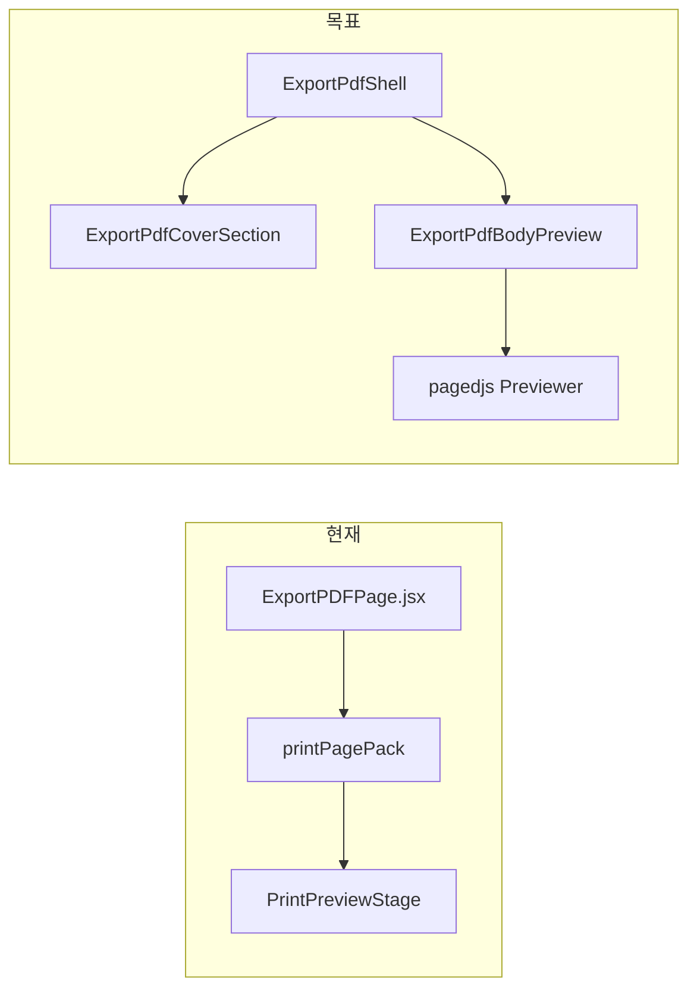
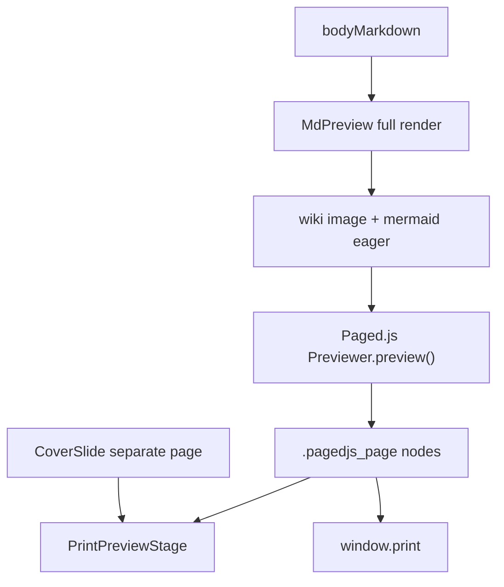

# Export PDF 리팩토링 → TSX → pagedjs 도입

## 현재 상태

[`src/pages/ExportPDFPage.jsx`](src/pages/ExportPDFPage.jsx) (~2306줄)에 아래가 한 파일에 혼재합니다.

| 영역 | 대략 줄수 | 핵심 책임 |
|------|----------|-----------|
| `printFontStyles` + 상수 | ~320 | 인쇄 전용 CSS 문자열 |
| 상태·훅·핸들러 | ~1280 | 문서/표지/TOC/이미지/AS 등록 |
| JSX | ~560 | 툴바, 표지, 본문 패킹, Stage, TOC, 모달 |

본문 페이지네이션은 [`usePrintPackedPages`](src/hooks/usePrintPackedPages.ts) → [`printPagePack.ts`](src/utils/print/printPagePack.ts)가 staging `MdPreview` DOM을 줄 단위로 clone해 `.export-pdf-page` 스택을 만드는 **커스텀 패커**입니다. pagedjs는 아직 미도입(`package.json`에 없음).



---

## Phase 1 — 기능 단위 분리 (동작 변경 없음)

새 디렉터리 [`src/pages/exportPdf/`](src/pages/exportPdf/)를 만들고, **한 PR에서 한 덩어리씩** 추출합니다. 각 단계 후 수동 스모크(아래 체크리스트)로 회귀를 막습니다.

### 1-A. 스타일·타입 추출

- [`exportPdfPrintStyles.ts`](src/pages/exportPdf/exportPdfPrintStyles.ts) — `printFontStyles`, `EDITOR_ID`, TOC 상수
- [`exportPdfTypes.ts`](src/pages/exportPdf/exportPdfTypes.ts) — `ExportPDFPageProps`, wiki image modal state, TOC item, shared ref 타입

### 1-B. 도메인 훅 추출 (UI 없음)

| 훅 | 책임 | 기존 코드 위치 |
|----|------|----------------|
| [`useExportPdfDocument.ts`](src/pages/exportPdf/hooks/useExportPdfDocument.ts) | `previewValue`/`savedValue`/`currentFile`, dirty, save, handoff, `handleBack` | L470–478, L1004–1089 |
| [`useExportPdfPrintLayout.ts`](src/pages/exportPdf/hooks/useExportPdfPrintLayout.ts) | `printLayout`, `fonts`, `previewView`, `updatePrintLayout` | L481–641, L1546–1559 |
| [`useExportPdfCover.ts`](src/pages/exportPdf/hooks/useExportPdfCover.ts) | cover parse/edit, undo, snap prefs, `toggleCoverEditMode` | L623–790, L699–743 |
| [`useExportPdfToc.ts`](src/pages/exportPdf/hooks/useExportPdfToc.ts) | TOC 수집, active heading, `navigatePreviewToHeading`, pgbr modal | L867–1103, L1512–1530 |
| [`useExportPdfImageInteractions.ts`](src/pages/exportPdf/hooks/useExportPdfImageInteractions.ts) | contextmenu, wiki modal, free transform | L1105–1510 |
| [`useExportPdfPrintActions.ts`](src/pages/exportPdf/hooks/useExportPdfPrintActions.ts) | `registerPrintActions` / TOC provider | L1561–1698 |

훅은 **ref를 인자로 받거나 반환**해 컴포넌트 간 DOM 계약(`pagesHostRef`, `paperContentRef`, `coverPageRef`)을 유지합니다.

### 1-C. UI 컴포넌트 3분할

#### [`ExportPdfShell.tsx`](src/pages/exportPdf/ExportPdfShell.tsx) — 셸

- 로딩/세션 없음 empty state (L1722–1746)
- 루트 `export-pdf-page` + `fontStyleVars` + webfont `<style>`
- **툴바** (뒤로/저장/보내기/폰트/표지/용지·뷰·줌·이미지 max/목차) — L1758–1883
- **레이아웃 프레임**: scroll container, TOC aside, `PrintVisiblePageBadge`
- **모달/오버레이**: `PrintFontOptionsModal`, `WikiImageSizeModal`, `HaimTableBoxResizeLayer`, free-transform UI, `ConfirmModal`(pgbr/leave)
- `PreviewFootnoteTooltips`, `PrintPgbrContextMenu`
- children 슬롯으로 메인 프리뷰 영역 수용

#### [`ExportPdfCoverSection.tsx`](src/pages/exportPdf/ExportPdfCoverSection.tsx) — noteCover

- `coverEditMode` 분기: `CoverEditor` + print용 `CoverSlide` / view-only `CoverSlide`
- `PrintCoverPageChrome`, `coverPageRef`
- `coverEditMode`일 때 `CoverSidebar` (L2056–2090)
- 표지 전용 pan: `useScrollPointerPan(..., { middleClick: coverEditMode })`는 shell 또는 page에서 coverEditMode만 전달

#### [`ExportPdfBodyPreview.tsx`](src/pages/exportPdf/ExportPdfBodyPreview.tsx) — 페이지 보여주기

- `PrintPreviewStage` (scroll+1이 아닐 때) — L1900–1930
- `export-pdf-cover-stack` + `pagesHostRef` + **staging** `MdPreview` — L1932–2045
- fit 훅 일괄 유지:
  - `usePrintPageInnerHeightPx`, `usePrintImageAspectFit`, `usePrintTableFit`
  - `useLazyMermaidRender({ eager: true })`, `usePrintMermaidFit`
  - `usePrintPackedPages`
- `useWikiImageHydration(previewContainerRef, ...)`
- `isLiveScroll1`에 따른 `export-pdf-source-measure` / zoom 분기 유지

### 1-D. 얇은 오케스트레이터

[`ExportPDFPage.tsx`](src/pages/exportPdf/ExportPDFPage.tsx) (~150–200줄):

```tsx
export default function ExportPDFPage(props: ExportPDFPageProps) {
  const doc = useExportPdfDocument(props);
  const layout = useExportPdfPrintLayout();
  const cover = useExportPdfCover({ ...doc, printLayout: layout.printLayout });
  const refs = useExportPdfPreviewRefs(); // pagesHost, paperContent, coverPage, previewContainer
  const toc = useExportPdfToc({ refs, ... });
  const images = useExportPdfImageInteractions({ refs, ...doc });
  useExportPdfPrintActions({ doc, layout, cover, toc, ... });

  return (
    <ExportPdfShell {...shellProps}>
      <ExportPdfCoverSection {...coverProps} />
      <ExportPdfBodyPreview {...bodyProps} />
    </ExportPdfShell>
  );
}
```

- [`src/pages/ExportPDFPage.jsx`](src/pages/ExportPDFPage.jsx) 삭제
- [`ExportPdfGate.tsx`](src/App/components/ExportPdfGate.tsx) lazy import → `@/pages/exportPdf/ExportPDFPage`
- [`routeEntries.ts`](src/pages/routeEntries.ts) 주석 경로만 갱신

### Phase 1 회귀 체크리스트 (각 단계 후)

- 표지 추가/편집/undo·redo, 용지 크기 연동
- scroll / flip / 1·2페이지 Stage, 줌
- TOC 활성 heading, 클릭 이동, 우클릭 pgbr 삽입
- 이미지 우클릭 크기/자르기/wiki·imgbb 변환, free transform
- 저장(Ctrl+S), dirty leave guard, 뒤로가기 handoff
- `window.print()` 페이지 경계 = Stage 경계
- Advanced Search print 명령 (`printActions.ts`)

---

## Phase 2 — TSX 변환

Phase 1과 **동일 PR 시리즈**에서 처리합니다 (규칙: feature/refactor 시 구현 파일 `.tsx`).

- 새 파일은 처음부터 `.ts`/`.tsx`
- `ExportPDFPageProps`에 `documentFile`, `documentValue`, `openCoverEdit`, `isDocumentLoading`, `hasNavigationSession` 명시
- ref 타입: `RefObject<HTMLElement | null>`
- `exactOptionalPropertyTypes` 준수 — optional prop은 `prop?: T` + spread 시 `...(x != null && { x })`
- JS 의존 util(`printSettingsStore.js` 등)은 경계에서만 타입 단언/가드
- `bun run typecheck` + 기존 [`tests/pages/routeEntries.test.ts`](tests/pages/routeEntries.test.ts) 통과

**의도적으로 건드리지 않을 것**: `printPagePack.ts`, `PrintPreviewStage.tsx`, `index.css` export-pdf 규칙 — pagedjs 전까지 동작 동일 유지.

---

## Phase 3 — pagedjs 도입 (Phase 1·2 완료 후)

### 목표 아키텍처



**제거/대체 대상**

- [`printPagePack.ts`](src/utils/print/printPagePack.ts) + [`usePrintPackedPages.ts`](src/hooks/usePrintPackedPages.ts)
- staging hidden + `pagesHost` DOM clone 패턴
- 줄 단위 `print-pack-line` 물질화

**유지**

- `window.print()` (html2canvas/jspdf 추가 없음)
- 표지는 pagedjs 밖 **별도 첫 페이지** (현 [`print_chrome_templates`](.cursor/plans/print_chrome_templates_c27c3fe5.plan.md) 계획과 동일)
- fit 훅은 **pagedjs 실행 전** source DOM에 적용; 이후 CSS fragmentation에 맡김
- `PrintPreviewStage` UX (flip/2-up/zoom) — 소스를 `.pagedjs_page` clone으로 교체

### 구현 단계

1. **의존성**: `pagedjs` 추가 (`manualChunks`에 vendor 분리 — [`vite-chunk-splitting`](.cursor/rules/vite-chunk-splitting.mdc))
2. **[`usePagedJsPreview.ts`](src/pages/exportPdf/hooks/usePagedJsPreview.ts)** (신규)
   - 입력: `sourceRef`, `outputRef`, `pageSizeId`, `layoutKey` (markdown + fonts + images)
   - wiki/mermaid/image `load` 완료 후 `new Previewer().preview(source, [printCssUrls], output)`
   - 반환: `pageCount`, `isRendering`, `rerender()`
   - debounce + generation token으로 연속 타이핑 시 중복 preview 방지
3. **[`exportPdfPagedStyles.ts`](src/pages/exportPdf/exportPdfPagedStyles.ts)**
   - `@page { size; margin }` — [`buildPrintPageAtRule`](src/utils/print/printPageLayout.ts) 재사용
   - `.md-pgbr { break-before: page }` (packer 대체)
   - code/mermaid/table: `break-inside: avoid` (짧은 블록), 긴 pre는 허용
   - 기존 `exportPdfPrintStyles.ts` 중 pagedjs와 중복되는 fragmentation 규칙 정리
4. **`ExportPdfBodyPreview.tsx` 개편**
   - staging hidden 제거 → **단일 visible source** (또는 source hidden + output visible)
   - `pagesHostRef` → pagedjs output container
   - `PrintPreviewStage`의 `pagesHostRef` 계약을 paged page selector로 업데이트
5. **`PrintPreviewStage.tsx` / `PrintVisiblePageBadge.tsx`**
   - `PRINT_BODY_PAGE_ATTR` / pack clone → `.pagedjs_page` 기반 인덱싱
   - `logicalPageIndexForHeading` — paged fragment 내 heading 위치 탐색으로 수정
6. **인쇄 CSS** ([`src/index.css`](src/index.css), embedded styles)
   - `@media print`: paged output만 visible; React shell `print:hidden` 유지
7. **문서**: [`docs/custom-markdown/page-break.md`](docs/custom-markdown/page-break.md) — host가 pagedjs fragmentation 사용한다고 갱신
8. **테스트**: `usePagedJsPreview` 단위(mock Previewer), pgbr/mermaid 타이밍 수동 시나리오

### pagedjs 리스크와 완화

| 리스크 | 완화 |
|--------|------|
| Mermaid/SVG 비동기 | `useLazyMermaidRender` 완료 + `img.complete` await 후 preview |
| 긴 코드블록 분할 품질 | pagedjs CSS `break-inside`; 필요 시 pre 전용 handler |
| 표 분할 | `break-inside: avoid` + overflow 시 scale(`usePrintTableFit` 선행) |
| TOC heading id | source에 id 유지; paged clone 시 id strip 정책 Stage와 동기화 |
| free transform | source img 기준 유지; output은 preview 전용 |
| print-chrome / multi-cover 예정 기능 | Phase 1 분리 덕분에 `ExportPdfBodyPreview` / cover 레이어만 확장 |

### Phase 3에서 건드릴 연관 파일

- [`src/components/print/PrintPreviewStage.tsx`](src/components/print/PrintPreviewStage.tsx)
- [`src/components/print/PrintVisiblePageBadge.tsx`](src/components/print/PrintVisiblePageBadge.tsx)
- [`src/utils/print/printPagePack.ts`](src/utils/print/printPagePack.ts) (삭제 또는 deprecated shim)
- [`src/hooks/usePrintPackedPages.ts`](src/hooks/usePrintPackedPages.ts)
- [`src/index.css`](src/index.css) (`.export-pdf-*` 규칙)
- fit 훅 3종 — selector/target을 pagedjs source root로 조정

---

## 권장 PR 순서

1. **PR1** — 스타일·타입·훅 추출 (ExportPDFPage.jsx는 아직 단일 파일, import만 정리)
2. **PR2** — `ExportPdfShell` / `CoverSection` / `BodyPreview` 분리 + `ExportPDFPage.tsx` + jsx 삭제
3. **PR3** — pagedjs hook + BodyPreview 교체 + Stage/Badge/CSS/문서

PR1–2는 **동작 동일**이 목표이므로 diff는 이동 위주. PR3부터 시각적 페이지 경계가 바뀔 수 있어 별도 검증.

---

## 완료 기준

- `ExportPDFPage.jsx` 없음, `bun run check` 통과
- 3컴포넌트 + 훅 구조로 Phase 1 회귀 체크리스트 전항 통과
- pagedjs 적용 후 Mermaid·코드블록·표·이미지·pgbr가 **실제 인쇄 페이지 단위**로 미리보기·`window.print()` 일치
