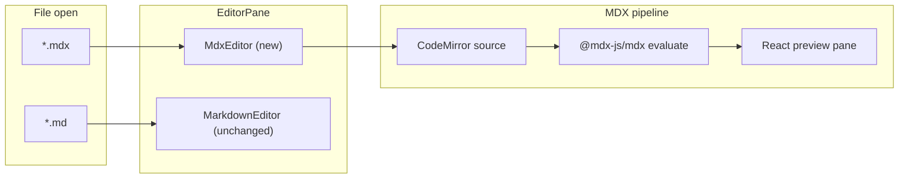

# MDX 지원 추가 계획

## 현재 상태

- UI만 부분 인식: [`TreeNode.tsx`](src/components/shell/TreeNode.tsx), [`WorkspaceTabBar.tsx`](src/components/shell/workspace/WorkspaceTabBar.tsx)에서 `mdx` 아이콘/색상 처리
- 실제 열기/저장/검색은 **미지원**: [`useFileSessionDomain.ts`](src/App/hooks/useFileSessionDomain.ts)는 `ext === 'md' | 'markdown'`만 `viewer: 'markdown'`으로 라우팅 → `.mdx`는 `unsupported`로 떨어짐
- [`createFileFormats.ts`](src/utils/createFileFormats.ts)에 `.mdx` 생성 포맷 없음
- [`md-editor-rt`](src/config/mdEditorConfig.js)는 markdown-it 미리보기만 지원; [공식 이슈](https://github.com/imzbf/md-editor-rt/issues/75)에서도 **우측 렌더러를 MDX로 교체 불가**
- `@mdx-js/mdx` 의존성 없음 (lockfile에는 transitive `mdast-util-mdx-*`만 존재)

## 목표 아키텍처



| 환경 | MDX JSX/expression | `import` | 커스텀 컴포넌트 |
|------|------------------|----------|----------------|
| Web / PWA | O | X (컴파일 에러 + 안내) | 내장 레지스트리만 |
| Tauri 데스크톱 (`isTauriDesktopPlatform()`) | O | O (vault 상대 경로만) | 내장 + import 모듈 |

Tauri Android/iOS는 데스크톱과 동일하게 `isDesktopApp()`이지만, import 번들링·FS 복잡도를 고려해 **1차는 데스크톱 Tauri만** import 허용 (`isTauriDesktopPlatform()`). 모바일 Tauri는 웹과 동일(내장 컴포넌트만).

## 핵심 구현

### 1. 파일 포맷·라우팅 (`.md` 무변경)

- [`createFileFormats.ts`](src/utils/createFileFormats.ts): `{ id: 'mdx', extension: '.mdx', ... }` 추가
- 새 헬퍼 [`src/utils/mdxFile.ts`](src/utils/mdxFile.ts): `isMdxFileName()`, `isMdxFilePath()` — `.md`용 [`isMarkdownFileName`](src/utils/markdownImageExport.ts)과 **분리** (기존 MD 파이프라인 오염 방지)
- [`sessionWorkspace.ts`](src/utils/vault/sessionWorkspace.ts): `SessionViewer`에 `'mdx'` 추가; `sessionViewerForName` / `mimeForSessionFileName` (`text/mdx`)
- [`useFileSessionDomain.ts`](src/App/hooks/useFileSessionDomain.ts): S3/WebDAV/local 열기·저장·refresh·rename 경로에 `ext === 'mdx'` → `viewer: 'mdx'`, MIME `text/mdx`; `editableViewers`에 `'mdx'` 포함
- [`EditorPane.jsx`](src/components/shell/EditorPane.jsx): `viewer === 'mdx'` 분기 → lazy `MdxEditor`; `isEditableViewer`에 `'mdx'` 추가; MD 전용 툴바(녹음, Novel, wiki 이미지 변환 등)는 **mdx에서 비활성**

### 2. `MdxEditor` (신규, lazy)

경로: [`src/components/editor/MdxEditor.tsx`](src/components/editor/MdxEditor.tsx)

- 레이아웃: 좌측 CodeMirror 소스 + 우측 React 미리보기 (md-editor-rt와 유사한 분할; 기존 [`TocResizeHandle`](src/components/TocResizeHandle.tsx) 패턴 재사용 가능)
- CM 언어: `@codemirror/lang-markdown` + JSX 하이라이트 (`@codemirror/lang-javascript` 또는 MDX 전용 extension)
- 변경 시 debounce(300–500ms) 후 컴파일
- 컴파일 실패 시 미리보기에 에러 패널 표시 (줄/메시지)
- `onChange` / undo: CodeMirror `history()` + capture-phase Mod+Z (editor-undo-redo 규칙)
- **번들**: `import()`로 `@mdx-js/mdx`, `@mdx-js/react`만 MDX 탭 열릴 때 로드; [`vite.config.ts`](vite.config.ts) `manualChunks`에 `vendor-mdx` 추가

### 3. MDX 컴파일·렌더

경로: [`src/utils/mdx/compileMdx.ts`](src/utils/mdx/compileMdx.ts), [`src/utils/mdx/MdxPreview.tsx`](src/utils/mdx/MdxPreview.tsx)

```ts
// 개략
import { evaluate } from '@mdx-js/mdx'
import * as runtime from 'react/jsx-runtime'
import remarkGfm from 'remark-gfm'

await evaluate(source, {
  ...runtime,
  remarkPlugins: [remarkGfm],
  development: import.meta.env.DEV,
  // Tauri: custom import resolver (below)
})
```

- [`src/utils/mdx/builtinComponents.tsx`](src/utils/mdx/builtinComponents.tsx): `Alert`, `Callout`, `CodeBlock` 등 문서화된 내장 컴포넌트 + `MDXProvider` (`@mdx-js/react`)
- Web: `import`/`export` 구문 감지 시 컴파일 전에 거부하거나 remark 플러그인으로 에러 메시지: *"import는 Tauri 데스크톱 앱에서만 지원됩니다"*

### 4. Tauri 전용 vault import (Phase 핵심)

경로: [`src/utils/mdx/mdxVaultImports.ts`](src/utils/mdx/mdxVaultImports.ts)

- 게이트: `isTauriDesktopPlatform()` && `VITE_ELECTRON === 'true'` (빌드 타임 tree-shake로 웹 번들에서 esbuild-wasm 제외)
- `import Foo from './components/Foo.tsx'` → 현재 MDX 파일 기준 vault 상대 경로 resolve
- 기존 storage 백엔드(S3/WebDAV/local) [`getObjectBody`](src/App/hooks/useFileSessionDomain.ts) 패턴 재사용해 텍스트 로드
- **`esbuild-wasm`** (dynamic import)으로 `.tsx/.jsx/.ts/.js` → ESM 변환; 결과를 in-memory module map에 캐시 (path + lastModified)
- **보안 제한**: npm 패키지 import 금지; vault 밖 경로·`..` 탈출 차단; 허용 확장자 화이트리스트
- MDX 간 상호 import는 2차로 검토 (1차는 단일 depth 또는 재귀 depth 제한)

### 5. 검색·생성·기타 연동

| 영역 | 변경 |
|------|------|
| Advanced Search | [`collectSources.ts`](src/utils/advancedSearch/collectSources.ts) `MARKDOWN_EXTENSIONS`에 `mdx` 추가 (또는 별도 set 후 index에 포함) |
| CreateItemModal | [`createFileFormats`](src/utils/createFileFormats.ts) 배지 자동 반영 |
| Session import | [`sessionWorkspace.ts`](src/utils/vault/sessionWorkspace.ts) viewer 매핑 |
| Desktop print | [`desktopMenuBridge.ts`](src/utils/shared/desktopMenuBridge.ts): MDX는 1차 **인쇄 비활성** (React 미리보기 → HTML 스냅샷 필요; 후속 작업) |
| unused images | [`unusedImageCleanup.ts`](src/utils/unusedImageCleanup.ts): MDX에서 `![[...]]` 스캔 여부 결정 (wiki 문법 미지원 시 생략) |
| LLM Assist / Novel / 녹음 동기화 | 1차 **미연동** (`.md` 전용 유지) |

### 6. 문서

- [`docs/custom-markdown/mdx.md`](docs/custom-markdown/mdx.md): 지원 문법, 내장 컴포넌트 목록, Tauri import 규칙, 비목표(`.md` custom 플러그인 미이식)
- [`docs/custom-markdown/index.md`](docs/custom-markdown/index.md) + VitePress sidebar 갱신

### 7. 테스트

- [`tests/utils/mdxFile.test.ts`](tests/utils/mdxFile.test.ts): `isMdxFileName`, viewer 라우팅 헬퍼
- [`tests/utils/mdxCompile.test.ts`](tests/utils/mdxCompile.test.ts): 기본 JSX, expression, web에서 import 거부
- Tauri import 통합 테스트는 E2E/수동 (esbuild-wasm + storage mock 부담)

## 신규 의존성

```json
"@mdx-js/mdx": "^3.x",
"@mdx-js/react": "^3.x",
"remark-gfm": "^4.x"
```

Tauri 전용 (optional peer / dynamic): `esbuild-wasm`

## 주요 제약·비목표 (1차)

- **기존 `.md` custom markdown 플러그인** (`![[wiki]]`, `<!-- note-cover -->`, haim-table, footnotes 등)은 MDX 미리보기에 **자동 이식되지 않음** — MDX는 remark/rehype 생태계로 별도 포팅 필요
- `.enc.mdx` 암호화 포맷 없음
- Export PDF / 인쇄는 후속 (MDX → static HTML 스냅샷 파이프라인 필요)
- `import 'react'` 같은 외부 패키지는 지원하지 않음 (vault 파일만)

## 구현 순서

1. 포맷·viewer 라우팅 + `MdxEditor` 뼈대 (소스 편집 + 정적 MDX 미리보기, 내장 컴포넌트)
2. Web/Tauri 공통 컴파일 안정화 + 에러 UX + lazy chunk
3. Tauri vault import (`esbuild-wasm` + storage read)
4. 검색/생성 연동 + 문서 + 테스트

## 리스크

| 리스크 | 완화 |
|--------|------|
| `@mdx-js/mdx` 번들 크기 | lazy `MdxEditor` + `vendor-mdx` chunk |
| 브라우저에서 `evaluate()` 보안 | import 비활성; vault-only; no `eval` of arbitrary npm |
| MDX와 앱 custom md 문법 이중 유지 | 문서에 경계 명시; 필요 시 remark 플러그인 점진 포팅 |
