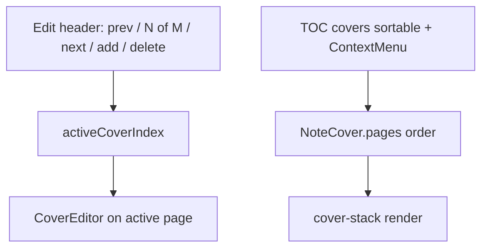
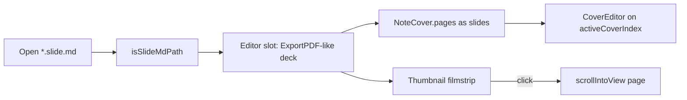

# Multi-cover (schema + TOC + edit header) + `*.slide.md`

## Goal

노트당 표지 **여러 장**을 스키마·인쇄·목차·편집 내비까지 지원한다.

- 저장: leading `<!-- note-cover -->` 하나, JSON `pages[]`
- 인쇄/미리보기: `enabled`이면 **모든 page**를 각각 `CoverSlide`로 렌더
- 목차: 표지 항목 + ContextMenu(수정 / 위·아래 추가 / **삭제**) + **dnd-kit 순서 변경**
- 표지 수정 모드 상단 헤더: **이전 / 다음 / 새 표지 추가 / 표지 삭제** (+ `N / M` 표시)

추가로 **`*.slide.md`**: 본문 없는 슬라이드 덱. 메인 **에디터 슬롯**이 MarkdownEditor 대신 **Export PDF와 같은** 페이지 스택 UI가 되고, **모든 페이지를 표지(`CoverPage`)처럼** 그리고 편집한다. 생성은 사이드바/AS **「슬라이드」 전용 메뉴**. 내비는 **텍스트 목차 대신 페이지 단위 미리보기(썸네일) + 클릭 스크롤**.

## Schema (v3)

```ts
type CoverPage = {
  id: string;
  layout: CoverLayout;
  bg: CoverBackground;
  rootLayerIds: string[];
  groups: CoverGroup[];
  elements: CoverElement[];
};

type NoteCover = {
  v: 3;
  enabled: boolean;
  pages: CoverPage[];     // length >= 1 after normalize
};
```

- `NOTE_COVER_VERSION = 3`
- Factories: `createDefaultCoverPage()`, `createDefaultNoteCover()`
- Helpers: `getCoverPage`, `updateCoverPage`, `insertCoverPage(doc, index, page?)`, `reorderCoverPages(doc, activeId, overId)`, `removeCoverPage(doc, index)` → `{ cover: NoteCover | null; nextIndex: number }`  
  - `pages.length > 1`: 해당 page 제거, `nextIndex = min(index, length-2)`  
  - **마지막 1장 삭제**: `cover: null` (주석 전체 제거) + edit 모드 종료  
  - **slide 모드**: 마지막 1장 삭제 시에도 최소 1장 유지(또는 confirm 후 빈 덱 정책 — 구현 시 결정; 기본안은 **항상 ≥1 page**, `enabled` 고정 true)

### Normalize / migrate

[`parse.ts`](src/utils/noteCover/parse.ts): v3 `pages[]` normalize; v1/v2 flat → wrap; always emit `v: 3`.

## Type split

- Canvas → **`CoverPage`** (layers/align/layout/layerTree/objectSnap, CoverSlide/Editor/Sidebar props/LayerPanel)
- Document → **`NoteCover`** (`enabled`, upsert, undo)
- 「표지 사용」Switch: document `enabled` (**일반 노트만**; slide에서는 Switch 숨김 / 항상 on)

## Export: print + `activeCoverIndex`

[`ExportPDFPage.jsx`](src/pages/ExportPDFPage.jsx):

| Mode | Behavior |
|------|----------|
| Preview/print | `pages.map` → `CoverSlide` (기존 page-break CSS) |
| Edit | `activeCoverIndex`만 `CoverEditor`, 나머지 `CoverSlide` |
| Mutate (insert/reorder/delete) | upsert 후 index clamp; 새 장 → 그 index로 edit; 삭제 후 `nextIndex`; 마지막 장 삭제 → `upsert(null)` + `coverEditMode=false` |

Cover DOM: `id={pdf-ex-cover-${page.id}}` for TOC scroll.

Undo: whole `NoteCover` document ([`useCoverUndoHistory`](src/hooks/useCoverUndoHistory.ts)).

## Cover-edit header (toolbar)

`coverEditMode && parsedCover`일 때 Export 상단(기존 「표지 편집」 버튼 근처 / 두 번째 toolbar row)에 컨트롤 노출:

| Control | Behavior |
|---------|----------|
| 이전 표지 | `activeCoverIndex > 0`이면 −1; scrollIntoView |
| 표시 | `표지 {i+1} / {pages.length}` (slide: `슬라이드 {i+1} / {n}`) |
| 다음 표지 | `activeCoverIndex < length-1`이면 +1; scroll |
| 새 표지 추가 | `insertCoverPage` at `activeCoverIndex + 1`; edit new; scroll |
| 표지 삭제 | ConfirmModal 후 `removeCoverPage`; 마지막 장이면 표지 전체 제거 + edit off (slide: 아래 slide 규칙) |

- 1장일 때 이전/다음은 disabled; 삭제는 항상 가능(확인 문구만 다르게: 「이 표지를 삭제합니다」 vs 「마지막 표지입니다. 표지 전체를 제거합니다」)
- 아이콘: `ChevronLeft` / `ChevronRight` / `Plus` / `Trash2` (Export 툴바 톤)
- 편집 모드가 아니면 이 내비는 숨김 (**slide**: 항상 편집 내비 노출 — 본문 모드 없음)

## TOC: cover entries

```ts
type TocItem =
  | { kind: 'cover'; id: string; coverIndex: number; pageId: string; text: string; level: 1 }
  | { kind: 'heading'; id: string; level: number; text: string; headingIndex: number };
```

- Cover 항목을 heading **앞**에 prepend (`enabled || coverEditMode`)
- 라벨: 항상 `표지 1` … `표지 N` (1장이어도 `표지 1`로 통일해 DnD/헤더와 맞춤)
- 클릭 → cover DOM scroll; active highlight에 cover 포함
- Heading pgbr: **`item.headingIndex`만** 사용 (map index 금지)
- **slide**: 이 텍스트 TOC를 쓰지 않음 → [Slide page navigator](#slide-page-navigator-filmstrip) (썸네일 필름스트립)

## TOC ContextMenu (cover)

Radix `ContextMenu`. Heading은 기존 pgbr ConfirmModal.

| 메뉴 | 동작 |
|------|------|
| 표지 수정 | `activeCoverIndex` + `coverEditMode=true` |
| 위쪽에 표지 추가 | `insertCoverPage(doc, coverIndex)` → edit new |
| 아래쪽에 표지 추가 | `insertCoverPage(doc, coverIndex + 1)` → edit new |
| 표지 삭제 | ConfirmModal → `removeCoverPage` (헤더와 동일 규칙) |

## TOC dnd-kit (cover reorder)

패턴: [`CoverLayerPanel.tsx`](src/components/noteCover/CoverLayerPanel.tsx) (`DndContext` + `SortableContext` + `useSortable`).

- **Cover 행만** sortable (`id = page.id`); heading 리스트는 DnD 밖(아래 고정 섹션) 또는 동일 리스트에서 cover만 `useSortable` / heading은 일반 `li`
- `onDragEnd`: `reorderCoverPages` → upsert; `activeCoverIndex`를 **같은 pageId** 기준으로 재매핑
- PointerSensor + 약간의 activation distance (레이어 패널과 유사) — 클릭 스크롤과 충돌 방지
- 시각: drag overlay 또는 opacity; 인쇄 미리보기 스택 순서는 `pages` 배열과 동기



## Advanced Search

같은 변경에 등록 ([`printActions.ts`](src/utils/advancedSearch/printActions.ts)):

- TOC provider에 cover 포함 → 검색·스크롤
- `print-edit-cover`, `print-add-cover-above`, `print-add-cover-below`, `print-delete-cover`
- `print-cover-prev`, `print-cover-next`, `print-add-cover` (헤더와 동일; edit 모드에서 situational enable)
- 다장이면 nested cover 선택 후 edit/add-above/below/delete
- **slide**: 동일 커맨드 계열(라벨만 슬라이드) 또는 `slide-*` alias — Export 호스트가 등록된 동안만; TOC provider 대신 **페이지 목록**(index + 스크롤) 제공
- AS browse / create: `browse-new-slide` (또는 create type `slide`) → 전용 생성 플로우

## Docs

[`docs/custom-markdown/note-cover.md`](docs/custom-markdown/note-cover.md): Spec `v: 3` / `pages[]` / migrate. Host 구현 노트(TOC·header·DnD·delete). Non-goals에서 **multi-slide 파일 포맷**은 `slide-md`로 이관(캔버스 multi-page는 v3 in-scope).

[`docs/custom-markdown/slide-md.md`](docs/custom-markdown/slide-md.md) (신규): 파일 규칙·저장·호스트·**전용 생성 메뉴**·**필름스트립 내비**·non-goals. Index + VitePress sidebar.

---

## Slide files (`*.slide.md`)

Depends on: schema v3 + Export multi-page print/edit/header (일반 노트 TOC는 그대로; slide는 필름스트립으로 대체).

### Identity

| | |
|--|--|
| Filename | `name.slide.md` (double extension; still `isMarkdownFileName`) |
| Detect | `isSlideMdPath(path)` / `isSlideMdFileName(name)` → `/\.slide\.md$/i` |
| Storage payload | Same leading `<!-- note-cover -->` + NoteCover **v3** `pages[]` (새 HTML comment 토큰 없음 — **확장자가 모드 스위치**) |
| Body | Empty / ignored. Save path: upsert cover comment만; trailing markdown strip |

### Host (editor slot = Export PDF)

일반 `.md`는 MarkdownEditor(+ optional Export 라우트). **`*.slide.md`를 vault에서 열면** 메인 에디터 위치([`EditorPane`](src/components/EditorPane.jsx) / App 본문 슬롯)에 **Export PDF와 동일한** 페이지 스택 UI를 올린다.

| Aspect | Behavior |
|--------|----------|
| Entry | Open file → `viewer === 'slide'` (또는 App이 `ExportPDFPage`/`SlideDeckHost`를 슬롯에 lazy mount). `/export-pdf/...`로 강제 redirect하지 않아도 됨 — **같은 컴포넌트 재사용**이 목표 |
| Default mode | 항상 커버/슬라이드 캔버스 (`coverEditMode` 상시 true). CM 본문 에디터·「표지 사용」Switch·본문 preview 스택 없음 |
| Pages | `pages.map` — **모든 장**이 `CoverSlide` / active만 `CoverEditor` (표지와 동일 그리기·레이어·스냅) |
| Print | 기존 Export 인쇄/PDF 경로 재사용 |
| Side nav | **텍스트 목차 대신** [페이지 썸네일 필름스트립](#slide-page-navigator-filmstrip) |
| Header | prev / `슬라이드 N/M` / next / add / delete |
| Undo | session `useCoverUndoHistory`; leave/unmount 시 clear |



### Create UI (전용 「슬라이드」 메뉴)

일반 「새 파일」과 **별도** 진입점:

| Surface | Change |
|---------|--------|
| [`SidebarContextMenu`](src/components/SidebarContextMenu.jsx) | `새 파일` / `새 폴더` 옆에 **「슬라이드」** (`onCreateSlide`) |
| [`Sidebar`](src/components/Sidebar.jsx) / tree empty-state | 동일 — `onCreateItem(..., 'slide')` |
| Advanced Search browse | `browse-new-slide` (또는 create type `slide`) — [advanced-search rule](.cursor/rules/advanced-search-features.mdc) |
| [`CreateItemModal`](src/components/modals/CreateItemModal.jsx) | `type: 'file' \| 'folder' \| 'slide'`; title 「새 슬라이드」; 기본 이름 `새 슬라이드.slide.md` (또는 입력명 + `.slide.md` 강제) |

Seed / save:

- 초기 내용 = `serializeNoteCover(createDefaultNoteCover())` (`enabled: true`, pages length 1)
- App create: `.md`만 강제 append할 때 **`.slide.md`를 깨지 않음**
- 생성 직후 해당 파일 open → slide host

### Slide page navigator (filmstrip)

Export 우측(또는 좌측) TOC 패널 자리를 **페이지 단위 미리보기 리스트**로 교체. 텍스트 heading/「슬라이드 N」 라벨만인 TOC는 쓰지 않음.

| Behavior | Detail |
|----------|--------|
| Item | 각 `CoverPage`의 **축소 `CoverSlide` 미리보기**(aspect 유지, 카드/테두리로 구분) + 선택적 `N` 배지 |
| Click | 해당 페이지 DOM `scrollIntoView` + `activeCoverIndex` 설정 (헤더 prev/next와 동기) |
| Active | 현재 스크롤/편집 페이지 하이라이트; 메인 스택 스크롤에 맞춰 필름스트립도 따라감(Export TOC auto-follow와 유사) |
| DnD | dnd-kit `SortableContext`로 **썸네일 순서 = `pages` 순서** (일반 노트 cover TOC DnD와 동일 helper) |
| ContextMenu | 위/아래 추가 · 삭제 (일반 cover TOC와 동일; 「수정」은 이미 항상 edit) |
| Toggle | 기존 「목차」 토글 자리 → 「페이지」/필름스트립 show·hide; AS `print-toggle-toc` situational 라벨 |

구현 노트:

- 썸네일은 **라이브 `CoverSlide` scale** 우선(별도 raster 캡처 불필요). 성능 이슈 시 후속으로 정적 썸네일 캐시.
- 패널 너비: 기존 `PRINT_TOC_WIDTH_KEY` 재사용 또는 `s3haim_slide_nav_width`.
- z-index / overflow: 썸네일 안 인터랙션은 pointer-events none(클릭은 카드 버튼만).

### Preview / tree

- 사이드바·검색: 다른 md와 같이 열기; 아이콘/배지(슬라이드)는 create 메뉴와 맞추면 좋음(optional).
- MdPreview note-cover hydrate: slide 파일도 comment만 있으면 동일 hydrate 가능하나, **편집은 전용 호스트**가 우선.

### Non-goals (slide v1)

- Presenter / fullscreen / transitions / speaker notes
- Mid-file markdown “slides” (`---` 분할 등)
- 자동 `.md` ↔ `.slide.md` 변환
- 별도 `<!-- note-slide -->` 스키마 (확장자 + note-cover 재사용)
- 필름스트립 외 별도 텍스트 목차 병행

## Out of scope (전체)

- 페이지별 `enabled` (일반 노트)
- mid-document cover comment
- `pdf_preview_view_modes` 논리 페이지 페어링 (후속에서 `pages.length`)
- slide presenter / transitions (위 slide Non-goals)
