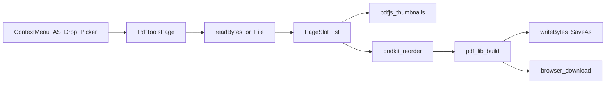

# PDF Tools (reorder / merge / split)

## Decisions (locked)

- **Route**: dedicated lazy page `/pdf-tools` (Export PDF early-return 패턴). Not inside `EditorPane` iframe viewer.
- **Save**: **다른 이름으로 vault 저장** + **브라우저 다운로드**. No overwrite of source PDFs.
- **Split**: (1) 선택 페이지 → **단일 PDF 추출**, (2) **구간(range) 여러 개** → **여러 PDF** 저장/다운로드.
- **Libs**: `pdf-lib` (mutate), `pdfjs-dist` (thumbnails). Dynamic import + `vendor-pdf` / `vendor-pdfjs` in [`vite.config.ts`](vite.config.ts).

## Architecture

**Working model** (in-memory while session open):

- `sources: { id, name, bytes, storageRef? }[]` — vault path or local `File`
- `pages: { id, sourceId, pageIndex }[]` — flat ordered slots (merge = append sources’ pages; reorder/delete mutate this list)
- Thumbnails keyed by `sourceId:pageIndex` (revoke blob URLs on leave)

Build output with `PDFDocument.create()` + `copyPages` in current `pages` order (or per extract/range subset).

## Entry points

1. **Tree ContextMenu** — [`.pdf` only] in [`SidebarContextMenu.jsx`](src/components/SidebarContextMenu.jsx): “PDF 편집” → `navigate('/pdf-tools', { state: { files: [{ storageType, path, name }] } })`. Wire through [`Sidebar.jsx`](src/components/Sidebar.jsx) + [`App.jsx`](src/App.jsx).
2. **Advanced Search** — `pdf-tools` in [`commands.ts`](src/utils/advancedSearch/commands.ts) (KO/EN keywords); Host navigates to `/pdf-tools`.
3. **In-page** — file picker + drag-drop for OS PDFs; “vault에서 추가”로 추가 merge 소스 (기존 스토리지 read 재사용). Multi-file handoff from context menu later can pass several paths in `state.files`.

URL helper in [`appHref.ts`](src/utils/appHref.ts): `isPdfToolsAppPathname` + App early-return layout (sidebar-free, like export-pdf) with `AdvancedSearchHost`.

## Page UI ([`src/pages/PdfToolsPage.tsx`](src/pages/PdfToolsPage.tsx))

- Toolbar: 파일 추가(OS/vault), 선택 삭제, 추출, 구간 분할, 다른 이름 저장, 다운로드, Undo/Redo
- Main: page thumbnail grid, **`@dnd-kit`** reorder (project mandate)
- Selection: multi-select for extract / delete
- **Extract dialog**: selected pages → one output → Save As and/or Download
- **Split-by-ranges dialog**: list of ranges `1-3, 4-7, …` (1-based UI) → N outputs; each can Save As (unique names) or zip/download individually (prefer sequential Save As prompts + optional bulk download as separate files; no zip required for v1 unless trivial with existing `@zip.js/zip.js`)
- **Save As**: filename + parent folder (reuse browse / create-file patterns or a small Radix dialog + path input). Call active backend `writeBytes(path, bytes, 'application/pdf')`, then refresh tree if needed. Never overwrite without a distinct path; if path exists, require rename or confirm-as-new-name only (default: reject collision / auto-suffix `-1`).

## Core utils (new)

| Module | Role |
|--------|------|
| `src/utils/pdfTools/buildPdf.ts` | merge/reorder/extract/range-split via pdf-lib |
| `src/utils/pdfTools/thumbnails.ts` | pdfjs worker (`?url`) + canvas → blob URL |
| `src/utils/pdfTools/ranges.ts` | parse/validate page ranges |
| `src/utils/pdfTools/loadSource.ts` | vault `readBytes` / local `File.arrayBuffer` |
| `src/hooks/usePdfToolsUndoHistory.ts` | session undo (capture-phase Mod+Z / Shift+Z / Y); clear on unmount — in-memory stack OK (no IDB unless crop pattern already shared) |

Follow [`editor-undo-redo`](.cursor/rules/editor-undo-redo.mdc). English comments only.

## App wiring

- `React.lazy(() => import('@/pages/PdfToolsPage'))` in App; early return when `isPdfToolsAppPathname`
- Optional toolbar button on PDF iframe viewer in [`EditorPane.jsx`](src/components/EditorPane.jsx): “편집” → same navigate with current file ref
- AS page actions (optional bridge `pdfToolsActions.ts`) for extract/split/save while page mounted — register like print actions if toolbar actions exist

## Chunk / deps

- `bun add pdf-lib pdfjs-dist` (user installs in their terminal if preferred; do not run install/server here unless asked)
- `manualChunks`: `pdf-lib` → `vendor-pdf`, `pdfjs-dist` → `vendor-pdfjs`

## Out of scope (v1)

- Overwrite original PDF
- Annotate / form fill / OCR
- Extending Export PDF (markdown print) pipeline
- Custom-markdown docs (not applicable)

## Smoke checks

- Open `.pdf` via ContextMenu → thumbnails load → drag reorder → Download opens valid PDF
- Add second PDF → pages append → Save As writes new vault object
- Extract selection → one file; range split `1-2,3-5` → two files
- Leave page → undo stack gone; reopen fresh
- Nested dialogs above page z-index; AS `pdf-tools` opens empty workspace
