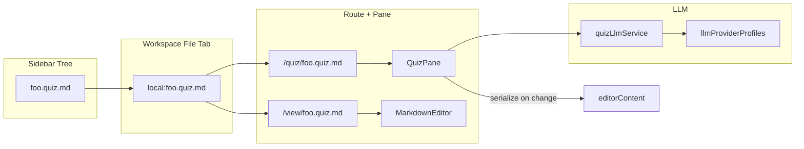
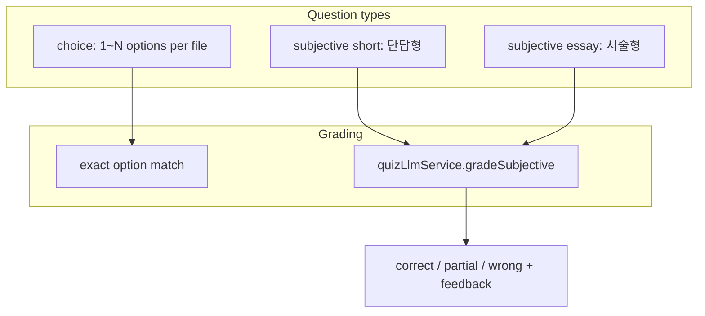
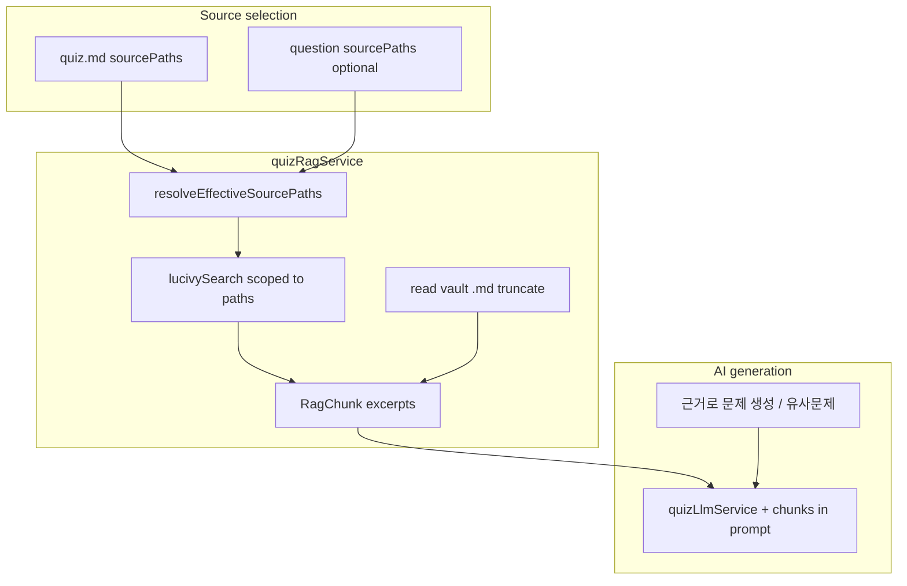

# Quiz 라우트 및 `*.quiz.md` 통합 계획

## 목표 아키텍처







- **파일 탭 기반**: `나와의 채팅`처럼 singleton 탭(`kind: 'quiz'`)을 추가하지 않고, **트리의 `*.quiz.md` 노드가 파일 탭으로 열림** (채팅과 동일한 `WorkspaceTabBar` + keep-alive 패턴).
- **라우트**: [`src/utils/appHref.ts`](src/utils/appHref.ts)에 `/quiz/<storagePath>` 헬퍼 추가 (`parseQuizPathFromAppPathname`, `quizPathnameForStoragePath`, `isQuizAppPathname`).
- **기본 열림**: [`src/App/hooks/useFileSessionDomain.ts`](src/App/hooks/useFileSessionDomain.ts)의 `goToViewPath()`를 `isQuizMdPath(path) ? /quiz/... : /view/...`로 분기.
- **모드 전환**: [`src/components/shell/EditorPane.jsx`](src/components/shell/EditorPane.jsx) 헤더에 `recordingViewMode`와 유사한 토글 — **퀴즈 모드** ↔ **편집 모드**. 라우트를 `/quiz/...` ↔ `/view/...`로 동기화해 북마크/뒤로가기와 일치.

## 1. 파일 포맷 등록

| 작업 | 파일 |
|------|------|
| `.quiz.md` 포맷 추가 | [`src/utils/createFileFormats.ts`](src/utils/createFileFormats.ts) |
| 경로 헬퍼 `isQuizMdPath()` | `src/utils/quiz/quizPath.ts` (신규) |
| 문법 문서 | `docs/custom-markdown/quiz-md.md` + [`docs/custom-markdown/index.md`](docs/custom-markdown/index.md) + [`docs/.vitepress/config.ts`](docs/.vitepress/config.ts) |

### 1.1 파일별 설정 (`QuizFileConfig`)

객관식 선택지 개수는 **파일마다** 다르게 둘 수 있다. 기본값 **4** (quiz.html 호환).

**저장 위치** — 문서 최상단 HTML comment (note-cover 패턴과 동일):

```markdown
<!-- quiz-config {"choiceCount":5,"sourcePaths":["notes/ch1.md","notes/ch2.md"]} -->

### 1. 첫 번째 문제
...
```

| 필드 | 타입 | 기본 | 설명 |
|------|------|------|------|
| `choiceCount` | `number` | `4` | 객관식 보기 개수 (허용 범위 **2~10**) |
| `sourcePaths` | `string[]` | `[]` | **파일 전체** AI 출제 근거 vault `.md` 경로 (POSIX, vault root 기준) |

- `parseQuizDocument(markdown)` → `{ config: QuizFileConfig, questions: QuizQuestion[] }`
- `serializeQuizDocument(config, questions)` → comment 블록 + 본문 (round-trip 보존)
- comment 없으면 `{ choiceCount: 4 }` 사용
- 잘못된 값(범위 밖·NaN) → 4로 clamp + 파서 경고(개발 시 console, UI는 토스트 1회)

**UI에서 변경** — `QuizPane` 헤더(또는 퀴즈 설정 드롭다운)에 「보기 개수」`Select`(2~10). 변경 시 `onChange`로 comment 갱신 후 저장 가능 상태로 표시. 전역 Settings가 아닌 **해당 `.quiz.md` 파일 메타**이다.

**적용 범위**:

- 객관식 카드: `1.`~`choiceCount` 슬롯 렌더 (실제 보기가 더 적으면 빈 슬롯 없이 존재하는 것만 표시)
- 파서: `^\d+\.` 선택지는 `1..choiceCount`까지 인식 (`choiceCount` 초과 번호는 파싱은 하되 UI에 경고 배지)
- AI 유사문제·오답 해설 프롬프트: 파일 `choiceCount`만큼 보기 생성
- 주관식 문항에는 영향 없음

- AI 유사문제·오답 해설·**근거 기반 신규 출제** 프롬프트: 파일 `choiceCount`만큼 보기 생성
- 주관식 문항에는 `choiceCount` 영향 없음

### 1.2 근거 문서 (RAG 소스) — 파일·문항 이중 선택

vault 내 **일반 `.md` / `.enc.md` 등 노트 파일**을 근거로 AI가 문제를 생성한다. 선택은 **두 레벨** 모두 지원:

| 레벨 | 저장 위치 | UI | 상속 |
|------|-----------|-----|------|
| **quiz.md 파일** | `quiz-config.sourcePaths` | `QuizFileConfigBar` 「근거 문서」 | 전체 문항 기본값 |
| **개별 문항** | 문항 blockquote `📚 근거 문서` | `QuizQuestionCard` 「근거 문서」 | 파일 기본값 **대체**(override) |

**유효 근거 경로** (`resolveEffectiveSourcePaths`):

```ts
effective = question.sourcePaths?.length
  ? question.sourcePaths
  : fileConfig.sourcePaths ?? [];
```

- 문항에 `sourcePaths`가 비어 있지 않으면 **그 문항만** 해당 목록 사용 (파일 기본값 무시).
- 문항 override 없으면 파일 `sourcePaths` 상속.
- 둘 다 비어 있으면 RAG 없이 기존 quiz.html 방식(문항 자체 텍스트만)으로 AI 출제.

**문항별 마크다운** (선택, 직렬화 시 보존):

```markdown
### 3. MapReduce 개념 문제

> **📚 근거 문서:**
> - notes/mapreduce.md
> - notes/distributed-systems.md

1. ...
```

- 파서: `📚 근거 문서:` blockquote 아래 `- path` 목록 → `question.sourcePaths`
- `*.quiz.md` 자기 자신은 근거로 선택 불가 (순환 방지)
- `.enc.md`는 unlock 상태에서만 읽기·RAG 가능

**근거 문서 선택 UI** — `QuizSourcePickerModal.tsx` (신규):

- Sidebar와 동일 vault 트리에서 **`.md` 파일 다중 선택** (폴더는 탐색만, 선택은 파일 leaf)
- 기존 [`browse-directory`](src/utils/advancedSearch/openRequest.ts) 패턴 참고하되, 퀴즈 전용 모달로 구현 (Advanced Search Host에 `quiz-pick-sources` 모드 추가는 **선택 사항**; 1차는 독립 모달)
- 선택 결과: 칩 목록 표시 + 경로 클릭 시 `/view/...`로 열기
- 파일 단위·문항 단위 버튼이 동일 모달 재사용, `scope: 'file' | 'question'` prop으로 저장 대상만 분기

### 1.3 문항 유형 (`quizTypes.ts`)

| `kind` | 하위 | UI | 채점 |
|--------|------|-----|------|
| `choice` | — | `1.`~`choiceCount` 선택지 라디오 | 정답 번호 일치 |
| `subjective` | `short` (단답형) | 한 줄 `input` | **AI** |
| `subjective` | `essay` (서술형) | 여러 줄 `textarea` | **AI** |

- 단답형은 주관식의 하위 유형 (`answerStyle: 'short' | 'essay'`).
- 객관식과 주관식을 한 `.quiz.md`에 혼합 가능.

### 1.4 마크다운 문법 (객관식 — quiz.html 호환 + N지선다)

- `### N. 질문` 헤더 (번호 매긴 선택지가 있으면 `kind: choice`)
- `1.`~`N.` 선택지 (`N = 파일 choiceCount`, 최소 2) + `*(정답)*` 등 마커
- `> **💡 접근 Point!**` / `> **📖 해설:**` 블록
- `---` 구분, `🔖`/`유사N` 라벨, KaTeX `$...$` / `$$...$$`

### 1.5 마크다운 문법 (주관식 — 신규)

**유형 감지 규칙** (파서 우선순위):

1. 헤더에 `[단답형]` → `subjective` + `short`
2. 헤더에 `[주관식]` 또는 `[서술형]` → `subjective` + `essay`
3. 선택지(`1.`) 없고 `**정답:**` 또는 `> **📖 모범 답안:**` 존재 → `subjective` (`**정답:**` 한 줄이면 `short`, 모범 답안 blockquote가 길면 `essay`)
4. 그 외 선택지 1개 이상 → `choice`

**단답형 예시:**

```markdown
### 12. [단답형] MAP 단계의 역할을 한 단어로 쓰시오.

**정답:** 변환

> **💡 접근 Point!**
> MapReduce Map 단계의 핵심 동작을 묻는다.
>
> **📖 해설:**
> Map 단계는 입력을 키-값 쌍으로 변환한다.
```

**서술형 예시:**

```markdown
### 13. [주관식] 분산 파일 시스템의 장단점을 서술하시오.

> **📖 모범 답안:**
> 장점: 확장성, 내결함성. 단점: 일관성 트레이드오프, 네트워크 지연.

> **💡 접근 Point!**
> CAP 정리와 실무 트레이드오프를 연결해 서술할 것.

> **📖 해설:**
> (채점 기준 보조 설명)
```

- `modelAnswer` 필드: `**정답:**` 값 또는 `> **📖 모범 답안:**` 본문 (AI 채점 기준).
- 직렬화 시 유형 태그·정답/모범답안 블록을 보존해 편집 모드와 round-trip 일치.

### 1.6 문제 직접 등록 (Authoring)

AI 없이 사용자가 vault의 `.quiz.md`에 문항을 **직접 추가**한다. `temp/quiz.html`의 「마크다운 입력」모달(`md-modal`, 326~374행)을 React로 이식·확장.

#### A. 단건 추가 — `QuizAddQuestionModal`

`QuizFileConfigBar` / 빈 목록 CTA에서 「문제 추가」→ 모달.

| 필드 | UI | 비고 |
|------|-----|------|
| 문항 유형 | Radix `Select` 또는 segmented: **객관식** / **단답형** / **서술형** | 파일 `choiceCount`와 연동 |
| 질문 본문 | Markdown `textarea` (+ 실시간 `MdPreview` 미리보기) | KaTeX·이미지 `![[…]]` 지원 |
| 객관식 선택지 | `choiceCount`개 입력란 (1~N) | 정답은 라디오로 1개 선택 |
| 단답형 정답 | 한 줄 `input` → `**정답:**` |
| 서술형 모범답안 | `textarea` → `> **📖 모범 답안:**` |
| 접근 Point | `textarea` (선택) | blockquote `💡 접근 Point!` |
| 해설 | `textarea` (선택) | blockquote `📖 해설:` |
| 근거 문서 | `QuizSourcePathsChips` + picker (선택) | 문항 `sourcePaths` override |

**저장 흐름**:

1. 폼 → `buildQuestionMarkdownBlock(form)` (`src/utils/quiz/buildQuestionMarkdown.ts`) — 단일 문항 MD 블록 생성
2. `parseQuizDocument`로 검증 (파싱 실패 시 필드별 오류 표시)
3. 기존 `questions` 끝에 append → `serializeQuizDocument` → `onChange`
4. 문항 번호: 기존 최대 `displayLabel` + 1 (또는 사용자 지정 번호 필드 optional)

**편집**: 문항 카드 「수정」→ 동일 모달 prefill → 해당 문항 replace.

#### B. 일괄 등록 — `QuizBulkImportModal`

`QuizFileConfigBar` 「마크다운 가져오기」→ 모달 (quiz.html `parseAndApplyMarkdown` 대응).

| 기능 | 설명 |
|------|------|
| 붙여넣기 | 대용량 `textarea`에 `.quiz.md` 본문 전체 붙여넣기 |
| 파일 업로드 | `.md` / `.quiz.md` / `.txt` (`accept`, `FileReader`) |
| 샘플 불러오기 | quiz.html `defaultSampleMarkdown` 수준의 예시 삽입 (개발용·온보딩) |
| 적용 모드 | **추가**(append, 기본) / **교체**(replace 전체 문항, confirm) |
| 파싱 | `parseQuizDocument(paste)` — `quiz-config` comment가 있으면 config 병합 옵션(교체 시만 덮어쓰기 확인) |
| 오류 | 파싱 0건 → 인라인 오류; 부분 실패 시 성공 건수 토스트 |

적용 후 `serializeQuizDocument` → `onChange`; 풀이 세션(답안·채점)은 **교체 모드**에서만 초기화.

#### C. 공통

- 두 모달 모두 `Modal` / Radix `Dialog`, z-index `modal-nested-z-index` 규칙 준수
- 헤더 액션: 「문제 추가」| 「마크다운 가져오기」| (기존) 「근거로 문제 추가」(AI)
- 편집 모드( `/view/` )와 병행: 퀴즈 모드에서 등록 UI, 원본 MD는 `serialize`로 동기화

## 2. 코어 유틸 (`src/utils/quiz/`)

| 모듈 | 역할 |
|------|------|
| `quizTypes.ts` | `QuizFileConfig`, `QuizQuestion`, `SubjectiveGradeResult`, 세션 상태 |
| `parseQuizDocument.ts` | `<!-- quiz-config -->` + 문항 파싱 → `{ config, questions }` |
| `serializeQuizDocument.ts` | config comment + 문항 역직렬화 |
| `quizFileConfig.ts` | parse/serialize/validate `choiceCount` (기본 4, clamp 2~10) |
| `quizTypes.ts` | `QuizFileConfig`, `QuizQuestion` (+ `sourcePaths?`), `RagChunk`, 세션 상태 |
| `parseQuizDocument.ts` | config + `📚 근거 문서` blockquote + 문항 파싱 |
| `serializeQuizDocument.ts` | config + 근거 경로 + 문항 역직렬화 |
| `quizFileConfig.ts` | `choiceCount`, `sourcePaths` parse/validate |
| `buildQuestionMarkdown.ts` | 단건 폼 → 문항 MD 블록 / `QuizAddQuestionModal` ↔ parser round-trip |
| `mergeQuizDocuments.ts` | append·replace 문항 병합 (bulk import) |
| `quizRagService.ts` | **RAG 발췌** — Lucivy 스코프 검색 + vault 읽기 fallback |
| `quizVaultSourceLoader.ts` | storage backend로 근거 `.md` 본문 로드 (S3/local/webdav) |
| `quizSettingsStore.ts` | temperature, calcComplexity, systemPrompt, `profileId`, 주관식 채점 temperature, **`ragTopK`**(기본 8), **`ragMaxChars`**(기본 24_000) |
| `quizLlmService.ts` | 유사문제, **`generateQuestionsFromSources`**, 오답 해설, `gradeSubjectiveAnswer` |

### 2.1 RAG (`quizRagService`)

기존 **Advanced Search / Lucivy** 인프라 재사용 ([`lucivySearch`](src/utils/advancedSearch/lucivyBackend.ts), [`fileIndexChunking`](src/utils/advancedSearch/fileIndexChunking.ts)):

```ts
retrieveQuizContext({
  sourcePaths: string[],
  query: string,        // 출제 주제 / 기준 문항 질문+point
  topK?: number,
  maxChars?: number,
}): Promise<RagChunk[]>
```

**검색 절차**:

1. `sourcePaths` 정규화·중복 제거; 빈 배열이면 `[]` 반환.
2. **Lucivy 인덱스 열림** → `query`에서 검색어 추출 → `lucivySearch` → hit의 `file:` doc id를 [`vaultPathFromFileDocId`](src/utils/advancedSearch/fileIndexChunking.ts)로 경로 복원 → **`sourcePaths`에 포함된 hit만** 채택 → 상위 `topK` chunk.
3. 인덱스 미구축·hit 없음 → **fallback**: `quizVaultSourceLoader`로 선택 파일 전체(또는 앞부분) 읽기, `splitTextIntoIndexChunks` 크기로 잘라 균등 샘플링. 토스트: 「고급 검색 인덱스를 구축하면 더 정확한 발췌가 가능합니다」.
4. 반환 `RagChunk`: `{ path, excerpt, score?, chunkIndex? }` — LLM 프롬프트에 `---\n[path]\n{excerpt}\n` 형태로 삽입.

**출제 시 query**:

- 「근거로 신규 문제 생성」(파일 헤더): 사용자 입력 주제 또는 첫 문항 키워드
- 「유사문제 생성」(문항 카드): 해당 문항 `question` + `point`
- 「근거로 N문항 일괄 생성」(파일 헤더, 2차): 주제 + `sourcePaths`

### 2.2 AI 출제 (`generateQuestionsFromSources` / 유사문제 확장)

**근거가 있을 때** 프롬프트에 반드시 포함:

- `retrieveQuizContext` 결과 (인용 구간)
- 「제공된 발췌 **밖의** 사실은 사용하지 말 것」 지시
- 출처 경로 목록 (환각 시 사용자 검증용)

**신규 액션**:

| 액션 | 위치 | 입력 |
|------|------|------|
| 근거로 문제 추가 | `QuizFileConfigBar` | `effectiveSourcePaths`(파일), 주제(optional), kind(choice/subjective) |
| 근거 기반 유사문제 | `QuizQuestionCard` | 기준 문항 + `effectiveSourcePaths`(문항 override 우선) |
| 기존 유사문제 (무근거) | 문항 카드 | `sourcePaths` 비어 있을 때 quiz.html 2단계 로직 |

생성 결과는 `serializeQuizDocument` → `onChange` (저장은 사용자가 vault Save).

### 2.3 주관식 AI 채점 (`gradeSubjectiveAnswer`)

**입력**: 문항(질문, kind, modelAnswer, point, explanation), 사용자 답안 문자열.

**출력 JSON** (프롬프트 고정 스키마):

```json
{
  "verdict": "correct" | "partial" | "wrong",
  "score": 0,
  "feedback": "학습자에게 보여줄 피드백",
  "rationale": "채점 근거 (내부 요약)"
}
```

**채점 지침 (프롬프트)**:

- **단답형 (`short`)**: 의미 동일·동의어·허용 표기(대소문자, 공백, 단위) 인정. 수치는 허용 오차 명시.
- **서술형 (`essay`)**: 모범 답안·접근 Point 기준 루브릭. 핵심 키워드 누락 시 `partial`. 완전 오개념은 `wrong`.
- `score`: 0~100 (`correct`≥90, `partial` 40~89, `wrong`<40 — UI 배지 매핑용).

**호출 시점**:

- 개별 「채점」 버튼 (주관식 카드)
- 「전체 채점」: 객관식은 즉시, 주관식은 순차/병렬 제한(동시 2~3건)으로 AI 호출
- 학습 모드: 제출 후 자동 채점 시 동일 로직

**세션 캐시**: `subjectiveGrades[questionId]`에 결과 저장 (재채점 시 덮어쓰기). 파일에는 쓰지 않음.

**LLM 연동** (기존과 동일 인프라):

- [`resolveLlmProviderProfiles`](src/utils/llmProviderProfiles.ts) + `quizSettingsStore.profileId`
- [`generateGeminiTransform`](src/utils/llm/geminiClient.ts) / OpenAI compatible / MLX·llama.cpp (LlmAssistModal 패턴)
- JSON-only 응답 + 파싱 실패 시 재시도 1회

## 3. UI 컴포넌트 (`src/components/quiz/`)

| 컴포넌트 | 기능 |
|----------|------|
| `QuizPane.tsx` | props: `content`, `onChange`, `currentFile`, `onSave`, `llmProviderProfiles`, `isActiveFile` |
| `QuizProgressDashboard.tsx` | 진행률·점수·필터 — 주관식은 AI `verdict` 반영 |
| `QuizFileConfigBar.tsx` | 보기 개수, 근거 문서, **문제 추가**, **마크다운 가져오기**, 근거 AI 출제 |
| `QuizAddQuestionModal.tsx` | 단건 등록 폼 (유형·MD 본문·선택지/정답/모범답안·해설) |
| `QuizBulkImportModal.tsx` | quiz.md 붙여넣기·파일 업로드·append/replace |
| `QuizSourcePickerModal.tsx` | vault 트리 `.md` 다중 선택 (파일·문항 공용) |
| `QuizSourcePathsChips.tsx` | 선택된 경로 칩, 제거, `/view` 링크 |
| `QuizQuestionCard.tsx` | 문항별 근거 override, 객관식/주관식 UI, 근거 기반 유사문제 |
| `QuizTocPanel.tsx` | 목차 — 유형 아이콘(객관/단답/서술) 구분 |
| `QuizStudyModeBar.tsx` | 학습/시험 모드, 전체 채점(주관식 AI 포함), 초기화 |
| `QuizSubjectiveFeedback.tsx` | verdict 배지, score, feedback Markdown 렌더 |

**점수 집계**:

- 객관식: 정답 1점 / 오답 0점 (기존)
- 주관식: `score / 100` 가중 (또는 `partial` = 0.5점) — 대시보드에 동일 스케일 표시
- 전체 점수 = (객관식 정답 수 + 주관식 환산 점수 합) / 총 문항 수 × 100

**렌더링**: `MdPreview` + KaTeX ([`ChatMessageMarkdown.tsx`](src/components/chatWithMyself/ChatMessageMarkdown.tsx) 참고).

**상태 ↔ 파일 동기화**:

- 마운트 시 `parseQuizDocument(content)`
- `choiceCount`·유사문제·import 변경 시 `serializeQuizDocument` → `onChange(md)`
- 풀이·채점·AI 피드백 캐시는 탭 세션 in-memory

**EditorPane 통합** (변경 없음):

```tsx
const isQuizFile = isQuizMdPath(currentFile?.id || currentFile?.name);
const isQuizRoute = isQuizAppPathname(location.pathname);
const quizMode = isQuizFile && isQuizRoute;
{quizMode ? <QuizPane ... /> : <MarkdownEditor ... />}
```

## 4. 라우팅·탭 연동

| 파일 | 변경 |
|------|------|
| [`src/utils/appHref.ts`](src/utils/appHref.ts) | quiz path parse/build |
| [`src/App/hooks/useFileOpenRoutingDomain.ts`](src/App/hooks/useFileOpenRoutingDomain.ts) | `/quiz/*` URL에서 파일 오픈 |
| [`src/App/hooks/useFileSessionDomain.ts`](src/App/hooks/useFileSessionDomain.ts) | `selectFileRaw`·rename retarget 시 quiz path 반영 |
| [`src/App/hooks/useWorkspaceTabsDomain.ts`](src/App/hooks/useWorkspaceTabsDomain.ts) | 탭 활성화 시 quiz/view URL 분기 |
| [`src/components/shell/workspace/WorkspaceTabBar.tsx`](src/components/shell/workspace/WorkspaceTabBar.tsx) | `.quiz.md` 탭 아이콘 |

## 5. SettingsPage 섹션

신규 [`src/components/settings/QuizSettings.tsx`](src/components/settings/QuizSettings.tsx):

- Temperature (출제용), 주관식 채점 temperature
- Calc complexity, system prompt (출제용)
- LLM 프로필 선택
- **RAG**: `topK`, `maxChars` (전역 기본; 파일·문항 `sourcePaths`는 quiz-config에 저장)
- SettingsPage `SettingsPageGroup id="quiz"` + Advanced Search `settings-quiz` 앵커

## 6. 테스트

| 테스트 | 내용 |
|--------|------|
| `parseQuizDocument.test.ts` | `sourcePaths`, `📚 근거 문서`, choiceCount |
| `buildQuestionMarkdown.test.ts` | choice/subjective 폼 → parse round-trip |
| `mergeQuizDocuments.test.ts` | append vs replace, config 병합 |
| `quizRagService.test.ts` | path 필터, fallback truncate, 빈 sources |
| `quizVaultSourceLoader.test.ts` | mock storage read |
| `serializeQuizDocument.test.ts` | config + choice + subjective round-trip |
| `quizFileConfig.test.ts` | clamp 2~10, invalid JSON fallback |
| `quizLlmService.test.ts` | `gradeSubjectiveAnswer` JSON 파싱, short vs essay 프롬프트 분기 (mock) |
| `quizScoring.test.ts` | 혼합 점수 집계 (객관식 + 주관식 partial) |
| `appHref.test.ts` | `/quiz/...` parse |

## 7. 구현 순서 (권장)

1. **포맷·경로·파서** — `createFileFormats`, `quizPath`, `QuizFileConfig` + choice+subjective parse/serialize + tests
2. **appHref + 라우팅**
3. **QuizPane MVP** — 풀이·채점 + **문제 추가·일괄 가져오기 모달** (AI 없이 수동 등록)
4. **주관식 AI 채점** — `gradeSubjectiveAnswer` + 카드/전체 채점 연동
5. **EditorPane 모드 토글**
6. **quizSettingsStore + QuizSettings**
7. **quizRagService + QuizSourcePicker** — 근거 선택 UI + Lucivy 스코프 검색
8. **quizLlmService** — 근거 출제·유사문제·오답 해설·주관식 채점
9. **문서** — quiz-md (객관식 + 주관식 + RAG Spec)

## 주요 리스크·결정

- **주관식 유사문제 AI 생성**: 1차 범위는 객관식 유사문제만 (quiz.html 동일). 주관식 유사문제 생성은 추후 `generateSimilarSubjectiveQuestion`으로 확장.
- **AI 채점 비용·지연**: 전체 채점 시 주관식만 LLM 호출; 로딩 상태·취소(`AbortSignal`) 제공.
- **빈 답안**: 채점 버튼 비활성 또는 즉시 `wrong` (LLM 호출 생략).
- **LLM 프로필 미설정**: 토스트 + 설정 페이지 안내.
- **생성/수정 내용 저장**: `onChange` → vault 저장 버튼.
- **`choiceCount` 축소**: 기존 문항에 `choiceCount`보다 많은 보기가 있으면 파싱은 유지·UI 경고.
- **RAG 인덱스 lag**: 근거 파일이 인덱스에 없으면 full-read fallback; 설정에서 인덱스 재구축 안내.
- **대용량 근거**: `ragMaxChars` 초과 시 chunk 점수순 truncate; 출제 프롬프트에 「일부만 포함」 명시.
- **근거 없는 출제**: `sourcePaths` 비어 있으면 기존 문항 텍스트 기반 유사문제만 (quiz.html 호환).
- **일괄 교체**: `QuizBulkImportModal` replace는 `ConfirmModal` variant danger로 확인.
- **단건 폼 검증**: 객관식은 최소 2개 비어 있지 않은 선택지 + 정답 1개 필수; 주관식은 모범답안/정답 필수.
