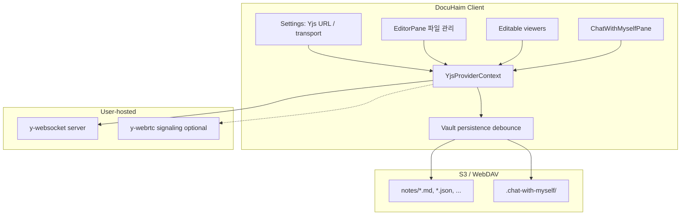
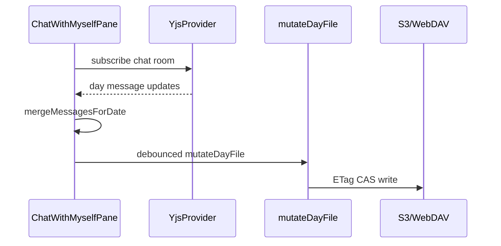

# Yjs 실시간 파일 공유

## 범위 확정

| 포함 | 제외 |
|------|------|
| 원격 저장소(S3/WebDAV) 사용 시 | Local 저장소 |
| 편집 가능 viewer 전부 (`markdown`, `json`, `html`, `excalidraw` 등 — [`EDITABLE_VIEWERS`](src/utils/workspaceTabs/types.ts)) | `.enc.md` (Yjs·임시 링크 모두 불가) |
| 나와의 채팅 (vault `.chat-with-myself/` 저장 유지) | session 임시 파일 |

## 아키텍처



**원칙:** Yjs = 실시간 transport + awareness. **Source of truth for durability** = 기존 vault 파일 (S3/WebDAV). 클라이언트는 Yjs update 수신 후 기존 `saveFile` / `mutateDayFile` 경로로 debounce 저장.

## 1. 의존성 및 번들

[`package.json`](package.json) 추가 (lazy boundary 유지):

| 패키지 | 용도 |
|--------|------|
| `yjs` | CRDT Doc |
| `y-websocket` | WebSocket provider |
| `y-webrtc` | P2P provider (선택) |
| `y-protocols` | awareness (커서/참여자) |
| `y-codemirror.next` | 마크다운 CodeMirror 6 바인딩 |
| `lib0` | encoding (yjs peer) |

- [`vite.config.ts`](vite.config.ts): `manualChunks`에 `vendor-yjs` 그룹
- Yjs 모듈은 `React.lazy` / dynamic `import()` — [`vite-chunk-splitting`](.cursor/rules/vite-chunk-splitting.mdc) 준수
- **서버 측:** 앱에 서버를 내장하지 않음. 사용자가 [y-websocket](https://github.com/yjs/y-websocket) 또는 호환 서버(Hocuspocus 등)를 직접 호스팅. README/docs에 `HOST=0.0.0.0 PORT=1234 npx y-websocket` 예시 문서화

## 2. 설정 (전역 Yjs 연결)

### 저장소

신규 [`src/utils/yjs/yjsSettingsStore.ts`](src/utils/yjs/yjsSettingsStore.ts):

```ts
type YjsTransport = 'websocket' | 'webrtc' | 'auto';

type YjsSettings = {
  enabled: boolean;
  websocketUrl: string;      // wss://collab.example.com
  webrtcSignalingUrl?: string; // optional, defaults to websocketUrl
  transport: YjsTransport;
};
```

- `localStorage` 키 `s3haim_yjs_settings` (WebDAV/S3 creds와 분리 — 연결 엔드포인트만)
- `loadYjsSettings()` / `saveYjsSettings()` / `isYjsConfigured()`

### Settings UI

- [`src/utils/settingsPageCatalog.ts`](src/utils/settingsPageCatalog.ts): `storage-connection` 그룹에 `settings-yjs` 섹션 추가
  - `visible`: `supportsRemoteSync(storageMode)` — S3/WebDAV일 때만 표시
- [`src/pages/SettingsPage.jsx`](src/pages/SettingsPage.jsx): 신규 [`src/components/settings/YjsSettings.tsx`](src/components/settings/YjsSettings.tsx)
  - WebSocket URL, transport 선택, 연결 테스트 버튼
- [`src/utils/advancedSearch/settingsToggles.ts`](src/utils/advancedSearch/settingsToggles.ts): `yjs-enabled` 토글 등록

## 3. 게이팅 (원격 저장소 전용)

신규 [`src/utils/yjs/yjsEligibility.ts`](src/utils/yjs/yjsEligibility.ts):

```ts
export function canUseYjs(ctx: {
  storageMode: string;
  fileType?: string;
  filePath?: string;
}): boolean {
  if (!supportsRemoteSync(ctx.storageMode)) return false;
  if (!isYjsConfigured()) return false;
  if (isEncMdPath(ctx.filePath)) return false;
  return true;
}
```

- `storageMode === 'local'` → Yjs UI/기능 전부 숨김
- `.enc.md` → 생성·참여·임시 링크 모두 차단 (사용자 확정)

## 4. Room ID 및 임시 링크

신규 [`src/utils/yjs/yjsRoomId.ts`](src/utils/yjs/yjsRoomId.ts):

- **문서 room:** `{storageScopeId}:{vaultRelativePath}` → SHA-256 hex (경로가 서버에 노출되지 않도록)
  - `storageScopeId`는 기존 [`getStorageScopeId`](src/utils/vault/storageScope.ts) 재사용
- **채팅 room:** `{storageScopeId}:chat` (global), 일별 서브 doc은 `chat:{YYYY-MM-DD}`

**임시 링크 (비공개 vault 문서 공유):**

- 형식: `{appOrigin}/#/collab?room={token}&path={encodedPath}`
- `token` = HMAC-SHA256(roomId, vault-scoped secret) — secret은 vault `.settings/yjs-share-secret`에 저장 (최초 생성 시 랜덤)
- 링크 수신자는 **같은 vault(S3/WebDAV)에 접근 가능**해야 vault persist 가능; Yjs는 실시간 편집만 브릿지
- S3 credential 없이 순수 링크만으로는 vault 쓰기 불가 — UI에 “저장소 연결 필요” 안내
- `.enc.md`는 링크 생성 UI 자체 비활성

신규 라우트/핸들러: [`src/App/hooks/useFileOpenRoutingDomain.ts`](src/App/hooks/useFileOpenRoutingDomain.ts)에 `#/collab?...` 딥링크 → 해당 파일 열기 + Yjs 세션 자동 참여

## 5. Yjs Provider 레이어 (핵심)

신규 모듈 트리:

| 파일 | 역할 |
|------|------|
| [`src/contexts/YjsProviderContext.tsx`](src/contexts/YjsProviderContext.tsx) | 전역 provider 풀, room lifecycle |
| [`src/utils/yjs/createYjsProvider.ts`](src/utils/yjs/createYjsProvider.ts) | websocket/webrtc/auto 분기 |
| [`src/utils/yjs/useYjsDocument.ts`](src/utils/yjs/useYjsDocument.ts) | Doc connect/disconnect, awareness |
| [`src/utils/yjs/yjsVaultPersistence.ts`](src/utils/yjs/yjsVaultPersistence.ts) | Y.Text/Y.Map → vault debounce write |

### Transport 선택 (`auto`)

1. WebSocket provider 연결 시도
2. 실패 또는 설정이 `webrtc`이면 `y-webrtc` + signaling URL
3. 둘 다 실패 시 오프라인 배너 + 기존 idle poll 폴백 (채팅/문서)

### 문서별 persistence

- **Markdown:** `Y.Text('content')` ↔ CodeMirror via `y-codemirror.next`
  - [`MarkdownEditor.jsx`](src/components/editor/MarkdownEditor.jsx): `canUseYjs` + room active 시 collab extension 주입; 기존 `handleEditorChange`는 Yjs origin이 아닐 때만 vault dirty 갱신
  - Yjs 활성 탭: [`createAutoSaveSyncHandlers.ts`](src/App/providers/createAutoSaveSyncHandlers.ts) idle **pull 비활성** (충돌 방지); Yjs update debounce → `saveFile`
- **JSON / text viewers:** `Y.Text` 바인딩 (Monaco/JsonCodeMirrorEditor 패턴)
- **Excalidraw:** `Y.Map` for elements/appState/files — Excalidraw plan 완료 후 동일 room API로 연결 (이번 계획에 인터페이스만 정의)

[`src/main.tsx`](src/main.tsx): `YjsProviderContext`를 `FileUploadQueueContext` 근처에 마운트

## 6. 파일 관리 메뉴 (문서 편집 중)

[`src/components/shell/EditorPane.jsx`](src/components/shell/EditorPane.jsx) 파일 관리 드롭다운에 항목 추가:

| 메뉴 | 조건 |
|------|------|
| 실시간 동기화 시작 | `canUseYjs` + vault 파일 + 미참여 |
| 실시간 동기화 참여 | room URL 클립보드 붙여넣기 또는 클립보드 감지 |
| 임시 링크 복사 | host(세션 생성자) + `canUseYjs` |
| 동기화 종료 | 참여 중 |

신규 [`src/components/yjs/YjsSessionModal.tsx`](src/components/yjs/YjsSessionModal.tsx):
- 참여자 목록 (awareness)
- 연결 상태 (WebSocket / WebRTC)
- 링크 복사, 종료

네비바에 연결 상태 dot 표시 (녹색=연결, 노랑=재연결, 회색=미사용)

## 7. 나와의 채팅 Yjs 연동

Yjs 설정 활성 + `storageMode`가 s3/webdav일 때:



- [`useChatRemoteSync.js`](src/components/chatWithMyself/useChatRemoteSync.js): `canUseYjs`이면 **10초 폴링 대신** Yjs day-channel 구독
  - 폴링은 Yjs 미설정/연결 끊김 시 폴백
- 메시지 모델·HTML 주석 포맷 유지 — Yjs `Y.Map` per message id 또는 day 단위 `Y.Text`에 serialized day file
  - 권장: day별 `Y.Text`에 전체 day file 문자열 동기화 → 기존 `parseDayFile`/`serializeDayFile` 재사용 (구현 단순)
- `postChatSyncEvent` / BroadcastChannel은 Yjs 미사용 시에만 (같은 탭·다른 탭 로컬 알림)
- 첨부 이미지/파일: 기존 `.chat-with-myself/images|files/` 업로드 유지; Yjs에는 path 토큰만 전파

## 8. 기존 동기화와의 관계

| 기능 | Yjs 활성 시 |
|------|-------------|
| 문서 idle pull ([`createAutoSaveSyncHandlers`](src/App/providers/createAutoSaveSyncHandlers.ts)) | 해당 파일 비활성 |
| 문서 auto-save | Yjs debounce persist 후에도 5초 가드 유지 (이중 쓰기 방지 플래그) |
| 채팅 remote poll | 비활성, Yjs 폴백 |
| BroadcastChannel | 로컬 탭 알림용 유지 (Yjs와 병행 가능) |
| `.enc.md` | 변경 없음 (auto-save/pull 기존 동작) |

## 9. 보안·제한 사항 (문서화 필수)

- Yjs relay 서버 운영자는 **CRDT update 내용을 볼 수 있음** (E2E 아님) — self-hosted 권장 이유
- 임시 링크는 **편집 세션 초대**이지 vault credential 공유가 아님
- `.enc.md`는 암호화·세션 비밀번호 모델과 충돌 → **전면 제외**
- Room token은 vault `.settings/yjs-share-secret` 없으면 생성 불가 (설정 UI에서 초기화 유도)

## 10. 테스트

| 파일 | 내용 |
|------|------|
| [`tests/utils/yjsRoomId.test.ts`](tests/utils/yjsRoomId.test.ts) | room ID 결정성, scope 격리 |
| [`tests/utils/yjsEligibility.test.ts`](tests/utils/yjsEligibility.test.ts) | local/enc.md 차단 |
| [`tests/utils/yjsVaultPersistence.test.ts`](tests/utils/yjsVaultPersistence.test.ts) | debounce/coalesce |

통합 테스트는 mock WebSocket provider로 room join/leave.

## 11. 문서

- `docs/integrations/yjs-collaboration.md` (신규): 서버 호스팅, transport, 보안 한계, 임시 링크
- VitePress sidebar 등록

## 구현 단계 (권장 PR 순서)

1. **Foundation** — settings store, eligibility, provider context, websocket 연결
2. **Markdown collab** — y-codemirror.next, EditorPane 메뉴, room/link, auto-sync 비활성
3. **Other viewers** — json/text/excalidraw Y.Text/Y.Map 바인딩
4. **Chat** — useChatRemoteSync Yjs 분기, day file persist
5. **Polish** — awareness UI, reconnect, AS toggles, docs

## 검증 체크리스트

1. Local 모드 → 설정·파일 관리에 Yjs 항목 없음
2. S3/WebDAV + Yjs URL 설정 → 연결 테스트 성공
3. `.md` 두 클라이언트 실시간 편집 → vault에 최종 내용 저장
4. `.enc.md` → Yjs 메뉴/링크 없음
5. Yjs 끊김 → 채팅/문서 폴링 폴백
6. 임시 링크로 두 번째 클라이언트 참여 (동일 vault 연결)
7. `bun run check` 통과
