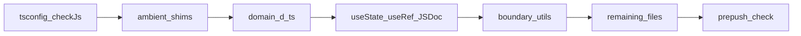

# Fix checkJs (~1800) with JSDoc

## 목표 범위

- **대상**: `checkJs: true` + **`noImplicitAny: false`** → 이전에 측정한 **~1800건 / ~110 files** (말씀하신 1800건 기준).
- **제외**: 파라미터 `implicit any`(TS7006/7031, 추가 ~1700건). 인자 타입 검사는 하지 않음.
- **정책**: `.js`/`.jsx` 대량 `.ts` 변환 없음. JSDoc·`src/types/*.d.ts`·최소 ambient 모듈 선언으로 통과.



## 에러 원인 (측정 요약)

| 코드 | 대략 | 원인 |
|------|------|------|
| TS2339 | ~1200 | `useState([])` / `useState(null)` / `useRef(null)` → `never`; Dexie 테이블 미선언; DOM ref |
| TS2322/2345/2349/2353 | ~400 | state가 `null`/`never[]`로 고정된 뒤 할당·인자 불일치 |
| TS2307 | ~20 | `radix-ui`, `@dnd-kit/*`, `react-aria-components`, `virtual:pwa-register/react` 타입 해석 |
| 기타 | 소수 | nullish, unused, indexed access |

상위 파일: [App.jsx](src/App.jsx)(~850), [ChatWithMyselfPane.jsx](src/components/chatWithMyself/ChatWithMyselfPane.jsx), [Sidebar.jsx](src/components/Sidebar.jsx), [MarkdownEditor.jsx](src/components/MarkdownEditor.jsx), [ExportPDFPage.jsx](src/pages/ExportPDFPage.jsx), chat composer/list, novel editor, storage/backends.

핵심 패턴 예 ([App.jsx](src/App.jsx)):

```js
const [s3Tree, setS3Tree] = useState([]);          // never[]
const [currentFile, setCurrentFile] = useState(null); // null → never fields
const scrollRef = useRef(null);                     // never DOM
```

## Phase 0 — 설정과 모듈 심

1. [tsconfig.json](tsconfig.json): `"checkJs": true`, `"noImplicitAny": false` (나머지 strict 유지).
2. [package.json](package.json) `check` / `.githooks/pre-push`: 당분간 typecheck는 **fail 허용 전까지** ESLint만 엄격 유지하거나, typecheck를 켠 뒤 초록이 될 때까지 브랜치에서만 게이트 (최종에 typecheck 포함).
3. `src/types/shims.d.ts` (또는 `src/vite-env.d.ts` 확장):
   - `declare module 'radix-ui'`
   - `declare module '@dnd-kit/core'` / sortable (필요 시)
   - `declare module 'react-aria-components'`
   - `declare module '@internationalized/date'`
   - `declare module 'virtual:pwa-register/react'`
4. 패키지에 정식 `@types`가 있으면 shim 대신 의존성/types 배열 보강을 우선 (shim은 최소).

## Phase 1 — 도메인 타입 + Dexie (레버리지 최대)

`src/types/`에 공유 타입을 `.d.ts` 또는 JSDoc `@typedef`로 정의하고, 경계 모듈에 연결:

- **트리/파일**: `TreeNode`, `CurrentFile` (`id`/`type`/`path`/`viewer`/`bucket`/`handle` 등 TS2339 상위 프로퍼티)
- **채팅**: `ChatMessage`, `ChatGroup`, search/filter/reply 타깃
- **녹음/동기화**: recording list item, sync row
- **크레덴셜/모달**: save method / webauthn pending payloads

[chatDb.js](src/utils/chatWithMyself/chatDb.js): `new Dexie(...)` → `Dexie` 서브클래스 + `Table` 선언 패턴으로 `pendingMessages`/`dayCache` 등 TS2339 제거.

```js
/** @typedef {import('dexie').Table} Table */
class ChatDatabase extends Dexie {
  /** @type {Table} */ pendingMessages;
  // ...
}
```

유틸 export에 `@param`/`@returns`를 붙여 UI 쪽 추론이 살아나게 함: [s3Tree.js](src/utils/s3Tree.js), [storage.js](src/utils/chatWithMyself/storage.js), [backends/index.js](src/utils/chatWithMyself/backends/index.js), recording DB.

## Phase 2 — React state/ref 일괄 주석 (에러 대량 소거)

공통 기법 (파일 변환 없이):

```js
const [items, setItems] = useState(/** @type {import('@/types/...').TreeNode[]} */ ([]));
const [file, setFile] = useState(/** @type {CurrentFile | null} */ (null));
const elRef = useRef(/** @type {HTMLDivElement | null} */ (null));
```

우선순위 (에러 수 순):

1. [App.jsx](src/App.jsx) — tree/file/modal/recording/SW/`AbortController` ref, `saveFileRef` 등
2. [ChatWithMyselfPane.jsx](src/components/chatWithMyself/ChatWithMyselfPane.jsx) + composer/list
3. [Sidebar.jsx](src/components/Sidebar.jsx) + [TreeNode.jsx](src/components/TreeNode.jsx)
4. [MarkdownEditor.jsx](src/components/MarkdownEditor.jsx), [NovelMarkdownEditor.jsx](src/components/NovelMarkdownEditor.jsx), [EditorPane.jsx](src/components/EditorPane.jsx)
5. [ExportPDFPage.jsx](src/pages/ExportPDFPage.jsx), [SettingsPage.jsx](src/pages/SettingsPage.jsx), Move* modals, LLM assist, hooks

`catch`에서 `message` on `{}` → `/** @type {unknown} */` 후 narrowing, 또는 `e instanceof Error`.

`Uint8Array` → `BlobPart` 불일치: `new Blob([bytes.buffer])` 또는 `/** @type {BlobPart} */` 캐스트.

## Phase 3 — 잔여 파일 mop-up

- `bunx tsc --noEmit -p tsconfig.json`로 카운트 모니터링 (목표 0).
- 파일별 상위 에러부터; 동일 패턴은 스크립트/체크리스트로 반복.
- `exactOptionalPropertyTypes` / `noUncheckedIndexedAccess`: optional 프로퍼티는 `?.` / 기본값 / 명시적 `T | undefined`로 맞춤 (느슨하게 끄지 않음).
- 진짜 고칠 가치 없는 한 줄은 `// @ts-expect-error` + 짧은 이유 (남용 금지).

## Phase 4 — 게이트와 규칙

1. `bun run check`가 **eslint --quiet + tsc** 모두 0으로 통과.
2. [.githooks/pre-push](.githooks/pre-push)가 이미 `check`를 호출하므로 typecheck 포함 유지.
3. [.cursor/rules/typescript-migration.mdc](.cursor/rules/typescript-migration.mdc): project-wide `checkJs` **허용(통과 상태)** 으로 갱신; 신규 JS에 state/ref JSDoc 의무 한 줄 추가.

## 성공 기준

- `checkJs: true`, `noImplicitAny: false`에서 `tsc --noEmit` **0 errors**
- 기존 ESLint guard 유지
- 대량 `.tsx` 변환 없음; 공유 타입은 `src/types`에 집중

## 예상 작업량

- Phase 0–1: 반나절급 (심 + Dexie + 핵심 typedef)
- Phase 2: 수일 (App/Sidebar/Chat/에디터가 전체의 절반 이상)
- Phase 3–4: 잔여 ~30–50 파일 정리 + 게이트

## 하지 않을 것

- 전 파일 TS 전환, `any`로 전역 침묵, `strict`/`exactOptionalPropertyTypes` 끄기
- `noImplicitAny: true`까지의 추가 ~1700건 (별도 후속 과제)