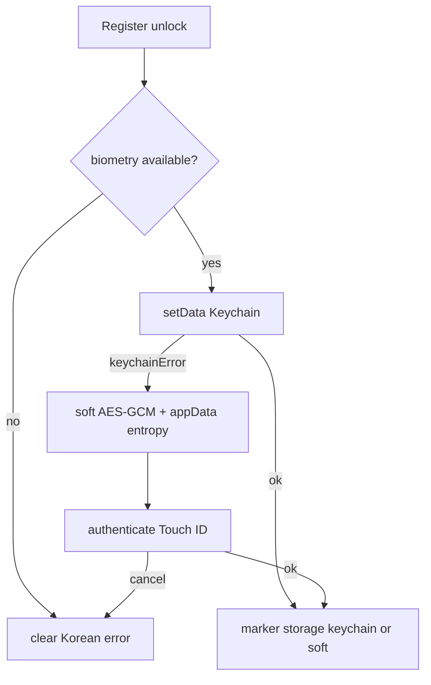

# Fix macOS Touch ID / 보안 키 등록 (soft-storage + biometry 업그레이드)

## 원인

설정 등록 → [`enableWebAuthnUnlock`](src/utils/webauthn.js) → [`enableDesktopBiometricUnlock`](src/utils/desktopBiometricUnlock.ts) → `setData`(Keychain). 미서명 빌드에서 Keychain이 실패하고, 실패 시 WebAuthn PRF fallback도 WKWebView에서 깨져 제네릭 「보안 키 등록에 실패했습니다.」만 보인다.

## 접근 (확정)

1. **biometry `0.2.8` → `0.3.0-rc.1`** (crates + npm 동기; 현재 max_stable은 0.2.8, scope 모델은 RC에만 있음).
2. **Keychain 우선**, 실패 시 **soft-storage** (앱 자체 AES-GCM, **평문 금지**).
3. 데스크톱에서 **WebAuthn PRF fallback 금지**.
4. Soft path는 OS Keychain만큼 강하지 않음을 문서/위협 모델에 명시하되, 디스크에 비밀번호·크리덴셜 **평문 문자열은 두지 않음**.

## 1. biometry 버전업 + capability scope

- Rust: [`src-tauri/Cargo.toml`](src-tauri/Cargo.toml) `tauri-plugin-biometry = "0.3.0-rc.1"`
- JS: `@choochmeque/tauri-plugin-biometry-api@0.3.0-rc.1`
- [`src-tauri/capabilities/default.json`](src-tauri/capabilities/default.json):
  - 유지: `biometry:default` (status + authenticate만)
  - 추가: `biometry:allow-has-data` / `get-data` / `set-data` / `remove-data` 각각  
    `"allow": [{ "domain": "com.docuhaim.app" }]`  
    (names: `unlock-password`, `creds-entropy` — domain 전체 allow로 충분)

0.3에서 스코프 없이 `setData` 호출하면 `scopeDenied`로 깨지므로 업그레이드와 capability는 **한 세트로** 넣는다.

## 2. Soft-storage (평문 금지)

기존 [`encryptWithEntropy` / `decryptWithEntropy`](src/utils/crypto.js) 재사용.

### 저장 레이아웃

| 조각 | 내용 | 위치 |
|------|------|------|
| Ciphertext | AES-GCM blob (`salt`/`iv`/`cipher`) — 마스터 비밀번호 또는 S3/WebDAV JSON | `localStorage` marker / `s3NotesEncrypted` (기존과 동일 형태, **평문 없음**) |
| Entropy (32B) | 복호화용 난수 | Tauri **app data dir** 파일 (예: `biometry-soft/unlock.entropy` 또는 `creds.entropy`) — Base64/바이너리, **비밀번호 평문 아님** |
| Marker | `{ desktopBiometry, mode, storage: 'keychain' \| 'soft', encryptedPassword? }` | `s3NotesWebAuthn` |

### 동작

**등록 (`enableDesktopBiometricUnlock` / `saveCredsWithDesktopBiometric`)**

1. `authenticate('…')`로 사용자 확인 (soft·keychain 공통 UX; keychain `setData`가 자체 프롬프트면 중복 최소화 — keychain 성공 시 soft 안 탐).
2. Keychain `setData` 시도.
3. 성공 → `storage: 'keychain'`, soft 파일 있으면 삭제.
4. `keychainError`(또는 서명 관련 실패) → soft:
   - `crypto.getRandomValues(32)` entropy
   - `encryptWithEntropy(plaintext, entropy)` → ciphertext만 localStorage
   - entropy를 appData 파일에 기록 (`@tauri-apps/plugin-fs` + 기존 fs scope)
   - `storage: 'soft'`
5. Soft에도 **절대** master password / AWS secret / WebDAV password 문자열을 그대로 쓰지 않음.

**해제**

1. Marker `storage === 'keychain'` → 기존 `getData`.
2. `storage === 'soft'` → `authenticate()` 성공 후에만 appData에서 entropy 읽고 `decryptWithEntropy`.

**해제/비활성** → keychain 항목 + soft 파일 + marker 모두 제거.

### 위협 모델 (문서에 명시)

- **막는 것**: localStorage/설정 화면에서 비밀번호·키가 **평문**으로 노출되는 것; 단순 문자열 검색형 유출.
- **막지 못하는 것**: DocuHaim app data + localStorage를 함께 읽고 포맷을 아는 공격자 (entropy+ciphertext 복원). Keychain path가 더 강함 → 서명된 배포에서는 Keychain 우선.
- Soft는 **미서명/Keychain 불가 환경에서도 등록이 되게** 하는 폴백.

## 3. WebAuthn fallback 제거

[`src/utils/webauthn.js`](src/utils/webauthn.js):

- `isDesktopApp()`이면 enable/save/unlock 관련은 desktop biometry(+soft)만.
- `isWebAuthnAvailableForSave` / PRF 지원 체크도 데스크톱에서는 `isDesktopBiometricAvailable()`만.

## 4. 에러 UX + 문서

- Tauri invoke 에러에서 `code`/`message` 파싱 (`formatDesktopBiometryError`).
- Soft 성공 시 사용자에게는 등록 성공 (내부 `storage: soft`). 필요 시 Settings에 「이 빌드는 OS Keychain 대신 앱 암호화 저장을 사용합니다」 짧은 안내(선택).
- [`docs/desktop/code-signing.md`](docs/desktop/code-signing.md):
  - 무료 Apple Development(로컬) vs 유료 Developer ID(배포)
  - Keychain vs soft-storage 위협 모델
  - biometry 0.3 scope 요약

## 검증

1. **미서명** macOS 빌드: 등록 → soft path로 성공; localStorage/appData에 비밀번호 평문 없음; 해제 시 Touch ID 후 성공.
2. **서명** 빌드(가능 시): Keychain path, `storage: 'keychain'`.
3. 데스크톱에서 WebAuthn PRF 호출 없음 (생체 미가용 시 명확한 불가 메시지).
4. capability에 domain 없으면 `scopeDenied` — scope 넣은 뒤 set/get 정상.
