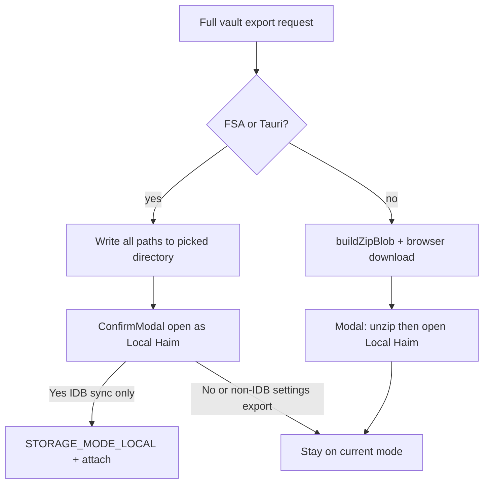

# IDB Haim + 전체 Vault 내보내기

## 결정된 동작

- **IDB Haim**: vault source of truth는 IndexedDB 가상 파일 트리 (S3/Local/WebDAV와 동일 path→bytes 모델).
- **동기화 = A안**: 요청 시 전체 vault를 한 번 내보내기.
- **내보내기 채널** (모든 Haim 공통):
  - **Storage API 지원** (`showDirectoryPicker`) 또는 **Tauri desktop** (`pickTauriExportDirectory`): 폴더에 vault 트리 쓰기.
  - **미지원** (예: Android/iOS 브라우저 등): [`buildZipBlob`](src/utils/zipBuilder.js) + blob 다운로드. ZIP만 가능.
- **IDB 동기화 후 UX**:
  - 폴더 쓰기 성공 → **ConfirmModal** “이 폴더를 Local Haim으로 열까요?” → 예이면 `attachLocalRootFolder` / `saveLocalVaultFsPath` + `STORAGE_MODE_LOCAL`.
  - ZIP 다운로드 성공 → **안내 모달** (Confirm 또는 메시지 전용): 압축을 직접 해제한 뒤 Settings/Sidebar에서 그 폴더를 **Local Haim**으로 열라는 설명. (핸들이 없으므로 Local 자동 전환 없음.)
- **설정**: 현재 모드뿐 아니라 **모든 Haim(S3 / Local / WebDAV / IDB)** 에서 “전체 데이터 다운로드”를 Storage API 또는 ZIP으로 실행할 수 있는 섹션 추가.
- 양방향 sync·폴더→IDB import·OPFS는 범위 밖.

Note: Settings의 “전체 다운로드”는 폴더 쓰기 후에도 **기본적으로 Local 전환 Confirm을 띄우지 않음**. Local 전환 Confirm은 **IDB Haim의 「로컬 폴더로 동기화」** 전용. ZIP 안내는 두 경로 공통.

## 1. IndexedDB vault 저장소 + backend

- [`src/utils/vault/idbVaultStore.ts`](src/utils/vault/idbVaultStore.ts) — Dexie `s3haim-idb-vault`
  - `entries`: `path` (PK), `kind` (`file` | `dir`), `blob`, `contentType`, `size`, `updatedAt`
  - helpers: `listChildren`, `getEntry`, `putFile`, `mkdir`, `deletePath`, `deletePrefix`, `listAllFiles`, `ensureParentDirs`
- [`src/utils/storage/idbBackend.ts`](src/utils/storage/idbBackend.ts) — [`localBackend.js`](src/utils/storage/localBackend.js)와 동일 Surface
  - `isReady()` → 항상 `true`
  - `mode: 'idb'`, capabilities = local과 동일 (`supportsRemoteSync: false`)

## 2. 모드 등록

| 위치 | 변경 |
|------|------|
| [`storageSettings.js`](src/utils/vault/storageSettings.js) | `STORAGE_MODE_IDB`, load/save whitelist, `getAppNameByStorageMode` → `IDB Haim` |
| [`capabilities.js`](src/utils/storage/capabilities.js) | `idb` 엔트리 |
| [`createStorageBackend.js`](src/utils/storage/createStorageBackend.js) | `createIdbBackend()` |
| [`VaultContext.ts`](src/App/context/VaultContext.ts) | `'idb'` in `VAULT_PATH_STORAGE_TYPES` |
| [`storageScope.ts`](src/utils/vault/storageScope.ts) | `idb:default` |
| Chat [`backends/index.js`](src/utils/chatWithMyself/backends/index.js) | IDB ChatBackend |
| [`desktopMenuBridge.ts`](src/utils/shared/desktopMenuBridge.ts) | IDB 메뉴 |
| Settings / Sidebar / 분석 UI | 라벨·ready·tree 분기 |

**Ready / Auth**: Local처럼 remote creds 불필요. `storageMode === idb`이면 ready.

**트리**: `idbTree` + lazy `listChildren` ([`localTree`](src/utils/vault/localTree.js) 패턴).

## 3. 공통 전체-vault 내보내기 유틸

새 모듈 [`src/utils/vault/exportVaultArchive.ts`](src/utils/vault/exportVaultArchive.ts) (이름 가칭):

1. **입력**: active `StorageBackend` (또는 mode + deps) — s3 / local / webdav / idb 모두 `listChildren`/`readBytes`(또는 S3 `listObjectsV2` 등 backend 일관 API)로 전체 파일 수집.
2. **채널 분기** (기존 [`useTreeOpsDomain`](src/App/hooks/useTreeOpsDomain.ts) 폴더 다운로드와 동일 기준):
   - FSA: `showDirectoryPicker` + `ensureDirectoryReadWritePermission` → path 유지 쓰기
   - Tauri(FSA 없음): `pickTauriExportDirectory` → Tauri FS write
   - else: `buildZipBlob(entries)` + `triggerBlobDownload` (`{appName}-vault.zip` 등)
3. Progress: Activity indicator 재사용.
4. 반환: `{ channel: 'directory' | 'zip', dirHandle?, tauriPath?, zipFileName? }`

Local vault 수집은 기존 `downloadFolderAsZip`의 local recursive / S3 list 로직을 backend 중심으로 일반화해 **webdav·idb**까지 포함. 가능하면 tree-ops의 폴더 ZIP 경로도 이 유틸을 쓰도록 맞추되, 범위가 커지면 Settings/IDB sync만 새 유틸을 쓰고 tree-ops는 후속.

## 4. Settings UI

[`SettingsPage.jsx`](src/pages/SettingsPage.jsx):

1. 저장소 라디오 **4택1** (S3 / Local / WebDAV / **IDB Haim**).
2. **공통 섹션** 「Vault 전체 다운로드」 (현재 선택된 Haim 기준, 모든 모드에서 표시):
   - Storage API 지원 시: 「폴더로 내보내기」 버튼
   - 미지원 시: 「ZIP으로 다운로드」만 활성 + 짧은 안내 문구
   - 둘 다 가능한 환경에서는 Storage API를 기본으로 두고, ZIP을 보조 옵션으로 제공 (사용자 요청: Storage API **또는** zip)
3. **IDB 전용**: 「로컬 폴더로 동기화」 — 위 export를 호출한 뒤:
   - `directory` → ConfirmModal Local 전환
   - `zip` → 안내 모달 (압축 해제 후 Local Haim으로 열기)

버튼은 icon+label ([button-icons](.cursor/rules/button-icons.mdc)).

## 5. IDB 동기화 → Confirm / ZIP 안내

App 훅:

1. `exportVaultArchive` 실행
2. `channel === 'directory'`: ConfirmModal — Local Haim으로 열지 → Yes면 mode 전환 + attach
3. `channel === 'zip'`: 모달 메시지 예:
   - 제목: `ZIP 다운로드 완료`
   - 본문: `압축을 해제한 뒤, 저장소를 Local Haim으로 바꾸고 해당 폴더를 열어 주세요.`
4. ConfirmModal 규칙 준수 ([confirm-modal](.cursor/rules/confirm-modal.mdc))

## 6. 의도적으로 하지 않는 것

- IDB ↔ 폴더 양방향 sync / watcher
- ZIP 다운로드 후 자동 Local 전환
- Settings 전체 다운로드에서 기본 Local 전환 Confirm (IDB 동기화만)
- OPFS / 보조 Dexie(초안·캐시)를 vault ZIP에 포함 — **vault 파일 트리만**

## 구현 순서

1. `idbVaultStore` + `idbBackend` + mode/capabilities/factory
2. Vault state / tree / open·save에 `idb` 배선
3. Chat backend + Settings/Sidebar/desktop 라벨
4. `exportVaultArchive` (FSA / Tauri / ZIP) + Settings 「Vault 전체 다운로드」
5. IDB 「로컬 폴더로 동기화」 + ConfirmModal / ZIP 안내 모달
6. 남은 `storageMode` 분기 정리
