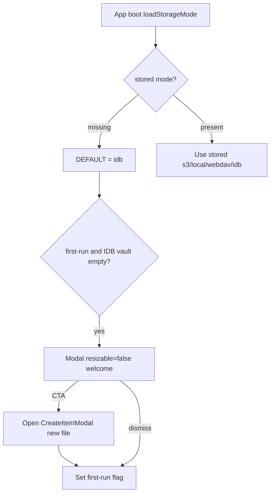

# IDB Haim + 전체 Vault 내보내기 + 최초 온보딩

## 결정된 동작

- **IDB Haim**: vault source of truth는 IndexedDB 가상 파일 트리 (S3/Local/WebDAV와 동일 path→bytes 모델).
- **기본 모드**: [`DEFAULT_STORAGE_MODE`](src/utils/vault/storageSettings.js)를 `STORAGE_MODE_S3` → **`STORAGE_MODE_IDB`**. `localStorage`에 모드가 없는 신규 사용자만 IDB로 시작; 이미 `s3`/`local`/`webdav`가 저장된 사용자는 그대로.
- **동기화 = A안**: 요청 시 전체 vault를 한 번 내보내기.
- **내보내기 채널** (모든 Haim 공통):
  - **Storage API** / **Tauri**: 폴더에 vault 트리 쓰기.
  - **미지원**: [`buildZipBlob`](src/utils/zipBuilder.js) + blob 다운로드.
- **IDB 동기화 후 UX**:
  - 폴더 쓰기 → ConfirmModal로 Local Haim 전환 유도.
  - ZIP → 압축 해제 후 Local Haim으로 열기 **안내** 모달 (자동 전환 없음).
- **설정**: 모든 Haim에서 「Vault 전체 다운로드」(Storage API 또는 ZIP).
- **최초 로드 온보딩** (아예 처음 사용자):
  - [`Modal`](src/components/shared/modals/Modal.jsx) with **`resizable={false}`**.
  - 새 파일 생성으로 노트 시작을 유도 (CTA → `requestCreateItem` / CreateItemModal 오픈).
  - 한 번만 표시 (플래그 + 빈 vault 조건).

## 1. IndexedDB vault + backend

- [`src/utils/vault/idbVaultStore.ts`](src/utils/vault/idbVaultStore.ts) — Dexie `s3haim-idb-vault`
- [`src/utils/storage/idbBackend.ts`](src/utils/storage/idbBackend.ts) — localBackend와 동일 Surface, `isReady()` always true

## 2. 모드 등록 + 기본값

| 위치 | 변경 |
|------|------|
| [`storageSettings.js`](src/utils/vault/storageSettings.js) | `STORAGE_MODE_IDB`, **`DEFAULT_STORAGE_MODE = STORAGE_MODE_IDB`**, load/save whitelist에 `idb`, `getAppNameByStorageMode` → `IDB Haim` |
| capabilities / createStorageBackend / VaultContext / storageScope | `idb` 등록 |
| Chat backends / desktopMenuBridge / Settings·Sidebar | IDB 라벨·ready·tree |

**Ready / Auth**: remote creds 불필요. `storageMode === idb`이면 ready.

## 3. 공통 전체-vault 내보내기

[`src/utils/vault/exportVaultArchive.ts`](src/utils/vault/exportVaultArchive.ts): FSA / Tauri / ZIP 분기, progress indicator, `{ channel, dirHandle?, tauriPath? }` 반환. Settings + IDB 동기화가 공유.

## 4. Settings UI

- 라디오 4택1 + 「Vault 전체 다운로드」 + IDB 「로컬 폴더로 동기화」 (이전 계획과 동일).

## 5. IDB 동기화 → Confirm / ZIP 안내

- directory → ConfirmModal Local 전환; zip → 안내 모달 (이전 계획과 동일).

## 6. 최초 사용자 온보딩 Modal

**대상**: 저장된 storage mode가 없고(또는 명시적 first-run), 현재 모드가 IDB이며, IDB vault에 사용자 노트가 없고, `localStorage` 플래그(예: `s3haim_first_note_prompt_done`)가 없는 경우.

**UI**: 새 컴포넌트 예) `FirstNoteWelcomeModal` — 공유 [`Modal`](src/components/shared/modals/Modal.jsx)에 **`resizable={false}`** (기존 PrintChrome / WorkspacePaneLayoutModal 패턴).

- 카피: IDB Haim으로 바로 시작할 수 있음 + 첫 노트 만들기 유도.
- Primary CTA (아이콘+라벨): 「새 노트 만들기」 → `requestCreateItem(STORAGE_MODE_IDB, '', null, 'file')` 로 CreateItemModal 오픈.
- Dismiss / 닫기: 같은 세션·다음 방문에 다시 안 뜨도록 플래그 저장.
- CTA로 CreateItemModal을 연 뒤에도 플래그 저장 (성공 생성 전 dismiss해도 재노출하지 않음 — 반복 방해 방지).
- Auth unlock / Local restore Confirm보다 **뒤**, IDB tree ready 이후에 표시.

마운트: [`AppModals.tsx`](src/App/components/AppModals.tsx) + 전용 훅(예: `useFirstNoteOnboardingDomain`)에서 조건 평가.

## 7. 의도적으로 하지 않는 것

- 기존 S3/Local/WebDAV 사용자 강제 IDB 마이그레이션
- IDB ↔ 폴더 양방향 sync
- ZIP 후 자동 Local 전환
- Settings 전체 다운로드의 Local 전환 Confirm (IDB 동기화만)
- 온보딩에서 파일명 없이 `untitled.md` 자동 생성만 하고 CreateItemModal을 건너뛰기 — **이름은 CreateItemModal로 받는다**

## 구현 순서

1. `idbVaultStore` + `idbBackend` + mode/capabilities + **DEFAULT = idb**
2. Vault state / tree / open·save에 `idb` 배선
3. Chat + Settings/Sidebar/desktop 라벨
4. `exportVaultArchive` + Settings 전체 다운로드
5. IDB 동기화 Confirm / ZIP 안내
6. `FirstNoteWelcomeModal` (`resizable={false}`) + first-run 게이트
7. 남은 `storageMode` 분기 정리
