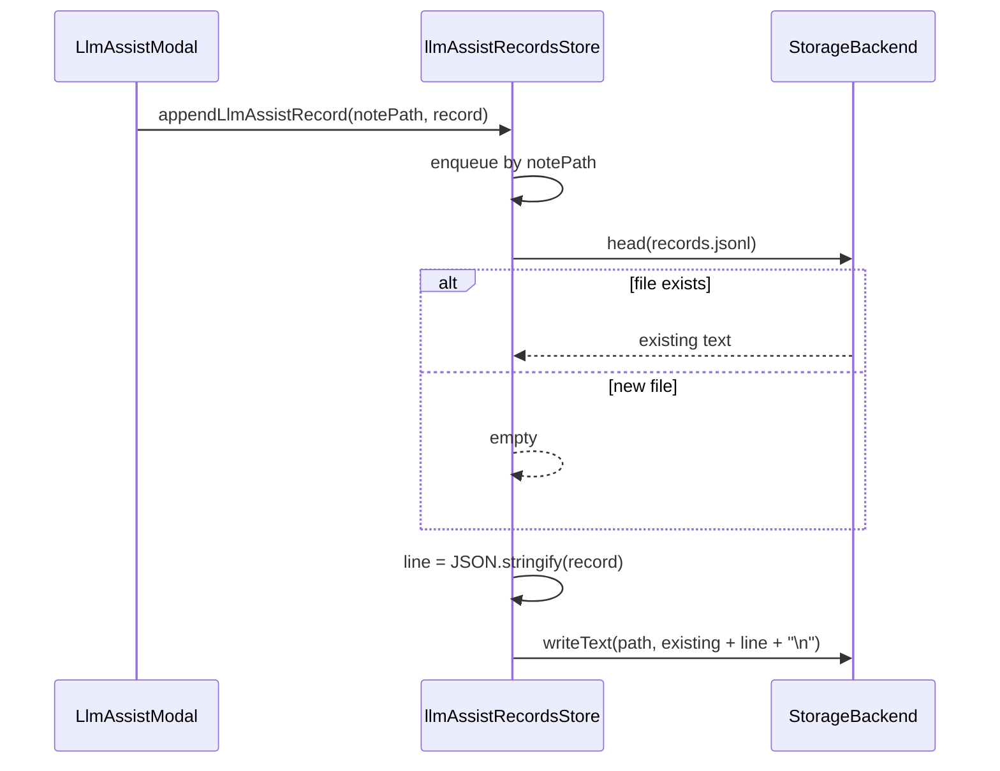
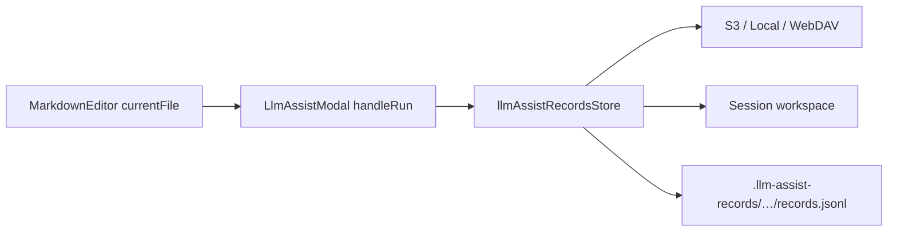

# LLM Assist 사용 기록 저장소

## 목표

- 노트별 companion 폴더 [`.llm-assist-records/…`](src/utils/llm/llmAssistRecordsPath.ts)에 **LLM 변환(transform) 실행** 기록 저장
- 저장 형식: **압축 JSONL(NDJSON)** — 줄 단위 append, 필드명은 의미 유지, 공백 없음, 이미지 base64 제외
- 스키마는 `type` 필드로 **여러 기록 종류** 확장 가능 (1차 구현은 `transform`만 기록)
- 모든 레코드에 **`createdAt`(ms epoch) 필수**

## 경로 규칙 (`.images` 미러)

[`buildEditorImagePathPrefix`](src/utils/editorImageUpload.js)와 동일한 규칙:

| md 경로 | prefix |
|---------|--------|
| `notes/foo.md` | `.llm-assist-records/notes/foo/` |
| (없음) | `.llm-assist-records/note/` |

실제 기록 파일(노트당 1개):

```text
.llm-assist-records/{mdDir}{mdNameNoExt}/records.jsonl
```

예: `notes/report.md` → `.llm-assist-records/notes/report/records.jsonl`

## 저장 형식 — JSONL을 선택하는 이유

| 방식 | 장점 | 단점 |
|------|------|------|
| **JSONL (채택)** | S3/WebDAV에서 객체 수 최소, append 의미 명확, 줄 단위 스트리밍 읽기 | read-modify-write 필요 |
| 파일당 JSON 1개 (`.images`식) | PUT만으로 append | 기록 많을수록 객체/메타데이터 비용 증가 |
| MessagePack/CBOR | 바이트 최소 | 신규 의존성, 디버깅 어려움 |

백엔드에 native append가 없으므로 **노트 경로별 write queue**로 직렬화:



Content-Type: `application/x-ndjson; charset=utf-8`

## 레코드 스키마 (v1)

```typescript
// src/utils/llm/llmAssistRecordsStore.ts
type LlmAssistRecordBase = {
  id: string;           // crypto.randomUUID()
  type: string;           // extensible — v1: 'transform'
  createdAt: number;      // required, Date.now()
};

type LlmAssistTransformRecord = LlmAssistRecordBase & {
  type: 'transform';
  ok: boolean;
  durationMs: number;
  providerKind: string;
  profileId: string;
  model: string;
  instruction: string;
  systemPrompt: string;
  selectedText: string;
  selectionFrom: number;
  selectionTo: number;
  imageCount: number;
  imageNames: string[];   // names only — no base64
  templateId?: string;
  result?: string;        // success only
  error?: string;         // failure only
};
```

- `normalizeLlmAssistRecord()`로 파싱/검증 (`createdAt` 없으면 drop 또는 보정)
- `listLlmAssistRecords(notePath)` — 향후 UI 대비, 줄 단위 parse (이번 PR에서는 store API만)

## 신규/수정 파일

### 1. 경로 헬퍼 — [`src/utils/llm/llmAssistRecordsPath.ts`](src/utils/llm/llmAssistRecordsPath.ts)

- `LLM_ASSIST_RECORDS_PREFIX = '.llm-assist-records/'`
- `buildLlmAssistRecordsPathPrefix(mdPath)` — `buildEditorImagePathPrefix`와 동일 로직, prefix만 교체
- `buildLlmAssistRecordsFilePath(mdPath)` → `{prefix}records.jsonl`
- re-export shim: [`src/utils/llmAssistRecordsPath.ts`](src/utils/llmAssistRecordsPath.ts)

### 2. 저장소 — [`src/utils/llm/llmAssistRecordsStore.ts`](src/utils/llm/llmAssistRecordsStore.ts)

[`llmPromptTemplatesDb.js`](src/utils/llm/llmPromptTemplatesDb.js) 패턴 재사용:

- `setLlmAssistRecordsStore({ getS3Client, s3Creds, localRootHandle, localVaultFsPath, storageMode, webdavConfig, getSessionWorkspace, setSessionWorkspace })`
- `appendLlmAssistRecord({ notePath, storageType, record })`
  - `storageType`: `currentFile.type` (`s3` / `local` / `webdav` / `session`)
  - vault: `createStorageBackendForType` + read-modify-write
  - session: `putSessionFileBytes`로 session workspace 내 동일 경로 갱신
  - backend 미준비 시 **조용히 skip** (LLM UX 차단 금지)
- re-export shim: [`src/utils/llmAssistRecordsStore.ts`](src/utils/llmAssistRecordsStore.ts)

### 3. UI 연동

[`LlmAssistModal.jsx`](src/components/llm/LlmAssistModal.jsx):

- props 추가: `notePath`, `storageType`
- `handleRun`에 `startedAt = Date.now()` 측정
- success/failure `finally`에서 `appendLlmAssistRecord` fire-and-forget (`void …catch(console.warn)`)
- 기록 필드: instruction/systemPrompt/selectedText/result 전문, 이미지는 `imageNames`+`imageCount`만

[`MarkdownEditor.jsx`](src/components/editor/MarkdownEditor.jsx):

```jsx
<LlmAssistModal
  notePath={currentFile?.id ?? null}
  storageType={currentFile?.type ?? null}
  …
/>
```

### 4. Store deps 등록

[`useChatIntegrationDomain.ts`](src/App/hooks/useChatIntegrationDomain.ts) — 기존 `setLlmPromptTemplatesStore` 옆에 `setLlmAssistRecordsStore` 호출. session workspace ref는 editor image domain과 동일 소스(`useFileSessionOwned` 또는 vault provider)에서 주입.

### 5. 인덱스/트리 제외

[`collectSources.ts`](src/utils/advancedSearch/collectSources.ts) `EXCLUDED_PREFIXES`에 `.llm-assist-records/` 추가 (Advanced Search 인덱스 제외).

### 6. 테스트 — [`tests/utils/llmAssistRecords.test.ts`](tests/utils/llmAssistRecords.test.ts)

- path prefix/file path 생성 (NFC, nested dir, extension strip)
- record normalize (`createdAt` 필수)
- JSONL append 직렬화 (mock backend read/write)

## 이번 범위에서 하지 않음

- 기록 조회 UI / 사이드바 아이콘
- 노트 삭제 시 companion cleanup (`.images`의 [`collectCompanionImageKeysForDelete`](src/utils/unusedImageCleanup.ts) 대응) — 후속 작업으로 분리
- `apply` / `append` 이벤트 기록 (사용자 선택: transform만)

## 데이터 흐름


