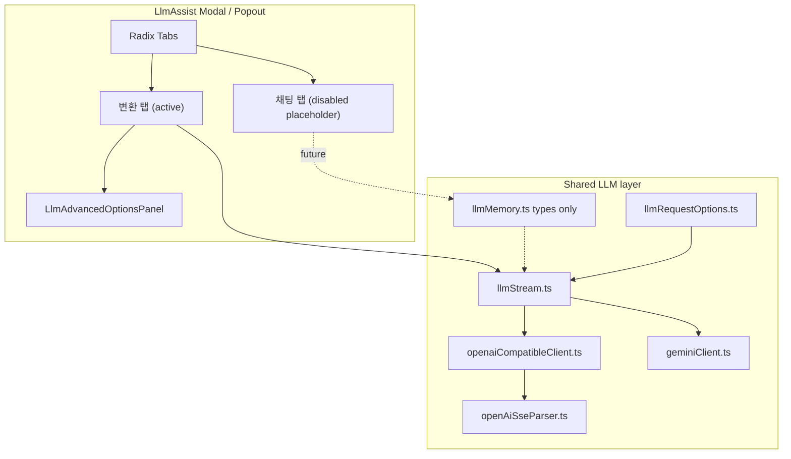

# LLM 고급 옵션 + 스트리밍 + 탭 UI

## 현재 상태

- LLM 호출은 **에디터 AI 도우미**에만 존재 ([`openaiCompatibleClient.ts`](src/utils/openaiCompatibleClient.ts), [`geminiClient.ts`](src/utils/geminiClient.ts))
- OpenAI 호환: `POST /chat/completions`만 사용, `temperature: 0.4` 고정, **비스트리밍**
- Gemini: `generateContent` 비스트리밍, `temperature: 0.4` 고정
- UI는 단일 「변환」 패널 ([`LlmAssistPanel.jsx`](src/components/LlmAssistPanel.jsx))

## 이번 범위 핵심 변경

1. **탭 UI** — LlmAssist를 2탭으로 분리 (Radix `Tabs`, [`ChatReactionPicker.tsx`](src/components/chatWithMyself/ChatReactionPicker.tsx) 패턴 참고)
2. **왼쪽 「변환」** — 기존 방식 + 스트리밍 + 고급 옵션 (이번에 실제 구현)
3. **오른쪽 「채팅」** — 탭은 보이지만 **비활성(disabled)**; placeholder만. 클릭 불가 + 「준비 중」 툴팁
4. **메모리** — 자동 누적이 아니라 **전송 전 선택** 모델로 설계; 타입·빌더만 선행, UI/전송은 후속
5. **나와의 채팅 AI** — [`chat_ai_replies` 계획](.cursor/plans/chat_ai_replies_ec18337d.plan.md)은 **이번 PR에서 구현하지 않음** (추후 우측 dock 통합 시 LlmAssist 채팅 탭과 합침)

## 목표 아키텍처



### 추후 로드맵 (이번 범위 밖, 설계에 반영)

- 채팅 탭 활성화 → 멀티턴 UI + **메모리 선택 패널** + `streamLlmChatReply`
- LlmAssist를 **우측 dock**에 통합 (에디터/채팅 옆 AI 패널)
- 나와의 채팅과 dock AI의 메모리 소스 공유 여부는 dock 통합 시 결정

---

## 1. 탭 UI — [`LlmAssistPanel.jsx`](src/components/LlmAssistPanel.jsx) 리팩터

### 구조

```
LlmAssistPanel
├── 공통 헤더: 제공자 · 모델 · LlmAdvancedOptionsPanel (접힘)
└── Tabs.Root (defaultValue="transform")
    ├── Tabs.List
    │   ├── Tabs.Trigger value="transform"  → 「변환」
    │   └── Tabs.Trigger value="chat" disabled → 「채팅」
    ├── Tabs.Content value="transform" → LlmAssistTransformPanel (기존 UI 추출)
    └── Tabs.Content value="chat" → (렌더 안 함 또는 빈 placeholder)
```

- **채팅 탭**: `disabled` + `aria-disabled` + Radix `Tooltip` 「준비 중」
- `defaultValue="transform"` 고정 — 채팅 탭으로 전환 불가
- 제공자/모델/고급 옵션은 **탭 바깥 공통 영역** (두 모드가 나중에 공유)
- 기존 UI는 `LlmAssistTransformPanel.tsx`로 추출 (변환 탭 전용)

[`LlmAssistModal.jsx`](src/components/LlmAssistModal.jsx) / [`LlmAssistPopoutPage.jsx`](src/pages/LlmAssistPopoutPage.jsx): `activeTab` state는 항상 `'transform'`; popout sync payload에 `activeTab` 필드만 예약 (후속 호환).

---

## 2. 메모리 모델 (설계 + 타입만) — `llmMemory.ts` (신규)

채팅 탭용. **자동으로 전체 히스토리를 쌓지 않음.**

```typescript
type LlmMemoryItem = {
  id: string;
  role: 'user' | 'assistant' | 'system' | 'context';
  label: string;       // UI 표시용 (예: "선택 텍스트", "이전 답변 #2")
  content: string;
  createdAt: string;
  source?: 'selection' | 'result' | 'manual' | 'note';
};

type LlmMemorySelection = {
  /** 전송 시 포함할 item id 목록 (순서 유지) */
  includedIds: string[];
};
```

**동작 원칙 (후속 구현 시):**

- 세션 중 `LlmMemoryItem[]` 풀에 항목 추가 가능 (결과·선택 텍스트·수동 메모 등)
- 전송 직전 **체크박스로 포함 항목만 선택** → `buildMessagesFromMemory(pool, includedIds)` → LLM `messages`
- 미선택 항목은 풀에 남지만 **요청에 포함되지 않음**
- 이번 PR: 타입 + `buildMessagesFromMemory()` + 빈 배열 가드만. UI·저장·전송 없음

---

## 3. 공통 타입·저장소 — `llmRequestOptions.ts` (신규)

프로필별 고급 옵션 localStorage (`s3haim_llm_request_options`).

```typescript
type OpenAiApiMode = 'chat-completions' | 'responses';

type LlmRequestOptions = {
  temperature: number;        // default 0.4
  maxTokens?: number;
  topP?: number;
  presencePenalty?: number;   // chat-completions only
  frequencyPenalty?: number;
  apiMode: OpenAiApiMode;     // OpenAI compat only
  systemMessage?: string;
  topK?: number;              // Gemini only
};
```

- `loadLlmRequestOptions(profileId)`, `saveLlmRequestOptions(profileId, opts)`
- 빈 필드는 요청 body에서 omit

---

## 4. SSE 스트림 파서 — `openAiSseParser.ts` (신규)

- `fetch` + `ReadableStream`, `text/event-stream`
- `data: [DONE]` 종료, `AbortSignal` 연동
- `/chat/completions`: `choices[0].delta.content`
- `/responses`: `response.output_text.delta`

---

## 5. OpenAI 호환 확장 — [`openaiCompatibleClient.ts`](src/utils/openaiCompatibleClient.ts)

- `streamOpenAiCompatibleTransform({ ..., options, onChunk, signal })`
- `apiMode === 'responses'` → `POST {base}/responses` + `stream: true`
- `apiMode === 'chat-completions'` → 기존 경로 + `stream: true`
- 429 재시도 유지
- 비스트리밍 wrapper는 스트리밍 누적으로 thin wrapper

---

## 6. Gemini 확장 — [`geminiClient.ts`](src/utils/geminiClient.ts)

- `generateGeminiTransformStream` — `generateContentStream` + options 매핑
- `generateGeminiChatReplyStream` — **시그니처만** export (채팅 탭 후속용, 내부는 transform stream 재사용 또는 stub)

---

## 7. 통합 스트리밍 — `llmStream.ts` (신규)

```typescript
// 이번 PR에서 실제 사용
streamLlmTransform({ instruction, selectedText, images, profile, model, options, onChunk, signal })

// 시그니처만 (채팅 탭 후속)
streamLlmChatReply({ messages, systemInstruction, ... })
```

`withLlmProfileApiKey`로 감싸 호출.

---

## 8. 고급 옵션 UI — `LlmAdvancedOptionsPanel.tsx` (신규)

- 접이식 (기본 **접힘**), Settings chevron 패턴
- API 모드 / temperature / max tokens / top_p / top_k / penalty / system message
- **배치**: LlmAssistPanel 공통 영역 (탭 위), 변환·채팅 탭 모두 공유 예정
- ~~ChatComposerSettingsModal~~ — 이번 범위 제외

---

## 9. 변환 탭 스트리밍 UX — [`LlmAssistModal.jsx`](src/components/LlmAssistModal.jsx)

`handleRun` (변환 탭 전용):

1. `setResult('')`, `AbortController`, `streamLlmTransform`
2. `onChunk` → `setResult(accumulated)`
3. 중단 버튼 (`Square` 아이콘)
4. 버튼 라벨: 「실행」 / 「생성 중…」 / 「중단」
5. 미리보기: 스트리밍 중 텍스트 모드 고정 또는 150ms 디바운스
6. Popout sync 100ms throttle

---

## 10. 주요 변경 파일

| 파일 | 변경 |
|------|------|
| `src/utils/llmRequestOptions.ts` | 신규 |
| `src/utils/openAiSseParser.ts` | 신규 |
| `src/utils/llmStream.ts` | 신규 |
| `src/utils/llmMemory.ts` | 신규 — 타입·빌더만 |
| `src/utils/openaiCompatibleClient.ts` | 스트리밍 + responses |
| `src/utils/geminiClient.ts` | 스트리밍 |
| `src/components/LlmAdvancedOptionsPanel.tsx` | 신규 |
| `src/components/LlmAssistTransformPanel.tsx` | 신규 — 기존 변환 UI 추출 |
| `src/components/LlmAssistPanel.jsx` | Tabs shell + 공통 헤더 |
| `src/components/LlmAssistModal.jsx` | 스트리밍 orchestration |
| `src/pages/LlmAssistPopoutPage.jsx` | 옵션·탭 sync 예약 필드 |

**이번에 건드리지 않음:** `ChatComposer`, `ChatWithMyselfPane`, `ChatMessageList`, `chatActions.ts`, `App.jsx` chat props

---

## 구현 순서

1. **인프라** — options, SSE, OpenAI/Gemini 스트리밍, `llmStream`, `llmMemory` 타입
2. **탭 shell** — `LlmAssistTransformPanel` 추출 + disabled 채팅 탭
3. **변환 탭** — 고급 옵션 + 스트리밍 + 중단 + popout sync

---

## 테스트 체크리스트

- 변환 탭만 동작; 채팅 탭 클릭 불가 + 준비 중 표시
- OpenAI `chat-completions` / `responses` 스트리밍
- Gemini 스트리밍 + temperature 반영
- 고급 옵션 접기/펼치기, 프로필별 저장
- 중단 버튼, popout 스트리밍 동기화
- 키 없음 / 429 에러

## 범위 밖 (후속)

- 채팅 탭 활성화 (멀티턴 UI, 메모리 선택 패널, `streamLlmChatReply` 연결)
- 나와의 채팅 AI (`chat_ai_replies` 계획)
- LlmAssist → **우측 dock** 통합
- 채팅 AI 이미지 첨부, 서버별 custom JSON body
