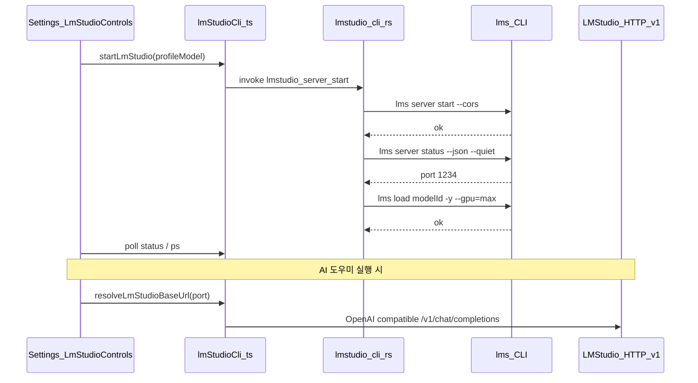

# LM Studio CLI 연동 (Tauri 데스크톱 전용)

## 목표

- [LM Studio CLI (`lms`)](https://lmstudio.ai/docs/cli)로 로컬 LM Studio를 **원격 조작** (서버 시작/중지, 모델 목록/로드 상태, 모델 로드).
- **새 API 제공자 종류 `lm-studio`** 추가 — 사용자가 설정에서 **직접** “시작”할 때 서버 + 선택 모델을 켬 (요청 실패 시 자동 시작 **하지 않음**).
- **Tauri 데스크톱** (`isTauriDesktopPlatform()`) 전용. 웹/Electron/Android에서는 제공자 생성·실행 UI 숨김.

## 현재 상태

- OpenAI 호환 LLM은 [`openaiCompatibleClient.ts`](src/utils/llm/openaiCompatibleClient.ts) + 프로필 [`llmProviderProfiles.ts`](src/utils/llm/llmProviderProfiles.ts)로만 동작.
- Tauri Rust는 [`gemini_api_fetch`](src-tauri/src/lib.rs) 패턴으로 외부 API를 우회 호출 — **프로세스 실행은 아직 없음**.
- `tauri-plugin-shell`은 외부 URL 열기만 사용 ([`initDesktopExternalLinks.ts`](src/utils/shared/initDesktopExternalLinks.ts)).

## 아키텍처

## 1. Rust: `lms` 실행 모듈

**새 파일:** [`src-tauri/src/lmstudio_cli.rs`](src-tauri/src/lmstudio_cli.rs)

**`lms` 바이너리 탐색** (순서대로 시도):

| 우선순위 | 경로 |
|---------|------|
| 1 | PATH의 `lms` / `lms.exe` (`which` / `where`) |
| 2 | `~/.cache/lm-studio/bin/lms` (macOS/Linux, LM Studio 0.3+) |
| 3 | `~/.lmstudio/bin/lms` (레거시) |
| 4 | Windows `%USERPROFILE%\.cache\lm-studio\bin\lms.exe` 등 |

**Tauri commands** (`#[cfg(not(mobile))]` 또는 desktop-only guard):

| Command | `lms` 호출 | 반환 |
|---------|-----------|------|
| `lmstudio_cli_probe` | `--version` 또는 `server status --json --quiet` | `{ available, binaryPath? }` |
| `lmstudio_server_status` | `server status --json --quiet` | `{ running, port? }` |
| `lmstudio_server_start` | `server start --cors` (+ optional `--port`) | status JSON |
| `lmstudio_server_stop` | `server stop` | void |
| `lmstudio_list_models` | `ls --llm --json --quiet` | 모델 배열 (id/path 파싱) |
| `lmstudio_list_loaded` | `ps --json --quiet` | 로드된 모델 배열 |
| `lmstudio_load_model` | `load <modelId> -y --gpu=max` (+ optional `--context-length`) | void |

**구현 메모:**

- `std::process::Command` + stdout/stderr 캡처 (shell plugin scope 불필요).
- LM Studio wake-up 지연 대비: `server start` 후 `server status`를 2–3초 간격으로 최대 ~60초 폴링 ([`lms server status`](https://lmstudio.ai/docs/cli/serve/server-status) JSON: `{ running, port }`).
- `load` 후 `ps --json`으로 선택 모델 로드 확인 (타임아웃 동일).
- 에러 시 stderr를 프론트에 전달 (한글 메시지는 TS에서 조합).

[`src-tauri/src/lib.rs`](src-tauri/src/lib.rs): `mod lmstudio_cli`, `generate_handler!`에 위 command 등록.

## 2. TypeScript: CLI 파사드

**새 파일:** [`src/utils/llm/lmStudioCli.ts`](src/utils/llm/lmStudioCli.ts)

- `isLmStudioCliSupported()` → `isTauriDesktopPlatform()`.
- `probeLmStudioCli()`, `getLmStudioServerStatus()`, `startLmStudioServer({ port? })`, `stopLmStudioServer()`, `listLmStudioModels()`, `listLmStudioLoadedModels()`, `loadLmStudioModel(modelId)`.
- `resolveLmStudioOpenAiBaseUrl(port)` → `http://127.0.0.1:${port}/v1` (LM Studio OpenAI 호환 엔드포인트).
- **`startLmStudioSession({ modelId, port? })`**: `server start --cors` → status로 port 확정 → `load` → `ps` 확인까지 한 번에 (설정 UI “시작” 버튼용).
- Re-export shim: [`src/utils/lmStudioCli.ts`](src/utils/lmStudioCli.ts) (기존 import 패턴 유지).

**테스트:** [`tests/utils/lmStudioCli.test.ts`](tests/utils/lmStudioCli.test.ts) — `resolveLmStudioOpenAiBaseUrl` 등 pure helper.

## 3. LLM 제공자 타입 확장

[`src/utils/llm/llmProviderProfiles.ts`](src/utils/llm/llmProviderProfiles.ts):

- `LLM_PROVIDER_LM_STUDIO = 'lm-studio'` 추가.
- `LlmProviderKind` union 확장.
- `normalizeLlmProviderProfile` / `isLlmProviderKind` / `storedModelMatchesKind` 업데이트.
- `validateLlmProviderProfileDraft`: `lm-studio`는 **baseUrl·apiKey 불필요** (apiKey는 LM Studio 토큰 사용 시 선택).
- `defaultModelForKind('lm-studio')` → `''` (모델은 `lms ls`에서 선택).
- `syncLegacyLlmCredsFromProfiles`: lm-studio는 legacy 필드에 매핑하지 않음.

## 4. 설정 UI

[`src/components/settings/LlmProviderProfilesSettings.tsx`](src/components/settings/LlmProviderProfilesSettings.tsx):

- `isTauriDesktopPlatform()`일 때만 Radio에 **「LM Studio (로컬)」** 추가.
- draft `kind === lm-studio`일 때 Endpoint URL 입력 **숨김**.

**새 컴포넌트:** [`src/components/settings/LmStudioProviderControls.tsx`](src/components/settings/LmStudioProviderControls.tsx)

| UI | 동작 |
|----|------|
| 상태 배지 | `probe` + `server status` (실행 중 / 중지, port) |
| 모델 Select | `lms ls --llm --json` → [`LmStudioModelSelect`](src/components/llm/LmStudioModelSelect.tsx) |
| **시작** 버튼 | `startLmStudioSession({ modelId })` — **서버 + 모델 로드** |
| **중지** 버튼 | `server stop` (ConfirmModal) |
| CLI 없음 | “LM Studio를 한 번 실행한 뒤 `lms` CLI가 PATH에 있는지 확인” 안내 + [CLI 문서](https://lmstudio.ai/docs/cli) 링크 |

- `lms` 없으면 제공자 추가는 가능하지만 시작 버튼 disabled + 설명.
- 버튼은 workspace rule 준수: 아이콘 + 라벨 (`Play`, `Square` 등 lucide).

## 5. AI 도우미 연동

[`src/components/llm/LlmAssistModal.tsx`](src/components/llm/LlmAssistModal.tsx):

- `selectedProfile.kind === LLM_PROVIDER_LM_STUDIO` 분기:
  1. `getLmStudioServerStatus()` — `running === false`면 **에러**: “설정에서 LM Studio를 시작하세요” (자동 시작 없음).
  2. `baseUrl = resolveLmStudioOpenAiBaseUrl(status.port)`로 [`generateOpenAiCompatibleTransform`](src/utils/llm/openaiCompatibleClient.ts) 호출.
  3. optional `profile.apiKey` → Bearer.

[`src/components/llm/LlmAssistPanel.jsx`](src/components/llm/LlmAssistPanel.jsx) + [`LlmProviderSelect.tsx`](src/components/llm/LlmProviderSelect.tsx):

- lm-studio 프로필 라벨: `· LM Studio`.
- 모델 선택: `LmStudioModelSelect` (OpenAI 호환 select와 분기).

## 6. Advanced Search

workspace rule 준수 — Tauri + `lms` 사용 가능 시:

**새 파일:** [`src/utils/advancedSearch/lmStudioActions.ts`](src/utils/advancedSearch/lmStudioActions.ts)

| Id | 동작 |
|----|------|
| `lmstudio-server-start` | 마지막 사용 lm-studio 프로필 모델로 `startLmStudioSession` |
| `lmstudio-server-stop` | `stopLmStudioServer` |

- [`commands.ts`](src/utils/advancedSearch/commands.ts): keywords에 `lm studio`, `lms` 보강.
- [`AdvancedSearchHost.tsx`](src/components/advancedSearch/AdvancedSearchHost.tsx): select 핸들러 등록 (설정 페이지 마운트 시 handler 등록 패턴은 `settingsToggles`와 유사하게 `registerLmStudioActions`).

## 7. 범위 밖 / 비목표

- 웹 빌드·Android Tauri에서 LM Studio 제공자 노출.
- 요청 실패 시 자동 `server start` (사용자 선택: 수동만).
- `lms daemon`, `lms get`(모델 다운로드) — 후속 작업.
- LM Studio 네이티브 `/api/v1/*` 전용 클라이언트 — OpenAI 호환 `/v1`로 충분.

## 검증 체크리스트

1. LM Studio 설치 + 1회 실행 후 Tauri 앱 → 설정에 LM Studio 제공자 추가 가능.
2. `lms` 없는 PC → probe 실패 메시지, 시작 버튼 비활성.
3. **시작** → `lms server start --cors` + 선택 모델 `load` 후 status/ps가 running/loaded.
4. AI 도우미에서 lm-studio 프로필 + 서버 미실행 → 명확한 수동 시작 안내.
5. 서버 실행 후 AI 도우미 변환 성공 (`--cors`로 webview fetch 가능).
6. Advanced Search에서 start/stop 명령 동작 (Tauri only).
