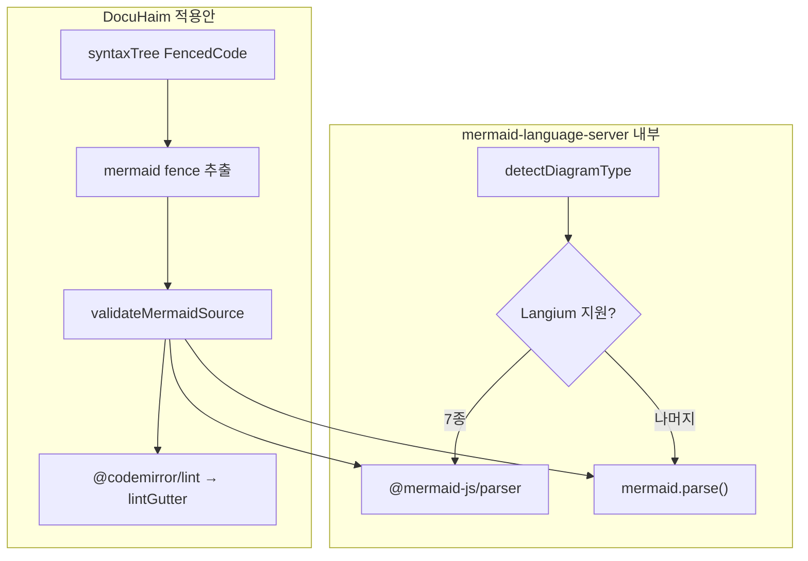

# Mermaid 코드블록 에디터 린트 계획

## 검토 결론

### LSP 직접 통합: **비권장 (사실상 불가)**

[mermaid-language-server](https://github.com/thepwagner-org/mermaid-language-server)는 Node.js 프로세스에서 `vscode-languageserver` + `--stdio`로 동작합니다.

| 요구사항 | DocuHaim 현황 |
|---------|--------------|
| Node LSP 프로세스 | 웹 PWA가 기본, Tauri는 Rust `invoke`만 사용 (sidecar 없음) |
| `jsdom` DOM 셋업 | 브라우저에는 불필요하지만, LSP 패키지 전체는 Node 전용 |
| stdio JSON-RPC | 프론트엔드에 LSP 클라이언트 인프라 없음 |

Tauri `externalBin`으로 바이너리를 번들하고 JSON-RPC 브릿지를 새로 만들 수는 있으나, **데스크톱 전용·유지보수 비용 대비 이득이 거의 없습니다.**

### 동등 검증 + CodeMirror lint: **권장 (가능)**

언어 서버의 핵심은 LSP가 아니라 [`validateDocument()`](https://github.com/thepwagner-org/mermaid-language-server/blob/main/src/diagnostics/index.ts)입니다.



이미 프로젝트에 필요한 기반이 있습니다.

- [`mermaid@11.17.0`](package.json) — `mermaid.parse()` API 존재 ([`mermaid.d.ts`](node_modules/mermaid/dist/mermaid.d.ts))
- [`getMermaidInstance()`](src/utils/lazyMermaid.ts) — dynamic import + `initialize` 캐시
- [`mermaidBase64FoldExtension.ts`](src/utils/mermaidBase64FoldExtension.ts) — `syntaxTree` + `FencedCode` 순회 패턴
- [`MarkdownEditor.jsx`](src/components/editor/MarkdownEditor.jsx) — `codeMirrorExtensions` 훅으로 CM 확장 주입
- `@codemirror/lint` — lockfile에 이미 존재 (직접 dependency 추가만 필요)

현재 오류는 preview 렌더 실패 시 [`lazyMermaid.ts`](src/utils/lazyMermaid.ts)에서 `data-haim-mermaid-error="1"` + `console.warn`만 설정됩니다. **에디터 본문에는 표시되지 않습니다.**

---

## 구현 전략

### Phase 1 — `mermaid.parse` 기반 린트 (필수)

언어 서버의 [`validateWithMermaid`](https://github.com/thepwagner-org/mermaid-language-server/blob/main/src/diagnostics/mermaid.ts)와 동일한 접근:

- `mermaid.parse(source, { suppressErrors: true })` 로 렌더 없이 검증
- 실패 시 에러 메시지에서 `line N, column M` 패턴 파싱 (언어 서버의 `extractErrorPosition` 로직 포팅)
- fence 본문 시작 오프셋 + 상대 line/col → CodeMirror 절대 `from`/`to` 변환

**대상 fence:**

- `lang === mermaid` ([`isMermaidLangToken`](src/utils/mermaidBase64Fence.ts))
- base64 embed fence (`isMermaidBase64Fence`) — **스킵** (이미지 데이터는 문법 검증 대상 아님)

### Phase 2 — Langium 파서 보강 (선택, 언어 서버 parity)

7종 다이어그램(pie, packet, info, architecture, gitGraph, radar, treemap)에 대해 [`@mermaid-js/parser`](https://github.com/mermaid-js/mermaid/tree/develop/packages/mermaid/parser) 사용.

- 이미 `mermaid` 의존성으로 lockfile에 포함 (`vendor-mermaid` 청크)
- [`detectDiagramType`](https://github.com/thepwagner-org/mermaid-language-server/blob/main/src/detector.ts) + [`validateWithLangium`](https://github.com/thepwagner-org/mermaid-language-server/blob/main/src/diagnostics/langium.ts) 로직을 `src/utils/mermaid/`로 포팅
- dynamic import로 Phase 1 경로에만 로드 (pie 등일 때만)

### 적용 범위 (사용자 선택)

- **1차:** [`MarkdownEditor.jsx`](src/components/editor/MarkdownEditor.jsx)만
- **이후:** LlmAssistPanel 등 동일 `codeMirrorExtensions` 패턴으로 확장

---

## 새 파일 / 수정 파일

### 신규

| 파일 | 역할 |
|------|------|
| [`src/utils/mermaidFence.ts`](src/utils/mermaidFence.ts) | fence 본문 추출, lang 판별, CM 오프셋 계산 (base64 fold와 공유) |
| [`src/utils/mermaid/validateMermaidSource.ts`](src/utils/mermaid/validateMermaidSource.ts) | `mermaid.parse` + (Phase 2) Langium 검증, `MermaidDiagnostic[]` 반환 |
| [`src/utils/mermaid/extractErrorPosition.ts`](src/utils/mermaid/extractErrorPosition.ts) | 언어 서버 `extractErrorPosition` 포팅 |
| [`src/utils/mermaidLintExtension.ts`](src/utils/mermaidLintExtension.ts) | `@codemirror/lint` `linter()` + `lintGutter()`, debounce 400ms |
| [`src/utils/mermaidLintSettings.ts`](src/utils/mermaidLintSettings.ts) | localStorage 토글 (기본값: 켜기) |

### 수정

| 파일 | 변경 |
|------|------|
| [`src/components/editor/MarkdownEditor.jsx`](src/components/editor/MarkdownEditor.jsx) | `codeMirrorExtensions`에 `{ type: 'mermaidLint', extension: mermaidLintExtension(...) }` 추가 |
| [`package.json`](package.json) | `@codemirror/lint` 직접 dependency 추가 |
| [`src/utils/advancedSearch/settingsToggles.ts`](src/utils/advancedSearch/settingsToggles.ts) | `mermaid-lint` 토글 등록 |
| Settings UI (기존 에디터 설정 섹션) | Switch 연동 |
| [`src/utils/advancedSearch/commands.ts`](src/utils/advancedSearch/commands.ts) | 토글 컨텍스트 전달 (autocomplete 패턴 따름) |

**의존성으로 `mermaid-language-server` npm 패키지는 추가하지 않습니다.** MIT 로직만 포팅하고, LSP/`jsdom`/`vscode-languageserver` 번들을 피합니다.

---

## 핵심 구현 스케치

### Fence 순회 (기존 fold 패턴 재사용)

[`mermaidBase64FoldExtension.ts`](src/utils/mermaidBase64FoldExtension.ts)와 동일하게 `syntaxTree(state).iterate` + `FencedCode` 노드에서 fence slice 파싱.

### Linter

```typescript
import { linter, lintGutter, type Diagnostic } from '@codemirror/lint';
import { syntaxTree } from '@codemirror/language';
import { getMermaidInstance } from '@/utils/lazyMermaid';
import { collectMermaidFences, toCmDiagnostic } from '@/utils/mermaidFence';
import { validateMermaidSource } from '@/utils/mermaid/validateMermaidSource';

export function mermaidLintExtension(enabled: boolean): Extension {
  if (!enabled) return [];
  return [
    lintGutter(),
    linter(async (view) => {
      const results: Diagnostic[] = [];
      for (const fence of collectMermaidFences(view.state)) {
        const issues = await validateMermaidSource(fence.body);
        results.push(...issues.map((d) => toCmDiagnostic(fence, d)));
      }
      return results;
    }, { delay: 400 }),
  ];
}
```

### 검증

```typescript
// validateMermaidSource.ts — Phase 1
const mermaid = await getMermaidInstance();
const ok = await mermaid.parse(source, { suppressErrors: true });
if (!ok) { /* parse threw or returned false → extractErrorPosition */ }
```

`getMermaidInstance()`는 이미 [`patchMermaidRender`](src/utils/mermaidFixLabelNewlines.ts)를 적용하므로, preview와 동일한 전처리 컨텍스트를 공유합니다.

---

## UX / 성능 고려

- **표시:** CM 기본 squiggle + gutter 아이콘 + hover 툴팁 (메시지는 mermaid 원문 또는 간단 한글 prefix `Mermaid: …`)
- **Debounce:** 400ms (`linter` `delay` 옵션) — 타이핑 중 메인 스레드 부담 완화
- **동시 fence:** 문서 내 모든 mermaid fence 검증 (언어 서버와 동일). fence가 매우 많은 문서는 Phase 2에서 “커서가 있는 fence 우선” 최적화 가능
- **번들:** `mermaid`는 이미 lazy chunk — 린트 첫 실행 시에만 로드 (preview와 공유)
- **토글:** Settings + Advanced Search (`mermaid-lint` 켜기/끄기)

---

## 테스트

| 케이스 | 기대 |
|--------|------|
| `flowchart` + 잘못된 화살표 | fence 본문 해당 줄에 error squiggle |
| 유효한 다이어그램 | 진단 없음 |
| ` ```mermaid ` + base64 이미지 fence | 린트 스킵 |
| 토글 끄기 | squiggle/gutter 제거 |
| Phase 2 pie 차트 오류 | Langium 경로에서 line/col 정확도 향상 |

단위 테스트: `extractErrorPosition`, `collectMermaidFences` 오프셋 매핑 (vitest).

---

## 리스크 / 한계

| 항목 | 설명 |
|------|------|
| LSP 미사용 | OpenCode 등 외부 에디터 LSP 연동과는 무관 — 앱 내 인라인 린트만 제공 |
| parse vs render | 일부 edge case에서 `parse` 통과 후 `render` 실패 가능 (현재 preview도 render 기반) — 필요 시 나중에 render dry-run 옵션 검토 |
| 모바일 | lint gutter가 좁은 화면에서 공간 차지 — 토글로 끌 수 있음 |
| `mermaid-language-server` 업스트림 | 직접 의존하지 않으므로 검증 로직은 수동 동기화 (포팅 파일에 출처 주석) |

---

## 작업 순서

1. `@codemirror/lint` dependency + `mermaidFence` / `extractErrorPosition` 유틸
2. `validateMermaidSource` (Phase 1: `mermaid.parse` only)
3. `mermaidLintExtension` + MarkdownEditor `codeMirrorExtensions` 연결
4. Settings 토글 + Advanced Search 등록
5. vitest + 수동 스모크 (유효/무효 flowchart, sequence, 토글)
6. (선택) Phase 2 Langium 7종 + `detector.ts` 포팅
