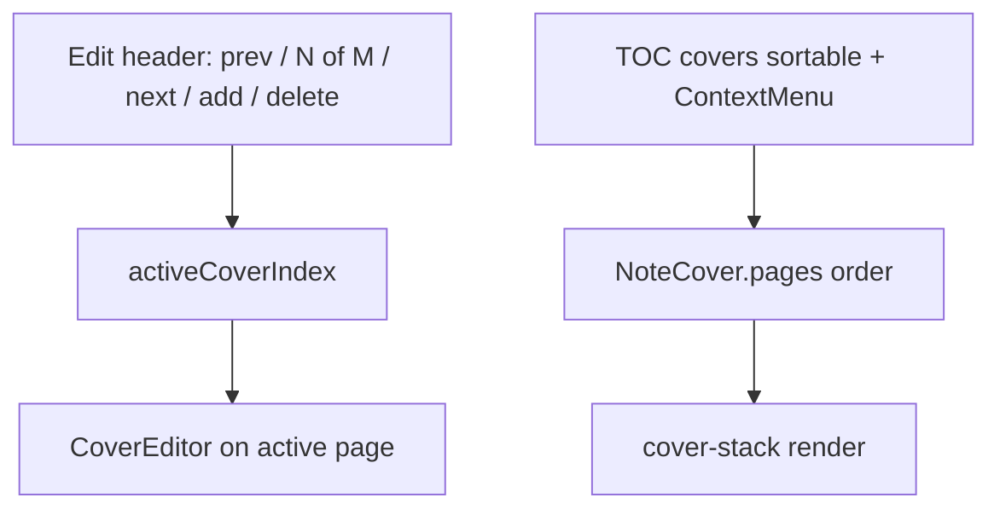

# Multi-cover (schema + TOC + edit header)

## Goal

노트당 표지 **여러 장**을 스키마·인쇄·목차·편집 내비까지 지원한다.

- 저장: leading `<!-- note-cover -->` 하나, JSON `pages[]`
- 인쇄/미리보기: `enabled`이면 **모든 page**를 각각 `CoverSlide`로 렌더
- 목차: 표지 항목 + ContextMenu(수정 / 위·아래 추가 / **삭제**) + **dnd-kit 순서 변경**
- 표지 수정 모드 상단 헤더: **이전 / 다음 / 새 표지 추가 / 표지 삭제** (+ `N / M` 표시)

## Schema (v3)

```ts
type CoverPage = {
  id: string;
  layout: CoverLayout;
  bg: CoverBackground;
  rootLayerIds: string[];
  groups: CoverGroup[];
  elements: CoverElement[];
};

type NoteCover = {
  v: 3;
  enabled: boolean;
  pages: CoverPage[];     // length >= 1 after normalize
};
```

- `NOTE_COVER_VERSION = 3`
- Factories: `createDefaultCoverPage()`, `createDefaultNoteCover()`
- Helpers: `getCoverPage`, `updateCoverPage`, `insertCoverPage(doc, index, page?)`, `reorderCoverPages(doc, activeId, overId)`, `removeCoverPage(doc, index)` → `{ cover: NoteCover | null; nextIndex: number }`  
  - `pages.length > 1`: 해당 page 제거, `nextIndex = min(index, length-2)`  
  - **마지막 1장 삭제**: `cover: null` (주석 전체 제거) + edit 모드 종료

### Normalize / migrate

[`parse.ts`](src/utils/noteCover/parse.ts): v3 `pages[]` normalize; v1/v2 flat → wrap; always emit `v: 3`.

## Type split

- Canvas → **`CoverPage`** (layers/align/layout/layerTree/objectSnap, CoverSlide/Editor/Sidebar props/LayerPanel)
- Document → **`NoteCover`** (`enabled`, upsert, undo)
- 「표지 사용」Switch: document `enabled`

## Export: print + `activeCoverIndex`

[`ExportPDFPage.jsx`](src/pages/ExportPDFPage.jsx):

| Mode | Behavior |
|------|----------|
| Preview/print | `pages.map` → `CoverSlide` (기존 page-break CSS) |
| Edit | `activeCoverIndex`만 `CoverEditor`, 나머지 `CoverSlide` |
| Mutate (insert/reorder/delete) | upsert 후 index clamp; 새 장 → 그 index로 edit; 삭제 후 `nextIndex`; 마지막 장 삭제 → `upsert(null)` + `coverEditMode=false` |

Cover DOM: `id={pdf-ex-cover-${page.id}}` for TOC scroll.

Undo: whole `NoteCover` document ([`useCoverUndoHistory`](src/hooks/useCoverUndoHistory.ts)).

## Cover-edit header (toolbar)

`coverEditMode && parsedCover`일 때 Export 상단(기존 「표지 편집」 버튼 근처 / 두 번째 toolbar row)에 컨트롤 노출:

| Control | Behavior |
|---------|----------|
| 이전 표지 | `activeCoverIndex > 0`이면 −1; scrollIntoView |
| 표시 | `표지 {i+1} / {pages.length}` |
| 다음 표지 | `activeCoverIndex < length-1`이면 +1; scroll |
| 새 표지 추가 | `insertCoverPage` at `activeCoverIndex + 1`; edit new; scroll |
| 표지 삭제 | ConfirmModal 후 `removeCoverPage`; 마지막 장이면 표지 전체 제거 + edit off |

- 1장일 때 이전/다음은 disabled; 삭제는 항상 가능(확인 문구만 다르게: 「이 표지를 삭제합니다」 vs 「마지막 표지입니다. 표지 전체를 제거합니다」)
- 아이콘: `ChevronLeft` / `ChevronRight` / `Plus` / `Trash2` (Export 툴바 톤)
- 편집 모드가 아니면 이 내비는 숨김

## TOC: cover entries

```ts
type TocItem =
  | { kind: 'cover'; id: string; coverIndex: number; pageId: string; text: string; level: 1 }
  | { kind: 'heading'; id: string; level: number; text: string; headingIndex: number };
```

- Cover 항목을 heading **앞**에 prepend (`enabled || coverEditMode`)
- 라벨: 항상 `표지 1` … `표지 N` (1장이어도 `표지 1`로 통일해 DnD/헤더와 맞춤)
- 클릭 → cover DOM scroll; active highlight에 cover 포함
- Heading pgbr: **`item.headingIndex`만** 사용 (map index 금지)

## TOC ContextMenu (cover)

Radix `ContextMenu`. Heading은 기존 pgbr ConfirmModal.

| 메뉴 | 동작 |
|------|------|
| 표지 수정 | `activeCoverIndex` + `coverEditMode=true` |
| 위쪽에 표지 추가 | `insertCoverPage(doc, coverIndex)` → edit new |
| 아래쪽에 표지 추가 | `insertCoverPage(doc, coverIndex + 1)` → edit new |
| 표지 삭제 | ConfirmModal → `removeCoverPage` (헤더와 동일 규칙) |

## TOC dnd-kit (cover reorder)

패턴: [`CoverLayerPanel.tsx`](src/components/noteCover/CoverLayerPanel.tsx) (`DndContext` + `SortableContext` + `useSortable`).

- **Cover 행만** sortable (`id = page.id`); heading 리스트는 DnD 밖(아래 고정 섹션) 또는 동일 리스트에서 cover만 `useSortable` / heading은 일반 `li`
- `onDragEnd`: `reorderCoverPages` → upsert; `activeCoverIndex`를 **같은 pageId** 기준으로 재매핑
- PointerSensor + 약간의 activation distance (레이어 패널과 유사) — 클릭 스크롤과 충돌 방지
- 시각: drag overlay 또는 opacity; 인쇄 미리보기 스택 순서는 `pages` 배열과 동기



## Advanced Search

같은 변경에 등록 ([`printActions.ts`](src/utils/advancedSearch/printActions.ts)):

- TOC provider에 cover 포함 → 검색·스크롤
- `print-edit-cover`, `print-add-cover-above`, `print-add-cover-below`, `print-delete-cover`
- `print-cover-prev`, `print-cover-next`, `print-add-cover` (헤더와 동일; edit 모드에서 situational enable)
- 다장이면 nested cover 선택 후 edit/add-above/below/delete

## Docs

[`docs/custom-markdown/note-cover.md`](docs/custom-markdown/note-cover.md): Spec `v: 3` / `pages[]` / migrate. Host 구현 노트(TOC·header·DnD·delete). Non-goals: mid-document, per-page `enabled`, freehand.

## Out of scope

- 페이지별 `enabled`
- mid-document cover comment
- `pdf_preview_view_modes` 논리 페이지 페어링 (후속에서 `pages.length`)
