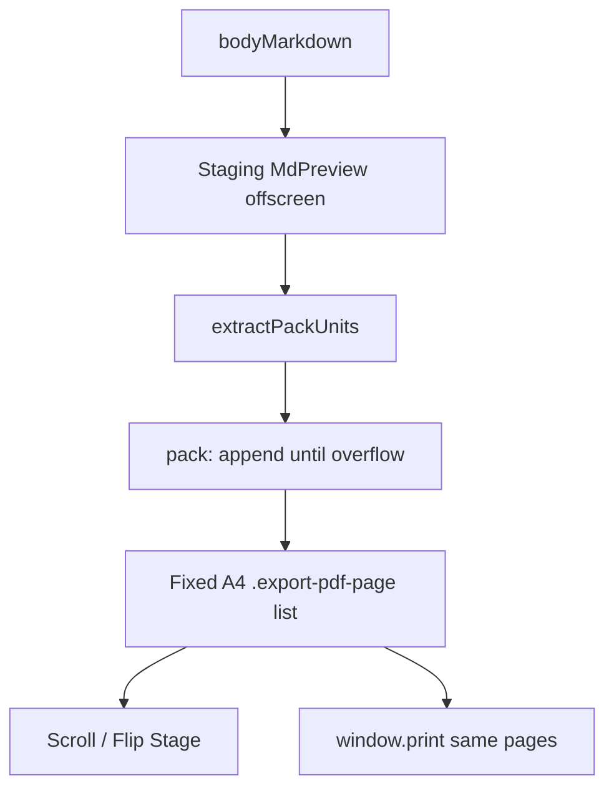

# PDF Export: overflow 기반 고정 페이지 패킹

## 문제

지금 구조는 **이중 페이지네이션**입니다.

- 미리보기: 연속 [`MdPreview`](src/pages/ExportPDFPage.jsx) + [`measurePrintPagination`](src/utils/printPageBreaks.ts) (`pageStarts`) + Stage의 `translateY` 클립
- 실제 PDF: `window.print()` + 브라우저 CSS fragmentation (`break-inside` / orphans 등)

그래서 빨간 페이지선·Stage와 Save as PDF가 어긋날 수 있고, `snapBreakAboveSolid`가 atomic 블록을 페이지 높이보다 길게 잡는 경우도 있습니다.

## 목표 모델 (채택)

미리보기와 인쇄 **모두** 같은 고정 페이지 DOM을 소스 오브 트루스로 씁니다.

1. 정해진 크기(A4 등 `--print-page-*`)의 빈 페이지 박스를 만든다.
2. 스테이징에서 렌더된 본문을 **팩 유닛**으로 순서대로 꺼낸다.
3. 현재 페이지에 append → **overflow면** 되돌리고 다음 페이지에 넣는다.
4. 마크다운 본문이 끝날 때까지 반복한다.

## 팩 유닛 규칙

[`printPageBreaks.ts`](src/utils/printPageBreaks.ts)의 solid 수집 의도를 재사용하되, **오프셋 스냅이 아니라 실제 노드 이동/복제**로 바꿉니다.

| 유닛 | 규칙 |
|------|------|
| 본문 텍스트 (`p`, `h1–h6`, `li`, `blockquote` 등) | **시각적 한 줄** (`Range.getClientRects` 기반) |
| 짧은 코드 블록 (`.md-editor-code`, 페이지 inner 이하) | **통째로** |
| 긴 코드 블록 | `.md-editor-code-block` **줄 단위** (기존과 동일) |
| 이미지 / figure / Mermaid / 표 | **통째로** (기존 fit hook 후) |
| `<pgbr/>` (`.md-pgbr`) | **강제 새 페이지** (spacer padding 제거) |

한 유닛이 페이지 inner보다 크면(예: 페이지보다 큰 이미지): 그 유닛만 담은 페이지를 만들고 다음으로 진행 (잘리지 않게). fit hook이 대부분을 막아주지만 fallback으로 둡니다.

## 구현 위치

### 1. 새 패커 모듈 (핵심)

[`src/utils/printPageBreaks.ts`](src/utils/printPageBreaks.ts)를 측정/스냅 중심에서 **패킹** 중심으로 재작성하거나, 역할을 나눕니다.

- `extractPrintPackUnits(stagingRoot, pageInnerHeightPx)` → 순서 있는 유닛
- `packPrintPages({ stagingRoot, pageHost, pageInnerHeightPx })` → 페이지 DOM 생성
- overflow 판정: 페이지 content 박스에 append 후 `scrollHeight > clientHeight` (또는 `getBoundingClientRect` bottom 초과)

줄 유닛 물질화: 스테이징에서 줄 `Range`로 `cloneContents()` / 필요 시 래퍼(`span.print-pack-line`)를 만들어 페이지에 붙입니다. 코드/이미지 등은 해당 블록 노드를 **이동 또는 clone** (이미 hydrate된 위키 이미지·Mermaid SVG 유지).

[`usePrintPageStarts.ts`](src/hooks/usePrintPageStarts.ts) → `usePrintPackedPages`로 교체: layoutKey / 이미지 load / fit 완료 후 패킹 재실행. 반환값은 `pageCount` + 페이지 루트 ref(또는 children mount 완료 신호). `pageStarts` 연속 오프셋은 더 이상 SoT가 아님 (Stage/배지가 페이지 인덱스를 쓰도록 맞춤).

### 2. ExportPDFPage 레이아웃

[`ExportPDFPage.jsx`](src/pages/ExportPDFPage.jsx):

- **Staging**: 기존 `MdPreview`를 오프스크린 측정 호스트로 유지 (같은 content width / 폰트 / fit hooks: image·table·mermaid).
- **Visible body**: `.export-pdf-paper` 연속 1장 대신 `.export-pdf-page` 스택 (각 페이지 = outer A4 + margin + fixed inner height, `overflow: hidden`).
- **scroll + 1**: 패킹된 실제 페이지를 세로로 나열 (빨간 `PrintPageBreakOverlay` / pgbr spacer 불필요).
- **print**: staging `print:hidden`; 페이지 스택만 인쇄. 페이지 사이 `break-after: page`. 본문 CSS fragmentation 의존 제거(또는 최소화).
- 표지 페이지는 지금처럼 논리 1페이지 유지.

### 3. PrintPreviewStage

[`PrintPreviewStage.tsx`](src/components/print/PrintPreviewStage.tsx)의 `BodyPageSlot`(`outerHTML` + `translateY(-pageStart)`)를 **이미 패킹된 N번째 페이지 노드를 보여주거나 clone**하는 방식으로 단순화합니다. `pageStarts`/`contentHeight` 클립 계약 제거.

### 4. CSS / 인쇄

- [`printPageLayout.ts`](src/utils/printPageLayout.ts) 용지·margin·inner 변수 유지.
- [`ExportPDFPage.jsx` 임베디드 print CSS](src/pages/ExportPDFPage.jsx) + [`style.css` `@media print`](src/styles/md-editor-rt/style.css): 연속 용지/`#export-pdf-preview` 인쇄 규칙 → `.export-pdf-page` 고정 박스 인쇄로 정리.
- `.md-pgbr`의 `break-after: page` + spacer 루프는 패킹의 “강제 새 페이지”로 대체.

### 5. 문서

[`docs/custom-markdown/page-break.md`](docs/custom-markdown/page-break.md) Preview/Print host 표: 호스트가 **고정 페이지 패킹**으로 `<pgbr/>`를 처리한다고 갱신.

## 유지할 것

- 용지 크기 Select, 줌, scroll/flip, 1/2페이지 Stage UX
- `<pgbr/>` 문법·삽입 UX (재렌더 → 재패킹)
- 표지 / Advanced Search print actions / TOC (페이지 인덱스로 스크롤·플립)
- html2canvas·jspdf 등 새 PDF 라이브러리 **추가하지 않음** (`window.print` 유지)

## 검증 포인트

- 긴 문단: 줄 경계에서만 넘어가고 페이지 inner를 넘기지 않음
- 짧은 코드: 한 페이지에 통째로; 안 들어가면 다음 페이지로 통째 이동
- 긴 코드: 줄 단위로만 분할
- 이미지/Mermaid/표: 통째 이동, fit 후 대부분 한 페이지 안
- `<pgbr/>`: 즉시 새 페이지
- Stage flip/scroll 2-up와 Save as PDF 페이지 경계가 일치
