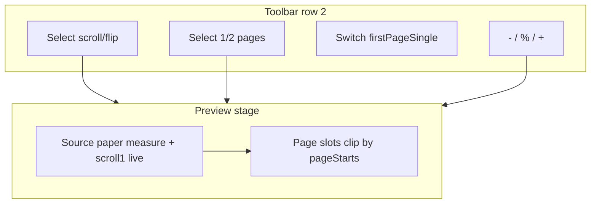

# PDF 미리보기 보기 모드

## 현재 상태

[`ExportPDFPage.jsx`](src/pages/ExportPDFPage.jsx)는 **단일 연속 용지** (`.export-pdf-paper` + `MdPreview`)를 `overflow-auto`로 스크롤하고, [`pageStarts`](src/hooks/usePrintPageStarts.ts) 오버레이로만 페이지를 표시한다. 줌·플립·2페이지 UI는 없다.

## 보기 모드 모델

두 개의 Radix Select로 4조합을 만든다 (옵션에 lucide 아이콘 + 라벨).

| navigation | pages | 동작 |
|---|---|---|
| `scroll` | `1` | 기존 연속 스크롤 + 자유 줌 |
| `scroll` | `2` | 스프레드 행을 세로 스크롤 (가상화). **첫장 단면** Switch |
| `flip` | `1` | 한 장씩 좌우 넘김. 진입/리사이즈 시 **뷰포트 fit** (가림 없음) |
| `flip` | `2` | 두 장씩 넘김. **첫장 단면** Switch + fit |

**첫장 단면** (`firstPageSingle`): 2페이지일 때만 표시. 페이지 1은 단독(책등 오른쪽/가운데), 이후 `(2\|3), (4\|5), …`. 표지가 있으면 표지를 논리 페이지 0으로 포함해 페어링.

## 렌더 전략 (핵심)

- **소스 오브 트루스**: 기존 cover + `.export-pdf-paper` + `pageStarts` / 인쇄 CSS는 유지. `@media print` 동작 불변.
- **`scroll` + `1`**: 지금과 같이 라이브 용지를 직접 보여 줌(`zoom` 또는 scale 보정)만 적용. 이미지 리사이즈·pgbr 등 **편집 인터랙션은 이 모드에서만**.
- **`scroll`+`2` / `flip`**: 조회 전용 스테이지. 소스 용지는 측정용으로 레이아웃 유지(오프스크린/비가시), 보이는 슬롯은 `pageStarts[i]` 기준으로 `overflow:hidden` + `translateY` 클립. 2페이지는 슬롯 최대 2개(좌/우). 스크롤 2페이지는 스프레드 행을 가상 스크롤하고 보이는 행만 슬롯에 바인딩.
- **표지 편집 모드** (`coverEditMode`): 보기 모드를 `scroll`+`1`로 고정(Select 비활성)해 기존 CoverEditor UX 유지.

슬롯 콘텐츠: 측정용 라이브 DOM을 복제(`cloneNode`)하거나 동일 `bodyMarkdown`의 보조 `MdPreview` 최대 2개. 초기 구현은 **복제 슬롯**(위키 이미지 URL 이미 소스에 hydrate됨)으로 두고, 복제가 깨지면 보조 `MdPreview`로 전환.

## 줌 UX

- 상태: `zoomPercent` (기본 100). 버튼/Ctrl·Cmd+wheel → **±5**. 범위 예: 25–400.
- 표시: `100%` 클릭 → 인라인 숫자 입력(Enter/blur 반영, 5% 단위로 반올림 가능). **더블클릭 → 100%**.
- `flip` 진입 및 미리보기 영역 ResizeObserver 시: 1·2페이지가 뷰포트에 들어가도록 fit%를 계산해 `zoomPercent`에 설정 (이후 수동 줌 허용; fit보다 크면 슬롯 컨테이너에 스크롤).
- wheel 핸들러: `ctrlKey`/`metaKey`일 때만 `preventDefault` + 줌; 일반 스크롤은 유지.

## UI 배치

툴바 두 번째 줄([`PrintPageSizeSelect`](src/components/print/PrintPageSizeSelect.tsx) 옆)에 추가:

1. `PrintPreviewNavSelect` — 스크롤 / 넘기기 (+ 아이콘)
2. `PrintPreviewPagesSelect` — 1페이지 / 2페이지 (+ 아이콘)
3. `pages===2`일 때 Radix `Switch` — 「첫장 단면」([`CoverSidebar`](src/components/noteCover/CoverSidebar.tsx) Switch 패턴)
4. `PrintPreviewZoomControls` — `−` / 퍼센트 / `+`

아이콘 예: `ScrollText`, `BookOpen`(또는 `GalleryHorizontalEnd`), `File`, `Columns2` (lucide).

설정은 `localStorage`에 persist (예: `s3haim_print_preview_view`).

## 넘기기·목차

- flip: 좌/우 Chevron 버튼 + `ArrowLeft`/`ArrowRight` (입력 중 제외).
- `PrintVisiblePageBadge` / TOC `scrollIntoView`: flip·2-up에서는 **해당 논리 페이지/스프레드로 이동**하도록 어댑터 (기존 [`scrollPrintHeading`](src/utils/advancedSearch/printActions.ts)도 모드 인식).

## Advanced Search

규칙([`advanced-search-features.mdc`](.cursor/rules/advanced-search-features.mdc))에 따라 [`printActions.ts`](src/utils/advancedSearch/printActions.ts)에 등록하고 `ExportPDFPage`에서 handler 연결:

- `print-view-scroll` / `print-view-flip`
- `print-view-pages-1` / `print-view-pages-2`
- `print-toggle-first-page-single`
- `print-zoom-in` / `print-zoom-out` / `print-zoom-reset`
- focus 타겟: `view-nav`, `view-pages`, `zoom`

## 주요 파일

| 파일 | 역할 |
|---|---|
| [`src/utils/printPreviewView.ts`](src/utils/printPreviewView.ts) | 타입, pairing, fit 계산, localStorage |
| [`src/components/print/PrintPreviewNavSelect.tsx`](src/components/print/PrintPreviewNavSelect.tsx) | 스크롤/넘기기 Select |
| [`src/components/print/PrintPreviewPagesSelect.tsx`](src/components/print/PrintPreviewPagesSelect.tsx) | 1/2페이지 Select |
| [`src/components/print/PrintPreviewZoomControls.tsx`](src/components/print/PrintPreviewZoomControls.tsx) | 줌 UI |
| [`src/components/print/PrintPreviewStage.tsx`](src/components/print/PrintPreviewStage.tsx) | 모드별 스테이지·슬롯·휠·키보드 |
| [`src/pages/ExportPDFPage.jsx`](src/pages/ExportPDFPage.jsx) | 상태 연결, 툴바, coverEdit 잠금 |
| [`src/utils/advancedSearch/printActions.ts`](src/utils/advancedSearch/printActions.ts) | AS 커맨드 |

## 구현 순서

1. `printPreviewView` 유틸 + persist
2. 툴바 Select / Switch / Zoom 컴포넌트
3. `scroll`+`1`에 줌(Ctrl+wheel 포함)만 먼저 연결
4. `PrintPreviewStage`: flip 1 → flip 2 → scroll 2 (가상화)
5. TOC/배지/AS 연동
6. 표지 편집 잠금 + 인쇄 회귀 확인 (미리보기 전용, print 레이아웃 무변경)
