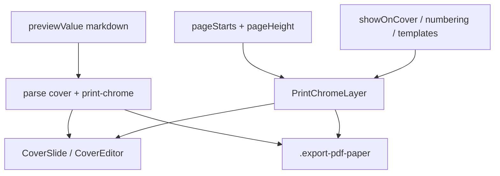

# Print chrome templates (page numbers)

## Goal

PDF/인쇄 미리보기·실제 `window.print()` 결과에 **페이지 크롬**을 찍는다. 1차는 **페이지번호**이며, 같은 템플릿 배열로 **정적 텍스트**(머릿글 등)도 넣을 수 있게 스키마·UI를 연다.

- 저장: **노트별** leading HTML 주석 `<!-- print-chrome … -->` (표지와 동일 패턴)
- 위치 8곳: 좌상 / 중상 / 우상 / 중좌 / 중우 / 좌하 / 중하 / 우하
- 템플릿마다 `fontFamily` + `fontSizePx` (`FontFamilyInput`)
- 문서 옵션: 표지 표시 여부, 번호 기산(표지 포함 vs 본문부터), 포맷 문자열

## Schema

새 모듈 [`src/utils/printChrome/`](src/utils/printChrome/) (`types.ts`, `parse.ts`, `index.ts`).

```ts
type PrintChromePosition =
  | 'top-left' | 'top-center' | 'top-right'
  | 'middle-left' | 'middle-right'
  | 'bottom-left' | 'bottom-center' | 'bottom-right';

type PrintChromeNumbering = 'document' | 'body';
// document: cover=1 when present; body continues
// body: first body page=1; cover unnumbered for {page} (and omitted if showOnCover=false)

type PrintChromeTemplate =
  | {
      id: string;
      type: 'page-number';
      enabled: boolean;
      position: PrintChromePosition;
      fontFamily: string;
      fontSizePx: number;       // clamp e.g. 8–72; default 10
      format: string;          // default "{page}"; tokens {page} {total}
    }
  | {
      id: string;
      type: 'text';
      enabled: boolean;
      position: PrintChromePosition;
      fontFamily: string;
      fontSizePx: number;
      text: string;
    };

type PrintChromeDoc = {
  v: 1;
  showOnCover: boolean;          // default false
  numbering: PrintChromeNumbering; // default 'body'
  templates: PrintChromeTemplate[];
};
```

Defaults when absent: `null` doc (no comment) ≡ empty templates / no chrome. First add creates comment via upsert.

### Leading comment order

```html
<!-- note-cover … -->   <!-- optional -->
<!-- print-chrome … --> <!-- optional -->
body markdown
```

- Parse: `parseNoteCover` → then `parsePrintChrome` on remainder (chrome must sit immediately after cover, before body).
- Rebuild helper `rebuildLeadingMeta(cover, chrome, body)` used by both upserts so neither wipes the other.
- Same `--` → `\u002d\u002d` escape as note-cover.
- Strip chrome (+ cover) before `MdPreview` / editor body (extend current `stripNoteCoverComment` path in Export PDF; MdPreview placeholder if cover already strips leading metas).

Docs: [`docs/custom-markdown/print-chrome.md`](docs/custom-markdown/print-chrome.md) + index + VitePress sidebar (custom-markdown rule).

## Rendering (print + preview)

Browser `@page` margin boxes are unreliable → **logical-page absolute overlays** on the print source DOM (must **not** use `print:hidden`).



- New [`PrintChromeLayer.tsx`](src/components/print/PrintChromeLayer.tsx): for each logical page slot, a full-page absolute frame; place enabled templates via CSS (top/left/transform for 8 anchors).
- **Body**: frames at each `pageStarts[i]` with height ≈ printable page height ([`getPrintPageInnerSizePx`](src/utils/printPageLayout.ts) / outer page height as needed so corners sit in the **margin band** of `.export-pdf-paper`).
- **Cover**: one frame on cover wrapper when `showOnCover` and templates enabled.
- **Numbering**:
  - `numbering: 'document'`: cover → 1, body index `i` → `i + (hasCover ? 2 : 1)` (align with today’s overlay offset).
  - `numbering: 'body'`: body `i+1`; cover has no `{page}` (text templates still show if `showOnCover`).
  - `{total}` = cover count (0/1 for now; later multi-cover pages length) + `pageStarts.length`.
- Format: simple replace `{page}` / `{total}` (no full i18n engine).
- Keep existing red `PrintPageBreakOverlay` as preview-only (`print:hidden`); printed numbers come only from chrome templates.
- Flip/2-up: chrome lives on source stack; stage already mirrors source pages — verify paint; if clipped, mirror layer in stage only as follow-up.

## UI (Export PDF)

- Toolbar button next to 폰트 설정: **페이지 크롬** / **쪽번호** → modal [`PrintChromeModal.tsx`](src/components/print/PrintChromeModal.tsx) (`Modal` + Radix Select/Switch; nested portals `z-100010`).
- Modal sections:
  1. Document options: `showOnCover` Switch, `numbering` Select, short help.
  2. Template list (add / delete / enable): type Select (`page-number` | `text`), position Select (8), `FontFamilyInput`, font size number, format or text field.
  3. Apply → update `previewValue` via upsert (dirty like cover edits); Save writes file.
- State in [`ExportPDFPage.jsx`](src/pages/ExportPDFPage.jsx): parse chrome from `previewValue`; `onChromeChange` → `rebuildLeadingMeta`; wire layer on cover + body paper.

## Advanced Search

Same change in [`printActions.ts`](src/utils/advancedSearch/printActions.ts) + Host if needed:

- `print-page-chrome` / `print-focus-page-chrome` — open modal
- `print-add-page-number` — append default page-number template (e.g. bottom-center `{page}`) and open modal
- optional `print-add-chrome-text` — append text template

Register handlers while Export PDF mounted.

## Out of scope (this change)

- Multi-cover `pages[]` itself (existing multi-cover plan); chrome `{total}` / cover frames only need a thin hook so multi-cover can later map over all cover pages.
- Per-template “odd/even only”, running headers from heading text, CSS `@page` margin boxes.
- Global `.settings/print.json` chrome (fonts stay global; chrome is per-note).
