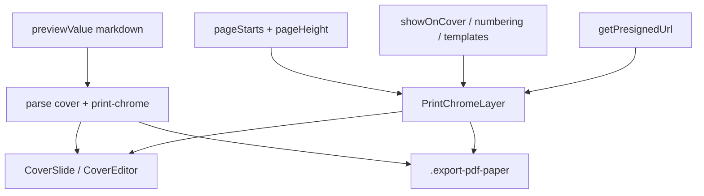

# Print chrome templates (page number / text / image)

## Goal

PDF/인쇄 미리보기·실제 `window.print()` 결과에 **페이지 크롬 템플릿**을 여러 개 찍는다. 템플릿 종류:

| type | 용도 |
|------|------|
| `page-number` | `{page}` / `{total}` 쪽번호 |
| `text` | 고정 텍스트 (머릿글·문서 제목 등) |
| `image` | 고정 이미지 (로고·도장 등, vault 경로) |

- 저장: **노트별** leading HTML 주석 `<!-- print-chrome … -->` (표지와 동일 패턴)
- 위치 8곳: 좌상 / 중상 / 우상 / 중좌 / 중우 / 좌하 / 중하 / 우하
- 텍스트·쪽번호: `fontFamily` + `fontSizePx` (`FontFamilyInput`)
- 이미지: vault `path` + `widthPx` / `heightPx` (표지 이미지와 동일 URL resolve)
- 문서 옵션: 표지 표시 여부, 번호 기산(표지 포함 vs 본문부터)

## Schema

새 모듈 [`src/utils/printChrome/`](src/utils/printChrome/) (`types.ts`, `parse.ts`, `index.ts`).

```ts
type PrintChromePosition =
  | 'top-left' | 'top-center' | 'top-right'
  | 'middle-left' | 'middle-right'
  | 'bottom-left' | 'bottom-center' | 'bottom-right';

type PrintChromeNumbering = 'document' | 'body';
// document: cover=1 when present; body continues
// body: first body page=1; cover has no {page} (text/image still respect showOnCover)

type PrintChromeTemplateBase = {
  id: string;
  enabled: boolean;
  position: PrintChromePosition;
};

type PrintChromePageNumberTemplate = PrintChromeTemplateBase & {
  type: 'page-number';
  fontFamily: string;
  fontSizePx: number;   // clamp 8–72; default 10
  format: string;       // default "{page}"; tokens {page} {total}
};

type PrintChromeTextTemplate = PrintChromeTemplateBase & {
  type: 'text';
  fontFamily: string;
  fontSizePx: number;
  text: string;
};

type PrintChromeImageTemplate = PrintChromeTemplateBase & {
  type: 'image';
  path: string;         // vault-relative; empty = skip render
  widthPx: number;      // clamp e.g. 8–800; default 48
  heightPx: number;     // clamp; default 48; UI may offer “keep aspect” later
};

type PrintChromeTemplate =
  | PrintChromePageNumberTemplate
  | PrintChromeTextTemplate
  | PrintChromeImageTemplate;

type PrintChromeDoc = {
  v: 1;
  showOnCover: boolean;            // default false
  numbering: PrintChromeNumbering; // default 'body'
  templates: PrintChromeTemplate[];
};
```

Defaults when absent: `null` doc (no comment) ≡ empty templates. First add creates comment via upsert.

### Leading comment order

```html
<!-- note-cover … -->   <!-- optional -->
<!-- print-chrome … --> <!-- optional -->
body markdown
```

- Parse: `parseNoteCover` → then `parsePrintChrome` on remainder (chrome immediately after cover, before body).
- Rebuild helper `rebuildLeadingMeta(cover, chrome, body)` used by both upserts so neither wipes the other.
- Same `--` → `\u002d\u002d` escape as note-cover.
- Strip chrome (+ cover) before `MdPreview` / editor body.

Docs: [`docs/custom-markdown/print-chrome.md`](docs/custom-markdown/print-chrome.md) + index + VitePress sidebar.

## Rendering (print + preview)

Browser `@page` margin boxes are unreliable → **logical-page absolute overlays** on the print source DOM (**not** `print:hidden`).



- New [`PrintChromeLayer.tsx`](src/components/print/PrintChromeLayer.tsx): per logical page, full-page absolute frame; place enabled templates at 8 anchors.
- **page-number / text**: styled span (`fontFamily`, `fontSizePx`, color default near-black for print).
- **image**: resolve `path` like cover (`useCoverImageUrl` / `getPresignedUrl` from Export PDF); `` with `width`/`height`, `object-fit: contain`; missing URL → skip.
- **Body**: frames at each `pageStarts[i]` sized to page (margin-band corners on `.export-pdf-paper`).
- **Cover**: one frame when `showOnCover`.
- **Numbering** (page-number only):
  - `document`: cover → 1, body continues
  - `body`: body `i+1`; cover omits page-number templates (text/image still show if `showOnCover`)
  - `{total}` = cover count (0/1 now) + `pageStarts.length`
- Keep red `PrintPageBreakOverlay` preview-only; printed chrome = templates only.
- Flip/2-up: verify source-stack paint; stage mirror only if clipped.

## UI (Export PDF)

- Toolbar: **페이지 크롬** → [`PrintChromeModal.tsx`](src/components/print/PrintChromeModal.tsx) (`Modal` + Radix Select/Switch; portals `z-100010`).
- Document options: `showOnCover`, `numbering`.
- Template list — add menu: 쪽번호 / 텍스트 / 이미지; per row: enable, position, type-specific fields:
  - page-number: format, `FontFamilyInput`, size
  - text: text input, `FontFamilyInput`, size
  - image: path picker (reuse cover/wiki image path UX from CoverSidebar / existing vault file picker if present), width/height inputs
- Apply → upsert into `previewValue` (dirty); Save writes file.
- Wire in [`ExportPDFPage.jsx`](src/pages/ExportPDFPage.jsx): parse, `onChromeChange` → `rebuildLeadingMeta`, layer on cover + body with `getPresignedUrl`.

## Advanced Search

[`printActions.ts`](src/utils/advancedSearch/printActions.ts) + Host as needed:

- `print-page-chrome` / `print-focus-page-chrome` — open modal
- `print-add-page-number` — default bottom-center `{page}`
- `print-add-chrome-text` — empty text template
- `print-add-chrome-image` — empty image template (open modal to pick path)

Register while Export PDF mounted.

## Out of scope

- Multi-cover `pages[]` itself; thin hook for later multi cover frames / `{total}`.
- Odd/even-only, running headers from H1, CSS `@page` margin boxes.
- Image crop editor inside chrome (path + box size only; crop stays cover-side).
- Global `.settings/print.json` chrome.
