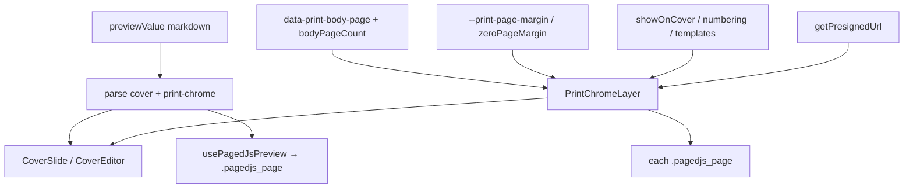

# Print chrome templates (page number / text / image)

## Goal

PDF/인쇄 미리보기·실제 `window.print()` 결과에 **페이지 크롬 템플릿**을 여러 개 찍는다. 템플릿 종류:

| type | 용도 |
|------|------|
| `page-number` | `{page}` / `{total}` 쪽번호 |
| `text` | 고정 텍스트 (머릿글·문서 제목 등) |
| `image` | 고정 이미지 (로고·도장 등, vault 경로) |

- 저장: **노트별** leading HTML 주석 `<!-- print-chrome … -->` (표지와 동일 패턴)
- 위치 8곳: 좌상 / 중상 / 우상 / 중좌 / 중우 / 좌하 / 중하 / 우하
- 텍스트·쪽번호: `fontFamily` + `fontSizePx` (`FontFamilyInput`)
- 이미지: vault `path` + `widthPx` / `heightPx` (표지 이미지와 동일 URL resolve)
- 문서 옵션: 표지 표시 여부, 번호 기산(표지 포함 vs 본문부터)

## Current baseline (do not regress)

Export PDF is already modular + paged.js. This feature **builds on** that stack; do not revive `printPagePack` / `pageStarts` packing.

| Area | Current reality |
|------|-----------------|
| Orchestrator | [`src/pages/exportPdf/ExportPDFPage.tsx`](src/pages/exportPdf/ExportPDFPage.tsx) |
| Shell / toolbar | [`ExportPdfShell.tsx`](src/pages/exportPdf/ExportPdfShell.tsx) |
| Body pages | paged.js → `[data-export-pdf-pages] .pagedjs_page` + [`PRINT_BODY_PAGE_ATTR`](src/utils/print/printBodyPage.ts) (`data-print-body-page`) |
| Staging | hidden MdPreview in [`ExportPdfBodyPreview.tsx`](src/pages/exportPdf/ExportPdfBodyPreview.tsx); pagination via [`usePagedJsPreview`](src/pages/exportPdf/hooks/usePagedJsPreview.ts) |
| Cover | [`ExportPdfCoverSection.tsx`](src/pages/exportPdf/ExportPdfCoverSection.tsx) / CoverSlide |
| Page size / margins | [`printPageLayout.ts`](src/utils/print/printPageLayout.ts): `PRINT_PAGE_MARGIN_MM` (10) or **`zeroPageMargin`** → 0; CSS vars `--print-page-margin`, `--print-page-inner-*`, `--print-cover-fit-*` |
| Toolbar toggle | [`PrintZeroPageMarginSwitch`](src/components/print/PrintZeroPageMarginSwitch.tsx) + AS `print-toggle-zero-page-margin` |
| Print path | `prepareExportPdfBrowserPrint` + `@page` from `buildPrintPageAtRule` |
| Flip / 2-up | [`PrintPreviewStage`](src/components/print/PrintPreviewStage.tsx) clones page slots — chrome must live on **source** `.pagedjs_page` so clones paint it |



## Schema

New module [`src/utils/printChrome/`](src/utils/printChrome/) (`types.ts`, `parse.ts`, `index.ts`). Prefer **`.ts` only** (project TS migration policy).

```ts
type PrintChromePosition =
  | 'top-left' | 'top-center' | 'top-right'
  | 'middle-left' | 'middle-right'
  | 'bottom-left' | 'bottom-center' | 'bottom-right';

type PrintChromeNumbering = 'document' | 'body';
// document: cover=1 when present; body continues
// body: first body page=1; cover has no {page} (text/image still respect showOnCover)

type PrintChromeTemplateBase = {
  id: string;
  enabled: boolean;
  position: PrintChromePosition;
};

type PrintChromePageNumberTemplate = PrintChromeTemplateBase & {
  type: 'page-number';
  fontFamily: string;
  fontSizePx: number;   // clamp 8–72; default 10
  format: string;       // default "{page}"; tokens {page} {total}
};

type PrintChromeTextTemplate = PrintChromeTemplateBase & {
  type: 'text';
  fontFamily: string;
  fontSizePx: number;
  text: string;
};

type PrintChromeImageTemplate = PrintChromeTemplateBase & {
  type: 'image';
  path: string;         // vault-relative; empty = skip render
  widthPx: number;      // clamp e.g. 8–800; default 48
  heightPx: number;     // clamp; default 48; UI may offer “keep aspect” later
};

type PrintChromeTemplate =
  | PrintChromePageNumberTemplate
  | PrintChromeTextTemplate
  | PrintChromeImageTemplate;

type PrintChromeDoc = {
  v: 1;
  showOnCover: boolean;            // default false
  numbering: PrintChromeNumbering; // default 'body'
  templates: PrintChromeTemplate[];
};
```

Defaults when absent: `null` doc (no comment) ≡ empty templates. First add creates comment via upsert.

### Leading comment order

```html
<!-- note-cover … -->   <!-- optional -->
<!-- print-chrome … --> <!-- optional -->
body markdown
```

- Parse: `parseNoteCover` → then `parsePrintChrome` on remainder (chrome immediately after cover, before body).
- Rebuild helper `rebuildLeadingMeta(cover, chrome, body)` used by both upserts so neither wipes the other.
- Same `--` → `\u002d\u002d` escape as note-cover.
- Strip chrome (+ cover) before staging `MdPreview` / editor body (same place cover is stripped today in document hooks).

Docs: [`docs/custom-markdown/print-chrome.md`](docs/custom-markdown/print-chrome.md) + index + VitePress sidebar ([`custom-markdown-docs`](.cursor/rules/custom-markdown-docs.mdc) checklist).

## Rendering (print + preview)

Browser `@page` margin boxes remain unreliable → **per physical page absolute overlays** on the print source DOM (**not** `print:hidden`).

### Mount targets (paged.js era)

- **Body**: for each `[data-export-pdf-pages] .pagedjs_page` (or `[data-print-body-page]`), mount a full-page absolute `PrintChromeLayer` sibling/overlay (`position: absolute; inset: 0; pointer-events: none` for print; allow hit-testing only if we add edit handles later — v1 can be non-interactive).
- **Do not** position via legacy `pageStarts[]` + continuous paper height — those no longer drive layout.
- **Cover**: one frame on the cover root when `showOnCover` (use cover box / `--print-cover-fit-*` in print media).
- Re-run / remount when `usePagedJsPreview` finishes a pass (`pagedStatus` idle + `bodyPageCount` / `packLayoutKey` change), and when chrome doc or `zeroPageMargin` changes.
- Flip/2-up: chrome on source pages so [`PrintPreviewStage`](src/components/print/PrintPreviewStage.tsx) slot clones include it; avoid stage-only injection.

### Margin / `zeroPageMargin` interaction

| Mode | `--print-page-margin` | Chrome placement |
|------|----------------------|------------------|
| Default | `10mm` | Anchor templates in the **page margin band**: inset content by `var(--print-page-margin)` so page numbers/headers sit outside body text (corners of the full `.pagedjs_page`, not inside `.pagedjs_page_content`). Optional small padding (e.g. 2–4px) from the sheet edge. |
| 여백 없음 (`zeroPageMargin`) | `0` | Anchors at page edges with a **small fixed inset** (e.g. 4–8px) so chrome is not clipped by printer hardware; may overlap body — acceptable for full-bleed. |

- Read margin from CSS var / `getPrintPageMarginMm(printLayout.zeroPageMargin)` — do not hardcode 10mm.
- When user toggles 여백 없음, paged.js re-paginates; chrome remounts on new page boxes (page count / breaks may change; `{page}` / `{total}` update accordingly).

### Template paint

- New [`PrintChromeLayer.tsx`](src/components/print/PrintChromeLayer.tsx) (or colocated under `exportPdf/` if preferred): 8 anchors; enabled templates only.
- **page-number / text**: styled span (`fontFamily` via `FontFamilyInput` / CSS `font-family`, `fontSizePx`, near-black for print; `print-color-adjust: exact`).
- **image**: resolve `path` like cover (`getPresignedUrl` from Export PDF / print settings store); `` with `width`/`height`, `object-fit: contain`; missing URL → skip.
- **Numbering** (page-number only):
  - `document`: cover → 1, body continues (`data-print-body-page` + 1 if cover counted)
  - `body`: body index + 1; cover omits page-number templates (text/image still show if `showOnCover`)
  - `{total}` = (cover counted? 1 : 0) + body page count from paged.js
- Keep any preview-only debug overlays separate; printed chrome = templates only.
- Ensure `@media print` does not hide chrome (no `print:hidden`); z-index above page content, below modal UI.

## UI (Export PDF)

- Toolbar (next to 용지 / **여백 없음**): **페이지 크롬** → [`PrintChromeModal.tsx`](src/components/print/PrintChromeModal.tsx) (`Modal` + Radix Select/Switch; nested portals `z-100010` per modal-nested-z-index rule).
- Document options: `showOnCover`, `numbering`.
- Template list — add menu: 쪽번호 / 텍스트 / 이미지; per row: enable, position, type-specific fields:
  - page-number: format, `FontFamilyInput`, size
  - text: text input, `FontFamilyInput`, size
  - image: path picker (reuse cover/wiki image path UX), width/height inputs
- Buttons need icons ([`button-icons`](.cursor/rules/button-icons.mdc)); product tooltips = Radix Tooltip only.
- Apply → upsert into `previewValue` (dirty); Save writes file via existing document save.
- Wire through hooks, not a monolith:
  - Parse / upsert: extend [`useExportPdfDocument`](src/pages/exportPdf/hooks/useExportPdfDocument.ts) (or small `useExportPdfPrintChrome` helper) with `rebuildLeadingMeta`
  - Layer mount: Body preview / pages host after paged idle + cover section
  - Toolbar + modal: [`ExportPdfShell.tsx`](src/pages/exportPdf/ExportPdfShell.tsx)
  - AS: [`useExportPdfPrintActions.ts`](src/pages/exportPdf/hooks/useExportPdfPrintActions.ts)

## Advanced Search

[`printActions.ts`](src/utils/advancedSearch/printActions.ts) + Host focus map as needed. **Keep** existing:

- `print-toggle-zero-page-margin` / `print-focus-zero-margin`

Add:

- `print-page-chrome` / `print-focus-page-chrome` — open modal
- `print-add-page-number` — default bottom-center `{page}`
- `print-add-chrome-text` — empty text template
- `print-add-chrome-image` — empty image template (open modal to pick path)

Register while Export PDF mounted (`useExportPdfPrintActions`).

## Out of scope

- Multi-cover `pages[]` itself; thin hook for later multi cover frames / `{total}` (see multi-cover prep plan).
- Odd/even-only, running headers from H1, CSS `@page` margin boxes as the chrome mechanism.
- Image crop editor inside chrome (path + box size only; crop stays cover-side).
- Global `.settings/print.json` chrome.
- Changing default `PRINT_PAGE_MARGIN_MM` / removing **여백 없음** — chrome must coexist with both margin modes.
- Replacing paged.js pagination.

## Implementation notes

- Prefer English in new code comments if Korean Unicode might corrupt.
- New files `.ts` / `.tsx` only.
- After paged re-layout, query live `.pagedjs_page` list; do not cache stale DOM nodes across generations.
- Smoke: default margin (chrome in margin band) → toggle 여백 없음 → re-paginate → chrome at edge inset → 내보내기 + print dialog 여백 없음 → flip/2-up still shows chrome.
