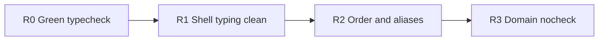

# App domain debt remainder

> 선행 완료: D0 green/bridge-deps fix · D1 `register*BridgeDeps` 제거 · D2 bag/glueRef → context-owned · D3 AppHandlers → Session/Chat/EditorExtras.
> **현재**: [`AppLayout.tsx`](src/App/components/AppLayout.tsx) / [`AppModals.tsx`](src/App/components/AppModals.tsx) / [`SidebarConnected.tsx`](src/App/components/SidebarConnected.tsx)에서 `@ts-nocheck`는 이미 빠졌으나 **`bun run typecheck`가 AppLayout·AppModals에서 실패** 중. Domain `@ts-nocheck`는 16파일 잔존.
> **제외**: Zustand, AuthContext 구조 변경, `src/features/` 전면 재배치, AS `registerEditorActions`/print/chat product registries, File/Tree 거대 파일 분할.
> **원칙**: 동작 동일; 단계마다 `bun run check` + 로컬 Conventional Commit; push 금지; 이 플랜 파일은 구현 중 수정 금지.

---

### R0 — `bun run check` 복구 (최우선)

**구현 첫 액션**: `bun run check` (또는 `bun run typecheck`)로 현재 오류 목록을 확정한 뒤 수정. 그린 전까지 R1+ 금지.

알려진 실패 (직전 스냅샷):

| 파일 | 증상 | 조치 |
|------|------|------|
| [`AppLayout.tsx`](src/App/components/AppLayout.tsx) | 콜백/`pane*` 바인딩 implicit `any` (~601–825) | 파라미터에 `any` 또는 최소 명시 타입 부여 (`eslint-disable no-explicit-any` 유지 가능) |
| [`AppModals.tsx`](src/App/components/AppModals.tsx) | implicit `any`; `exactOptionalPropertyTypes`로 `onSelectHaim` undefined; `string \| null` vs `string`; `any[]` vs `never[]` | optional prop은 조건부로 전달하거나 `undefined`를 Props에 허용; null → `?? ''`; 배열 prop 타입 캐스트/`as X[]` |

완료 조건: `bun run check` **green**.  
Commit: `fix: restore typecheck after App shell nocheck removal`

---

### R1 — App shell 타이핑 마무리 (구 D4)

목표: UI 3파일이 **nocheck 없이** 안정적으로 check 통과 + 불필요한 `any`만 남김.

1. [`SidebarConnected.tsx`](src/App/components/SidebarConnected.tsx) — 이미 nocheck 없음; typecheck 회귀 없으면 유지. `Sidebar.jsx` 경계는 `ChromeProps`/`any` pick으로 고정.
2. [`AppModals.tsx`](src/App/components/AppModals.tsx) — R0 수정 위에 modal-lib Props와 `exactOptionalPropertyTypes` 정합 (필요 시 로컬 `as any`는 modal 경계에만).
3. [`AppLayout.tsx`](src/App/components/AppLayout.tsx) — R0 수정 후 destructure 과다/`any` 남용 구간만 정리 (동작 변경 없음).

Commit: `refactor: finish App shell typing without ts-nocheck`

---

### R2 — Provider order 문서 + dead surface (구 D5)

1. **Order 분리** ([`providerOrder.ts`](src/App/providers/providerOrder.ts) + [`tests/App/providers/index.test.ts`](tests/App/providers/index.test.ts)):
   - `APP_PROVIDER_ORDER` = [`AppProviders.tsx`](src/App/AppProviders.tsx) JSX와 **1:1** (RecordingProvider까지; logic 3개 제외).
   - `APP_LOGIC_PROVIDER_ORDER` = `AppBootstrapProvider` → `AppModalsProvider` → `AutoSaveProvider` ([`AppLogicProvider.tsx`](src/App/providers/AppLogicProvider.tsx) 내부 nest).
2. **Dead alias**:
   - [`useAppOrchestration.ts`](src/App/providers/useAppOrchestration.ts)에서 `useMainAppController` re-export 제거; [`providers/index.ts`](src/App/providers/index.ts)도 동일.
   - [`AppShellContext`](src/App/context/AppShellContext.ts): 소비자가 `useAppChrome`뿐이면 `AppLogicProvider`의 `AppShellContext.Provider` 이중 publish 제거 후 파일/export 정리 (grep으로 소비자 0 확인 후 삭제).

Commit: `chore: sync provider order docs and drop dead App aliases`

---

### R3 — Domain `@ts-nocheck` 점진 제거

순서 고정 (한 커밋에 무리하게 전부 제거하지 않음):

1. [`useVaultDomain.ts`](src/App/hooks/useVaultDomain.ts) (~361줄) — `VaultValue` 경계에 맞춤.
2. [`useWorkspaceTabsDomain.ts`](src/App/hooks/useWorkspaceTabsDomain.ts) (~475줄) — `WorkspaceTabsCtxValue` 경계.
3. [`useAppLogicSharedState.ts`](src/App/hooks/useAppLogicSharedState.ts) (~112줄) — compose return을 `Record<string, any>` 또는 좁힌 타입으로.
4. 소형 context-owned domains (chrome / chat / session / pwa / …) — 파일당 check green 후 커밋 묶음 가능.
5. **보류**: [`useFileSessionDomain.ts`](src/App/hooks/useFileSessionDomain.ts) (~1.6k), [`useTreeOpsDomain.ts`](src/App/hooks/useTreeOpsDomain.ts) (~3k) — 경계 타입만 점진; 필수 완료 조건에서 제외하되 PR 설명에 잔여로 명시.

Commits (예시):
- `refactor: remove ts-nocheck from useVaultDomain`
- `refactor: remove ts-nocheck from useWorkspaceTabsDomain`
- `refactor: remove ts-nocheck from AppLogic compose and small domains`

---

## 검증 (매 단계)

- `bun run check`
- 스모크: unlock · tab dirty close · save · tree rename · session · export-pdf (R0/R1 후 특히)
- R2: `APP_PROVIDER_ORDER` 테스트가 `AppProviders` JSX와 일치하는지 확인
